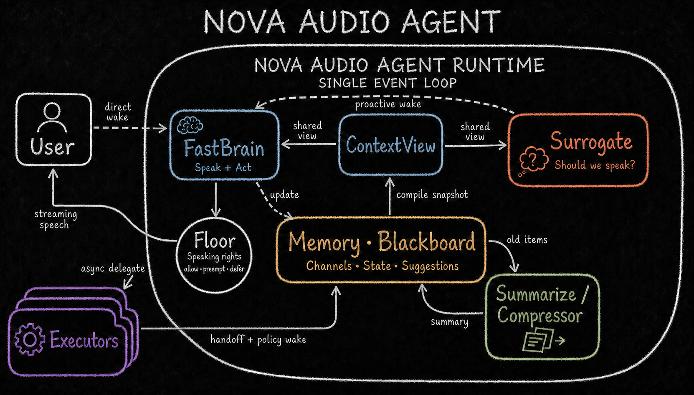
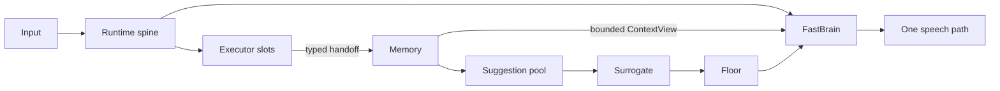

<!-- Keep in sync with README.zh-CN.md -->

# Nova Audio Agent

**English** | [简体中文](README.zh-CN.md)

> **An always-on voice agent with restrained proactivity — always working, speaking only when
> it's worth the floor.**

[](https://github.com/deepnovacore/NovaAudioAgent/actions/workflows/ci.yml)
[](LICENSE)
[](pyproject.toml)
[](#3-architecture)
[](docs/blog/2026-08-proactive-voice-agent-design-space.md)

Nova Audio Agent is a **harness for an always-on, general-purpose voice agent**. Nova (小诺)
keeps the conversation responsive while independent capabilities search, observe, operate devices,
or complete longer tasks in the background.

This is not a chatbot framework and not a workflow engine. It focuses on a different problem:
**how an agent decides when to speak, when to dispatch work, and when to stay silent while several
things are happening at once.** It is an experimental system for development and evaluation rather
than a turnkey consumer assistant.

Our closest neighbor is [qwen-audio-agent](https://github.com/QwenAudio/qwen-audio-agent) — we
adapted its macOS voice-capture helper (see [NOTICE](NOTICE)) and read its progress-reporting
design closely. It answers *how to keep an agent talking while it works*, and answers it well.
The question that kept nagging us is the mirror image: when is talking worth it at all — who
decides, with what priority, from which memory? That upstream question is what this repository
explores; the
[design post](docs/blog/2026-08-proactive-voice-agent-design-space.md#5-related-work) carries the
full discussion.

> **Principle:** domain-specific capability is replaceable execution capability; the agent core is
> the part that owns lifecycle, memory, attention, and speech.

**New here?** Read [Design essence](docs/essence.md) for the shortest explanation of the design, or
jump to [Quickstart](#4-quickstart) to run it.

## 1. Highlights

- **Structured channel-wise memory.** Every capability writes to its own append-only channel —
  `conversation`, `search`, `cam`, `watch`, `guard`, plus one per active executor — and every
  entry carries trust, priority, and outcome. Only FastBrain updates structured intent, goal, and
  authorization; model calls read a bounded `ContextView`, never raw memory.
- **Push-and-pull proactivity.** Push: an eligible ambient observation becomes a pooled
  suggestion, and Surrogate decides whether it deserves attention now — `speak=false` is silence,
  not forgetting (urgent Guard hits bypass the pool). Pull: the same stored state answers later
  questions, including the realtime `memory.recall` tool. Publish once. Decide later. Answer from
  the same state.
- **Heterogeneous executors under priority-based floor arbitration.** Executors run concurrently,
  and Floor rules every speech attempt `allow`, `preempt`, or `defer` with priorities bound to the
  triggering event (user 100 > guard 90 > executors 50 > ambient 40). A model cannot escalate its
  own priority; a deferred utterance lands in the suggestion pool.
- **Codex live steering over the native app-server.** On the realtime path, Codex runs behind
  `codex app-server` (JSON-RPC `turn/start`, `turn/steer`): a new user constraint joins the
  in-flight turn instead of restarting it, under the eval-gated contract
  `run < turn_start < steer ≤ accept < completion`.

[](assets/ideas/v3/nova-audio-agent-runtime-chalkboard.png)

*The runtime on the original design chalkboard: one event loop, two model ports reading one
ContextView, Memory as the shared blackboard, and Floor guarding the single speech path.*

> 📝 **Design post:**
> [A Tradeoff Ruler for Proactive Voice Agents](docs/blog/2026-08-proactive-voice-agent-design-space.md)
> — where the speak decision should live, and what survives a stronger model.

## 2. The problem it models

A realtime agent has more than one clock:

- the user may continue talking while delegated work is still running;
- an executor may publish progress before it has a final result;
- a camera or guard may notice something nobody explicitly asked about;
- several possible responses may become ready while only one voice owns the floor.

Treating all of this as one synchronous model-and-tools turn either blocks the conversation or
creates multiple competing speakers. Nova Audio Agent separates the responsibilities instead —
each component owns exactly one judgment; the vocabulary is pinned in
[Glossary and invariants](docs/glossary.md).

## 3. Architecture



The diagram encodes several non-negotiable boundaries:

1. The runtime dispatches executor work without waiting for it in the event-loop body.
2. Every accepted result reaches canonical memory before it can affect the conversation, and
   executors never speak directly to the user.
3. Only FastBrain may update structured intent, goal, and authorization, and model calls read a
   bounded `ContextView`, not unrestricted memory.
4. Only manifests selected by configuration become model-facing tools.
5. User-awaited results wake FastBrain directly; unsolicited suggestions must pass through
   `Surrogate → Floor → FastBrain`, where Floor rules `allow`, `preempt`, or `defer` with a
   priority bound to the triggering event — never chosen by the model — and a deferred utterance
   lands in the suggestion pool instead of being dropped.

These are implementation constraints, not prompt conventions: delegate identity, deadline, and
terminal state are checked at the runtime boundary, and a returning result is correlated to the
exact delegate and channel that produced it — the user never waits for an executor to finish
before continuing the conversation. Modules and rules:
[Architecture](docs/architecture.md), [Glossary and invariants](docs/glossary.md).

### 3.1 Memory before speech

Many agent systems treat progress primarily as a notification problem. Nova Audio Agent treats it
first as a memory problem. An executor publishes an observation once; Runtime records it once; the
control plane decides later whether it should interrupt, wait, or remain available as evidence.

**Publish once. Decide later. Answer from the same state.**

The push and pull sides in the Highlights are both projections of this rule: a fired suggestion
cools down and re-arms only when new evidence lands on its channel (so the same line is never
replayed on a timer), and the `memory.recall` tool later reads the same channels the push side
wrote. The design separates three judgments that are easy to conflate:

| Question | Owner |
|---|---|
| What happened? | Executor → canonical Memory |
| Nobody asked: is this change worth saying now? | Surrogate, for eligible ambient suggestions |
| The user asked: how should the answer be expressed? | FastBrain over a bounded `ContextView` |

### 3.2 Why this is not a ReAct loop

Executor completion does not sit inside a turn-bound `reason → act → observe` loop: a model can
dispatch work, return control, and respond to new events, while progress and completion come back
as causal events rather than a blocking tool result. A slow task can earn one response at dispatch
and another when useful work returns, and the executor never gains a direct route to the user's
speakers. The longer rationale is in [Design essence](docs/essence.md) and the
[v3 design series](docs/archs/v3/00-overview.md).

## 4. Quickstart

Requirements: Python 3.11+, [uv](https://docs.astral.sh/uv/), Git with submodule support,
Node.js 22+ for the optional desktop application, and macOS for native Ambient Orb audio capture.

Clone the repository and its pinned Open-AutoGLM submodule:

```bash
git clone --recurse-submodules \
  https://github.com/deepnovacore/NovaAudioAgent.git nova-audio-agent
cd nova-audio-agent
uv sync --dev
cp .env.example .env
```

For the text CLI, set `NOVA_AUDIO_AGENT_MODEL_API_KEY` and `TAVILY_API_KEY` in `.env`, then run:

```bash
uv run nova-audio-agent --help
uv run nova-audio-agent demo dual-axis
uv run nova-audio-agent demo proactive
uv run nova-audio-agent chat --executor fast_sim
```

The dual-axis demo shows one FastBrain call both speaking and dispatching; the proactive demo
shows Surrogate judging an ambient observation. `demo async | dual-axis | timeout | proactive |
all` covers the four acceptance scenarios, `scorecard` runs a non-gating real-model evaluation,
and `./scripts/bootstrap_backend.sh` is the Conda alternative. Exit chat with `/quit`, `/exit`,
end-of-file, or `Ctrl-C`.

Nova is Chinese-first: the persona, production prompts, tool descriptions, CLI error messages, and
default voice are Chinese. Real integrations — deterministic sims, Tavily search, Home Assistant,
Codex (default JSONL backend, plus the live app-server backend on the realtime path), AutoGLM,
camera Watch/Guard, and Qwen realtime voice — are configured through environment variables;
per-integration setup, cautions, and the full variable reference are in
[Getting started](docs/getting-started.md).

## 5. macOS Ambient Orb

The Ambient Orb is the local voice interface:

```bash
./scripts/start_ambient_orb_macos.sh
```

It starts the Python realtime backend, builds the native VoiceProcessingIO helper, and launches
the Electron renderer (context isolation, sandboxing, and a narrow preload bridge); it requires
macOS, Node.js, the `codex` executable, microphone permission, and `DASHSCOPE_API_KEY` in `.env`.
Provider events are correlated with host response and delegate identities, playback
acknowledgements fence audio clearing and completion, and a Memory Board view renders every memory
channel's latest items on request — the visual counterpart of the channel-wise memory described
above.

## 6. Repository layout

```text
src/nova_audio_agent/           Runtime spine, ports, floor, context, model gateway, and CLI
src/nova_audio_agent/memory/    Canonical channel memory and structured user state
src/nova_audio_agent/executors/ Simulator and real capability adapters
src/nova_audio_agent/realtime/  Qwen transport, session bridge, recovery, playback, and telemetry
desktop/ambient-orb/            Electron UI and native macOS audio helper
tests/                          Deterministic unit, scenario, protocol, and repository tests
docs/                           Public architecture, rationale, guides, status, and design series
thirdparty/Open-AutoGLM/        Pinned public upstream Git submodule
resources/                      Local raw and edited media; intentionally ignored by Git
```

## 7. Documentation

| Read this | For |
|---|---|
| [Design essence](docs/essence.md) | Stance and non-goals |
| [Architecture](docs/architecture.md) | Modules and boundaries |
| [Glossary and invariants](docs/glossary.md) | Vocabulary and rules |
| [Getting started](docs/getting-started.md) | Setup and integrations |
| [Project status](docs/status.md) | What works, what's experimental |
| [v3 design series](docs/archs/v3/00-overview.md) | The detailed design argument |
| [A Tradeoff Ruler for Proactive Voice Agents](docs/blog/2026-08-proactive-voice-agent-design-space.md) | The design-space essay |
| [Downstream reimplementation guide](docs/guides/downstream-reimplementation.md) | Rebuilding it elsewhere |

## 8. Development and verification

```bash
# Python
uv run ruff check src tests scripts
uv run ruff format --check src tests scripts
uv run pytest -q
uv build

# Electron
(cd desktop/ambient-orb && npm ci && npm test && npm run build)
```

Live integrations are intentionally credential- and hardware-dependent; they are not substitutes
for the deterministic tests, and their outputs belong in ignored local artifact directories.
Report security issues privately via [SECURITY.md](SECURITY.md); contribution guidelines,
including the invariants every change must preserve, are in [CONTRIBUTING.md](CONTRIBUTING.md).

## 9. License

Copyright 2026 DeepNovaCore. Licensed under the [Apache License 2.0](LICENSE).
Third-party attribution is recorded in [NOTICE](NOTICE) and the desktop
[third-party notices](desktop/ambient-orb/THIRD_PARTY_NOTICES.md).
