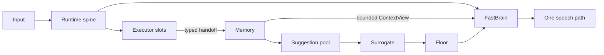

<!-- Keep in sync with README.zh-CN.md -->

# Nova Audio Agent

**English** | [简体中文](README.zh-CN.md)

> **An always-on voice agent with restrained proactivity — always working, speaking only when
> it's worth the floor.**

[](LICENSE)
[](package.json)
[](#3-architecture)
[](docs/blog/2026-08-proactive-voice-agent-design-space.md)

Nova Audio Agent is a **harness for an always-on, general-purpose voice agent**. Nova (小诺)
keeps the conversation responsive while independent capabilities search, observe, operate devices,
or complete longer tasks in the background.

This is not a chatbot framework and not a workflow engine. It focuses on a different problem:
**how an agent decides when to speak, when to dispatch work, and when to stay silent while several
things are happening at once.** It is an experimental system for development and evaluation rather
than a turnkey consumer assistant. Nova is built to be a user-level assistant rather than a
per-project tool: one always-on voice entry point that can create, switch between, and resume work
across many named workspaces — a Workspace is the filesystem isolation boundary between projects,
and each task runs as its own resumable Session inside one.

Our closest neighbor is [qwen-audio-agent](https://github.com/QwenAudio/qwen-audio-agent) — we
adapted its macOS voice-capture helper (see [NOTICE](NOTICE)) and read its progress-reporting
design closely. It answers *how to keep an agent talking while it works*, and answers it well.
The question that kept nagging us is the mirror image: when is talking worth it at all — who
decides, with what priority, from which memory? That upstream question is what this repository
explores; the
[design post](docs/blog/2026-08-proactive-voice-agent-design-space.md#5-related-work) carries the
full discussion.

> **Principle:** domain-specific capability is replaceable execution capability; the agent core is
> the part that owns lifecycle, memory, attention, and speech.

**New here?** Read [Design essence](docs/essence.md) for the shortest explanation of the design, or
jump to [Quickstart](#4-quickstart) to run it.

## 1. Highlights

- **Structured channel-wise memory.** Every capability writes to its own append-only channel —
  `conversation`, `search`, `cam`, `watch`, `guard`, plus one per active executor — and every
  entry carries trust, priority, and outcome. Only FastBrain updates structured intent, goal, and
  authorization; model calls read a bounded `ContextView`, never raw memory.
- **Push-and-pull proactivity.** Push: an eligible ambient observation becomes a pooled
  suggestion, and Surrogate decides whether it deserves attention now — `speak=false` is silence,
  not forgetting (urgent Guard hits bypass the pool). Pull: the same stored state answers later
  questions, including the realtime `memory.recall` tool. Publish once. Decide later. Answer from
  the same state.
- **Heterogeneous executors under priority-based floor arbitration.** Executors run concurrently,
  and Floor rules every speech attempt `allow`, `preempt`, or `defer` with priorities bound to the
  triggering event (user 100 > guard 90 > executors 50 > ambient 40). A model cannot escalate its
  own priority; a deferred utterance lands in the suggestion pool.
- **Codex live steering over the native app-server.** On the realtime path, Codex runs behind
  `codex app-server` (JSON-RPC `turn/start`, `turn/steer`): a new user constraint joins the
  in-flight turn instead of restarting it, under the eval-gated contract
  `run < turn_start < steer ≤ accept < completion`.
- **One voice entry point for many workspaces.** Named Codex Workspaces with isolated Codex homes
  and persistent, resumable Sessions; voice-driven create, switch, and resume all pass through a
  fail-closed propose-and-confirm step. (Voice creates new managed directories; importing an
  existing repository goes through the `NOVA_AUDIO_AGENT_CODEX_WORKSPACE` startup setting.)
- **Token discipline by design.** Codex receives one bounded work order, never conversation
  history, and its progress returns summarized rather than streamed raw (see §3.3 below).

[](assets/ideas/v3/nova-audio-agent-runtime-chalkboard.png)

*The runtime on the original design chalkboard: one event loop, two model ports reading one
ContextView, Memory as the shared blackboard, and Floor guarding the single speech path.*

> 📝 **Design post:**
> [A Tradeoff Ruler for Proactive Voice Agents](docs/blog/2026-08-proactive-voice-agent-design-space.md)
> — where the speak decision should live, and what survives a stronger model.

## 2. The problem it models

A realtime agent has more than one clock:

- the user may continue talking while delegated work is still running;
- an executor may publish progress before it has a final result;
- a camera or guard may notice something nobody explicitly asked about;
- several possible responses may become ready while only one voice owns the floor.

Treating all of this as one synchronous model-and-tools turn either blocks the conversation or
creates multiple competing speakers. Nova Audio Agent separates the responsibilities instead —
each component owns exactly one judgment; the vocabulary is pinned in
[Glossary and invariants](docs/glossary.md).

## 3. Architecture



The diagram encodes several non-negotiable boundaries:

1. The runtime dispatches executor work without waiting for it in the event-loop body.
2. Every accepted result reaches canonical memory before it can affect the conversation, and
   executors never speak directly to the user.
3. Only FastBrain may update structured intent, goal, and authorization, and model calls read a
   bounded `ContextView`, not unrestricted memory.
4. Only manifests selected by configuration become model-facing tools.
5. User-awaited results wake FastBrain directly; unsolicited suggestions must pass through
   `Surrogate → Floor → FastBrain`, where Floor rules `allow`, `preempt`, or `defer` with a
   priority bound to the triggering event — never chosen by the model — and a deferred utterance
   lands in the suggestion pool instead of being dropped.

These are implementation constraints, not prompt conventions: delegate identity, deadline, and
terminal state are checked at the runtime boundary, and a returning result is correlated to the
exact delegate and channel that produced it — the user never waits for an executor to finish
before continuing the conversation. Modules and rules:
[Architecture](docs/architecture.md), [Glossary and invariants](docs/glossary.md).

### 3.1 Memory before speech

Many agent systems treat progress primarily as a notification problem. Nova Audio Agent treats it
first as a memory problem. An executor publishes an observation once; Runtime records it once; the
control plane decides later whether it should interrupt, wait, or remain available as evidence.

**Publish once. Decide later. Answer from the same state.**

The push and pull sides in the Highlights are both projections of this rule: a fired suggestion
cools down and re-arms only when new evidence lands on its channel (so the same line is never
replayed on a timer), and the `memory.recall` tool later reads the same channels the push side
wrote. The design separates three judgments that are easy to conflate:

| Question | Owner |
|---|---|
| What happened? | Executor → canonical Memory |
| Nobody asked: is this change worth saying now? | Surrogate, for eligible ambient suggestions |
| The user asked: how should the answer be expressed? | FastBrain over a bounded `ContextView` |

### 3.2 Why this is not a ReAct loop

Executor completion does not sit inside a turn-bound `reason → act → observe` loop: a model can
dispatch work, return control, and respond to new events, while progress and completion come back
as causal events rather than a blocking tool result. A slow task can earn one response at dispatch
and another when useful work returns, and the executor never gains a direct route to the user's
speakers. The longer rationale is in [Design essence](docs/essence.md) and the
[v3 design series](docs/archs/v3/00-overview.md).

### 3.3 Fast and slow brains: token discipline by design

The realtime front brain (a cloud realtime model; the text path uses a lightweight cloud model)
owns the conversation, and Codex is the slow work brain, behind a deliberately narrow boundary:

- The front brain asks at most one short clarifying question, then consolidates the request into
  a single bounded work order — the work order, never conversation history, is all that crosses
  to Codex.
- Codex progress returns as memory events, summarized at the Codex projection boundary and passed
  through the Surrogate attention policy before it can reach the floor.
- The conversation channel compresses at a fixed watermark; `codex__steer` appends a new
  constraint to the in-flight turn rather than re-dispatching with re-sent context.
- Workspace-graph context enters model calls only through fixed budgets, and workspace/session
  candidates are listed only on demand.

These bounds govern what crosses the boundary and what returns to the conversation — a resumed
Session still restores its saved Codex thread, whose accumulated context sits outside them. They
are structural bounds, not measured savings: no token or cost benchmarks are published, and both
brains are cloud models.

## 4. Quickstart

Requirements: Node.js 22+, npm, Git, a logged-in `codex` executable, and a supported desktop
session. Building native helpers also requires Xcode Command Line Tools on macOS, a C compiler at
`/usr/bin/cc` on Linux, or Visual Studio Build Tools with the **Desktop development with C++**
workload on Windows. Native Ambient Orb audio capture is available on macOS; Windows and Linux use
Chromium's audio stack.

> **Release status:** Node.js and TypeScript are the primary runtime. Codex uses app-server only;
> JSONL exists only for historical parser fixtures. Signed three-platform candidates,
> clean-machine runs, hardware validation, and publication evidence remain pending.

### Platform support and packaging status

The runtime and desktop client carry win32, darwin, and linux code paths, and the repository
defines packaging targets for macOS, Windows (NSIS), and Linux (AppImage and deb). Validation is
uneven, and this section states it plainly:

- Native echo-cancelled audio capture (VoiceProcessingIO) is macOS-only; Windows and Linux use
  Chromium's audio stack, including its echo cancellation.
- CI currently runs only on manual dispatch and only on Windows runners; there is no automatic
  cross-platform CI signal today, and signed candidates, clean-machine runs, and hardware
  validation remain pending.
- The **Unsigned Windows packages** workflow builds a Windows artifact only (`unsigned-win32-x64`;
  expect a SmartScreen warning for the unsigned executable, keep protections enabled, and verify
  the workflow run before use). Linux AppImage/deb exist as local packaging scripts
  (`npm run package:linux`) and as legs of the manual-dispatch release-candidate workflow, whose
  macOS and Windows legs are signing-gated while Linux artifacts are format-checked, not signed.

Clone and install the locked Node dependencies:

```bash
git clone \
  https://github.com/deepnovacore/NovaAudioAgent.git nova-audio-agent
cd nova-audio-agent
npm ci
cp .env.example .env
```

For the default integrated Qwen desktop, set both `DASHSCOPE_API_KEY` and `TAVILY_API_KEY` in
`.env` (or in the invoking shell). Search is always assembled, so Tavily is required even when it
is not selected as an executor.

The deterministic CLI is available after a build:

```bash
npm run build --workspace @nova-audio-agent/runtime
node runtime/dist/src/cli.js diagnose --json
node runtime/dist/src/cli.js demo all
```

The demo suite covers asynchronous delegation, dual-axis speak-and-dispatch, timeouts, and
proactive observations. `diagnose` validates configuration without contacting providers or opening
devices.

Nova is Chinese-first: the persona, production prompts, tool descriptions, CLI error messages, and
default voice are Chinese. Current Node capabilities — deterministic sims, Tavily search, Codex
over app-server, camera Watch/Guard, and integrated or cascaded realtime voice — are configured
through environment variables;
per-integration setup, cautions, and the full variable reference are in
[Getting started](docs/getting-started.md).

## 5. One assistant, many workspaces

One Nova instance is meant to be the single voice entry point across every project a user works
in.

### Named Codex workspaces and Sessions

A **Workspace** is an isolated filesystem/Git project with its own `CODEX_HOME`; a **Session** is
a persistent, resumable Codex thread inside one Workspace. The realtime project surface is always
on, and the optional startup workspace imports an existing repository:

```bash
NOVA_AUDIO_AGENT_CODEX_WORKSPACE=/absolute/path/to/initial/repository
NOVA_AUDIO_AGENT_CODEX_MANAGED_ROOT=~/.nova-audio-agent/workspaces
NOVA_AUDIO_AGENT_CODEX_PROJECT_STATE_ROOT=~/.nova-audio-agent
```

Each realtime turn sees only the active Workspace and Session; candidates are listed on demand,
never injected as standing context. Create, switch, and resume first produce a proposal, and only
a dedicated structured confirmation with the exact proposal ID commits it — rejection, a
mismatched ID, or replay fails closed. Switching is staged (confirm the Workspace, then list or
resume its Sessions), Codex execution stays one global task at a time, a registry admits one live
Orb owner (a second fails with `state_busy`), and the Orb displays only public labels — never
paths, thread IDs, or registry keys. The complete discovery, confirmation, persistence, and
recovery contract is in
[Multi-project Workspace handoff](docs/multi-project-workspace-handoff.md); retention limits and
credential handling are in [Getting started](docs/getting-started.md).

### Workspace memory graph and optional MyContext evidence

The Node runtime has an opt-in workspace memory graph: it maintains workspace identity from
Nova's confirmed lifecycle and records adjacent committed transitions as weak `discussed_with`
map cues — bounded, low-authority, below the proactive threshold, and stale after 90 days without
refresh. Nova reads neither workspace and never inspects another workspace automatically; the
memory layering rationale is in the [v3 memory volume](docs/archs/v3/02-memory.md).

```bash
NOVA_AUDIO_AGENT_WORKSPACE_GRAPH_ENABLED=true
NOVA_AUDIO_AGENT_WORKSPACE_GRAPH_PATH=~/.nova-audio-agent/workspace-graph.sqlite

# Optional. This must be a separately supplied Nova-compatible read-only adapter base URL.
NOVA_AUDIO_AGENT_MYCONTEXT_PROVIDER_URL=http://127.0.0.1:PORT/base
```

The optional MyContext boundary adds a person-wide evidence source (chats, documents, meetings,
people) that Nova may consult only for explicit evidence recall about the current workspace; the
result is read-only, untrusted, and non-proactive. It requires a separately supplied
Nova-compatible read-only adapter — none ships in this repository, so the integration is not yet
functional end to end. Upstream MyContext is licensed under the Elastic License 2.0, and a
separate legal and distribution review is required before reusing, bundling, or shipping any of
its code or runtime. The strict handshake contract and participation limits are in
[Getting started](docs/getting-started.md).

## 6. Ambient Orb

The Ambient Orb is the local voice interface. After filling `.env`, launch the source client:

```bash
npm run start:client
```

The client launcher starts the Node runtime and the Electron renderer with context isolation,
sandboxing, and a narrow preload bridge. It requires Node.js, the `codex` executable, microphone
permission, and `TAVILY_API_KEY` in `.env` or the invoking shell; shell variables take precedence
over `.env`. `DASHSCOPE_API_KEY` is required only for integrated Qwen and cascaded Qwen. For
integrated-Qwen source startup, `NOVA_AUDIO_AGENT_MODEL_API_KEY` can stand in for it only when
`NOVA_AUDIO_AGENT_MODEL_BASE_URL` is exactly
`https://dashscope.aliyuncs.com/compatible-mode/v1`; another base URL does not make the generic
key a Qwen realtime credential. When both credentials are set, `DASHSCOPE_API_KEY` takes
precedence. Cascaded Ark requires `ARK_API_KEY` for its LLM plus
`DOUBAO_BIGMODEL_API_KEY` for Volcengine TTS and ASR
fallback; `DOUBAO_ASR_API_KEY` is an optional ASR override. On macOS it also builds the native
VoiceProcessingIO helper for system-level echo cancellation; Windows and Linux use Chromium's echo
cancellation instead. Linux sessions run on X11 (Wayland sessions go through XWayland). See
[Getting started](docs/getting-started.md) for the per-platform notes.

Both the local-camera default and `NOVA_AUDIO_AGENT_DESKTOP_VIDEO_FILE` playback use Chromium's
camera pipeline.

### Voice pipeline configuration

The top-level choice is `integrated` or `cascaded`. The default integrated Qwen pipeline uses
`qwen-audio-3.0-realtime-plus`, the `longanqian` voice, and `DASHSCOPE_API_KEY`; it does not expose
separate ASR, LLM, or TTS nodes. Cascaded mode exposes endpointing, ASR, LLM, and TTS. Its default
chain is Volcengine ASR -> Qwen `qwen-flash` -> Volcengine TTS; choose Ark only by explicitly
selecting it as the cascaded LLM.

A single key per platform is reused wherever that platform is selected: DashScope for Qwen, Ark
for the Ark LLM, and `DOUBAO_BIGMODEL_API_KEY` for Volcengine TTS. `DOUBAO_ASR_API_KEY` is an
optional Volcengine ASR override; its fallback is `DOUBAO_BIGMODEL_API_KEY`. There
is no provider failover.

The conditional Settings Panel puts the mode first. Integrated mode shows its provider, model, and
voice; cascaded mode shows endpointing, ASR, LLM, and TTS cards. Keys are write-only and return only
presence state to the renderer. Pipeline, provider, model, voice, and key edits take effect on the
next launch; only palette changes apply live. See [Getting started](docs/getting-started.md) for
the public selectors and opt-in live smoke command.

The orb renders as a Canvas 2D particle field whose behavior carries state — particles converge
while listening, pulse with playback amplitude while speaking, and an outer band orbits while a
Codex delegate works — in either the Ember or Graphite palette. Right-clicking the orb opens the
Memory Board, which renders every memory channel's latest items on request (the visual counterpart
of the channel-wise memory described above), and a settings panel for the palette, push-and-pull
proactivity preset, Codex progress cadence, voice, and API keys (encrypted through the OS keychain).
Provider events are correlated with host response and delegate identities, and playback
acknowledgements fence audio clearing and completion.

## 7. Repository layout

```text
runtime/src/                    Runtime spine, memory, executors, providers, CLI, and desktop entry
runtime/test/                   Deterministic runtime, protocol, adapter, and integration tests
desktop/ambient-orb/            Electron UI and native macOS audio helper
docs/                           Public architecture, rationale, guides, status, and design series
resources/                      Local raw and edited media; intentionally ignored by Git
```

## 8. Documentation

| Read this | For |
|---|---|
| [Design essence](docs/essence.md) | Stance and non-goals |
| [Architecture](docs/architecture.md) | Modules and boundaries |
| [Glossary and invariants](docs/glossary.md) | Vocabulary and rules |
| [Getting started](docs/getting-started.md) | Setup and integrations |
| [Project status](docs/status.md) | What works, what's experimental |
| [Multi-project Workspace handoff](docs/multi-project-workspace-handoff.md) | The complete Workspace/Session contract |
| [A2A](docs/a2a.md) | Agent-to-agent boundaries |
| [Node runtime migration notes](docs/releases/node-runtime-migration-unreleased.md) | The migration's de-facto changelog |
| [v3 design series](docs/archs/v3/00-overview.md) | The detailed design argument |
| [A Tradeoff Ruler for Proactive Voice Agents](docs/blog/2026-08-proactive-voice-agent-design-space.md) | The design-space essay |
| [Downstream reimplementation guide](docs/guides/downstream-reimplementation.md) | Rebuilding it elsewhere |

## 9. Roadmap

1. **MyContext end to end.** Only the strict loopback-only, read-only client boundary ships
   today; the plan is a Nova-compatible read-only adapter — after the Elastic License 2.0
   review — so explicit evidence recall works against a real MyContext installation.
2. **Workspace memory graph on by default, with episodic memory.** The graph is implemented but
   opt-in, and session-level episodic summaries are not built; the plan is default-on once soak
   evidence justifies it, plus bounded episodic summaries as a new memory layer.
3. **More coding-agent providers through the executor port.** Codex over `codex app-server` is
   the only coding-agent backend today; the `ExecutorAdapter` port is the seam for adding
   providers over ACP or their native protocols. (Distinct from the voice/realtime provider
   abstraction, which already offers real choices.)

## 10. Development and verification

```bash
npm ci
npm run check
npm run build
npm test
```

Live integrations are intentionally credential- and hardware-dependent; they are not substitutes
for the deterministic tests, and their outputs belong in ignored local artifact directories.
Report security issues privately via [SECURITY.md](SECURITY.md); contribution guidelines,
including the invariants every change must preserve, are in [CONTRIBUTING.md](CONTRIBUTING.md).

## 11. License

Copyright 2026 DeepNovaCore. Licensed under the [Apache License 2.0](LICENSE).
Third-party attribution is recorded in [NOTICE](NOTICE) and the desktop
[third-party notices](desktop/ambient-orb/THIRD_PARTY_NOTICES.md).
