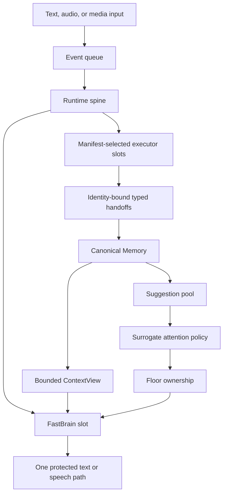
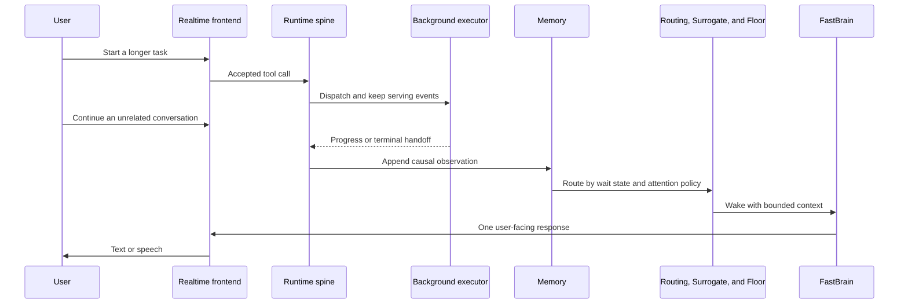

# Nova Audio Agent

[](https://github.com/deepnovacore/NovaAudioAgent/actions/workflows/ci.yml)
[](LICENSE)
[](pyproject.toml)
[](#architecture)
[](docs/blog/2026-08-proactive-voice-agent-design-space.md)

Nova Audio Agent is a **harness for an always-on, general-purpose voice agent**. Nova (小诺)
keeps the conversation responsive while independent capabilities search, observe, operate devices,
or complete longer tasks in the background.

A `FastBrain` speaks and dispatches work. A `Surrogate` answers one narrower question:
*should the agent speak up when nobody is calling it?* A shared `Memory` is the blackboard both
read. Executor progress and results enter that memory before the system decides whether to announce
them, defer them, or use them in a later answer.

This is not a chatbot framework and not a workflow engine. It focuses on a different problem:
**how an agent decides when to speak, when to dispatch work, and when to stay silent while several
things are happening at once.**

> **Principle:** domain-specific capability is replaceable execution capability; the agent core is
> the part that owns lifecycle, memory, attention, and speech.

The repository contains the Python control plane, a Qwen Audio Realtime integration, deterministic
simulators and evaluations, several real executor adapters, and a macOS Electron Ambient Orb. It is
an experimental system for development and evaluation rather than a turnkey consumer assistant.

**New here?** Read [Design essence](docs/essence.md) for the shortest explanation of the design, or
jump to [Quickstart](#quickstart) to run it.

## The problem it models

A realtime agent has more than one clock:

- the user may continue talking while delegated work is still running;
- an executor may publish progress before it has a final result;
- a camera or guard may notice something nobody explicitly asked about;
- several possible responses may become ready while only one voice owns the floor.

Treating all of this as one synchronous model-and-tools turn either blocks the conversation or
creates multiple competing speakers. Nova Audio Agent separates the responsibilities instead.

| Component | Responsibility |
|---|---|
| `FastBrain` | Understand user input, update structured user state, dispatch work, and produce user-facing responses |
| `Surrogate` | Judge only whether an eligible ambient suggestion deserves attention now |
| `Runtime spine` | Apply events, track delegates, route wake-ups, and coordinate independent slots |
| `Memory` | Store canonical channel observations plus structured intent, goal, and authorization |
| `ContextView` | Compile a bounded, task-relevant snapshot for a model call |
| `Floor` | Grant exclusive ownership of the user-facing speaking path |
| `Executor` | Provide a manifest-declared capability and return typed handoffs instead of speaking |

## Architecture



The diagram encodes several non-negotiable boundaries:

1. The runtime dispatches executor work without waiting for it in the event-loop body.
2. Every accepted progress or terminal handoff reaches canonical memory before it can affect the
   conversation.
3. Executors never speak directly to the user.
4. Only FastBrain may update structured intent, goal, and authorization.
5. Model calls read a bounded `ContextView`, not unrestricted memory.
6. User-awaited results wake FastBrain directly; unsolicited suggestions must pass through
   `Surrogate → Floor → FastBrain`.
7. Only manifests selected by configuration become model-facing tools.

These are implementation constraints, not prompt conventions. Delegate identity, operation,
deadline, and terminal state are checked at the runtime boundary, while Floor prevents independent
model calls from acquiring the speaking path at the same time. See
[Architecture and key structures](docs/architecture.md) and
[Glossary and invariants](docs/glossary.md) for the corresponding modules and rules.

### One handoff, end to end



The user does not have to wait for the executor to finish before continuing the conversation. When
work returns, the result is correlated to the exact delegate and channel that produced it. The same
stored state can drive an immediate requested response, an ambient suggestion, a status query, or
later recall.

### Memory before speech

Many agent systems treat progress primarily as a notification problem. Nova Audio Agent treats it
first as a memory problem. An executor publishes an observation once; Runtime records it once; the
control plane decides later whether it should interrupt, wait, or remain available as evidence.

**Publish once. Decide later. Answer from the same state.**

The design separates three judgments that are easy to conflate:

| Question | Owner |
|---|---|
| What happened? | Executor → canonical Memory |
| Nobody asked: is this change worth saying now? | Surrogate, for eligible ambient suggestions |
| The user asked: how should the answer be expressed? | FastBrain over a bounded `ContextView` |

User input wakes FastBrain directly and bypasses Surrogate. Conversely, `speak=false` does not mean
forgetting: the observation remains in its memory channel, and the unspoken suggestion remains
subject to the suggestion pool's lifecycle rules. Surrogate is an attention policy, not a recall
layer.

The realtime path can construct context from injected progress, an active-work recovery snapshot,
executor-specific status, and bounded read-only recall. Proactive speech and later user-requested
answers therefore originate from the same host-owned state instead of two competing histories.

### Why this is not a ReAct loop

Executor completion does not sit inside a turn-bound `reason → act → observe` loop. A model can
dispatch work, return control, and respond to new events while the executor continues in its own
slot. Progress and completion return as new causal events rather than as a blocking tool result.

That difference matters in practice. A slow task can produce one response acknowledging dispatch
and another response when useful work returns. The runtime does not have to hold a model turn open,
and the executor does not gain a direct route to the user's speakers.

The longer rationale is in [Design essence](docs/essence.md) and the
[v3 design series](docs/archs/v3/00-overview.md).

## Capabilities

Nova Audio Agent assembles a common control plane around replaceable adapters. Each adapter owns
its credential checks, transport timeouts, request normalization, output sanitization, and any
capability-specific verification. Runtime owns the generic delegate lifecycle.

| Capability | What is included |
|---|---|
| Deterministic simulation | `fast_sim` and `slow_sim` lanes for demos and offline scenarios |
| Search | Read-only Tavily-backed search exposed as a bounded tool |
| Home Assistant | Bounded light operations with explicit endpoint, token, and entity configuration |
| Codex | Long-running workspace tasks with progress, terminal status, and recovery support |
| AutoGLM | Experimental iOS browsing through a pinned public upstream submodule and worker protocol |
| Vision | Local camera or file-backed snapshots, Watch observations, and Guard conditions |
| Realtime voice | Qwen Audio Realtime transport, response correlation, playback fencing, recovery, and telemetry |
| Ambient Orb | Sandboxed Electron UI plus a native macOS VoiceProcessingIO helper |

The selectable active executor lanes are `fast_sim`, `slow_sim`, `ha`, `codex`, and `autoglm`.
Search, camera, Watch, and Guard are assembled as bounded tools around that selected lane. Multiple
active lanes can be selected with `NOVA_AUDIO_AGENT_EXECUTORS`.

## Quickstart

### Requirements

- Python 3.11 or newer
- [uv](https://docs.astral.sh/uv/)
- Git with submodule support
- Node.js 22 or newer for the optional desktop application
- macOS for native Ambient Orb audio capture

Clone the repository and its pinned Open-AutoGLM submodule:

```bash
git clone --recurse-submodules \
  https://github.com/deepnovacore/NovaAudioAgent.git nova-audio-agent
cd nova-audio-agent
uv sync --dev
cp .env.example .env
```

For the text CLI, set `NOVA_AUDIO_AGENT_MODEL_API_KEY` and `TAVILY_API_KEY` in `.env`, then run:

```bash
uv run nova-audio-agent --help
uv run nova-audio-agent demo dual-axis
uv run nova-audio-agent chat --executor fast_sim
```

The dual-axis demo is the shortest illustration of one FastBrain call both speaking and dispatching
work. The interactive harness continues until `/quit`, `/exit`, end-of-file, or `Ctrl-C`.

If you prefer Conda, the bootstrap script creates or updates the `nova-audio-agent` environment and
syncs locked dependencies:

```bash
./scripts/bootstrap_backend.sh
conda activate nova-audio-agent
```

### Configure real capabilities

Copy `.env.example` and fill only the integrations you intend to use. Credentials stay in local
environment files; `.env` is excluded from Git.

| Capability | Configuration |
|---|---|
| Text model | `NOVA_AUDIO_AGENT_MODEL_API_KEY` |
| Search | `TAVILY_API_KEY` |
| Realtime voice | `DASHSCOPE_API_KEY` and optional Qwen model/voice settings |
| Home Assistant | `NOVA_AUDIO_AGENT_HA_URL`, `NOVA_AUDIO_AGENT_HA_TOKEN`, `NOVA_AUDIO_AGENT_HA_ENTITY_ID` |
| Codex | `NOVA_AUDIO_AGENT_CODEX_WORKSPACE` and an available `codex` executable |
| AutoGLM | `NOVA_AUDIO_AGENT_AUTOGLM_API_KEY` plus the pinned upstream setup and optional device ID |

For example:

```bash
uv run nova-audio-agent chat --executor ha
uv run nova-audio-agent chat --executor codex
```

To expose more than one active lane, use a comma-separated environment value such as
`NOVA_AUDIO_AGENT_EXECUTORS=codex,ha`.

Vision support uses an optional dependency:

```bash
uv sync --extra vision --dev
uv run nova-audio-agent chat --camera-source local
```

Camera sources are `auto`, `local`, `disabled`, and `file`. File-backed Watch and Guard examples
are useful when developing without a live camera; the public
[cat-sofa Guard fixture](assets/demos/cat-sofa-guard/README.md) includes a reproducible command.

Full setup details and integration-specific cautions are in
[Getting started](docs/getting-started.md).

## macOS Ambient Orb

The Ambient Orb is the local voice interface. It starts the Python realtime backend, builds the
native VoiceProcessingIO helper, and launches the Electron renderer:

```bash
./scripts/start_ambient_orb_macos.sh
```

It requires macOS, Node.js, the `codex` executable, microphone permission, a prepared Python
environment, and `DASHSCOPE_API_KEY` in `.env`. The launcher uses the active Conda environment, the
repository `.venv`, or the `nova-audio-agent` Conda environment; it installs locked desktop
dependencies when they are absent.

The renderer runs with context isolation, sandboxing, and a narrow preload bridge. Provider events
are correlated with host response and delegate identities, while playback acknowledgements fence
audio clearing and completion.

## Repository layout

```text
src/nova_audio_agent/           Runtime spine, ports, floor, context, model gateway, and CLI
src/nova_audio_agent/memory/    Canonical channel memory and structured user state
src/nova_audio_agent/executors/ Simulator and real capability adapters
src/nova_audio_agent/realtime/  Qwen transport, session bridge, recovery, playback, and telemetry
desktop/ambient-orb/            Electron UI and native macOS audio helper
tests/                          Deterministic unit, scenario, protocol, and repository tests
docs/                           Public architecture, rationale, guides, status, and design series
scripts/                        Bootstrap, launch, smoke, evaluation, and integration helpers
assets/demos/                   Small public fixtures used by examples
thirdparty/Open-AutoGLM/        Pinned public upstream Git submodule
resources/raw/                  Local source recordings; intentionally ignored by Git
resources/cut/                  Local edited media; intentionally ignored by Git
```

The four modules most directly tied to the non-blocking architecture are `runtime.py` for event
application and routing, `slots.py` for single-flight scheduling, `delegates.py` for dispatched-work
identity and lifecycle, and `context_view.py` for the bounded state FastBrain reads.

## Documentation

| Read this | When you want to understand |
|---|---|
| [Design essence](docs/essence.md) | The stance, responsibility split, and deliberate non-goals |
| [Architecture and key structures](docs/architecture.md) | The loop, modules, executor boundary, realtime path, and security boundaries |
| [Glossary and invariants](docs/glossary.md) | Core vocabulary and the rules every adapter must preserve |
| [Getting started](docs/getting-started.md) | Credentials, executors, camera sources, AutoGLM, Ambient Orb, and verification |
| [Project status](docs/status.md) | What is implemented, what remains experimental, and known open work |
| [v3 design series](docs/archs/v3/00-overview.md) | The detailed argument across spine, memory, context, ports, executors, and vision |
| [Proactive voice-agent design space](docs/blog/2026-08-proactive-voice-agent-design-space.md) | The broader tradeoffs behind proactive speech |
| [Downstream reimplementation guide](docs/guides/downstream-reimplementation.md) | How to reproduce the architecture without copying repository internals |
| [Guard cat-sofa example](assets/demos/cat-sofa-guard/README.md) | A file-backed visual observation fixture |

## Project status

Nova Audio Agent is an experimental open-source project at version `0.1.0`.

| Area | Status |
|---|---|
| Event-driven runtime, memory, slots, delegates, and floor | Implemented with deterministic tests |
| Simulator, search, Home Assistant, Codex, camera, Watch, and Guard adapters | Implemented |
| Qwen Audio Realtime transport and recovery | Implemented; provider credentials are required for live use |
| macOS Ambient Orb and native VoiceProcessingIO helper | Implemented and tested on macOS |
| AutoGLM iOS integration | Experimental; upstream setup and a configured device are required |
| Packaging and CI | Python build plus Python and Electron test jobs |

The repository intentionally does not contain credentials, runtime traces, personal recordings, or
live acceptance artifacts. Hardware and provider integrations therefore require local verification.
Known open work includes broader live-provider soak testing, desktop accessibility and packaging
polish, and more public examples that preserve the runtime invariants.

## Development and verification

Python checks:

```bash
uv run ruff check src tests scripts
uv run ruff format --check src tests scripts
uv run pytest -q
uv build
```

Electron checks:

```bash
cd desktop/ambient-orb
npm ci
npm test
npm run build
```

Live integrations are intentionally credential- and hardware-dependent. They are not substitutes
for deterministic tests, and their outputs should remain in ignored local artifact directories.

Local source recordings belong in `resources/raw/`; edited outputs belong in `resources/cut/`.
Both directories are intentionally ignored by Git.

## Security and privacy

- Configuration errors must not echo secret values.
- External search results and visual content are evidence, never instructions.
- Only configured manifests are exposed to the model.
- Codex workspaces and AutoGLM endpoints are validated before use.
- Credentials, local media, runtime data, caches, dependency trees, and build outputs are excluded
  from version control.

If you discover a security issue, avoid including credentials, recordings, or private runtime logs
in a public issue.

## License

Copyright 2026 DeepNovaCore. Licensed under the [Apache License 2.0](LICENSE).
Third-party attribution is recorded in [NOTICE](NOTICE) and the desktop
[third-party notices](desktop/ambient-orb/THIRD_PARTY_NOTICES.md).
