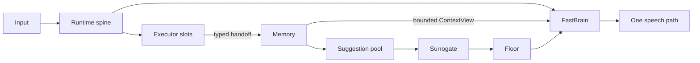

<!-- Keep in sync with README.zh-CN.md -->

# Nova Audio Agent

**English** | [简体中文](README.zh-CN.md)

> **An always-on voice agent with restrained proactivity — always working, speaking only when
> it's worth the floor.**

[](LICENSE)
[](package.json)
[](#2-architecture)
[](docs/blog/2026-08-proactive-voice-agent-design-space.md)

Nova Audio Agent is a **harness for an always-on, general-purpose voice agent**: Nova (小诺)
keeps the conversation responsive while independent capabilities search, observe, operate
devices, or complete longer tasks in the background.

It is not a chatbot framework or a workflow engine — it studies **how an agent decides when to
speak, when to dispatch work, and when to stay silent while several things happen at once**,
giving each component exactly one judgment ([Glossary and invariants](docs/glossary.md)); an
experimental system, not a turnkey assistant. Nova is user-level rather than per-project: one
voice entry point across many named workspaces, where a Workspace is the filesystem isolation
boundary between projects and each task is a resumable Session inside one.

We adapted the macOS voice-capture helper of
[qwen-audio-agent](https://github.com/QwenAudio/qwen-audio-agent) ([NOTICE](NOTICE)): it answers
*how to keep an agent talking while it works*; we ask the mirror question — when is talking
worth it at all ([design post](docs/blog/2026-08-proactive-voice-agent-design-space.md)).

> **Principle:** domain-specific capability is replaceable execution capability; the agent
> core is the part that owns lifecycle, memory, attention, and speech.

**New here?** Read [Design essence](docs/essence.md), or jump to [Quickstart](#3-quickstart).

## 1. Highlights

- **Structured channel-wise memory.** Every capability writes its own append-only channel;
  model calls read a bounded `ContextView`, never raw memory.
- **Push-and-pull proactivity.** Pooled observations Surrogate may voice later — `speak=false`
  is silence, not forgetting — and `memory.recall` answers from the same state.
- **Priority-based floor arbitration.** Floor rules every speech attempt `allow`, `preempt`,
  or `defer`; priority is bound to the triggering event, never chosen by the model.
- **One voice entry point for many workspaces.** Isolated Codex homes, resumable Sessions,
  fail-closed propose-and-confirm.
- **Token discipline and live steering.** Codex receives one bounded work order, never
  conversation history; progress returns summarized, and a new user constraint joins the
  in-flight `codex app-server` turn instead of restarting it (§2).

## 2. Architecture



Non-negotiable boundaries, checked at the runtime boundary rather than promised in prompts
([Architecture](docs/architecture.md)):

1. The runtime dispatches executor work without waiting for it in the event-loop body.
2. Every accepted result reaches canonical memory first; executors never speak to the user.
3. Only FastBrain updates structured intent, goal, and authorization.
4. Only manifests selected by configuration become model-facing tools.
5. Unsolicited suggestions pass `Surrogate → Floor → FastBrain`; deferred utterances land in
   the suggestion pool instead of being dropped.

Progress is a memory problem before it is a notification problem — **publish once, decide
later, answer from the same state** — separating three judgments that are easy to conflate:

| Question | Owner |
|---|---|
| What happened? | Executor → canonical Memory |
| Nobody asked: is this change worth saying now? | Surrogate, for eligible ambient suggestions |
| The user asked: how should the answer be expressed? | FastBrain over a bounded `ContextView` |

This is not a ReAct loop: a model dispatches work, returns control, and keeps responding while
results come back as causal events, not blocking tool results
([Design essence](docs/essence.md), [v3 design series](docs/archs/v3/00-overview.md)).

The front brain owns the conversation; Codex is the slow work brain behind a narrow boundary:

- one bounded work order crosses to Codex — never conversation history;
- progress returns summarized at the Codex projection boundary, filtered by Surrogate;
- the conversation channel compresses at a fixed watermark; `codex__steer` appends to the
  in-flight turn instead of re-dispatching;
- workspace-graph context enters model calls only through fixed budgets.

Structural bounds, not measured savings: a resumed Session still restores its saved Codex
thread's accumulated context; no token or cost benchmarks are published, and both brains are
cloud models.

## 3. Quickstart

Requirements: Node.js 22+, npm, Git, a logged-in `codex` executable (app-server is the only
Codex transport), and a supported desktop session; native helpers need one platform toolchain
([Getting started](docs/getting-started.md)). Validation is uneven:

- Native echo-cancelled capture (VoiceProcessingIO) is macOS-only; Windows and Linux use
  Chromium's audio stack.
- CI runs only on manual dispatch, only on Windows runners; signed three-platform candidates,
  clean-machine runs, hardware validation, and publication evidence remain pending
  ([Project status](docs/status.md)).
- The unsigned-packages workflow ships a Windows artifact only; release-candidate Linux
  artifacts are format-checked, not signed ([Getting started](docs/getting-started.md)).

```bash
git clone https://github.com/deepnovacore/NovaAudioAgent.git nova-audio-agent
cd nova-audio-agent
npm ci && cp .env.example .env
```

Set `DASHSCOPE_API_KEY` and `TAVILY_API_KEY` for the default integrated Qwen desktop — Search
is always assembled, so Tavily is required even when not selected as an executor.

```bash
npm run build --workspace @nova-audio-agent/runtime
node runtime/dist/src/cli.js diagnose --json
node runtime/dist/src/cli.js demo all
```

`diagnose` never contacts providers or opens devices. Nova is Chinese-first (persona, prompts,
default voice); per-integration setup and variables: [Getting started](docs/getting-started.md).

## 4. One assistant, many workspaces

A **Workspace** is an isolated filesystem/Git project with its own `CODEX_HOME`; a **Session**
is a resumable Codex thread inside one. Create, switch, and resume are proposal-first: only a
structured confirmation carrying the exact proposal ID commits them — rejection, a mismatched
ID, or replay fails closed. Switching is staged, Codex runs one global task at a time, one
live Orb owner is admitted, and the Orb shows public labels only. Voice creates new managed directories; importing an existing repository goes through
`NOVA_AUDIO_AGENT_CODEX_WORKSPACE`. Full contract:
[Multi-project Workspace handoff](docs/multi-project-workspace-handoff.md); retention and
credentials: [Getting started](docs/getting-started.md).

An opt-in workspace memory graph records weak `discussed_with` cues — bounded, low-authority,
below the proactive threshold, stale after 90 days — and Nova never reads or inspects another
workspace on its own ([v3 memory volume](docs/archs/v3/02-memory.md)). The optional MyContext
boundary adds a person-wide, read-only, untrusted, non-proactive evidence source for explicit
recall; no
Nova-compatible adapter ships here, so the integration is not yet functional end to end, and
upstream MyContext (Elastic License 2.0) requires a separate legal and distribution review
before any reuse or bundling.

```bash
NOVA_AUDIO_AGENT_CODEX_WORKSPACE=/absolute/path/to/initial/repository
NOVA_AUDIO_AGENT_WORKSPACE_GRAPH_ENABLED=true
NOVA_AUDIO_AGENT_MYCONTEXT_PROVIDER_URL=http://127.0.0.1:PORT/base
```

## 5. Ambient Orb

The Ambient Orb is the local voice interface. After filling `.env`:

```bash
npm run start:client
```

The launcher starts the Node runtime and a sandboxed, context-isolated Electron renderer; it
needs the `codex` executable, microphone permission, and `TAVILY_API_KEY`; `DASHSCOPE_API_KEY`
is needed only for integrated Qwen and cascaded Qwen, and cascaded Ark needs `ARK_API_KEY`
plus `DOUBAO_BIGMODEL_API_KEY`. The default `integrated` pipeline is Qwen
`qwen-audio-3.0-realtime-plus` with the `longanqian` voice; `cascaded` mode defaults to
Volcengine ASR → Qwen `qwen-flash` → Volcengine TTS. One key per platform, no provider
failover; pipeline, provider, model, voice, and key edits apply on the next launch (only the
palette is live).

The orb is a Canvas 2D particle field whose behavior carries state — converging while
listening, pulsing with playback, an orbiting band while Codex works — in the Ember or
Graphite palette. Right-clicking opens the Memory Board (each channel's latest items) and a
settings panel for palette, proactivity preset, Codex progress cadence, voice, and API keys
(encrypted via the OS keychain).

## 6. Documentation

| Read this | For |
|---|---|
| [Design essence](docs/essence.md) | Stance and non-goals |
| [Architecture](docs/architecture.md) | Modules and boundaries |
| [Glossary and invariants](docs/glossary.md) | Vocabulary and rules |
| [Getting started](docs/getting-started.md) | Setup and integrations |
| [Project status](docs/status.md) | What works, what's experimental |
| [Multi-project Workspace handoff](docs/multi-project-workspace-handoff.md) | The complete Workspace/Session contract |
| [A2A](docs/a2a.md) | Agent-to-agent boundaries |
| [v3 design series](docs/archs/v3/00-overview.md) | The detailed design argument |
| [A Tradeoff Ruler for Proactive Voice Agents](docs/blog/2026-08-proactive-voice-agent-design-space.md) | The design-space essay |

## 7. Roadmap

1. **MyContext end to end** — a Nova-compatible read-only adapter, after the Elastic License
   2.0 review; only the strict client boundary ships today.
2. **Workspace graph on by default, plus episodic memory** — once soak evidence justifies it;
   today the graph is opt-in and session-level episodic summaries are unbuilt.
3. **More coding agents through the executor port** — the `ExecutorAdapter` port is the seam
   for ACP or native protocols; Codex is the only backend today.

## 8. Development and verification

```bash
npm ci && npm run check && npm run build && npm test
```

Live integrations are credential- and hardware-dependent and never substitute for the
deterministic tests. Security reports: [SECURITY.md](SECURITY.md); contribution rules and
invariants: [CONTRIBUTING.md](CONTRIBUTING.md).

## 9. License

Copyright 2026 DeepNovaCore, [Apache License 2.0](LICENSE). Third-party attribution:
[NOTICE](NOTICE) and [desktop notices](desktop/ambient-orb/THIRD_PARTY_NOTICES.md).
