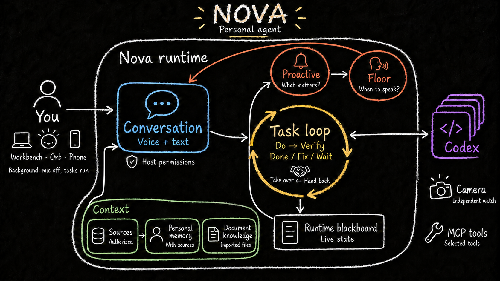
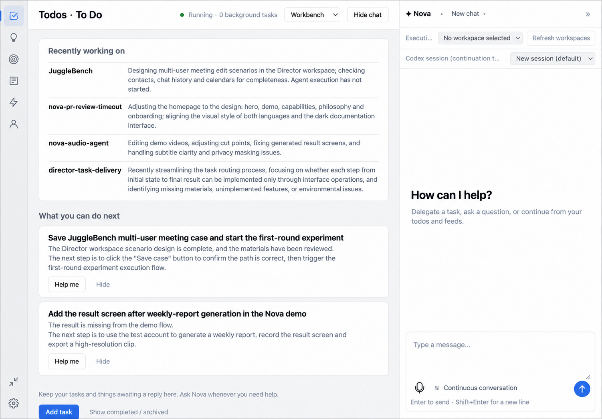
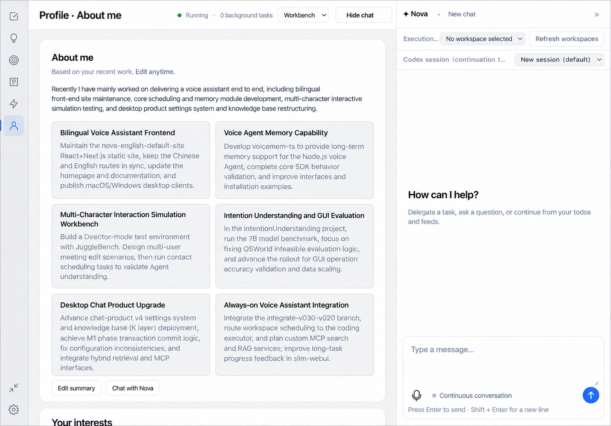
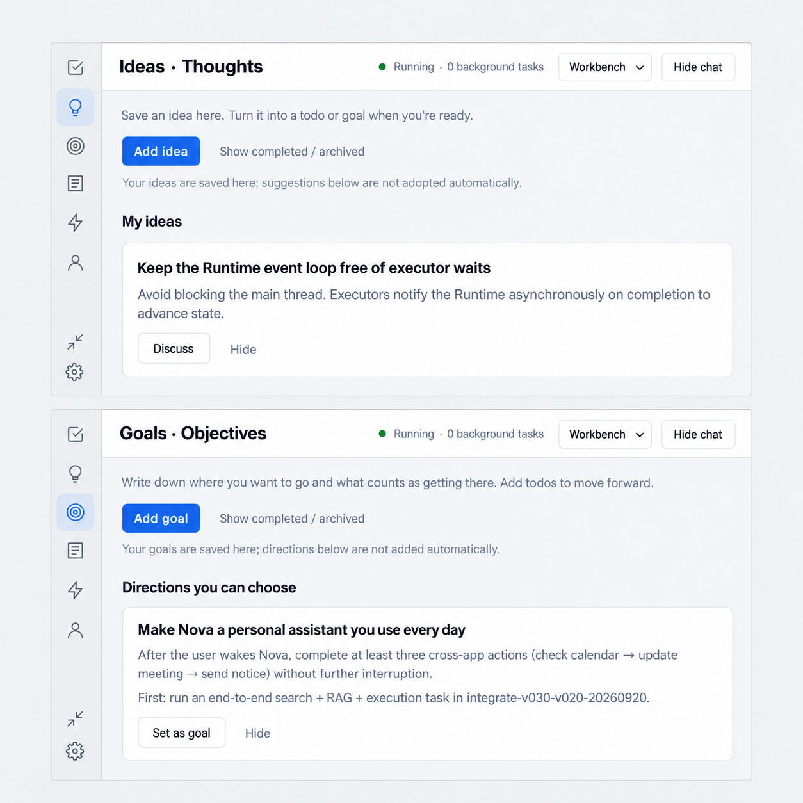
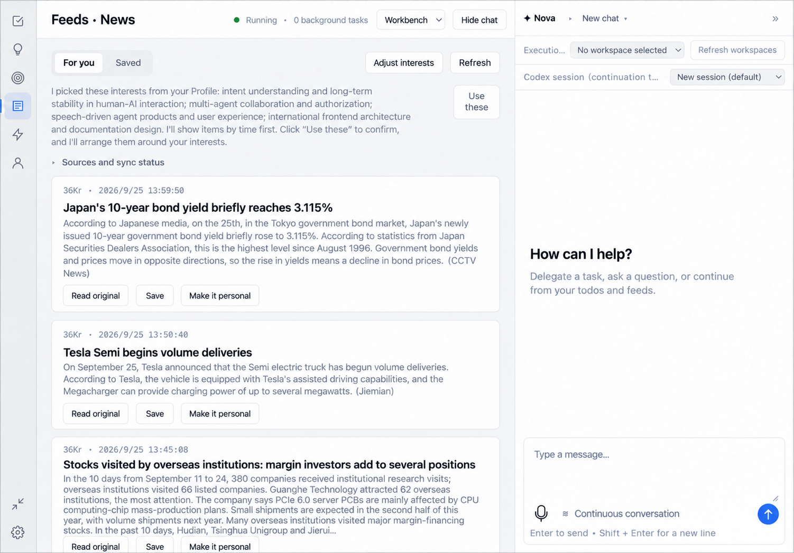
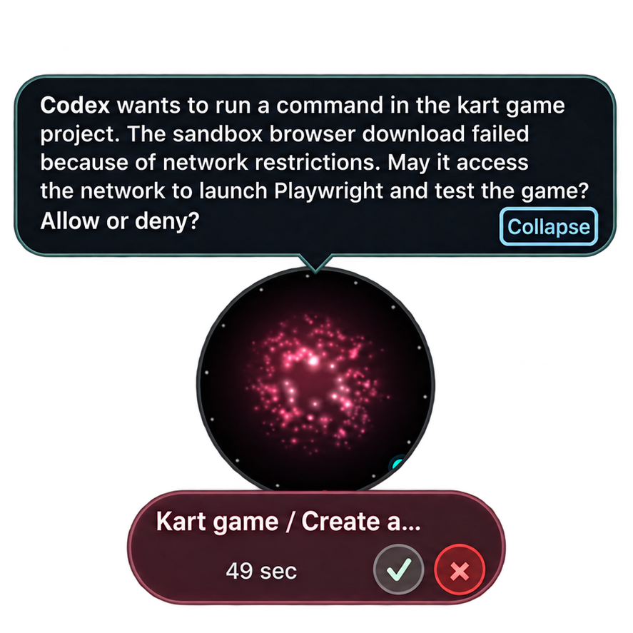
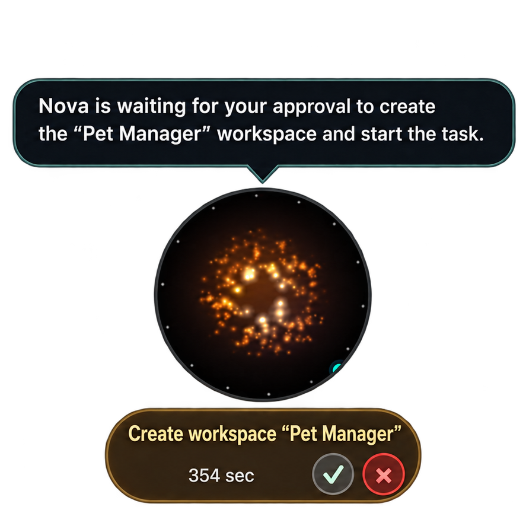
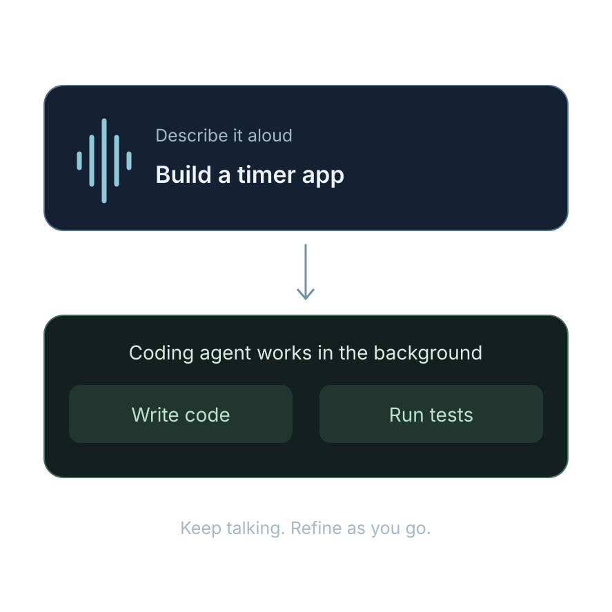
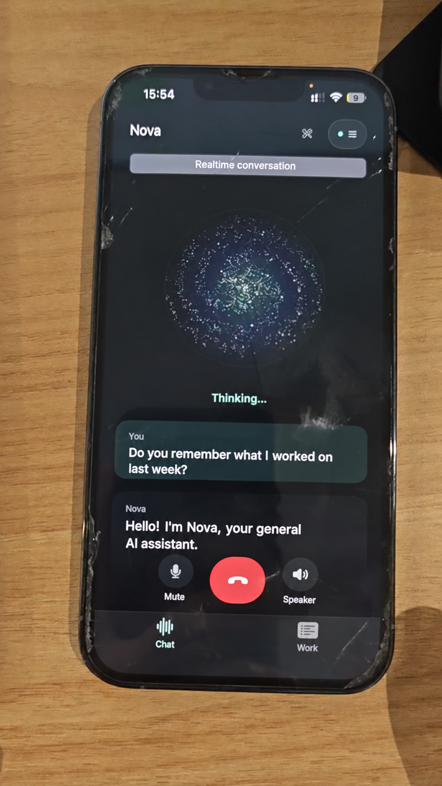

<!-- Keep in sync with README.zh-CN.md -->

# NAA (Your Personal Agent and Voice Assistant)

**English** | [简体中文](README.zh-CN.md)

[](https://github.com/deepnovacore/NovaAudioAgent/actions/workflows/ci.yml)
[](LICENSE)
[](package.json)
[](https://youtu.be/t1c-2O-QsxE)
[](https://deepnovacore.github.io/NovaAudioAgent/)

> **Your personal agent and always-on voice assistant — aware of your context, with dual brains and restrained proactivity.**

## News

- **2026-10-09 · [v0.3.1](https://github.com/deepnovacore/NovaAudioAgent/releases/tag/v0.3.1)** — **A smoother start:** ready-to-use text chat and easier desktop upgrades.
- **2026-10-07 · [v0.3.0](https://github.com/deepnovacore/NovaAudioAgent/releases/tag/v0.3.0)** — **Your personal agent:** Todos, Ideas, Goals, Feeds and Profile, with source-backed memory and evidence-checked tasks.
- **2026-09-21 · [v0.2.0](https://github.com/deepnovacore/NovaAudioAgent/releases/tag/v0.2.0)** — **Voice, your way:** configurable ASR / LLM / TTS, personal memory, MCP and an iPhone companion.
- **2026-08-31 · [v0.1.0](https://github.com/deepnovacore/NovaAudioAgent/releases/tag/v0.1.0)** — **Always-on voice assistant with dual brains:** responsive frontend conversation and background agent execution, with live steering.

<details>
<summary>Earlier minor releases</summary>

- **2026-09-24 · [v0.2.3](https://github.com/deepnovacore/NovaAudioAgent/releases/tag/v0.2.3)** — Guided first run with one DashScope API key.
- **2026-09-21 · [v0.2.2](https://github.com/deepnovacore/NovaAudioAgent/releases/tag/v0.2.2)** — Ubuntu desktop and a headless server with QR pairing.

</details>

## 1. Highlights

[](assets/architecture/nova-personal-agent.en.png)

Your context informs the conversation; the front brain coordinates work with the back brain. Nova checks results and speaks when it matters.

- **Your proactive personal agent.** Todos, Ideas, Goals, Feeds and Profile turn what Nova knows about you into suggestions you can act on.
- **Wide and unstructured context.** Bring folders, mail, calendars, conversations and documents; keep personal memory traceable, editable and removable.
- **Always-on voice assistant with dual brains.** The front brain stays in conversation while the back brain handles long-running work.
- **A thin frontend task coordinator.** Clarify, authorize and delegate to a coding agent; check evidence against your criteria, take over and hand control back.
- **Restrained proactivity.** Nova chooses what matters and when to speak. Routine updates stay quiet, and reminders respect your turn.

[How Nova works](docs/en/architecture.md) · [Task controls](docs/en/tasks.md) · [Source permissions](docs/en/sources-and-connectors.md)

## 2. Work with Nova

### 2.1 Your personal agent, with wide and unstructured context

Connect the sources you choose: folders, mail, calendars and conversations. Personal memory and imported document knowledge help Nova understand your work; reading sources and model processing remain separate permissions.

<table>
  <tr>
    <td width="50%" valign="top">
      <h3>Your personal workbench</h3>
      <p>Turn scattered context into source-backed recaps and suggested todos. Choose what to do next, then continue with Nova.</p>
      <a href="assets/features/workbench-original.en.png"></a>
    </td>
    <td width="50%" valign="top">
      <h3>Profile and personal memory</h3>
      <p>Nova builds an editable picture of your work and interests. Trace personal memories to their sources, correct them or remove them.</p>
      <a href="assets/features/profile-original.en.png"></a>
    </td>
  </tr>
  <tr>
    <td width="50%" valign="top">
      <h3>Ideas and goals</h3>
      <p>Keep an idea, choose a direction, and turn it into a todo when you are ready. Suggestions wait for you to adopt them.</p>
      <a href="assets/features/ideas-goals-original.en.png"></a>
    </td>
    <td width="50%" valign="top">
      <h3>Feeds that follow your interests</h3>
      <p>Review public news ranked by your Profile. Save a story or turn it into an idea, todo or goal.</p>
      <a href="assets/features/feeds-original.en.png"></a>
    </td>
  </tr>
</table>

### 2.2 Your voice assistant with restrained proactivity

The front brain handles conversation; the back brain does the work. Task events and camera observations inform optional updates, while speaking has its own timing.

<table>
  <tr>
    <td width="50%" valign="top">
      <h3>Understands what you mean</h3>
      <p>Describe your goal naturally. Nova asks for missing details before starting a task; keep talking and refining it while the back brain works.</p>
      <a href="assets/features/conversation.en.png"></a>
    </td>
    <td width="50%" valign="top">
      <h3>You set the boundaries</h3>
      <p>Nova coordinates tasks and checks results against your criteria. Review permissions, take over when needed, and hear updates when they matter.</p>
      <a href="assets/features/permission.en.png"></a>
    </td>
  </tr>
  <tr>
    <td width="50%" valign="top">
      <h3>Voice-run workspaces</h3>
      <p>Create and switch workspaces and sessions by voice. A new workspace waits for your confirmation.</p>
      <a href="assets/features/workspace.en.png"></a>
    </td>
    <td width="50%" valign="top">
      <h3>Bring your tools and knowledge</h3>
      <p>Configure ASR / LLM / TTS and MCP; ask questions across your documents.</p>
      <a href="assets/features/knowledge.en.png"></a>
    </td>
  </tr>
</table>

### 2.3 Use cases

<table>
  <tr>
    <td width="50%" valign="top">
      <h3>Voice Vibe Coding</h3>
      <p>Describe what you want, let a coding agent build and test it, and refine the work through conversation.</p>
      <a href="assets/features/coding.en.svg"></a>
    </td>
    <td width="50%" valign="top">
      <h3>Camera Monitoring</h3>
      <p>Ask Nova to watch for a condition and tell you when it happens. Observation runs independently of coding tasks.</p>
      <a href="assets/features/vision-camera.png"></a>
    </td>
  </tr>
  <tr>
    <td width="50%" valign="top">
      <h3>Weekly Report</h3>
      <p>Ask Nova to recall recent work and help organize a weekly report. Watch the original phone demo.</p>
      <a href="assets/demos/weekly-report/weekly-report.mp4"></a>
      <p><a href="assets/demos/weekly-report/weekly-report.mp4">▶ Watch the demo</a></p>
    </td>
    <td width="50%" valign="top">
      <h3>Take Nova with you</h3>
      <p>Connect your iPhone over Tailscale to your desktop or headless server. Talk to Nova and approve tasks wherever you are.</p>
      <a href="assets/features/iphone.en.png"></a>
    </td>
  </tr>
</table>

## 3. Quickstart

### 3.1 Install and run

Requirements: Node.js 22.13+, npm, Git, a logged-in `codex` executable (app-server is the only
Codex transport).

Install the release with npm.

```bash
npm install --global nova-audio-agent@latest
# open the shipped app; the first launch asks for one DashScope API key
novaaudio
# open the settings panel in the app
novaaudio config
# list the keys your voice pipeline needs; --online tests them
novaaudio doctor
```

Quit Nova before upgrading, then rerun the install command above. To pin a version, use `nova-audio-agent@0.3.1`. Upgrades keep your settings and data; back up your Nova data before downgrading.

Headless Ubuntu 22.04+ x64:

1. Install or upgrade with `npm install --global nova-audio-agent-server@latest`, then configure the service and initialize credentials using the [configuration guide](docs/en/deployment/remote-server.md).
2. Start the service with `novaaudio-server start`.
3. In a second terminal, run `novaaudio-server pair wss://your-host.ts.net` to display a one-use pairing QR code.

### 3.2 Develop from source

For development from source:

```bash
git clone https://github.com/deepnovacore/NovaAudioAgent.git nova-audio-agent
cd nova-audio-agent
npm ci && cp .env.example .env
```

Get an API key from [DashScope](https://platform.qianwenai.com) and set `DASHSCOPE_API_KEY`. That one key runs voice, memory, the camera and web search. Search goes through Bailian until you add a [Tavily](https://docs.tavily.com) `TAVILY_API_KEY`.

```bash
npm run start:client
# Open Workbench for this launch, overriding the saved startup preference
npm run start:workbench
# Build, diagnose or run the local demos
npm run build --workspace @nova-audio-agent/runtime
node runtime/dist/src/cli.js diagnose --json
node runtime/dist/src/cli.js demo all
```

The client includes microphone, camera, sound, settings and external MCP controls. Try hovering over the desktop orb for a surprise :)

### 3.3 Support matrix

| Platform | Desktop app | Headless server | Connect iPhone |
|---|---|---|---|
| macOS arm64 | ✅ Native echo cancellation | ✅ From source | ✅ Desktop pairing |
| Windows x64 | ✅ | ❌ | ❌ |
| Ubuntu 22.04+ x64 | ✅ | ✅ npm package | ✅ Headless pairing |

| Layer | Providers |
|---|---|
| Integrated voice | Qwen realtime, OpenAI realtime, Gemini Live, StepFun (preview) |
| Cascaded ASR / TTS | Volcengine Speech, Gemini, self-hosted (reference: Whisper / Breeze) |
| Cascaded LLM | DeepSeek, Qwen / DashScope, Volcengine Ark, OpenAI, Gemini, self-hosted |
| Vision | Qwen-VL family, Doubao Seed |
| Coding agent | Codex (v0.3.1); more backends planned for v0.4.0 |
| Sources | Local folders, Google via Composio, Apple Mail and Calendar (macOS), Feishu |

Models, credentials and per-provider limits: [support matrix](docs/en/support-matrix.md).

## 4. Documentation

| Read this | For |
|---|---|
| [Architecture](docs/en/architecture.md) | Modules and boundaries |
| [Glossary and invariants](docs/en/glossary.md) | Vocabulary and rules |
| [Getting started](docs/en/getting-started.md) | Setup and integrations |
| [Workbench](docs/en/workbench.md) · [Tasks](docs/en/tasks.md) · [Sources and connectors](docs/en/sources-and-connectors.md) | The main window, delegated work, and what Nova may read |
| [When should a voice agent speak?](docs/en/blog/2026-08-proactive-voice-agent-design-space.md) | Voice interaction design |
| [Node runtime migration archive](https://github.com/deepnovacore/NovaAudioAgent/tree/20a0812c0acb83b53cbad4b415d637dafff3c7f6/docs/archs/node-runtime-migration) | Migration-era plans in the history of tag `v0.1.0` |

## 5. Roadmap

- [ ] **v0.4.0 — Specialist agents (in development).** Expand coding backends with OpenCode, CodeBuddy, Pi and DeepSeek Harness; add supervised GUI execution and specialist-agent collaboration. Finish recovery, refusal, cancellation, voice and supported-platform acceptance before release.
- [ ] **v1.0.0 — Stable release.** Establish stable core behavior across supported platforms, reliable installation and upgrades, predictable recovery, and complete user documentation.

Development integrations are not release guarantees. Features ship after their supported configurations pass acceptance.

## 6. Contribution

```bash
npm ci && npm run check && npm run build && npm test
```

Live integrations are credential- and hardware-dependent and never substitute for the
deterministic tests. Security reports: [SECURITY.md](SECURITY.md); contribution rules and
invariants: [CONTRIBUTING.md](CONTRIBUTING.md).

## 7. License

Copyright 2026 DeepNovaCore, [Apache License 2.0](LICENSE).
