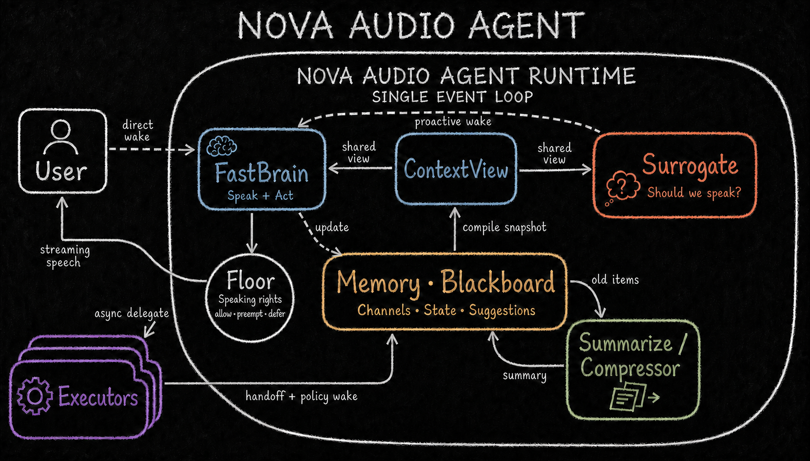
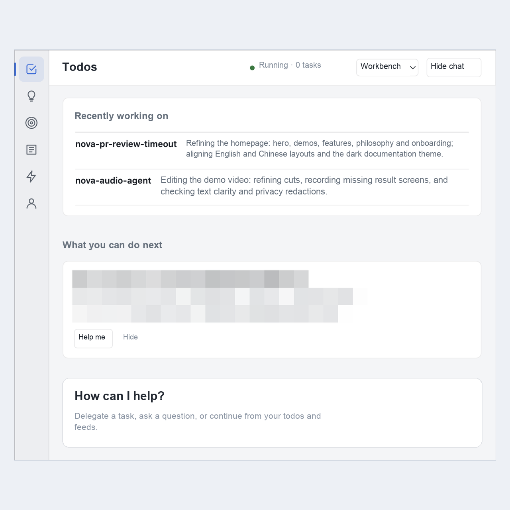
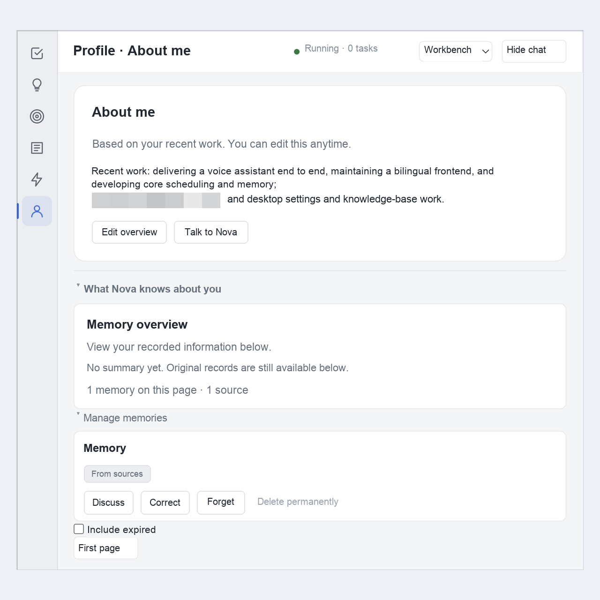

<!-- Keep in sync with README.zh-CN.md -->

# Nova Audio Agent

**English** | [简体中文](README.zh-CN.md)

[](https://github.com/deepnovacore/NovaAudioAgent/actions/workflows/ci.yml)
[](LICENSE)
[](package.json)
[](#2-architecture)
[](docs/en/blog/2026-08-proactive-voice-agent-design-space.md)


> **An always-on voice agent with restrained proactivity and the capability of workspace management.**


## News

- **2026-10-07 · [v0.3.0](https://github.com/deepnovacore/NovaAudioAgent/releases/tag/v0.3.0)** — Nova grows from a voice assistant into a personal agent. The [v0.3.0 Preview](https://github.com/deepnovacore/NovaAudioAgent/releases/tag/v0.3.0-preview.1) of 2026-10-02 is superseded by this release.
  - **Workbench main window**: Todos, Ideas, Goals, Feeds, Tasks and Profile on the left, the conversation with Nova on the right; the orb stays as the collapsed form.
  - **Tasks you can check**: delegated work carries acceptance criteria, and Nova verifies the evidence before calling it done; you can take over a task and hand it back at any time.
  - **Memory grounded in your sources**: Nova proposes candidates from authorized folders, email, calendars and Feishu, and you decide what to keep; every entry can be traced, corrected or forgotten.
  - **News and project recaps**: an interest-ranked feed and recap cards built from your project files, each with its sources.
  - **More voice options**: OpenAI and Gemini realtime voice, Gemini ASR / TTS, cascaded pipelines that mix cloud services with models you serve yourself, StepAudio 3 integrated provider (preview), Qwen Audio 3.1, and Volcengine voiceprint verification.
  - **Feishu mentions and a daily brief**: with your consent, direct @mentions in the chats you select become Todos, and an optional daily brief covers Todos, calendar and mentions.
- **2026-09-24 · [v0.2.3](https://github.com/deepnovacore/NovaAudioAgent/releases/tag/v0.2.3)** — Guided first run: one DashScope API Key is enough to start talking.
- **2026-09-21 · [v0.2.2](https://github.com/deepnovacore/NovaAudioAgent/releases/tag/v0.2.2)** — Ubuntu 22.04+ x64 desktop, plus the headless `nova-audio-agent-server` with QR pairing.
- **2026-09-21 · [v0.2.0](https://github.com/deepnovacore/NovaAudioAgent/releases/tag/v0.2.0)** — Configurable ASR / LLM / TTS pipelines, personal memory, custom MCP, wake words, bilingual desktop on macOS and Windows, and an iPhone client over Tailscale.
- **2026-08-31 · v0.1.0** — Always-on voice, background Codex tasks, live steering, workspace/session management, and selective progress updates.

## 1. Highlights

Nova Audio Agent is a **harness for an always-on, general-purpose voice agent**: Nova (小诺)
keeps responsive while doing long-running tasks in the background, reporting
**proper** progress at **proper** time.

A concurrent work [qwen-audio-agent](https://github.com/QwenAudio/qwen-audio-agent) answers
*how to keep an agent talking while it works*, while we ask a step further — **when is talking
worth it at all** (see the [design article](docs/en/blog/2026-08-proactive-voice-agent-design-space.md) for more details).


- **Restrained proactivity.** Important progress gets reported; routine updates stay quiet, and reminders never interrupt you while you speak.
- **Voice-run workspaces.** Create and switch workspaces and sessions by voice, with your confirmation.
- **Clarify before acting.** Nova asks about unclear requirements before handing work to the background executor.
- **Steer while it runs.** Add requirements and constraints by voice while a task is in progress.
- **One window for your day.** Todos, goals, news and delegated tasks sit beside the conversation in the Workbench, grounded in the sources you authorize.
- **Done means verified.** Each task carries acceptance criteria; Nova checks the evidence before it reports completion, and you can take over at any point.

## 2. Architecture

[](assets/ideas/v3/nova-audio-agent-runtime-chalkboard.png)

*One event loop, two model ports reading one ContextView, Memory as the shared blackboard,
Floor guarding the single speech path.*

Essential roles and ideas:

* **FrontBrain model**: the realtime model that interacts with users, using the minimal host/native surface to dispatch work, cancel it, confirm host proposals, recall memory, and search. Revision-bound intake slots remain host-owned.
* **Proactive**: discovers grounded suggestions and selects which optional updates are worth sharing. Floor controls the speaking opportunity; the front brain handles the final expression.
* **Memory and ContextView**: short-term events from different capabilities are stored in different channels. Only bounded evidence and intake facts are compiled into ContextView for FrontBrain.
* **Executors and controllers**: role-based manifests run asynchronous work; an AgentController registry owns model-facing controllers and hidden Vision watch/guard channels. Camera frames go directly to the selected VLM; monitoring owns its complete loop.

For more details about the architecture, check [Architecture](docs/en/architecture.md).


## Use Cases

<table>
  <tr>
    <td width="50%" valign="top">
      <h3>Your personal workbench</h3>
      <p>Todos, Ideas, Goals, Feeds and your Profile sit on the left, the conversation with Nova on the right. Start a task from any todo; Nova checks the result against its acceptance criteria, and you can take over or hand it back at any time.</p>
      
    </td>
    <td width="50%" valign="top">
      <h3>Camera monitoring and timely alerts</h3>
      <p>Ask Nova to watch for a condition and tell you when it occurs.</p>
      
    </td>
  </tr>
  <tr>
    <td width="50%" valign="top">
      <h3>Voice Vibe Coding</h3>
      <p>Describe a feature and refine it by voice while Codex writes and tests the code. Nova reports key milestones and keeps routine progress quiet.</p>
      
    </td>
    <td width="50%" valign="top">
      <h3>Take Nova with you</h3>
      <p>Connect your iPhone over Tailscale to talk and approve tasks on your PC.</p>
      
    </td>
  </tr>
</table>

## Main Features

<table>
  <tr>
    <td width="50%" valign="top">
      <h3>Understands what you mean</h3>
      <p>Describe your goal naturally. Nova asks for the missing details before turning it into a task.</p>
      
    </td>
    <td width="50%" valign="top">
      <h3>You control permissions</h3>
      <p>Review requests to run commands or access the network, then allow or deny them.</p>
      
    </td>
  </tr>
  <tr>
    <td width="50%" valign="top">
      <h3>Voice-run workspaces</h3>
      <p>Create and switch workspaces and sessions by voice. A new workspace waits for your confirmation.</p>
      
    </td>
    <td width="50%" valign="top">
      <h3>Bring your tools and knowledge</h3>
      <p>Configure ASR / LLM / TTS and MCP; ask questions across your documents.</p>
      
    </td>
  </tr>
</table>

### New in v0.3

<table>
  <tr>
    <td width="50%" valign="top">
      <h3>Todos and project recaps</h3>
      <p>Recent project activity becomes recap cards and suggested next steps, each with its sources. Pick one and ask Nova to help.</p>
      
    </td>
    <td width="50%" valign="top">
      <h3>Ideas and goals</h3>
      <p>Jot down ideas and set goals. Nova suggests more from your sources, and nothing is added without you.</p>
      
    </td>
  </tr>
  <tr>
    <td width="50%" valign="top">
      <h3>Feeds ranked by your interests</h3>
      <p>Nova infers your interests from your Profile and ranks public news by them. Save an item, or turn it into an idea, todo or goal of your own.</p>
      
    </td>
    <td width="50%" valign="top">
      <h3>Profile and personal memory</h3>
      <p>See what Nova knows about you, each entry marked as something you said or something from your sources. Continue, correct, forget or purge any of it.</p>
      
    </td>
  </tr>
</table>

## 3. Quickstart

Requirements: Node.js 22.13+, npm, Git, a logged-in `codex` executable (app-server is the only
Codex transport).

Install the release with npm.

```bash
npm install --global nova-audio-agent@latest
# open the shipped app; the first launch asks for one DashScope API key
novaaudio
# open the settings panel in the app
novaaudio config
# list the keys your voice pipeline needs; --online tests them
novaaudio doctor
```

Headless Ubuntu 22.04+: install `nova-audio-agent-server` with npm, configure it and initialize credentials; run `novaaudio-server start` and, in a second terminal, `novaaudio-server pair wss://your-host.ts.net` for a one-use QR. See the [configuration guide](docs/en/deployment/remote-server.md).

### Upgrading

Quit Nova, then run `npm install --global nova-audio-agent@latest`. This also replaces the v0.3 preview (npm tag `preview`, version `0.3.0-preview.1`, which is no longer updated). To pin a version, use `nova-audio-agent@0.3.0`. Upgrades keep your local settings and data; moving back to an older version does not roll back data changes, so back up your Nova data first.

For headless Ubuntu 22.04+ x64, use `npm install --global nova-audio-agent-server@latest`.

For development from source:

```bash
git clone https://github.com/deepnovacore/NovaAudioAgent.git nova-audio-agent
cd nova-audio-agent
npm ci && cp .env.example .env
```

Get an API key from [DashScope](https://platform.qianwenai.com) and set `DASHSCOPE_API_KEY`. That one key runs voice, memory, the camera and web search. Search goes through Bailian until you add a [Tavily](https://docs.tavily.com) `TAVILY_API_KEY`.

```bash
npm run start:client
# Open Workbench for this launch, overriding the saved startup preference
npm run start:workbench
```
The client includes microphone, camera, sound, settings, and external MCP controls. Try hovering over the desktop orb to get surprised :) Also you
may try build or run demo locally:

```bash
npm run build --workspace @nova-audio-agent/runtime
node runtime/dist/src/cli.js diagnose --json
node runtime/dist/src/cli.js demo all
```

Native echo-cancelled capture (VoiceProcessingIO) is macOS-only. Wake detection uses that
capture when available; Windows, Linux source runs, and macOS fallback use Chromium
`getUserMedia` + AudioWorklet. While sleeping, microphone frames go only to the local
wake-word Worker; explicit mute stops wake detection. See
[wake-word setup](docs/en/getting-started.md#enable-a-wake-word).

### Support matrix

| Platform | Desktop app | Headless server | Connect iPhone |
|---|---|---|---|
| macOS arm64 | Yes, with native echo-cancelled capture | From source | From the desktop app |
| Windows x64 | Yes | — | — |
| Ubuntu 22.04+ x64 | Yes | npm package | Through the headless server |

| Layer | Providers | Default |
|---|---|---|
| Integrated voice | Qwen realtime, OpenAI realtime, Gemini Live, StepFun (preview) | Qwen `qwen-audio-3.0-realtime-plus` |
| Cascaded ASR / TTS | Volcengine Speech, Gemini, self-hosted (reference: Whisper / Breeze) | `volc.seedasr.sauc.duration` / `seed-tts-2.0` |
| Cascaded LLM | DeepSeek, Qwen / DashScope, Volcengine Ark, OpenAI, Gemini, self-hosted | DeepSeek `deepseek-flash` |
| Vision | Qwen-VL family, Doubao Seed | Off in conversation; Loop Camera uses its own model |
| Coding executor | Codex | Codex |
| Sources | Local folders, Google via Composio, Apple Mail and Calendar (macOS), Feishu | None until you authorize them |

Models, credentials and per-provider limits: [support matrix](docs/en/support-matrix.md).

## 4. Documentation

| Read this | For |
|---|---|
| [Architecture](docs/en/architecture.md) | Modules and boundaries |
| [Glossary and invariants](docs/en/glossary.md) | Vocabulary and rules |
| [Getting started](docs/en/getting-started.md) | Setup and integrations |
| [Workbench](docs/en/workbench.md) · [Tasks](docs/en/tasks.md) · [Sources and connectors](docs/en/sources-and-connectors.md) | The main window, delegated work, and what Nova may read |
| [When should a voice agent speak?](docs/en/blog/2026-08-proactive-voice-agent-design-space.md) | Voice interaction design |
| [Node runtime migration archive](https://github.com/deepnovacore/NovaAudioAgent/tree/20a0812c0acb83b53cbad4b415d637dafff3c7f6/docs/archs/node-runtime-migration) | Migration-era plans in the history of tag `v0.1.0` |

## 5. Roadmap

`main` is the released baseline; v0.3.0 is released.

- [x] **v0.3.0:** one main window for text and voice with Todos, Ideas, Goals, Feeds, Tasks and Profile; tasks with acceptance criteria, verified completion and takeover; memory-grounded suggestions; traceable, correctable and removable personal memory; user-authorized folders, email, calendars and Feishu conversations.
- [ ] **v0.4.0:** expand coding backends with Kimi Code and pi agent; add a GUI executor with AutoGLM as the first example, enabling collaboration across specialist agents.

Releases require feature and supported-platform acceptance. Ubuntu 22.04+ x64 desktop and headless npm packages are included in the candidate release checks.

## 6. Contribution

```bash
npm ci && npm run check && npm run build && npm test
```

Live integrations are credential- and hardware-dependent and never substitute for the
deterministic tests. Security reports: [SECURITY.md](SECURITY.md); contribution rules and
invariants: [CONTRIBUTING.md](CONTRIBUTING.md).

## 7. License

Copyright 2026 DeepNovaCore, [Apache License 2.0](LICENSE).
