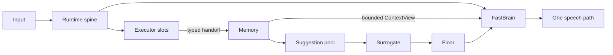

<!-- Keep in sync with README.md -->

# Nova Audio Agent

[English](README.md) | **简体中文**

> **手中事不辍，口中言有度。**

[](LICENSE)
[](package.json)
[](#2-架构)
[](docs/blog/2026-08-proactive-voice-agent-design-space.md)

Nova Audio Agent 是一个**常驻、通用语音 agent 的运行骨架（harness）**：小诺（Nova）让对话
始终应答如流，各独立能力在后台搜索、观察、操作设备，或完成更长的任务。

它不是聊天机器人框架，也不是工作流引擎——它研究的是**当多件事同时发生时，agent 如何决定
何时开口、何时派活、何时保持沉默**，并让每个组件只拥有一种判断
（[术语与不变量](docs/glossary.md)）；这是面向开发与评测的实验系统，不是开箱即用的助手。
小诺是用户级而非项目级：一个语音入口服务多个命名工作区，Workspace 是项目之间的文件系统
隔离边界，每个任务是其中一条可续接的 Session。

我们改编了 [qwen-audio-agent](https://github.com/QwenAudio/qwen-audio-agent) 的 macOS 语音
采集 helper（[NOTICE](NOTICE)）：它回答*如何让 agent 边干活边说话*；我们问镜像的一问——
开口本身何时值得（[设计文章](docs/blog/2026-08-proactive-voice-agent-design-space.md)）。

> **原则**：领域能力是可替换的执行能力；agent 的内核，是掌管生命周期、记忆、注意力与言语的
> 那一部分。

**初来乍到？** 先读[设计要义](docs/essence.md)，或直接跳到[快速开始](#3-快速开始)。

## 1. 亮点

- **结构化的按通道记忆。** 每个能力写入自己的只追加通道；模型调用读有界 `ContextView`，
  绝不直读原始记忆。
- **一推一拉的主动性。** 观察先落建议池、由 Surrogate 择机开口——`speak=false` 是沉默，
  不是遗忘——`memory.recall` 从同一份状态作答。
- **基于优先级的说话权仲裁。** Floor 对每次发声裁决 `allow`、`preempt` 或 `defer`；
  优先级绑定在触发事件上，永远不由模型选择。
- **一个语音入口，多个工作区。** 隔离的 Codex home、可续接的 Session、fail-closed 的
  提案—确认两步。
- **靠结构省 token，附带实时转向。** Codex 只收一份有界 work order、从不含对话历史；进度
  经摘要返回，用户新增约束追加进正在执行的 `codex app-server` turn 而非推倒重来（见 §2）。

## 2. 架构



不可逾越的边界，在运行时边界上逐一校验、而非靠提示词约定（[架构](docs/architecture.md)）：

1. 运行时派发 executor 工作，绝不在事件循环体内等它完成。
2. 每条被接受的结果先抵达权威记忆；executor 永远不直接对用户说话。
3. 只有 FastBrain 可以更新结构化的 intent、goal 与 authorization。
4. 只有配置选中的 manifest 才会成为模型可见的工具。
5. 不请自来的建议必须走 `Surrogate → Floor → FastBrain`；被 defer 的话语落入建议池，
   而不是被丢弃。

进度先是记忆问题、后才是通知问题——**一次写入，择机定夺，同源作答**——这把三个极易混为
一谈的判断分了家：

| 问题 | 归属 |
|---|---|
| 发生了什么？ | Executor → 权威 Memory |
| 没人问：这个变化现在值得说吗？ | Surrogate，只面向符合条件的环境建议 |
| 用户问了：答案该怎么表达？ | FastBrain，基于有界的 `ContextView` |

这不是 ReAct 循环：模型派活、交还控制权、继续响应，结果以因果事件返回，而不是阻塞式工具
结果（[设计要义](docs/essence.md)、[v3 设计系列](docs/archs/v3/00-overview.md)）。

前脑负责对话，Codex 是窄边界之后的慢速工作脑：

- 跨越边界交给 Codex 的只有一份有界 work order——从不包含对话历史；
- 进度在 Codex 投影边界生成摘要，再经 Surrogate 筛选；
- 对话通道到达固定水位即压缩；`codex__steer` 把新约束追加进行中的 turn，而非重新派单；
- 工作区图谱上下文只能经固定预算进入模型调用。

这些是结构性上界，不是实测节省：续接的 Session 仍会恢复其保存的 Codex thread 累积的
上下文；不发布 token 或成本基准，两个「脑」都是云端模型。

## 3. 快速开始

环境要求：Node.js 22+、npm、Git、已登录的 `codex` 可执行文件（app-server 是唯一的 Codex
transport）与受支持的桌面会话；原生 helper 需要对应平台工具链
（[上手指南](docs/getting-started.zh-CN.md)）。各平台验证程度不同：

- 原生回声消除采集（VoiceProcessingIO）仅限 macOS；Windows 与 Linux 使用 Chromium 音频栈。
- CI 只能手动触发、且只在 Windows runner 上运行；三平台签名候选、clean-machine、硬件验证
  与发布证据仍未完成（[项目状态](docs/status.md)）。
- unsigned 打包工作流只产出 Windows artifact；release-candidate 的 Linux artifact 仅做格式
  校验、不签名（[上手指南](docs/getting-started.zh-CN.md)）。

```bash
git clone https://github.com/deepnovacore/NovaAudioAgent.git nova-audio-agent
cd nova-audio-agent
npm ci && cp .env.example .env
```

默认集成 Qwen 桌面端需同时设置 `DASHSCOPE_API_KEY` 与 `TAVILY_API_KEY`——Search 始终装配，
即使没有把它选作 executor，Tavily 也是必需配置。

```bash
npm run build --workspace @nova-audio-agent/runtime
node runtime/dist/src/cli.js diagnose --json
node runtime/dist/src/cli.js demo all
```

`diagnose` 不连接 provider、不打开设备。小诺是中文优先的（人设、提示词、默认音色）；
逐项集成与完整变量参考见[上手指南](docs/getting-started.zh-CN.md)。

## 4. 一个助理，多个工作区

**Workspace** 是隔离的文件系统/Git 项目，拥有自己的 `CODEX_HOME`；**Session** 是其中一条
可续接的 Codex thread。create、switch、resume 都先出提案：只有携带完全匹配 proposal ID 的
structured confirmation 才能提交——拒绝、错误 ID 或重放都 fail closed。切换分阶段进行，
Codex 全局同时只跑一个任务，registry 只允许一个 Orb 运行属主，Orb 只显示公开标签。语音只能创建新的托管目录；导入已有仓库走
`NOVA_AUDIO_AGENT_CODEX_WORKSPACE`。完整契约见
[多项目 Workspace 交接](docs/multi-project-workspace-handoff.md)；保留上限与凭据处理见
[上手指南](docs/getting-started.zh-CN.md)。

opt-in 的工作区记忆图谱记录弱 `discussed_with` 线索——有界、低权威、低于主动建议阈值、
90 天未刷新即转 stale——小诺绝不自行读取或检查其他 workspace
（[v3 记忆卷](docs/archs/v3/02-memory.md)）。可选的 MyContext 边界补充以人为中心、只读、
不受信任、不主动的证据来源，仅用于显式证据召回；本仓库不提供 Nova 兼容 adapter，该集成尚
不能端到端工作；上游 MyContext（Elastic License 2.0）在任何复用或捆绑前必须另行完成法律与
分发审查。

```bash
NOVA_AUDIO_AGENT_CODEX_WORKSPACE=/absolute/path/to/initial/repository
NOVA_AUDIO_AGENT_WORKSPACE_GRAPH_ENABLED=true
NOVA_AUDIO_AGENT_MYCONTEXT_PROVIDER_URL=http://127.0.0.1:PORT/base
```

## 5. Ambient Orb

Ambient Orb 是本地语音界面。填好 `.env` 后：

```bash
npm run start:client
```

启动器拉起 Node 运行时和带沙箱、上下文隔离的 Electron 渲染器；需要 `codex` 可执行文件、
麦克风权限和 `TAVILY_API_KEY`；`DASHSCOPE_API_KEY` 仅集成 Qwen 与级联 Qwen 需要，级联 Ark
则需要 `ARK_API_KEY` 加 `DOUBAO_BIGMODEL_API_KEY`。默认 `integrated`
管线是 Qwen `qwen-audio-3.0-realtime-plus` 配 `longanqian` 音色；`cascaded` 模式默认
火山 ASR → Qwen `qwen-flash` → 火山 TTS。每个平台一把密钥、无 provider 故障转移；管线、
provider、模型、音色与密钥编辑在下次启动生效（只有配色实时）。

orb 是 Canvas 2D 粒子场，状态由粒子行为承载——聆听时聚拢、说话时随播放脉动、Codex 工作时
外侧轨道带环绕——可选 Ember 或 Graphite 配色。右键打开 Memory Board（每条通道的最新条目）
与设置面板：配色、主动性档位、Codex 播报间隔、音色与 API 密钥（经操作系统钥匙串加密）。

## 6. 文档

除上手指南提供中文版外，以下文档为英文。

| 读这篇 | 为了 |
|---|---|
| [设计要义](docs/essence.md) | 立场与非目标 |
| [架构](docs/architecture.md) | 模块与边界 |
| [术语与不变量](docs/glossary.md) | 词汇与规则 |
| [上手指南](docs/getting-started.zh-CN.md) | 安装与集成 |
| [项目状态](docs/status.md) | 什么可用、什么仍在实验 |
| [多项目 Workspace 交接](docs/multi-project-workspace-handoff.md) | 完整的 Workspace/Session 契约 |
| [A2A](docs/a2a.md) | agent 之间的边界 |
| [v3 设计系列](docs/archs/v3/00-overview.md) | 详细设计论证 |
| [A Tradeoff Ruler for Proactive Voice Agents](docs/blog/2026-08-proactive-voice-agent-design-space.md) | 设计空间随笔 |

## 7. 路线图

1. **MyContext 端到端打通**——完成 Elastic License 2.0 审查后交付 Nova 兼容只读 adapter；
   今天只有严格的 client 边界。
2. **工作区图谱默认开启，并补齐情景记忆**——待浸泡证据足够；今天图谱是 opt-in、会话级
   情景摘要尚未实现。
3. **经 executor 端口接入更多 coding agent**——`ExecutorAdapter` 端口是经 ACP 或各家原生
   协议接入的接缝；今天 Codex 是唯一后端。

## 8. 开发与验证

```bash
npm ci && npm run check && npm run build && npm test
```

在线集成有意依赖凭据与硬件，不能替代确定性测试。安全问题请私下报告：
[SECURITY.md](SECURITY.md)；贡献规则与不变量：[CONTRIBUTING.md](CONTRIBUTING.md)。

## 9. 许可证

版权所有 2026 DeepNovaCore，以 [Apache License 2.0](LICENSE) 授权。第三方署名：
[NOTICE](NOTICE) 与[桌面端第三方声明](desktop/ambient-orb/THIRD_PARTY_NOTICES.md)。
