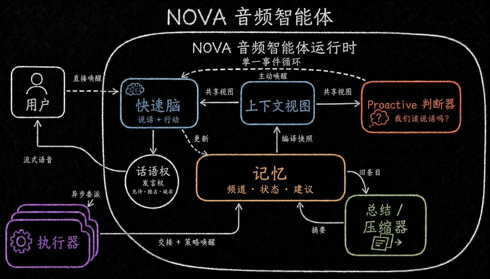

<!-- Keep in sync with README.md -->

# Nova Audio Agent

[English](README.md) | **简体中文**

[](LICENSE)
[](package.json)
[](#2-架构)
[](docs/blog/2026-08-proactive-voice-agent-design-space.md)
[](https://youtu.be/t1c-2O-QsxE)


> **Agent 常驻在线、主动但是有分寸、通过语音帮你管理所有工作区 -- 干活不停，言语有度**

https://github.com/user-attachments/assets/061697f3-fff6-47d6-924b-8a29eef4ab45

## 1. 核心特性

Nova Audio Agent **常驻通用语音 agent**：小诺（Nova）保持前台对话实时响应，同时在后台处理长任务，并在合适的时间汇报合适的进度。

同期工作 [qwen-audio-agent](https://github.com/QwenAudio/qwen-audio-agent) 回答的是
「怎么让 agent 边干活边说话」；我们在此基础上又追问了一层——**开口这件事，什么时候才值得**
（详见[历史设计探索文档](docs/blog/2026-08-proactive-voice-agent-design-space.md)）。


- **主动有分寸：** 话有轻重。Coding 的琐碎进度不必说，里程碑应该汇报；Vision Guard 告警说话权更高，可以打断 Nova 正在播放的语音，但绝不打断用户说话。
- **语音管工作区。** 不必像 Codex 那样自己切工作区，Agent 帮你代劳，全程通过语音创建和、切换 workspace / session，提案会让你确认。
- **先问清再派活。** 需求说不清时，主机拥有的 revision-bound intake slots 先澄清请求再下发；M1.5c 真实验证仍待完成，不在此宣称 token 节省比例。
- **实时 steer 你的 coding agent。** Codex执行器基于原生 app-server而非ACP实现，任务进行中可以随时加约束。

## 2. 设计架构

[](assets/ideas/v3/nova-audio-agent-runtime-chalkboard-zh-CN.png)

*一个事件循环，两个模型端口共读一份 ContextView，Memory 当公共黑板，Floor 把守唯一说话通路。*

几个关键角色：
* **FrontBrain：** 实时前台模型，通过最小主机工具面派活、取消、确认主机提案、召回记忆和搜索；revision-bound intake slots 由主机拥有。
* **Surrogate：** 决定**何时开口**。事件写入 Memory 或建议池后，由它判断值不值得告诉用户。
* **Memory 与 ContextView：** Memory 短期、分通道；能力证据与 intake facts 受限编译进 ContextView 给 FrontBrain。
* **Floor：** 说话权。不同事件自带不同优先级。
* **Executor 与 Controller：** role-based manifest 运行异步工作；AgentController registry 拥有面向模型的 controller 及隐藏的 Vision watch/guard。内置 Camera MCP 直接提供证据，不是 dispatch executor。
* **Compressor：** 对话变长后，短期记忆可能撑爆 FrontBrain 和 Surrogate 的上下文，Agent用摘要模型自动压缩。

架构细节见 [架构](docs/architecture.md)。


## 3. 快速开始

环境要求：Node.js 22+、npm、Git、已登录的 `codex` 可执行文件（Codex 只走 app-server）

```bash
# 全局安装
npm install --global nova-audio-agent@0.1.1
# 启动客户端
novaaudio
# 打开设置面板（配置 dashscope 和 tavily api key）
novaaudio config
novaaudio doctor
```

从源码开发时：

```bash
git clone https://github.com/deepnovacore/NovaAudioAgent.git nova-audio-agent
cd nova-audio-agent
npm ci && cp .env.example .env
# 从 dashscope 和 tavily 获取 api key 并填入
```

启动桌面应用：
```bash
npm run start:client
```
客户端包含麦克风、摄像头、声音开关等按钮，以及设置面板和工作区图谱；外部 MCP 设置尚未作为已交付功能宣称。你也可以试试把鼠标悬在桌面 orb 上，会有惊喜）

从 [DashScope](https://platform.qianwenai.com) 和 [Tavily](https://docs.tavily.com) 获取 API Key 并配置 `DASHSCOPE_API_KEY` 和 `TAVILY_API_KEY`。

```bash
npm run build --workspace @nova-audio-agent/runtime
node runtime/dist/src/cli.js diagnose --json
node runtime/dist/src/cli.js demo all
```

注意，原生回声消除采集（VoiceProcessingIO）仅 macOS 可用；Windows 与 Linux 走 Chromium AEC。


## 4. 文档

| 读这篇 | 目的 |
|---|---|
| [架构](docs/architecture.md) | 模块与边界 |
| [术语与不变量](docs/glossary.md) | 核心常量 |
| [上手指南](docs/getting-started.zh-CN.md) | 安装与集成 |
| [v0.2.0 规格](docs/specs/v0.2.0/00-overview.md) | `v0.2.0dev` 上进行中的功能契约 |
| [历史设计探索：A Tradeoff Ruler for Proactive Voice Agents](docs/blog/2026-08-proactive-voice-agent-design-space.md) | 历史设计博客 |

## 5. 路线图
- [ ] **v0.2.0（分支 `v0.2.0dev`）：** M1.5b → M1.5c 薄前端 → 03a 能力扩展。M1.5c 需验证最终六工具面、Camera MCP + 侧边 VLM 投影、Vision 隐藏 watch/guard、策略驱动监控并重跑 08 live acceptance；live 与 Windows 证据仍待完成。外部 MCP 设置尚未交付。规格：[docs/specs/v0.2.0](docs/specs/v0.2.0/00-overview.md)。
- [ ] 支持更多端到端与级联前端管线。
- [ ] 接入 MyContext，做以工作区为中心的记忆。
- [ ] 通过 executor 端口接入更多 coding agent。

## 6. 贡献

```bash
npm ci && npm run check && npm run build && npm test
```

安全问题见 [SECURITY.md](SECURITY.md)，贡献规则见 [CONTRIBUTING.md](CONTRIBUTING.md)。

## 7. 许可证

版权所有 2026 DeepNovaCore，[Apache License 2.0](LICENSE)。
