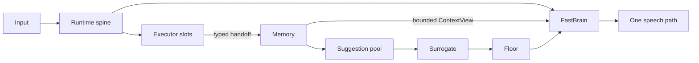

<!-- Keep in sync with README.md -->

# Nova Audio Agent

[English](README.md) | **简体中文**

> **手中事不辍，口中言有度。**

[](LICENSE)
[](package.json)
[](#3-架构)
[](docs/blog/2026-08-proactive-voice-agent-design-space.md)

Nova Audio Agent 是一个**常驻、通用语音 agent 的运行骨架（harness）**。小诺（Nova）负责让对话
始终应答如流，各个独立能力则在后台搜索、观察、操作设备，或完成更长的任务。

这不是一个聊天机器人框架，也不是工作流引擎。它关注的是另一个问题：
**当多件事同时发生时，agent 如何决定何时开口、何时派活、何时保持沉默。**
它是面向开发与评测的实验系统，而非开箱即用的消费级助手。小诺的定位是用户级助理，而不是绑定
在单个项目里的工具：一个常驻的语音入口，可以在多个命名工作区之间创建、切换与续作——
Workspace 是项目之间的文件系统隔离边界，每个任务则是其中一条可续接的 Session。

离我们最近的邻居是 [qwen-audio-agent](https://github.com/QwenAudio/qwen-audio-agent)——我们改编
了它的 macOS 语音采集 helper（见 [NOTICE](NOTICE)），也细读过它的进度播报设计。它把*如何让
agent 一边干活一边说话*回答得很好；而萦绕我们的，是镜像的另一问：开口本身何时值得——由谁决定、
以何种优先级、凭哪份记忆？这个上游问题正是本仓库要探究的；完整讨论见
[设计文章](docs/blog/2026-08-proactive-voice-agent-design-space.md#5-related-work)。

> **原则**：领域能力是可替换的执行能力；agent 的内核，是掌管生命周期、记忆、注意力与言语的
> 那一部分。

**初来乍到？** 先读[设计要义](docs/essence.md)——最短的设计说明；或直接跳到
[快速开始](#4-快速开始)把它跑起来。

## 1. 亮点

- **结构化的按通道记忆（channel-wise memory）。** 每个能力写入自己的只追加通道——
  `conversation`、`search`、`cam`、`watch`、`guard`，外加每个激活 executor 一条——每条记录都带
  信任级、优先级与结果。结构化的 intent / goal / authorization 只有 FastBrain 可写；模型调用
  读有界 `ContextView`，绝不直读原始记忆。
- **一推一拉的主动性（push-and-pull proactivity）。** 推：符合条件的环境观察先落入建议池，
  由 Surrogate 判断此刻是否值得开口——`speak=false` 是沉默，不是遗忘（紧急的 Guard 命中绕过
  建议池）。拉：同一份状态回答之后的提问，包括 realtime 路径的 `memory.recall` 工具。
  一次写入，择机定夺，同源作答。
- **异构 executor 与基于优先级的说话权仲裁。** 各 executor 并发运行；Floor 对每次发声裁决
  `allow`、`preempt` 或 `defer`，优先级绑定在触发事件上（用户 100 > guard 90 > executor 50 >
  环境观察 40）。模型无法给自己提权；被 defer 的话语落入建议池。
- **经由原生 app-server 的 Codex 实时转向（live steering）。** 在 realtime 路径上，Codex 运行
  于 `codex app-server` 之后（JSON-RPC `turn/start`、`turn/steer`）：用户新增的约束追加进正在
  执行的同一个 turn 而非推倒重来，受评测把关的契约为
  `run < turn_start < steer ≤ accept < completion`。
- **一个语音入口，服务多个工作区。** 命名的 Codex Workspace 各自拥有隔离的 Codex home 与可
  持久恢复的 Session；语音驱动的创建、切换、续作全部经过 fail-closed 的提案—确认两步。
  （语音只能创建新的托管目录；导入已有仓库走启动配置 `NOVA_AUDIO_AGENT_CODEX_WORKSPACE`。）
- **靠结构省 token。** Codex 收到的是一份长度受限的 work order、从不包含对话历史，进度也先经
  摘要返回、不整段外流（见下文 3.3 节）。

[](assets/ideas/v3/nova-audio-agent-runtime-chalkboard.png)

*设计黑板上的运行时：一个事件循环，两个模型端口共读一份 ContextView，Memory 作共享黑板，
Floor 守着唯一的说话路径。*

> 📝 **设计文章**：
> [A Tradeoff Ruler for Proactive Voice Agents](docs/blog/2026-08-proactive-voice-agent-design-space.md)
> ——说话的决定该住在哪里，以及更强的模型到来时什么得以幸存。

## 2. 它建模的问题

一个实时 agent 身上不止一个时钟：

- 委派出去的工作还在运行，用户可能继续说话；
- executor 可能在拿到最终结果之前先发布进度；
- 摄像头或 guard 可能注意到没人明确问起的事情；
- 多个候选回应可能同时就绪，而同一时刻只有一个声音握有说话权。

把这一切塞进一个同步的"模型加工具"回合，要么阻塞对话，要么制造出多个抢话的声音。
Nova Audio Agent 选择把职责拆开——每个组件只拥有一种判断；完整词汇表钉在
[术语与不变量](docs/glossary.md)。

## 3. 架构



这张图刻着几条不可逾越的边界：

1. 运行时派发 executor 工作，绝不在事件循环体内等它完成。
2. 每一条被接受的结果必须先抵达权威记忆，才能影响对话；executor 永远不直接对用户说话。
3. 只有 FastBrain 可以更新结构化的 intent、goal 与 authorization；模型调用读有界
   `ContextView`，不读未加约束的记忆。
4. 只有配置选中的 manifest 才会成为模型可见的工具。
5. 用户在等的结果直接唤醒 FastBrain；不请自来的建议必须走
   `Surrogate → Floor → FastBrain`——Floor 以 `allow`、`preempt`、`defer` 三种裁决定夺，
   优先级绑定在触发事件上、永远不由模型选择；被 defer 的话语落入建议池，而不是被丢弃。

这些是实现层的约束，不是提示词里的约定：delegate 的身份、期限与终态在运行时边界上逐一校验，
返回的结果被精确关联到产生它的那个 delegate 和通道——用户从不需要等 executor 干完活才能继续
对话。模块与规则见[架构](docs/architecture.md)与[术语与不变量](docs/glossary.md)。

### 3.1 先入记忆，后成言语

许多 agent 系统把进度首先当成通知问题。Nova Audio Agent 把它首先当成记忆问题：executor 发布
一次观察，Runtime 记录一次，控制面稍后再决定它该打断、该等待，还是该留作证据。

**一次写入，择机定夺，同源作答。（Publish once. Decide later. Answer from the same state.）**

亮点里的一推一拉，都是这条规则的投影：已开口的建议进入冷却，只有其通道上出现新证据才能重新
武装（re-arm），同一句话绝不会被定时器反复播放；而 `memory.recall` 日后读到的，正是推的一侧
写下的那些通道。这套设计把三个极易混为一谈的判断分了家：

| 问题 | 归属 |
|---|---|
| 发生了什么？ | Executor → 权威 Memory |
| 没人问：这个变化现在值得说吗？ | Surrogate，只面向符合条件的环境建议 |
| 用户问了：答案该怎么表达？ | FastBrain，基于有界的 `ContextView` |

### 3.2 为什么这不是 ReAct 循环

executor 的完成并不待在一个回合制的 `reason → act → observe` 循环里：模型可以派活、交还
控制权、继续响应新事件，进度与完成以因果事件返回，而不是一个阻塞式的工具结果。一个慢任务
可以在派发时得到一句回应，在有用的结果回来时再得到第二句；executor 也永远拿不到直通用户
扬声器的路径。更完整的论证见[设计要义](docs/essence.md)与
[v3 设计系列](docs/archs/v3/00-overview.md)。

### 3.3 快慢脑分工：靠结构省 token

实时前脑（云端实时模型；文本路径使用轻量云端模型）负责对话，Codex 是慢速工作脑，二者之间的
边界刻意收窄：

- 前脑最多追问一个简短问题，然后把需求合并为一份长度受限的 work order——跨越边界交给 Codex
  的只有这份 work order，从不包含对话历史。
- Codex 进度以记忆事件返回，在 Codex 投影边界生成摘要，再经 Surrogate 注意力策略筛选才可能
  触达说话权。
- 对话通道到达固定水位后自动压缩；`codex__steer` 把新约束追加进正在执行的 turn，而不是携带
  重发上下文重新派单。
- 工作区图谱上下文只能经固定预算进入模型调用；Workspace/Session 候选只在请求时列出。

这些边界约束的是跨界载荷与回流对话的内容——续接的 Session 仍会恢复其保存的 Codex thread，
线程自身累积的上下文不在其内。它们是结构性上界，不是实测节省数字：本仓库不发布 token 或
成本基准，两个「脑」都是云端模型。

## 4. 快速开始

环境要求：Node.js 22+、npm、Git、已登录的 `codex` 可执行文件，以及受支持的桌面会话。构建原生
helper 还需要：macOS 安装 Xcode Command Line Tools，Linux 在 `/usr/bin/cc` 提供 C 编译器，
Windows 安装 Visual Studio Build Tools 并勾选 **Desktop development with C++** 工作负载。
macOS 提供原生 Ambient Orb 音频采集；Windows 与 Linux 使用 Chromium 音频栈。

> **发布状态：** Node.js 与 TypeScript 是当前主运行时。Codex 只使用 app-server；JSONL 仅保留
> 历史 parser fixture。三平台签名候选、clean-machine、硬件和正式发布证据仍待完成。

### 平台支持与打包状态

运行时与桌面客户端包含 win32、darwin、linux 三套代码路径，仓库定义了 macOS、Windows（NSIS）
与 Linux（AppImage 与 deb）打包目标。各平台验证程度不同，这里如实说明：

- 原生回声消除音频采集（VoiceProcessingIO）仅限 macOS；Windows 与 Linux 使用 Chromium 音频栈
  （含其回声消除）。
- CI 目前只能手动触发，且只在 Windows runner 上运行；今天不存在自动化的跨平台 CI 信号，签名
  候选、clean-machine 与硬件验证也仍未完成。
- **Unsigned Windows packages** 工作流目前只构建 Windows artifact（`unsigned-win32-x64`；未签名
  可执行文件可能触发 SmartScreen 警告，请保持防护开启，使用前核验工作流运行）。Linux
  AppImage/deb 仍以本地打包脚本（`npm run package:linux`）和仅手动触发的 release-candidate
  工作流形式存在——其 macOS 与 Windows 腿有签名门控，Linux artifact 仅做格式校验、不签名。

克隆仓库并安装锁定的 Node 依赖：

```bash
git clone \
  https://github.com/deepnovacore/NovaAudioAgent.git nova-audio-agent
cd nova-audio-agent
npm ci
cp .env.example .env
```

使用默认的集成 Qwen 桌面端时，须在 `.env`（或启动命令所在的 shell）中同时设置
`DASHSCOPE_API_KEY` 和 `TAVILY_API_KEY`。Search 始终装配，因此即使没有把它选作 executor，
Tavily 也仍是必需配置。

构建后可以运行确定性 CLI：

```bash
npm run build --workspace @nova-audio-agent/runtime
node runtime/dist/src/cli.js diagnose --json
node runtime/dist/src/cli.js demo all
```

演示套件覆盖异步委派、说话与派活并行、超时和主动观察。`diagnose` 只检查配置，不会连接
provider 或打开设备。

小诺是中文优先的：人设、生产提示词、工具描述、CLI 报错与默认音色均为中文。各真实集成——
当前 Node 能力包括确定性模拟器、Tavily 搜索、app-server Codex、摄像头 Watch/Guard，以及
集成或级联实时语音；
逐项安装、注意事项与完整变量参考见[上手指南](docs/getting-started.zh-CN.md)。

## 5. 一个助理，多个工作区

一个 Nova 实例的定位，是用户手上所有项目共用的同一个语音入口。

### 命名 Codex 工作区与持久 Session

**Workspace** 是隔离的文件系统/Git 项目，拥有自己的 `CODEX_HOME`；**Session** 是某个 Workspace
内可持久化、可恢复的 Codex thread。实时 project surface 始终开启，可选的启动 workspace 用于
导入已有仓库：

```bash
NOVA_AUDIO_AGENT_CODEX_WORKSPACE=/absolute/path/to/initial/repository
NOVA_AUDIO_AGENT_CODEX_MANAGED_ROOT=~/.nova-audio-agent/workspaces
NOVA_AUDIO_AGENT_CODEX_PROJECT_STATE_ROOT=~/.nova-audio-agent
```

每个 realtime turn 只看到 active Workspace 与 Session；候选项按需列出，绝不注入常驻上下文。
create、switch、resume 都先生成提案，只有携带完全匹配 proposal ID 的专用 structured
confirmation 才能提交——拒绝、错误 ID 或重放都会 fail closed。切换分阶段进行（先确认
Workspace，再列出或恢复其中的 Session）；Codex 保持全局同时只执行一个任务；registry 只允许
一个 Orb 运行属主（第二个以 `state_busy` 失败）；Orb 只显示公开标签，不显示路径、thread ID
或 registry key。完整的发现、确认、持久化与恢复约定见
[多项目 Workspace 交接](docs/multi-project-workspace-handoff.md)；保留上限与凭据处理见
[上手指南](docs/getting-started.zh-CN.md)。

### Workspace 记忆图谱与可选 MyContext 证据

Node runtime 提供一套 opt-in 的 workspace 记忆图谱：它根据 Nova 已确认的生命周期维护
workspace 身份，并把相邻的已提交转换记录成弱 `discussed_with` 地图线索——有界、低权威、低于
主动建议阈值，90 天未刷新即转 stale。Nova 不读取任一 workspace，也绝不自动检查另一个
workspace；记忆分层的论证见 [v3 记忆卷](docs/archs/v3/02-memory.md)。

```bash
NOVA_AUDIO_AGENT_WORKSPACE_GRAPH_ENABLED=true
NOVA_AUDIO_AGENT_WORKSPACE_GRAPH_PATH=~/.nova-audio-agent/workspace-graph.sqlite

# 可选；必须指向另行提供的 Nova 兼容的只读 adapter base URL。
NOVA_AUDIO_AGENT_MYCONTEXT_PROVIDER_URL=http://127.0.0.1:PORT/base
```

可选的 MyContext 边界补充以人为中心的证据来源（聊天、文档、会议、人物），Nova 只能为当前
workspace 的显式证据召回而请求它；结果只读、不受信任、不主动。它需要另行提供的 Nova 兼容
只读 adapter——本仓库不提供，因此该集成尚不能端到端工作。上游 MyContext 采用 Elastic
License 2.0，复用、捆绑或随产品交付其任何代码或运行时之前，必须另行完成法律与分发审查。
严格握手契约与参与限制清单见[上手指南](docs/getting-started.zh-CN.md)。

## 6. Ambient Orb

Ambient Orb 是本地语音界面。填写 `.env` 后，启动源码客户端：

```bash
npm run start:client
```

该启动命令固定使用 Node 运行时，并拉起带上下文隔离、沙箱与窄 preload 桥的 Electron 渲染器。
它需要 Node.js、`codex` 可执行文件、麦克风权限，以及 `.env` 或启动 shell 中的
`TAVILY_API_KEY`；shell 变量优先于 `.env`。`DASHSCOPE_API_KEY` 只在集成 Qwen 和级联 Qwen 时
必需。对于集成 Qwen 的源码启动，只有当 `NOVA_AUDIO_AGENT_MODEL_BASE_URL` **完全等于**
`https://dashscope.aliyuncs.com/compatible-mode/v1` 时，`NOVA_AUDIO_AGENT_MODEL_API_KEY` 才可替代
它；其他地址不会让通用密钥成为 Qwen realtime 凭据。同时设置两种凭据时，`DASHSCOPE_API_KEY` 优先。
级联 Ark 的 LLM 需要 `ARK_API_KEY`，并为火山
TTS 与 ASR 回退需要 `DOUBAO_BIGMODEL_API_KEY`；
`DOUBAO_ASR_API_KEY` 是可选 ASR 覆盖。macOS 上还会构建原生 VoiceProcessingIO helper 以获得系统级
回声消除；Windows 与 Linux 使用 Chromium 自带的回声消除。Linux 会话运行在 X11 上（Wayland 会话
经由 XWayland）。分平台说明见[上手指南](docs/getting-started.zh-CN.md)。

默认本地摄像头和 `NOVA_AUDIO_AGENT_DESKTOP_VIDEO_FILE` 视频回放均使用 Chromium 摄像头链路。

### 语音管线配置

顶层选择是 `integrated` 或 `cascaded`。默认集成 Qwen 管线使用
`qwen-audio-3.0-realtime-plus`、`longanqian` 音色和 `DASHSCOPE_API_KEY`，不暴露独立的 ASR、LLM
或 TTS 节点。级联模式才显示端点检测、ASR、LLM 和 TTS；默认链路为
火山 ASR -> Qwen `qwen-flash` -> 火山 TTS，Ark 只能显式选作级联 LLM。

每个平台只存一把密钥并在该平台的选中节点间复用：Qwen 用 DashScope，Ark LLM 用 Ark，火山 TTS
用 `DOUBAO_BIGMODEL_API_KEY`。`DOUBAO_ASR_API_KEY` 是可选的火山 ASR 覆盖；未填写时 ASR 回退到
`DOUBAO_BIGMODEL_API_KEY`。没有 provider 自动故障转移。

条件式设置面板先显示模式。集成模式显示 provider、模型和音色；级联模式显示端点检测、ASR、LLM
和 TTS 卡片。密钥是只写的，渲染器只能收到是否存在的状态。管线、provider、模型、音色和密钥编辑
均在下次启动生效；只有配色会实时应用。公共选择器和可选在线 smoke 命令见
[上手指南](docs/getting-started.zh-CN.md)。

orb 以 Canvas 2D 粒子场呈现，状态由粒子行为承载——聆听时向心聚拢，说话时随播放振幅脉动，
Codex delegate 工作时外侧有一圈轨道带环绕——可选暖焰琥珀（Ember）或石墨月光（Graphite）配色。
右键 orb 可打开 Memory Board（按请求渲染每条记忆通道的最新条目，正是前文按通道记忆的可视化
对照），以及设置面板：配色、按推拉的主动性档位、Codex 播报间隔、语音音色与 API 密钥（经操作
系统钥匙串加密保存）。provider 事件与宿主的响应及 delegate 身份逐一关联，播放确认为音频清除
与完成加上围栏。

## 7. 仓库布局

```text
runtime/src/                    运行时脊柱、记忆、执行器、provider、CLI 与桌面入口
runtime/test/                   确定性的运行时、协议、适配器与集成测试
desktop/ambient-orb/            Electron UI 与原生 macOS 音频 helper
docs/                           公开的架构、论证、指南、状态与设计系列
resources/                      本地原始与剪辑媒体；有意被 Git 忽略
```

## 8. 文档

除上手指南提供中文版外，以下文档为英文。

| 读这篇 | 为了 |
|---|---|
| [设计要义](docs/essence.md) | 立场与非目标 |
| [架构](docs/architecture.md) | 模块与边界 |
| [术语与不变量](docs/glossary.md) | 词汇与规则 |
| [上手指南](docs/getting-started.zh-CN.md) | 安装与集成 |
| [项目状态](docs/status.md) | 什么可用、什么仍在实验 |
| [多项目 Workspace 交接](docs/multi-project-workspace-handoff.md) | 完整的 Workspace/Session 契约 |
| [A2A](docs/a2a.md) | agent 之间的边界 |
| [Node 运行时迁移记录](docs/releases/node-runtime-migration-unreleased.md) | 迁移的事实变更日志 |
| [v3 设计系列](docs/archs/v3/00-overview.md) | 详细设计论证 |
| [A Tradeoff Ruler for Proactive Voice Agents](docs/blog/2026-08-proactive-voice-agent-design-space.md) | 设计空间随笔 |
| [下游重实现指南](docs/guides/downstream-reimplementation.md) | 在别处重建这套架构 |

## 9. 路线图

1. **MyContext 端到端打通。** 目前只提供严格 loopback、只读的 client 边界；计划在完成
   Elastic License 2.0 审查后交付 Nova 兼容的只读 adapter，让显式证据召回能对接真实的
   MyContext 安装。
2. **工作区记忆图谱默认开启，并补齐情景记忆。** 图谱已实现但默认关闭，会话级情景摘要尚未
   实现；计划在浸泡证据足够后默认开启，并把有界的会话情景摘要作为新的记忆层。
3. **经由 executor 端口接入更多 coding agent。** 今天唯一的 coding-agent 后端是
   `codex app-server` 上的 Codex；`ExecutorAdapter` 端口是经 ACP 或各家原生协议接入其他
   provider 的接缝。（这与语音/实时 provider 抽象是两回事——后者今天已有真实选择。）

## 10. 开发与验证

```bash
npm ci
npm run check
npm run build
npm test
```

在线集成有意依赖凭据与硬件；它们不能替代确定性测试，其输出应留在被忽略的本地产物目录中。
安全问题请按 [SECURITY.md](SECURITY.md) 私下报告；贡献指南（含每次改动必须守住的不变量）见
[CONTRIBUTING.md](CONTRIBUTING.md)。

## 11. 许可证

版权所有 2026 DeepNovaCore，以 [Apache License 2.0](LICENSE) 授权。第三方署名记录于
[NOTICE](NOTICE) 与桌面端[第三方声明](desktop/ambient-orb/THIRD_PARTY_NOTICES.md)。
