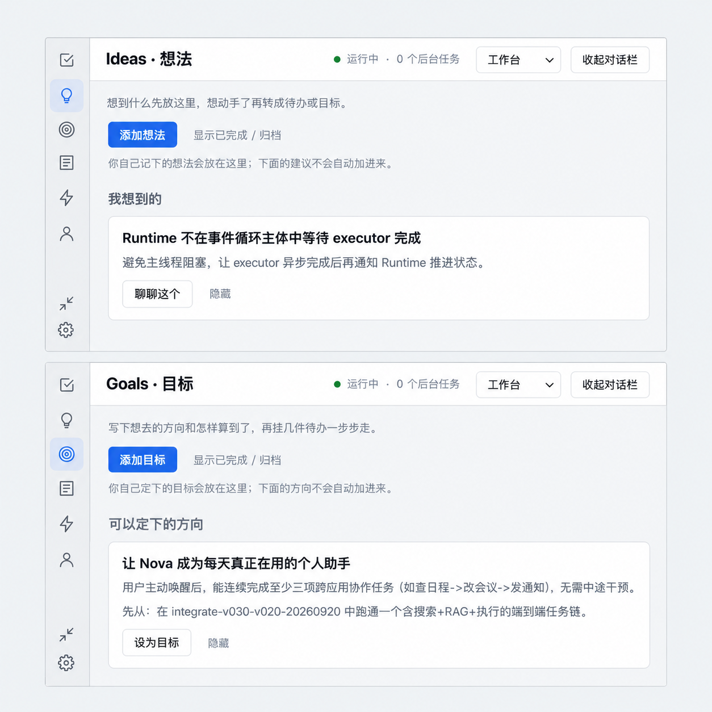
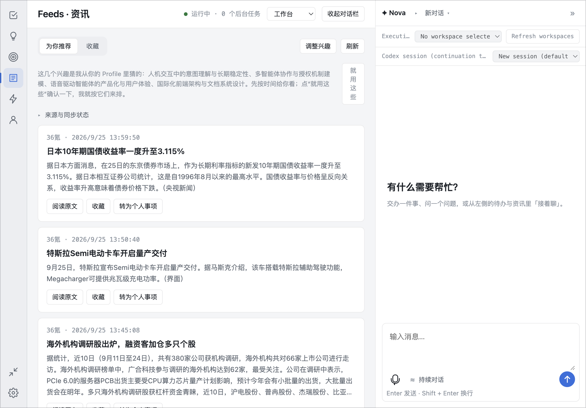
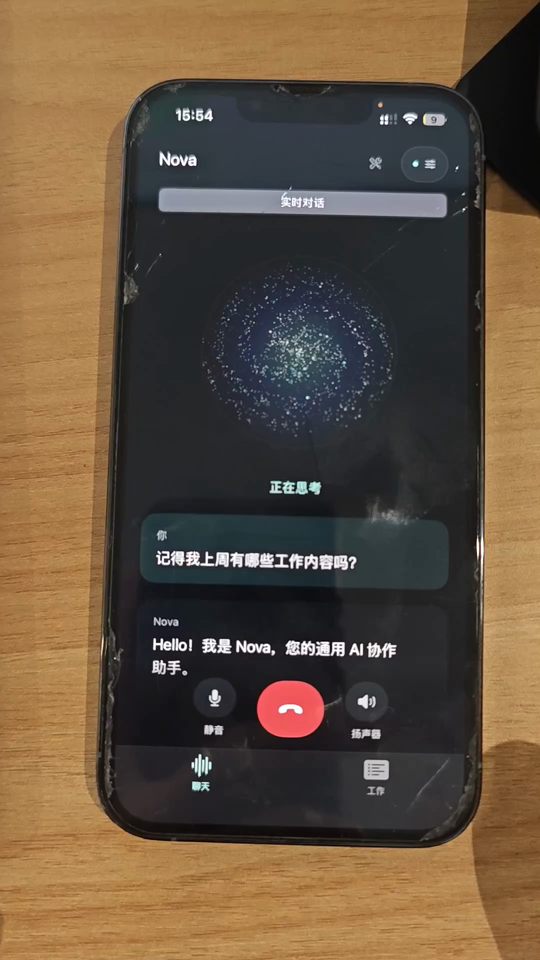

<!-- Keep in sync with README.md -->

# NAA (Your Personal Agent and Voice Assistant)

[English](README.md) | **简体中文**

[](https://github.com/deepnovacore/NovaAudioAgent/actions/workflows/ci.yml)
[](LICENSE)
[](package.json)
[](https://deepnovacore.github.io/NovaAudioAgent/)
[](https://youtu.be/t1c-2O-QsxE)

> **你的个人 Agent 与常驻语音助手：理解上下文，前后双脑协作，主动有分寸。**

## News

- **2026-10-09 · [v0.3.1](https://github.com/deepnovacore/NovaAudioAgent/releases/tag/v0.3.1)** — **上手更顺畅：** 文字对话开箱即用，桌面端升级更省心。
- **2026-10-07 · [v0.3.0](https://github.com/deepnovacore/NovaAudioAgent/releases/tag/v0.3.0)** — **你的个人 Agent：** 待办、想法、目标、资讯和 Profile，配合有出处的记忆与按证据核验的任务。
- **2026-09-21 · [v0.2.0](https://github.com/deepnovacore/NovaAudioAgent/releases/tag/v0.2.0)** — **按你的方式对话：** 可配置 ASR / LLM / TTS、个人记忆、MCP 与 iPhone 客户端。
- **2026-08-31 · [v0.1.0](https://github.com/deepnovacore/NovaAudioAgent/releases/tag/v0.1.0)** — **常驻语音助手，前后双脑协作：** 前台持续对话，后台 Agent 执行，途中随时补充需求。

<details>
<summary>其他小版本更新</summary>

- **2026-09-24 · [v0.2.3](https://github.com/deepnovacore/NovaAudioAgent/releases/tag/v0.2.3)** — 首次启动引导，一个 DashScope API Key 即可开始对话。
- **2026-09-21 · [v0.2.2](https://github.com/deepnovacore/NovaAudioAgent/releases/tag/v0.2.2)** — Ubuntu 桌面端与支持扫码配对的无头服务。

</details>

## 1. 核心特性

[](assets/architecture/nova-personal-agent.zh-CN.png)

你的上下文帮助 Nova 理解需求，前脑通过对话协调后脑执行。结果按证据核对，提醒在合适时机开口。

- **你的主动式个人 Agent。** 待办、想法、目标、资讯和 Profile，把 Nova 对你的了解变成可以行动的建议。
- **理解广泛、非结构化的上下文。** 接入文件夹、邮件、日历、对话和文档；个人记忆可追溯、可编辑、可删除。
- **常驻语音助手，前后双脑协作。** 前脑陪你交流，后脑处理长时间运行的工作。
- **薄而清晰的前台任务协调层。** 问清目标、确认授权，再委派给 coding agent；按标准核对证据，随时接管和交还。
- **主动有分寸。** Nova 判断什么值得提醒、什么时候开口。琐碎更新保持安静，不抢你的话。

[工作原理](docs/zh-CN/architecture.md) · [任务控制](docs/zh-CN/tasks.md) · [资料授权](docs/zh-CN/sources-and-connectors.md)

## 2. 和 Nova 一起做事

### 2.1 你的个人 Agent，理解广泛、非结构化的上下文

接入你选择的文件夹、邮件、日历和对话。个人记忆与导入的文档知识帮助 Nova 理解你的工作；读取资料和允许模型处理内容，仍是两项独立授权。

<table>
  <tr>
    <td width="50%" valign="top">
      <h3>你的个人工作台</h3>
      <p>把零散上下文整理成有出处的近况与待办建议。选好下一步，再和 Nova 接着做。</p>
      <a href="assets/features/workbench-original.png"></a>
    </td>
    <td width="50%" valign="top">
      <h3>关于你，也由你来改</h3>
      <p>Nova 根据近期工作和兴趣形成个人概览。个人记忆可以追溯来源、纠正、忘记或彻底删除。</p>
      <a href="assets/features/profile-original.png"></a>
    </td>
  </tr>
  <tr>
    <td width="50%" valign="top">
      <h3>把想法变成方向</h3>
      <p>记下想法，设定目标，准备好后再转成待办。Nova 的建议由你决定是否采纳。</p>
      <a href="assets/features/ideas-goals-original.png"></a>
    </td>
    <td width="50%" valign="top">
      <h3>围绕兴趣发现资讯</h3>
      <p>根据 Profile 为公开资讯排序。收藏感兴趣的内容，也能转成自己的想法、待办或目标。</p>
      <a href="assets/features/feeds-original.png"></a>
    </td>
  </tr>
</table>

### 2.2 你的语音助手，主动有分寸

前脑负责交流，后脑负责做事。任务进展与相机观察帮助 Nova 判断是否值得提醒，发言时机另行协调。

<table>
  <tr>
    <td width="50%" valign="top">
      <h3>前脑陪你交流，后脑继续做事</h3>
      <p>后台执行时，前台对话照常。随时问清目标、补充约束或调整方向，不必从头开始。</p>
      <a href="assets/features/conversation.png"></a>
    </td>
    <td width="50%" valign="top">
      <h3>任务有边界，主动有分寸</h3>
      <p>Nova 协调任务，按你的标准核对结果。权限由你确认，执行可以接管；值得提醒的进展才在合适时机开口。</p>
      <a href="assets/features/permission.png"></a>
    </td>
  </tr>
</table>

### 2.3 使用案例

<table>
  <tr>
    <td width="50%" valign="top">
      <h3>用语音 Vibe Coding</h3>
      <p>说出你想做的东西，让 coding agent 编写和测试，再通过对话不断调整。</p>
      <a href="assets/features/coding.svg"></a>
    </td>
    <td width="50%" valign="top">
      <h3>帮你留意画面变化</h3>
      <p>让 Nova 留意指定情况，发生时再提醒你。相机观察独立运行，不占用编码任务。</p>
      <a href="assets/features/vision-camera.png"></a>
    </td>
  </tr>
  <tr>
    <td width="50%" valign="top">
      <h3>一起整理周报</h3>
      <p>让 Nova 回顾近期工作，帮你整理周报。直接观看手机端的真实演示。</p>
      <a href="assets/demos/weekly-report/weekly-report.mp4"></a>
      <p><a href="assets/demos/weekly-report/weekly-report.mp4">▶ 播放演示</a></p>
    </td>
    <td width="50%" valign="top">
      <h3>把 Nova 带在身边</h3>
      <p>通过 Tailscale 将 iPhone 连到桌面端或无头服务。随时对话，也能在手机上确认任务权限。</p>
      <a href="assets/features/iphone.png"></a>
    </td>
  </tr>
</table>

## 3. 快速开始

### 3.1 安装与启动

环境要求：Node.js 22.13+、npm、Git、已登录的 `codex` 可执行文件（Codex 只走 app-server）

可直接用 npm 安装。

```bash
# 全局安装
npm install --global nova-audio-agent@latest
# 启动客户端；首次启动会弹出设置窗口，填一个 DashScope 密钥即可
novaaudio
# 打开设置面板
novaaudio config
# 查看当前语音管线需要哪些密钥；加 --online 在线验证
novaaudio doctor
```

无头 Ubuntu 22.04+：通过 npm 安装 `nova-audio-agent-server`，完成配置与凭据初始化后运行 `novaaudio-server start`；另开终端运行 `novaaudio-server pair wss://your-host.ts.net` 显示一次性配对二维码。配置见[远程服务指南](docs/zh-CN/deployment/remote-server.md)。

### 3.2 升级

先退出 Nova，再运行 `npm install --global nova-audio-agent@latest`。如需固定版本，使用 `nova-audio-agent@0.3.1`。升级会保留本地设置与数据；改回旧版本不会回滚数据变化，请先备份 Nova 数据。

Ubuntu 22.04+ x64 无头服务使用 `npm install --global nova-audio-agent-server@latest`。

### 3.3 从源码开发

从源码开发时：

```bash
git clone https://github.com/deepnovacore/NovaAudioAgent.git nova-audio-agent
cd nova-audio-agent
npm ci && cp .env.example .env
# 在 .env 中填入 DASHSCOPE_API_KEY
```

从 [DashScope](https://platform.qianwenai.com) 获取 API Key 并配置 `DASHSCOPE_API_KEY`。这一把密钥就能用语音、记忆、摄像头和联网搜索；搜索默认走百炼，配置 [Tavily](https://docs.tavily.com) 的 `TAVILY_API_KEY` 后改用 Tavily。

启动桌面应用：
```bash
npm run start:client
# 本次直接打开 Workbench，覆盖已保存的启动偏好
npm run start:workbench
```
客户端包含麦克风、摄像头、声音开关等按钮，以及设置面板和外部 MCP 设置。你也可以试试把鼠标悬在桌面 orb 上，会有惊喜）

```bash
npm run build --workspace @nova-audio-agent/runtime
node runtime/dist/src/cli.js diagnose --json
node runtime/dist/src/cli.js demo all
```

原生回声消除采集（VoiceProcessingIO）仅 macOS 可用，唤醒检测在可用时复用该采集路径；
Windows、Linux 源码运行及 macOS 回退路径使用 Chromium `getUserMedia` + AudioWorklet。
休眠时麦克风帧仅送入本地唤醒 Worker，闭麦会停止唤醒检测。详见[本地唤醒设置](docs/zh-CN/getting-started.md#本地唤醒词)。

### 3.4 支持矩阵

| 平台 | 桌面应用 | 无头服务 | 连接 iPhone |
|---|---|---|---|
| macOS arm64 | ✅ 原生回声消除 | ✅ 源码运行 | ✅ 桌面端配对 |
| Windows x64 | ✅ | ❌ | ❌ |
| Ubuntu 22.04+ x64 | ✅ | ✅ npm 包 | ✅ 无头服务配对 |

| 层 | 可选服务 |
|---|---|
| 集成语音 | Qwen realtime、OpenAI realtime、Gemini Live、StepFun（预览） |
| 级联 ASR / TTS | 火山语音、Gemini、自托管（参考实现：Whisper / Breeze） |
| 级联 LLM | DeepSeek、Qwen / DashScope、火山方舟、OpenAI、Gemini、自托管 |
| 视觉 | Qwen-VL 系列、Doubao Seed |
| 编码 Agent | Codex（v0.3.1）；v0.4.0 扩展更多后端 |
| 数据源 | 本地文件夹、Google（经 Composio）、Apple 邮件与日历（macOS）、飞书 |

各模型、凭据与服务商限制见[支持矩阵](docs/zh-CN/support-matrix.md)。

## 4. 文档

| 读这篇 | 目的 |
|---|---|
| [架构](docs/zh-CN/architecture.md) | 模块与边界 |
| [术语与不变量](docs/zh-CN/glossary.md) | 核心常量 |
| [上手指南](docs/zh-CN/getting-started.md) | 安装与集成 |
| [Workbench](docs/zh-CN/workbench.md) · [任务](docs/zh-CN/tasks.md) · [资料来源与连接器](docs/zh-CN/sources-and-connectors.md) | 主窗口、交办的任务，以及 Nova 能读取哪些资料 |
| [语音助手什么时候该开口？](docs/zh-CN/blog/2026-08-proactive-voice-agent-design-space.md) | 语音交互设计 |
| [Node runtime 迁移归档](https://github.com/deepnovacore/NovaAudioAgent/tree/20a0812c0acb83b53cbad4b415d637dafff3c7f6/docs/archs/node-runtime-migration) | `v0.1.0` tag 历史中的迁移期计划 |

## 5. 路线图

- [ ] **v0.4.0 — 专长 Agent 协作（开发中）。** 扩展 OpenCode、CodeBuddy、Pi、DeepSeek Harness 等编码后端，接入受监督的 GUI 执行与专长 Agent 协作；发布前完成恢复、拒绝、取消、语音及支持平台验收。
- [ ] **v1.0.0 — 稳定版。** 核心行为与支持平台完成稳定性验收，安装升级可靠，恢复行为明确，用户文档完整。

开发分支中的接入不等于正式版支持；各项能力完成对应配置的验收后再发布。

## 6. 贡献

```bash
npm ci && npm run check && npm run build && npm test
```

安全问题见 [SECURITY.md](SECURITY.md)，贡献规则见 [CONTRIBUTING.md](CONTRIBUTING.md)。

## 7. 许可证

版权所有 2026 DeepNovaCore，[Apache License 2.0](LICENSE)。
