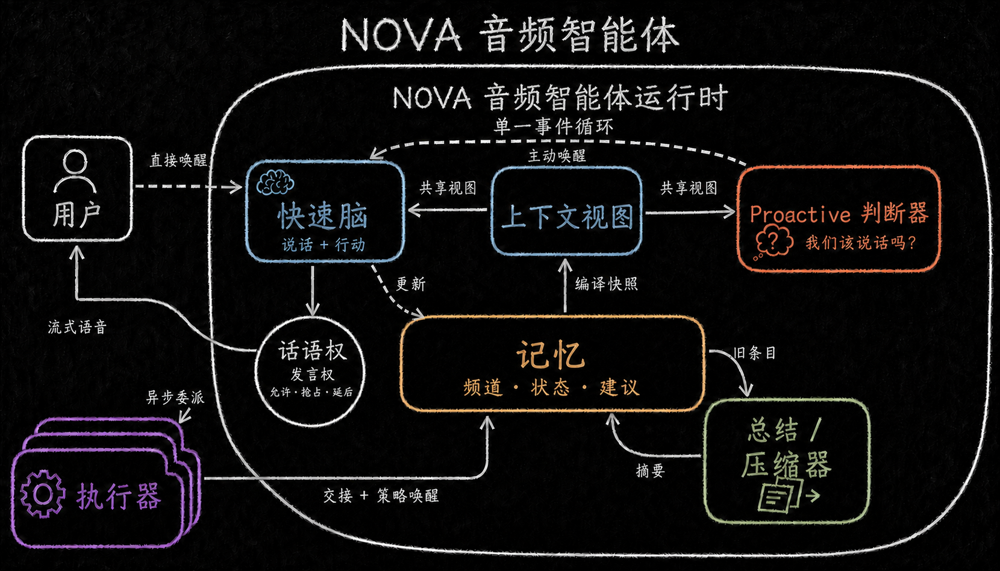

<!-- Keep in sync with README.md -->

# Nova Audio Agent

[English](README.md) | **简体中文**

[](https://github.com/deepnovacore/NovaAudioAgent/actions/workflows/ci.yml)
[](LICENSE)
[](package.json)
[](#2-架构)
[](docs/en/blog/2026-08-proactive-voice-agent-design-space.md)
[](https://youtu.be/t1c-2O-QsxE)


> **Agent 常驻在线、主动但是有分寸、通过语音帮你管理所有工作区 -- 干活不停，言语有度**

https://github.com/user-attachments/assets/061697f3-fff6-47d6-924b-8a29eef4ab45

## News

- **2026-10-02 · [v0.3.0 Preview](https://github.com/deepnovacore/NovaAudioAgent/tree/v0.3.0preview)** — 小诺从语音助手长成了个人 Agent。
  - **Workbench 主窗口**：左侧是待办、想法、目标、资讯、Agent 执行和「关于我」，右侧是与小诺的对话；悬浮球作为收起后的形态保留。
  - **任务可验收**：交出去的活带着验收标准，小诺核对证据后才说完成；随时可以接手，再交还给它。
  - **记忆有据可查**：从你授权的目录、邮件、日历和飞书里整理候选，留不留由你决定；每一条都能溯源、纠正或删除。
  - **资讯与项目回顾**：按兴趣排序的资讯流，以及根据项目文件生成、附带出处的回顾卡片。
  - **更多语音选择**：新增 StepAudio 3 集成模型（预览）、Qwen Audio 3.1，以及火山声纹验证。
- **2026-09-24 · [v0.2.3](https://github.com/deepnovacore/NovaAudioAgent/releases/tag/v0.2.3)** — 首次启动引导：一个 DashScope API Key 即可开始对话。
- **2026-09-21 · [v0.2.2](https://github.com/deepnovacore/NovaAudioAgent/releases/tag/v0.2.2)** — 支持 Ubuntu 22.04+ x64 桌面端，新增可扫码配对的无头服务包 `nova-audio-agent-server`。
- **2026-09-21 · [v0.2.0](https://github.com/deepnovacore/NovaAudioAgent/releases/tag/v0.2.0)** — 可配置 ASR / LLM / TTS 管线、个人记忆、自定义 MCP、唤醒词、中英双语桌面端（macOS / Windows），以及经 Tailscale 连接的 iPhone 客户端。
- **2026-08-31 · v0.1.0** — 常驻语音、Codex 后台执行、途中补充需求、工作区与会话管理，以及按需播报进度。

## 1. 核心特性

Nova Audio Agent **常驻通用语音 agent**：小诺（Nova）保持前台对话实时响应，同时在后台处理长任务，并在合适的时间汇报合适的进度。

同期工作 [qwen-audio-agent](https://github.com/QwenAudio/qwen-audio-agent) 回答的是
「怎么让 agent 边干活边说话」；我们在此基础上又追问了一层——**开口这件事，什么时候才值得**
（详见[语音交互设计说明](docs/en/blog/2026-08-proactive-voice-agent-design-space.md)）。


- **主动有分寸。** 重要进展及时说，琐碎过程保持安静，提醒不抢用户说话。
- **语音管理工作区。** 创建、切换工作区与会话，由你确认。
- **先问清，再动手。** 需求不明确时先澄清，再交给后台执行。
- **执行中随时调整。** 任务进行中，通过语音补充要求和约束。
- **一个窗口装下一天。** 待办、目标、资讯和交出去的任务都在 Workbench 里，就在对话旁边，依据是你授权的资料。
- **完成要经得起验收。** 每个任务带验收标准，小诺核对证据后才汇报完成；你随时可以接手。

## 2. 设计架构

[](assets/ideas/v3/nova-audio-agent-runtime-chalkboard-zh-CN.png)

*一个事件循环，两个模型端口共读一份 ContextView，Memory 当公共黑板，Floor 把守唯一说话通路。*

几个关键角色：

* **FrontBrain：** 实时前台模型，通过最小主机工具面派活、取消、确认主机提案、召回记忆和搜索；revision-bound intake slots 由主机拥有。
* **Proactive：** 发现有依据的建议，并选择值得主动告诉用户的信息。Floor 管发言时机，前脑负责最终表达。
* **Memory 与 ContextView：** Memory 短期、分通道；能力证据与 intake facts 受限编译进 ContextView 给 FrontBrain。
* **Floor：** 说话权。不同事件自带不同优先级。
* **Executor 与 Controller：** role-based manifest 运行异步工作；AgentController registry 拥有面向模型的 controller 及隐藏的 Vision watch/guard。主对话直接向当前 VLM 附图；视觉监控独立管理完整循环。
* **Compressor：** 对话变长后，短期记忆可能撑爆 FrontBrain 和 Proactive 的上下文，Agent用摘要模型自动压缩。

架构细节见 [架构](docs/en/architecture.md)。


## 使用场景

<table>
  <tr>
    <td width="50%" valign="top">
      <h3>你的个人工作台</h3>
      <p>待办、想法、目标、资讯和「关于我」在左侧，和小诺的对话在右侧。从任意一条待办发起任务，小诺对照验收标准核对结果；中途你随时可以接管，也可以交还给它。</p>
      
    </td>
    <td width="50%" valign="top">
      <h3>视觉监控与主动提醒</h3>
      <p>告诉 Nova 要关注的画面变化，条件触发时主动提醒。</p>
      
    </td>
  </tr>
  <tr>
    <td width="50%" valign="top">
      <h3>Voice Vibe Coding</h3>
      <p>用语音描述功能、调整需求，Codex 在后台编码与测试。关键进展主动告知，琐碎过程保持安静。</p>
      
    </td>
    <td width="50%" valign="top">
      <h3>把 Nova 带在身边</h3>
      <p>iPhone 通过 Tailscale 连接电脑，随时对话和审批。</p>
      
    </td>
  </tr>
</table>

## 核心功能

<table>
  <tr>
    <td width="50%" valign="top">
      <h3>理解意图，问清再做</h3>
      <p>自然描述目标，Nova 理解你的意图，问清缺失信息后再开始任务。</p>
      
    </td>
    <td width="50%" valign="top">
      <h3>操作权限，由你决定</h3>
      <p>执行命令或访问网络需要额外权限时，查看请求并选择允许或拒绝。</p>
      
    </td>
  </tr>
  <tr>
    <td width="50%" valign="top">
      <h3>语音管理工作区</h3>
      <p>用语音创建、切换工作区和会话；新建工作区前，先等你点头。</p>
      
    </td>
    <td width="50%" valign="top">
      <h3>接入工具与知识</h3>
      <p>自由配置 ASR / LLM / TTS 和 MCP，基于自己的资料问答。</p>
      
    </td>
  </tr>
</table>

### v0.3 新功能

<table>
  <tr>
    <td width="50%" valign="top">
      <h3>待办与项目回顾</h3>
      <p>根据最近的项目动态生成回顾卡片和下一步建议，每条都带出处；挑一条，就能让小诺接着做。</p>
      
    </td>
    <td width="50%" valign="top">
      <h3>想法与目标</h3>
      <p>想法随手记，目标慢慢定。小诺会从你的资料里补充建议，但不会自作主张加进来。</p>
      
    </td>
  </tr>
  <tr>
    <td width="50%" valign="top">
      <h3>按兴趣排序的资讯</h3>
      <p>从「关于我」推断你关心的方向，给公开资讯排序；看到有用的，可以收藏，或转成自己的想法、待办和目标。</p>
      
    </td>
    <td width="50%" valign="top">
      <h3>「关于我」与个人记忆</h3>
      <p>小诺对你的了解，每条都标明是你说过的还是来自资料；可以接着聊、纠正、忘记，也可以彻底删除。</p>
      
    </td>
  </tr>
</table>

## 3. 快速开始

环境要求：Node.js 22+、npm、Git、已登录的 `codex` 可执行文件（Codex 只走 app-server）

可直接用 npm 安装稳定版；预览版安装方式见下方 Preview 通道。

```bash
# 全局安装
npm install --global nova-audio-agent@0.2.3
# 启动客户端；首次启动会弹出设置窗口，填一个 DashScope 密钥即可
novaaudio
# 打开设置面板
novaaudio config
# 查看当前语音管线需要哪些密钥；加 --online 在线验证
novaaudio doctor
```

无头 Ubuntu 22.04+：通过 npm 安装 `nova-audio-agent-server`，完成配置与凭据初始化后运行 `novaaudio-server start`；另开终端运行 `novaaudio-server pair wss://your-host.ts.net` 显示一次性配对二维码。配置见[远程服务指南](docs/zh-CN/deployment/remote-server.md)。

### Preview 预览通道

v0.3 预览版使用 npm 的 `preview` 标签；`latest` 保持为稳定版。

```bash
# 安装或更新预览版
npm install --global nova-audio-agent@preview
novaaudio
# 固定安装本次预览版
npm install --global nova-audio-agent@0.3.0-preview.1
# 将 CLI 切回稳定版
npm install --global nova-audio-agent@latest
```

切换通道前请退出 Nova。两个通道共用本地设置与数据；切换 CLI 不会回滚数据变化，试用前请备份 Nova 数据。

Ubuntu 22.04+ x64 无头服务使用 `npm install --global nova-audio-agent-server@preview`；稳定版使用 `@latest`。

从源码开发时：

```bash
git clone https://github.com/deepnovacore/NovaAudioAgent.git nova-audio-agent
cd nova-audio-agent
npm ci && cp .env.example .env
# 在 .env 中填入 DASHSCOPE_API_KEY
```

启动桌面应用：
```bash
npm run start:client
# 本次直接打开 Workbench，覆盖已保存的启动偏好
npm run start:workbench
```
客户端包含麦克风、摄像头、声音开关等按钮，以及设置面板和外部 MCP 设置。你也可以试试把鼠标悬在桌面 orb 上，会有惊喜）

从 [DashScope](https://platform.qianwenai.com) 获取 API Key 并配置 `DASHSCOPE_API_KEY`。这一把密钥就能用语音、记忆、摄像头和联网搜索；搜索默认走百炼，配置 [Tavily](https://docs.tavily.com) 的 `TAVILY_API_KEY` 后改用 Tavily。

```bash
npm run build --workspace @nova-audio-agent/runtime
node runtime/dist/src/cli.js diagnose --json
node runtime/dist/src/cli.js demo all
```

原生回声消除采集（VoiceProcessingIO）仅 macOS 可用，唤醒检测在可用时复用该采集路径；
Windows、Linux 源码运行及 macOS 回退路径使用 Chromium `getUserMedia` + AudioWorklet。
休眠时麦克风帧仅送入本地唤醒 Worker，闭麦会停止唤醒检测。详见[本地唤醒设置](docs/zh-CN/getting-started.md#本地唤醒词)。

### 支持矩阵

| 平台 | 桌面应用 | 无头服务 | 连接 iPhone |
|---|---|---|---|
| macOS arm64 | 支持，含原生回声消除采集 | 源码运行 | 在桌面应用中配对 |
| Windows x64 | 支持 | — | — |
| Ubuntu 22.04+ x64 | 支持 | npm 包 | 通过无头服务 |

| 层 | 可选服务 | 默认 |
|---|---|---|
| 集成语音 | Qwen realtime、StepFun（预览） | Qwen `qwen-audio-3.0-realtime-plus` |
| 级联 ASR / TTS | 火山语音 | `volc.seedasr.sauc.duration` / `seed-tts-2.0` |
| 级联 LLM | DeepSeek、Qwen / DashScope、火山方舟 | DeepSeek `deepseek-flash` |
| 视觉 | Qwen-VL 系列、Doubao Seed | 对话中默认关闭；Loop Camera 使用独立模型 |
| 编码 executor | Codex | Codex |
| 数据源 | 本地文件夹、Google（经 Composio）、Apple 邮件与日历（macOS）、飞书 | 经你授权后才接入 |

各模型、凭据与服务商限制见[支持矩阵](docs/zh-CN/support-matrix.md)。

## 4. 文档

| 读这篇 | 目的 |
|---|---|
| [架构](docs/zh-CN/architecture.md) | 模块与边界 |
| [术语与不变量](docs/zh-CN/glossary.md) | 核心常量 |
| [上手指南](docs/zh-CN/getting-started.md) | 安装与集成 |
| [Workbench](docs/zh-CN/workbench.md) · [任务](docs/zh-CN/tasks.md) · [资料来源与连接器](docs/zh-CN/sources-and-connectors.md) | 主窗口、交办的任务，以及小诺能读取哪些资料 |
| [语音助手什么时候该开口？](docs/zh-CN/blog/2026-08-proactive-voice-agent-design-space.md) | 语音交互设计 |
| [Node runtime 迁移归档](https://github.com/deepnovacore/NovaAudioAgent/tree/20a0812c0acb83b53cbad4b415d637dafff3c7f6/docs/archs/node-runtime-migration) | `v0.1.0` tag 历史中的迁移期计划 |

## 5. 路线图

后续开发以 `v0.3.0dev` 为主；`main` 保持已发布基线。

- [x] **v0.3.0：** 文字与语音整合进同一个主窗口，含待办、想法、目标、资讯、Agent 执行和「关于我」；任务带验收标准、核验完成并可随时接手；基于记忆提出建议；个人记忆可追溯、可纠正、可删除；接入用户授权的目录、邮件、日历和飞书会话。
- [ ] **v0.4.0：** 扩展 Kimi Code、pi agent 等 coding 后端；以 AutoGLM 为首个示例接入 GUI 执行器，支持专长 Agent 之间的协作。

发布前须完成功能与支持平台验收。Ubuntu 22.04+ x64 桌面端与无头 npm 包纳入候选发布验收。

## 6. 贡献

```bash
npm ci && npm run check && npm run build && npm test
```

安全问题见 [SECURITY.md](SECURITY.md)，贡献规则见 [CONTRIBUTING.md](CONTRIBUTING.md)。

## 7. 许可证

版权所有 2026 DeepNovaCore，[Apache License 2.0](LICENSE)。
