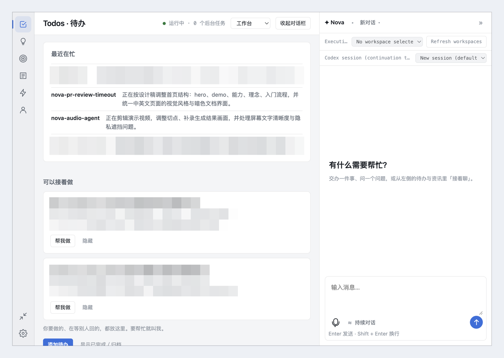
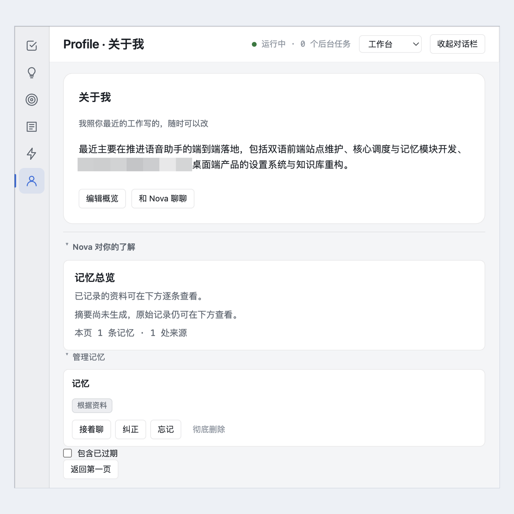
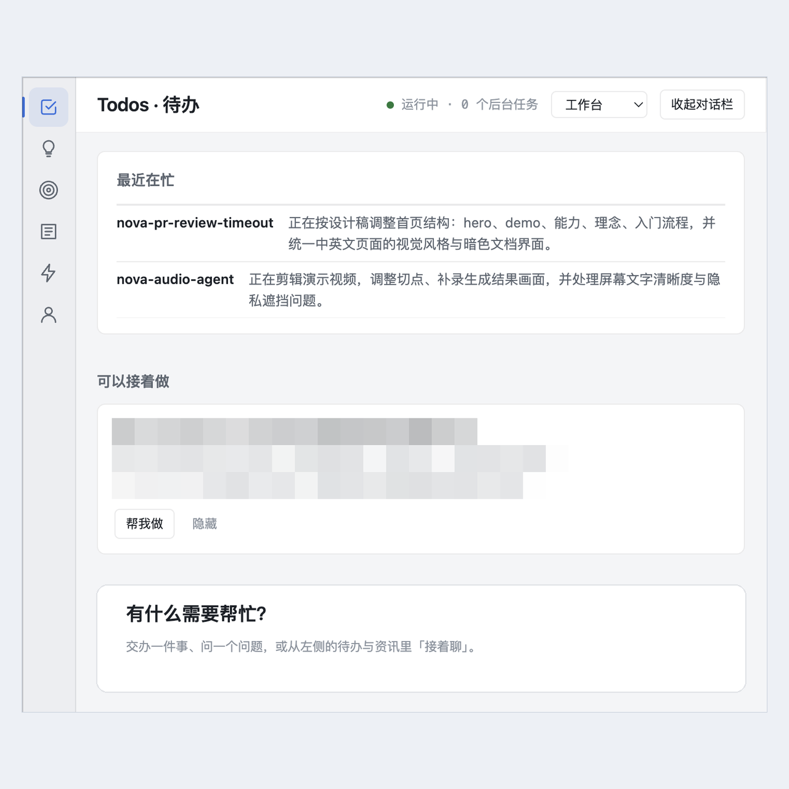
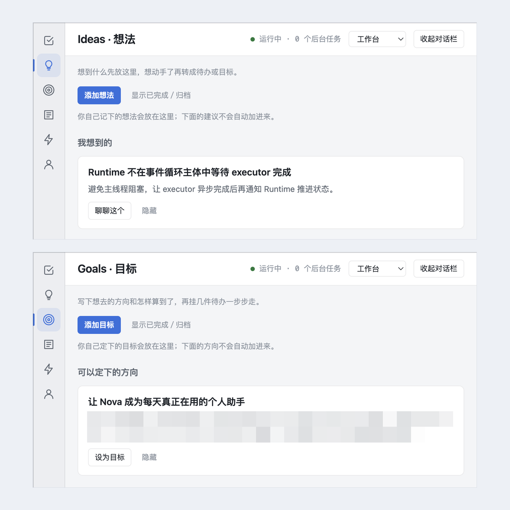
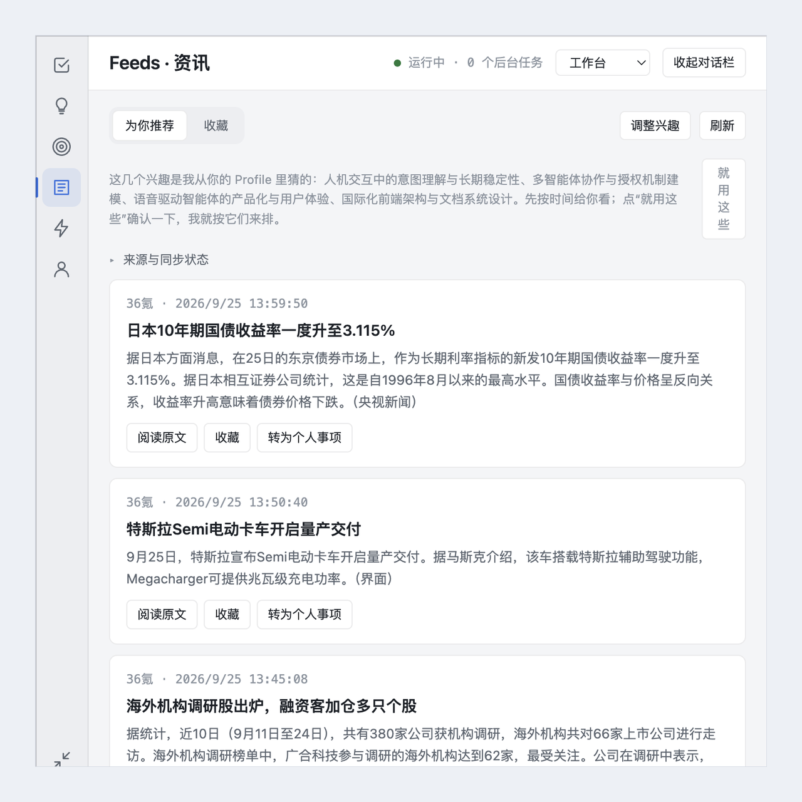
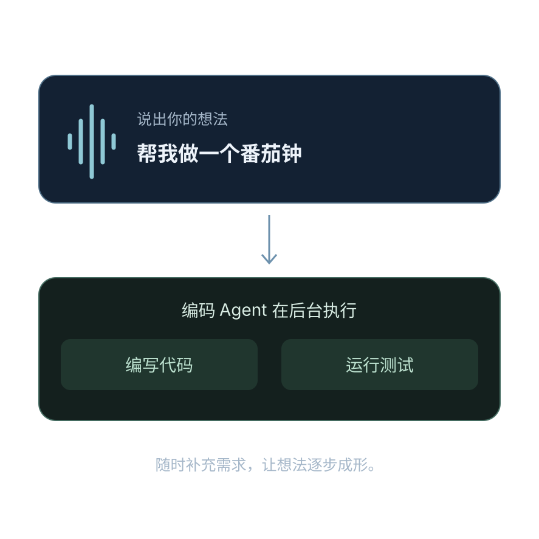
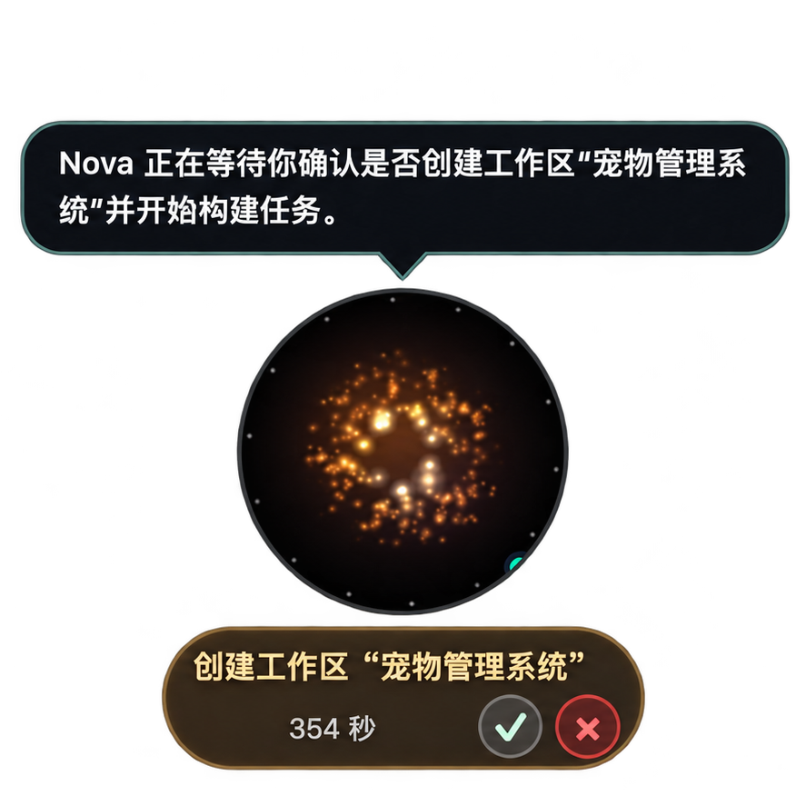
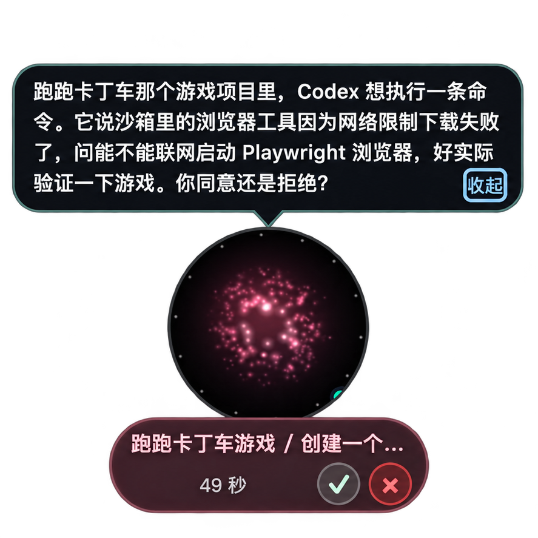
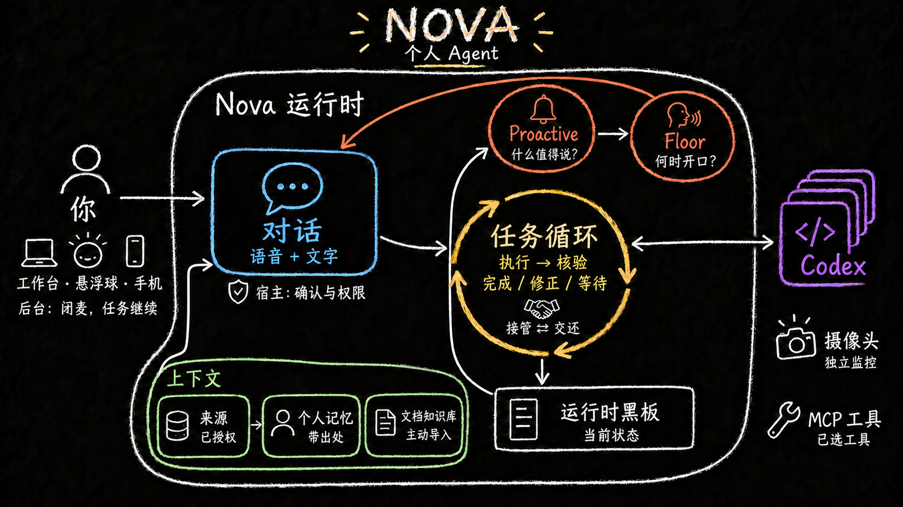

<!-- Keep in sync with README.md -->

# Nova Audio Agent

[English](README.md) | **简体中文**

[](https://github.com/deepnovacore/NovaAudioAgent/actions/workflows/ci.yml)
[](LICENSE)
[](package.json)
[](#4-设计架构)
[](docs/zh-CN/blog/2026-08-proactive-voice-agent-design-space.md)
[](https://youtu.be/t1c-2O-QsxE)


> **理解你的上下文，通过对话推进工作，结果可验收，主动有分寸。**

## News

- **2026-10-09 · [v0.3.1](https://github.com/deepnovacore/NovaAudioAgent/releases/tag/v0.3.1)** — 首次启动与升级更顺畅：快速开始的同一个密钥即可直接用于文字对话，Ubuntu 安装包支持从 0.3.0 原地升级，macOS 应用包校验通过，飞书连接界面补全英文。

<details>
<summary>早期版本</summary>

- **2026-10-07 · [v0.3.0](https://github.com/deepnovacore/NovaAudioAgent/releases/tag/v0.3.0)** — 个人工作台、带出处的记忆，以及有验收标准的任务。实时与级联语音可选 Qwen、OpenAI、Gemini、火山和自托管服务，具体能力取决于所选管线。
- **2026-09-24 · [v0.2.3](https://github.com/deepnovacore/NovaAudioAgent/releases/tag/v0.2.3)** — 首次启动引导：一个 DashScope API Key 即可开始对话。
- **2026-09-21 · [v0.2.2](https://github.com/deepnovacore/NovaAudioAgent/releases/tag/v0.2.2)** — 支持 Ubuntu 22.04+ x64 桌面端，新增可扫码配对的无头服务包 `nova-audio-agent-server`。
- **2026-09-21 · [v0.2.0](https://github.com/deepnovacore/NovaAudioAgent/releases/tag/v0.2.0)** — 可配置 ASR / LLM / TTS 管线、个人记忆、自定义 MCP、唤醒词、中英双语桌面端（macOS / Windows），以及经 Tailscale 连接的 iPhone 客户端。
- **2026-08-31 · v0.1.0** — 常驻语音、Codex 后台执行、途中补充需求、工作区与会话管理，以及按需播报进度。

</details>

## 1. 核心特性

小诺把对话、你授权的上下文和后台执行连接成一个个人 Agent：一起问清目标，在 Workbench 中整理待办、想法与目标，再跟进任务直到得到有证据的结果。

- **语音与文字一起用。** 后台任务继续，前台对话照常；随时澄清需求、补充要求或调整方向。
- **对话与任务并排。** 待办、想法、目标、资讯、任务和「关于我」与对话并排；也能切成悬浮球，或在关闭麦克风的后台模式中继续执行。
- **上下文来自你的资料。** 接入文件夹、邮件、日历和飞书；读取来源与允许配置的模型处理内容，是两项独立的授权。
- **个人记忆带着出处。** 查看小诺学到了什么，追溯依据、纠正、忘记或彻底删除；主动导入的文档知识库保持独立检索。
- **任务可执行、可验收。** 问清目标，确认工作区与会话，再交给 Codex；执行中可以补充要求，小诺按验收标准核对证据，你也能随时接管和交还。
- **主动有分寸。** 重要进展、关注的画面变化和可选每日简报，在合适时机提醒；琐碎更新保持安静，不抢你说话。

详见[资料授权](docs/zh-CN/sources-and-connectors.md)、[任务控制](docs/zh-CN/tasks.md)和[语音助手什么时候该开口](docs/zh-CN/blog/2026-08-proactive-voice-agent-design-space.md)。

## 2. 和小诺一起做事

### 工作台与个人上下文

<table>
  <tr>
    <td width="50%" valign="top">
      <h3>你的个人工作台</h3>
      <p>待办、想法、目标、资讯、任务和「关于我」与对话并排。可以切成悬浮球，也可以隐藏窗口、关闭麦克风，让任务继续运行。</p>
      
    </td>
    <td width="50%" valign="top">
      <h3>「关于我」与个人记忆</h3>
      <p>小诺对你的了解，每条都标明是你说过的还是来自资料；可以接着聊、纠正、忘记，也可以彻底删除。</p>
      
    </td>
  </tr>
  <tr>
    <td width="50%" valign="top">
      <h3>待办与项目回顾</h3>
      <p>根据最近的项目动态生成回顾卡片和下一步建议，每条都带出处；挑一条，就能让小诺接着做。</p>
      
    </td>
    <td width="50%" valign="top">
      <h3>想法与目标</h3>
      <p>想法随手记，目标慢慢定；小诺从你的资料里提出建议，由你决定是否采纳。</p>
      
    </td>
  </tr>
  <tr>
    <td width="50%" valign="top">
      <h3>按兴趣排序的资讯</h3>
      <p>从「关于我」推断你关心的方向，给公开资讯排序；看到有用的，可以收藏，或转成自己的想法、待办和目标。</p>
      
    </td>
    <td width="50%" valign="top">
      <h3>接入工具与知识</h3>
      <p>自由配置 ASR / LLM / TTS 和 MCP，基于自己的资料问答。</p>
      
    </td>
  </tr>
</table>

### 交办任务，随时调整

<table>
  <tr>
    <td width="50%" valign="top">
      <h3>理解意图，问清再做</h3>
      <p>自然描述目标，Nova 理解你的意图，问清缺失信息后再开始任务。</p>
      
    </td>
    <td width="50%" valign="top">
      <h3>Voice Vibe Coding</h3>
      <p>问清目标，交给 Codex 在后台执行，再用语音或文字补充要求。小诺对照验收标准核对任务证据；你随时可以接管，再交还给它。</p>
      
    </td>
  </tr>
  <tr>
    <td width="50%" valign="top">
      <h3>语音管理工作区</h3>
      <p>用语音创建、切换工作区和会话；新建工作区前，先等你点头。</p>
      
    </td>
    <td width="50%" valign="top">
      <h3>操作权限，由你决定</h3>
      <p>执行命令或访问网络需要额外权限时，查看请求并选择允许或拒绝。</p>
      
    </td>
  </tr>
</table>

### 观察画面，随身连接

<table>
  <tr>
    <td width="50%" valign="top">
      <h3>视觉监控与主动提醒</h3>
      <p>告诉 Nova 要关注的画面变化，条件触发时主动提醒。</p>
      
    </td>
    <td width="50%" valign="top">
      <h3>把 Nova 带在身边</h3>
      <p>iPhone 通过 Tailscale 连接 macOS 上的小诺或 Ubuntu 无头服务，随时对话和审批。</p>
      
    </td>
  </tr>
</table>

## 3. 快速开始

环境要求：Node.js 22.13+、npm、Git、已登录的 `codex` 可执行文件（Codex 只走 app-server）

可直接用 npm 安装。

```bash
# 全局安装
npm install --global nova-audio-agent@latest
# 启动客户端；首次启动会弹出设置窗口，填一个 DashScope 密钥即可
novaaudio
# 打开设置面板
novaaudio config
# 查看当前语音管线需要哪些密钥；加 --online 在线验证
novaaudio doctor
```

无头 Ubuntu 22.04+：通过 npm 安装 `nova-audio-agent-server`，完成配置与凭据初始化后运行 `novaaudio-server start`；另开终端运行 `novaaudio-server pair wss://your-host.ts.net` 显示一次性配对二维码。配置见[远程服务指南](docs/zh-CN/deployment/remote-server.md)。

### 升级

先退出 Nova，再运行 `npm install --global nova-audio-agent@latest`。如需固定版本，使用 `nova-audio-agent@0.3.1`。升级会保留本地设置与数据；改回旧版本不会回滚数据变化，请先备份 Nova 数据。

Ubuntu 22.04+ x64 无头服务使用 `npm install --global nova-audio-agent-server@latest`。

从源码开发时：

```bash
git clone https://github.com/deepnovacore/NovaAudioAgent.git nova-audio-agent
cd nova-audio-agent
npm ci && cp .env.example .env
# 在 .env 中填入 DASHSCOPE_API_KEY
```

启动桌面应用：
```bash
npm run start:client
# 本次直接打开 Workbench，覆盖已保存的启动偏好
npm run start:workbench
```
客户端包含麦克风、摄像头、声音开关等按钮，以及设置面板和外部 MCP 设置。你也可以试试把鼠标悬在桌面 orb 上，会有惊喜）

从 [DashScope](https://platform.qianwenai.com) 获取 API Key 并配置 `DASHSCOPE_API_KEY`。这一把密钥就能用语音、记忆、摄像头和联网搜索；搜索默认走百炼，配置 [Tavily](https://docs.tavily.com) 的 `TAVILY_API_KEY` 后改用 Tavily。

```bash
npm run build --workspace @nova-audio-agent/runtime
node runtime/dist/src/cli.js diagnose --json
node runtime/dist/src/cli.js demo all
```

原生回声消除采集（VoiceProcessingIO）仅 macOS 可用，唤醒检测在可用时复用该采集路径；
Windows、Linux 源码运行及 macOS 回退路径使用 Chromium `getUserMedia` + AudioWorklet。
休眠时麦克风帧仅送入本地唤醒 Worker，闭麦会停止唤醒检测。详见[本地唤醒设置](docs/zh-CN/getting-started.md#本地唤醒词)。

### 支持矩阵

| 平台 | 桌面应用 | 无头服务 | 连接 iPhone |
|---|---|---|---|
| macOS arm64 | 支持，含原生回声消除采集 | 源码运行 | 在桌面应用中配对 |
| Windows x64 | 支持 | — | — |
| Ubuntu 22.04+ x64 | 支持 | npm 包 | 通过无头服务 |

| 层 | 可选服务 | 默认 |
|---|---|---|
| 集成语音 | Qwen realtime、OpenAI realtime、Gemini Live、StepFun（预览） | Qwen `qwen-audio-3.0-realtime-plus` |
| 级联 ASR / TTS | 火山语音、Gemini、自托管（参考实现：Whisper / Breeze） | `volc.seedasr.sauc.duration` / `seed-tts-2.0` |
| 级联 LLM | DeepSeek、Qwen / DashScope、火山方舟、OpenAI、Gemini、自托管 | DeepSeek `deepseek-flash` |
| 视觉 | Qwen-VL 系列、Doubao Seed | 对话中默认关闭；Loop Camera 使用独立模型 |
| 编码 executor | Codex | Codex |
| 数据源 | 本地文件夹、Google（经 Composio）、Apple 邮件与日历（macOS）、飞书 | 经你授权后才接入 |

各模型、凭据与服务商限制见[支持矩阵](docs/zh-CN/support-matrix.md)。

## 4. 设计架构

[](assets/architecture/nova-personal-agent.zh-CN.png)

*前台保持对话，授权上下文帮助理解工作，任务结果带着证据返回；是否开口另行判断。*

- **交互入口：** Workbench、悬浮球与手机客户端提供对话和任务控制；后台模式关闭桌面麦克风，任务继续。
- **上下文：** 授权资料进入个人记忆账本，支持有出处的建议；文档知识库独立检索，两者都不拥有实时任务状态，也不产生操作授权。
- **协调与任务：** 对话问清目标，宿主管理确认、权限和任务状态；任务循环执行、核对证据，再完成、修正或等待。你可以接管，也可以交还控制权。
- **执行与表达：** Codex 在后台工作，视觉监控与已选工具各自管理生命周期；运行时事件交给 Proactive 选择值得提醒的信息，Floor 协调发言时机，对话模型负责表达。

**运行时黑板**保存当前对话与执行状态，**个人记忆**保留有来源的长期信息，**文档知识库**检索主动导入的文件；三者职责与权限不同。

产品流程见[工作原理](docs/zh-CN/architecture.md)，运行时细节见[架构参考](docs/zh-CN/archs/00-overview.md)。

## 5. 文档

| 读这篇 | 目的 |
|---|---|
| [架构](docs/zh-CN/architecture.md) | 模块与边界 |
| [术语与不变量](docs/zh-CN/glossary.md) | 核心常量 |
| [上手指南](docs/zh-CN/getting-started.md) | 安装与集成 |
| [Workbench](docs/zh-CN/workbench.md) · [任务](docs/zh-CN/tasks.md) · [资料来源与连接器](docs/zh-CN/sources-and-connectors.md) | 主窗口、交办的任务，以及小诺能读取哪些资料 |
| [语音助手什么时候该开口？](docs/zh-CN/blog/2026-08-proactive-voice-agent-design-space.md) | 语音交互设计 |
| [Node runtime 迁移归档](https://github.com/deepnovacore/NovaAudioAgent/tree/20a0812c0acb83b53cbad4b415d637dafff3c7f6/docs/archs/node-runtime-migration) | `v0.1.0` tag 历史中的迁移期计划 |

## 6. 路线图

- [x] **v0.3.0：** 文字与语音整合进同一个主窗口，含待办、想法、目标、资讯、Agent 执行和「关于我」；任务带验收标准、核验完成并可随时接手；基于记忆提出建议；个人记忆可追溯、可纠正、可删除；接入用户授权的目录、邮件、日历和飞书会话。
- [ ] **v0.4.0（开发中）：** 扩展 Kimi Code、pi agent 等 coding 后端；以 AutoGLM 为首个示例接入 GUI 执行器，支持专长 Agent 之间的协作。

发布前须完成功能与支持平台验收。Ubuntu 22.04+ x64 桌面端与无头 npm 包纳入候选发布验收。

## 7. 贡献

```bash
npm ci && npm run check && npm run build && npm test
```

安全问题见 [SECURITY.md](SECURITY.md)，贡献规则见 [CONTRIBUTING.md](CONTRIBUTING.md)。

## 8. 许可证

版权所有 2026 DeepNovaCore，[Apache License 2.0](LICENSE)。
