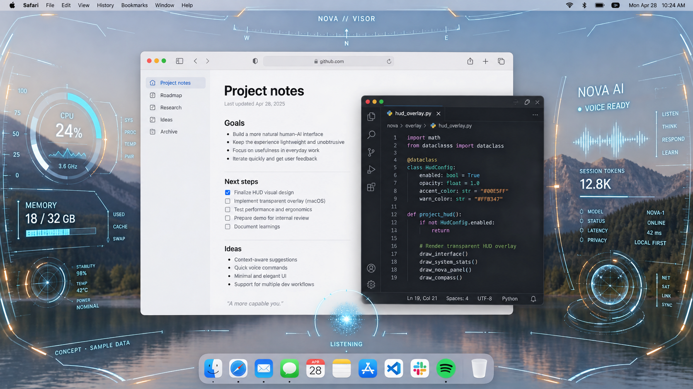

# Nova Visor：透明可交互桌面 HUD

状态：**分支目标与静态 Demo，桌面叠加功能尚未实现。**

关联：[Issue #11](https://github.com/deepnovacore/NovaAudioAgent/issues/11)。当前 `codex/orb-skins` 已实现的是 #10 的悬浮球换肤；本文记录下一阶段的产品方向和首个可运行 Demo 验收。

## 已选定的视觉基准

下图为用户选定的首版参考，后续方案以它为基准，而不是以黑色全屏驾驶舱或更高密度的其他概念稿为基准。

这是 AI 生成的概念合成图，用户在本次讨论中选定；应用、文档、数值、波形、模型名和连接状态均为示意，不是真实桌面采集或客户端运行截图。图片里的文字、罗盘、装饰球和精细指标不构成必须实现的功能清单。

## 产品定位

用户体验可以概括为“可交互桌面壁纸”：一个常驻、可切换、带 Nova 语音核心和真实数据的 Jarvis 视觉环境。

首版工程目标为 **透明桌面叠加层（HUD）**：正常应用窗口在其下继续使用，HUD 只绘制数字、线框与局部光效。传统壁纸在应用窗口下面，会被窗口遮住；本方案要保留图中浮在应用上方的效果。真正的壁纸层模式可后续独立探索，不在首版承诺修改系统壁纸或注入其他应用。

## 必须保留的感觉

- 第一人称从头盔内部向外看：细弧形面罩轮廓、贴近视野边缘的刻度和仪表，具有轻微透视。
- 正常桌面是真实背景；中央大部分区域保持透明，不铺深色底、不整体染蓝或模糊应用。
- 左侧硬件数据、右侧 AI 信息，底部或边缘保留小型 Nova 语音球。粒子球不放大成遮挡工作的中心主体。
- 青蓝细线、少量琥珀强调，透明仪表内部也能看见桌面；避免把信息簇变成实心卡片。
- 展示元素与可操作区域分离：装饰/数据区域默认鼠标穿透，小球与少量显式按钮可交互。
- 不为展示 HUD 强制缩小、移动或重新布局用户的应用窗口。最大化窗口同样是正常使用场景。

## 首个可运行 Demo

目标是先证明“正常用电脑时，Jarvis 能透明地陪伴在屏幕边缘”，不先追求全部传感器或复杂机甲动画。

1. 从 Nova 菜单打开/关闭单显示器透明 HUD，提供可发现的收拢/隐藏入口；不抢键盘焦点，不进入系统独占全屏。
2. 绘制与上图一致的透明弧形框架、左右数据区和小型 Nova 核心；首次进入采用简短点亮动画即可。
3. 接入整机 CPU/内存、AI 当前连接/语音状态与已有本次用量；尚未接通的字段显示不可用或暂不显示。费用仅在现有统计支持时标为估算。
4. 能在 HUD 下点击、打字、滚动、选中文字、拖动窗口，使用菜单栏和 Dock；只有明确的 Nova 操作区拦截鼠标。
5. 窗口最大化或背景变亮时，支持手动收拢指标、降低亮度/调整透明度或暂时隐藏；不依赖图中的桌面留白。自动避让和自动识别前台应用暂不作为前提。
6. 显示与退出不重启语音后台、不创建第二份音频采集；HUD 隐藏后停掉专用动画和采样。
7. 演示一段真实录屏：打开 HUD → 操作浏览器/文档/编辑器 → 移动及最大化窗口 → 收拢/隐藏 → 恢复小球。

可用性优先于样图密度：若数字挡住应用，必须能立即收拢。键盘退出/隐藏方案需要不抢焦点且避免误截应用按键，不能仅依赖一个没有焦点的窗口接收 Esc。

## 后续增强

- 更多硬件与 AI 数据：GPU、磁盘、网络、温度/风扇（按设备能力），调用/token/估算费用，真实任务状态。
- 更完整的面罩装配、点亮、锁定和反向收拢动画。以当前小球和周边 HUD 的连续关系为主，不回退为中心巨球加实心面板。
- 编程/办公/沉浸三种可手动切换的信息密度。跨系统全屏游戏、视频、屏幕共享与多显示器行为分别验证，不因静态概念图成立就宣称支持。

## 当前交付与待办边界

本次提交保存了选定图片、分支入口说明及目标文档，并同步 Issue #11。没有新增系统叠加窗口、鼠标穿透逻辑或硬件采集代码；本文的“可运行 Demo”是下一阶段工作，不是已经完成的功能。
