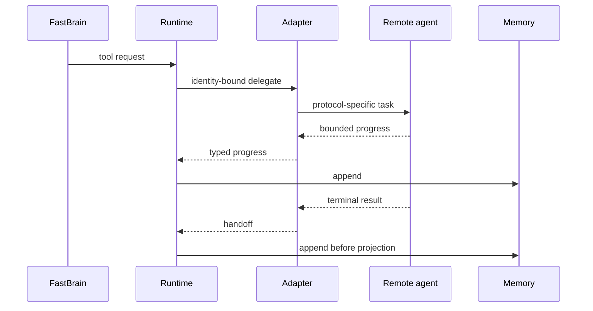

# Agent-to-Agent Boundaries

Nova Audio Agent treats a remote agent like any other executor: a manifest declares its public
operations, the adapter owns its protocol, and Runtime sees only typed progress and a terminal
handoff.

Protocol authentication, retries, cancellation, and response validation belong inside the adapter.
The remote side cannot bypass host authorization, memory, Surrogate, or Floor. This keeps remote
capabilities replaceable without creating another conversational authority.
