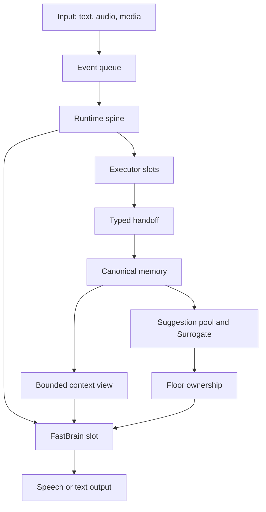

# Architecture

Nova Audio Agent is organized around a continuous event loop rather than a turn-bound tool loop.
The runtime accepts user input, dispatches work, receives progress or terminal handoffs, writes the
result to memory, and independently decides whether another response is useful.

## Core modules

| Module | Responsibility |
|---|---|
| `runtime/src/causal-runtime.ts` | Event application, dispatch, single-flight slots, wake routing, delegate identity/deadline/terminal state, and the `ExecutorAdapter` port |
| `runtime/src/memory.ts` | Append-only channel memory plus structured intent, goal, and authorization |
| `runtime/src/context-view.ts` | The bounded model-facing view of current state |
| `runtime/src/floor.ts` | Exclusive ownership of the user-facing speaking path |
| `runtime/src/ports.ts` | Executor manifests, operation contracts, requests, and typed handoffs |
| `runtime/src/assembly.ts`, `production-realtime-assembly.ts` | Configuration-driven construction of runtime, executor, and realtime graphs; dispatches `integrated` vs `cascaded` |
| `runtime/src/realtime/` | Provider transports, correlation, playback fencing, recovery, and telemetry |
| `runtime/src/codex-*.ts` | Codex app-server transport and contract, plus the Workspace/Session project store (`codex-project-store.ts`) |
| `runtime/src/workspace-graph/` | Opt-in durable workspace memory graph: store worker, identity, projector, recall, context budgeter, provider seam |
| `runtime/src/executors/` | Deterministic simulators and adapter implementations |

## Executor boundary

An executor declares a manifest containing its operations, input schema, deadline, trust level, and
channel policy. Assembly exposes only manifests selected by configuration. Runtime binds each tool
request to a delegate identity before dispatch and accepts progress or completion only for that
identity. An executor cannot write structured user intent and cannot speak directly.

## Memory and attention

All observations reach canonical memory before conversational projection. User-awaited work wakes
FastBrain directly. Eligible unsolicited observations (channels whose policy allows suggestions)
first become pooled suggestions and pass through the Surrogate attention policy; urgent monitors
such as Guard bypass the pool and wake FastBrain directly.

Floor is not a mutex but a three-way arbiter: for every speech attempt it rules `allow`, `preempt`,
or `defer`, comparing the priority bound to the triggering event against the priority of whatever
is currently speaking. Priorities are assigned by the runtime, never by the model — user input is
fixed at 100, the Guard monitor at 90, active executors at 50, and ambient observations at 40 — so
a model cannot escalate its own urgency. On the text path a `preempt` verdict is bookkeeping (there
is no audio to cut); on the realtime path only channels at or above the preemption band (today only
Guard) actually cancel in-flight speech, and a hit never interrupts the user. A deferred utterance
is not dropped: it lands in the suggestion pool, where a fired entry cools down and re-arms only
when new evidence arrives on its channel.

## Workspaces and Sessions

The Codex project surface is a two-level durable store (`runtime/src/codex-project-store.ts`): a
Workspace is an isolated filesystem/Git project with its own `CODEX_HOME`, and a Session is a
resumable Codex thread bound to exactly one Workspace. Voice-driven create, switch, and resume are
staged propose-and-confirm mutations that fail closed on rejection, ID mismatch, or replay, and a
registry admits only one live Orb owner at a time (a second Orb fails with `state_busy`). The
complete discovery, confirmation, switching, persistence, and recovery contract is in
[Multi-project Workspace handoff](multi-project-workspace-handoff.md).

Maintenance of managed workspaces is a host surface rather than a voice capability. Nova Desktop
can open the active managed workspace, or clear the active one or every managed workspace behind
two confirmation dialogs; clearing empties directories while the project record, display name,
Codex history, and Session metadata survive, so the store stays authoritative over the filesystem.

## Workspace memory graph (opt-in)

The Node runtime carries an opt-in durable workspace memory graph
(`runtime/src/workspace-graph/`): a SQLite store on a worker thread, identity resolution for
spoken workspace names, deterministic projection of confirmed lifecycle events into weak relation
cards, and bounded recall. Graph context reaches model calls only through fixed budgets — a
bounded header and a recall pack of at most two hints — and is marked low-authority: it can never
authorize a workspace switch. The memory layering rationale is in the
[v3 memory volume](archs/v3/02-memory.md) and the context rules in the
[context-view volume](archs/v3/03-context-view.md).

## Platform notes

The runtime and desktop client carry win32, darwin, and linux code paths, with per-platform
packaging targets (macOS, Windows NSIS, Linux AppImage/deb). Native echo-cancelled audio capture
(VoiceProcessingIO) exists on macOS only; Windows and Linux use Chromium's audio stack, and both
camera paths use Chromium's capture pipeline on every platform. Cross-platform CI and hardware
validation status is tracked honestly in [Project status](status.md).

Desktop settings apply as a transaction rather than live. Panel edits accumulate as drafts inside
the Settings window; an explicit save writes them, refreshes resolved configuration, and performs
exactly one controlled backend restart. The runtime therefore never observes a half-applied
configuration, and the palette commits on that same boundary instead of mutating a running session.

## Realtime path

The realtime service translates provider events into host events while preserving provider response
identity, playback generation, and delegate identity. Renderer acknowledgements fence audio clear
and completion. Recovery injects bounded host-owned facts rather than replaying arbitrary provider
state.

The top-level pipeline shape is selected by `production-realtime-assembly.ts` from
`pipeline_mode`. `integrated` (the default) runs one realtime speech-to-speech model — today Qwen
realtime only. `cascaded` composes injectable endpointing, ASR, LLM, and TTS ports; today's
provider matrix is Volcengine ASR, a Qwen (`qwen-flash`) or Ark LLM, Volcengine TTS, and an `auto`
endpointing stage that probes a LiveKit-style v1-mini turn detector with a bounded-silence
fallback. There is no automatic provider failover.

Two assembly differences distinguish this path from the text CLI. First, there is no separate
FastBrain model call: the realtime provider model itself fills the FastBrain role (the code calls
this port the realtime front brain), reading the same host-compiled context and tool schemas.
Second, the Codex executor is assembled on its live app-server backend, which adds the
`codex.steer` operation for same-turn steering, and the read-only `memory.recall` tool is exposed.
Neither is exposed by the text CLI; steering is also reachable through the explicit
`build_codex_live_assembly` entry point used by live evaluations.

## Security boundaries

- Configuration errors never echo secret values.
- External search and visual content are evidence, never instructions.
- Desktop renderers use context isolation, sandboxing, and a narrow preload bridge.
- Codex workspaces are validated before use.
- Local recordings, runtime data, caches, and credentials are excluded from Git.

The design rationale is expanded in the [v3 series](archs/v3/00-overview.md).
