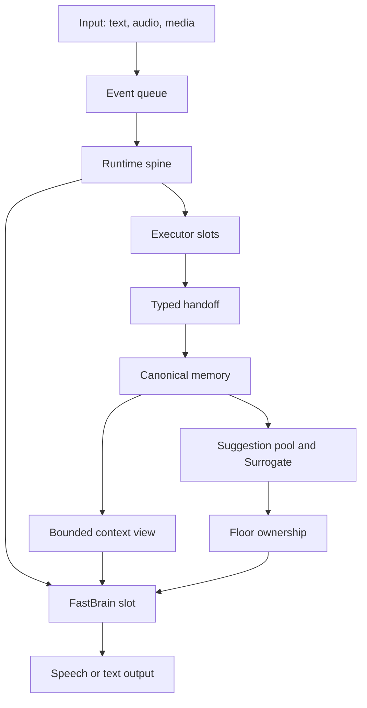

# Architecture

Nova Audio Agent is organized around a continuous event loop rather than a turn-bound tool loop.
The runtime accepts user input, dispatches work, receives progress or terminal handoffs, writes the
result to memory, and independently decides whether another response is useful.

## Core modules

| Module | Responsibility |
|---|---|
| `runtime.py` | Event application, dispatch, wake routing, and lifecycle coordination |
| `slots.py` | Single-flight scheduling for model and executor work |
| `delegates.py` | Identity, deadlines, and terminal state for dispatched work |
| `memory/` | Append-only channel memory plus structured intent, goal, and authorization |
| `context_view.py` | The bounded model-facing view of current state |
| `floor.py` | Exclusive ownership of the user-facing speaking path |
| `ports.py` | Executor manifests, operation contracts, requests, and typed handoffs |
| `assembly.py` | Configuration-driven construction of runtime and executor graphs |
| `realtime/` | Qwen transport, correlation, playback fencing, recovery, and telemetry |

## Executor boundary

An executor declares a manifest containing its operations, input schema, deadline, trust level, and
channel policy. Assembly exposes only manifests selected by configuration. Runtime binds each tool
request to a delegate identity before dispatch and accepts progress or completion only for that
identity. An executor cannot write structured user intent and cannot speak directly.

## Memory and attention

All observations reach canonical memory before conversational projection. User-awaited work wakes
FastBrain directly. Eligible unsolicited observations (channels whose policy allows suggestions)
first become pooled suggestions and pass through the Surrogate attention policy; urgent monitors
such as Guard bypass the pool and wake FastBrain directly.

Floor is not a mutex but a three-way arbiter: for every speech attempt it rules `allow`, `preempt`,
or `defer`, comparing the priority bound to the triggering event against the priority of whatever
is currently speaking. Priorities are assigned by the runtime, never by the model — user input is
fixed at 100, the Guard monitor at 90, active executors at 50, and ambient observations at 40 — so
a model cannot escalate its own urgency. On the text path a `preempt` verdict is bookkeeping (there
is no audio to cut); on the realtime path only channels at or above the preemption band (today only
Guard) actually cancel in-flight speech, and a hit never interrupts the user. A deferred utterance
is not dropped: it lands in the suggestion pool, where a fired entry cools down and re-arms only
when new evidence arrives on its channel.

## Realtime path

The realtime service translates provider events into host events while preserving provider response
identity, playback generation, and delegate identity. Renderer acknowledgements fence audio clear
and completion. Recovery injects bounded host-owned facts rather than replaying arbitrary provider
state.

Two assembly differences distinguish this path from the text CLI. First, there is no separate
FastBrain model call: the realtime provider model itself fills the FastBrain role (the code calls
this port the realtime front brain), reading the same host-compiled context and tool schemas.
Second, the Codex executor is assembled on its live app-server backend, which adds the
`codex.steer` operation for same-turn steering, and the read-only `memory.recall` tool is exposed.
Neither is exposed by the text CLI; steering is also reachable through the explicit
`build_codex_live_assembly` entry point used by live evaluations.

## Security boundaries

- Configuration errors never echo secret values.
- External search and visual content are evidence, never instructions.
- Desktop renderers use context isolation, sandboxing, and a narrow preload bridge.
- Codex workspaces and AutoGLM endpoints are validated before use.
- Local recordings, runtime data, caches, and credentials are excluded from Git.

The design rationale is expanded in the [v3 series](archs/v3/00-overview.md).
