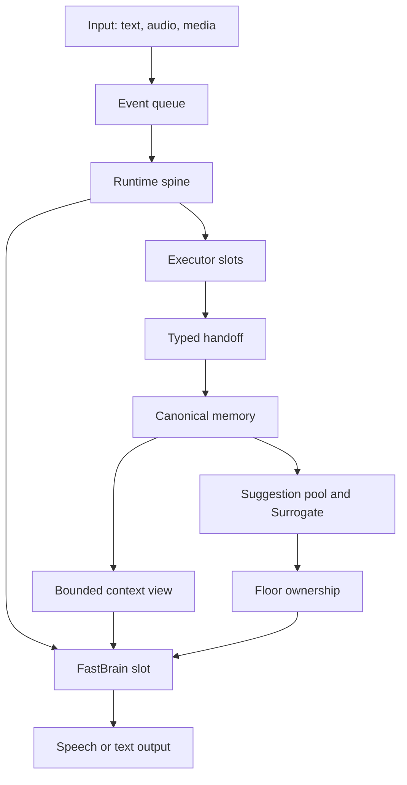

# Architecture

Nova Audio Agent is organized around a continuous event loop rather than a turn-bound tool loop.
The runtime accepts user input, dispatches work, receives progress or terminal handoffs, writes the
result to memory, and independently decides whether another response is useful.

## Core modules

| Module | Responsibility |
|---|---|
| `runtime.py` | Event application, dispatch, wake routing, and lifecycle coordination |
| `slots.py` | Single-flight scheduling for model and executor work |
| `delegates.py` | Identity, deadlines, and terminal state for dispatched work |
| `memory/` | Append-only channel memory plus structured intent, goal, and authorization |
| `context_view.py` | The bounded model-facing view of current state |
| `floor.py` | Exclusive ownership of the user-facing speaking path |
| `ports.py` | Executor manifests, operation contracts, requests, and typed handoffs |
| `assembly.py` | Configuration-driven construction of runtime and executor graphs |
| `realtime/` | Qwen transport, correlation, playback fencing, recovery, and telemetry |

## Executor boundary

An executor declares a manifest containing its operations, input schema, deadline, trust level, and
channel policy. Assembly exposes only manifests selected by configuration. Runtime binds each tool
request to a delegate identity before dispatch and accepts progress or completion only for that
identity. An executor cannot write structured user intent and cannot speak directly.

## Memory and attention

All observations reach canonical memory before conversational projection. User-awaited work wakes
FastBrain directly. Unsolicited observations first become suggestions and pass through the
Surrogate attention policy. Floor ownership prevents competing model calls from speaking at once.

## Realtime path

The realtime service translates provider events into host events while preserving provider response
identity, playback generation, and delegate identity. Renderer acknowledgements fence audio clear
and completion. Recovery injects bounded host-owned facts rather than replaying arbitrary provider
state.

## Security boundaries

- Configuration errors never echo secret values.
- External search and visual content are evidence, never instructions.
- Desktop renderers use context isolation, sandboxing, and a narrow preload bridge.
- Codex workspaces and AutoGLM endpoints are validated before use.
- Local recordings, runtime data, caches, and credentials are excluded from Git.

The design rationale is expanded in the [v3 series](archs/v3/00-overview.md).
