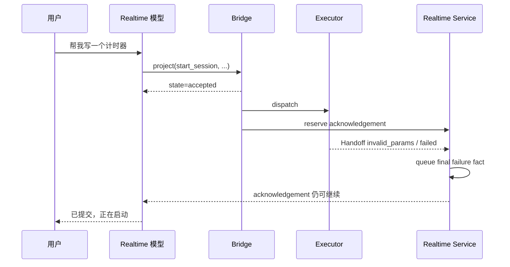

# Codex 工作区路由、请求准入与回执生命周期问题

状态：Review Draft

日期：2026-08-27

证据快照：`memory-board-2026-08-27T04-29-50-454Z.json`

## 1. 摘要

这次问题不是单个“工作区没创建成功”，而是三个边界同时失效：

1. 路由提示词和评测样例对“俄罗斯方块”过拟合，把一个具体示例写成了生产规则；
2. 同名 Workspace 被存储层正确拦截后，系统没有进入“复用、切换或另建副本”的可恢复流程，而是统一记为
   `failed`；
3. Realtime bridge 只校验 JSON Schema 的表层字段，忽略 `oneOf` 的 action-specific 约束，导致无效请求先被
   当作异步任务接收并生成“已提交、正在启动”回执，随后才被执行器以 `invalid_params` 拒绝。

因此，用户看到的是一条互相矛盾的链路：系统先说任务已经提交，Codex channel 同时记录失败，后续又把并不
存在的任务当作“仍在启动”。当前状态快照也确认只有 `tetris-game` 和 `nova-audio-agent` 两个 Workspace，
不存在计时器 Workspace 或计时器 Session。

推荐同时修复四个因果点，而不是继续追加名词映射或文案补丁：

- 用与具体应用名无关的路由优先级替换“俄罗斯方块 → `create_workspace`”规则；
- 把同名冲突转换为结构化、可恢复的 Workspace resolution；
- 让 bridge 与 executor 复用同一个 action-specific `validate_and_normalize` 准入契约；
- 在 terminal failure 到达时撤销尚未播报的乐观回执，并以真实 `started/working` 事件作为“已经开始”的边界。

本方案保留存储层唯一性保护，不覆盖现有 Workspace，也不默认创建带后缀的重复副本。

## 2. 本次现场发生了什么

### 2.1 时间线

| 时间（相对秒） | 事实 | 结论 |
| ---: | --- | --- |
| 13.879 | 用户：“帮我写一个俄罗斯方块。” | 用户提出开发请求，没有明确要求新建同名副本 |
| 15.472 | Codex：`workspace_name_conflict`，`outcome=failed` | 系统尝试创建已存在的 Workspace，被唯一性保护拦截 |
| 18.920 | Nova：“我来帮你创建一个俄罗斯方块游戏的工作区。” | 在失败已经发生后仍使用了执行中措辞 |
| 27.222 | Nova：“名称已经存在，让我先查看工作区会话。” | 口头承诺了恢复动作，但 Codex channel 中没有后续 list/select/start 操作 |
| 53.819 | 用户：“帮我写一个计时器。” | 在 Tetris 为当前 Workspace 时提出明显独立的新交付物 |
| 55.102 | Codex：`invalid_params`，`op=project`，`outcome=failed` | project 请求进入执行器后被严格参数校验拒绝 |
| 59.230 | Nova：“在当前的 tetris-game 工作区中创建一个新的计时器开发会话。” | 路由把独立应用错误归入当前 Tetris Workspace |
| 68.436 | Nova：“已经提交……任务正在启动中。” | 异步乐观回执在 terminal failure 之后仍被播报 |
| 87.756 | 用户再次要求写计时器 | 用户重试未完成的请求 |
| 95.071 | Nova：“当前已经有一个计时器开发任务在启动。” | 把旧回执误当成权威任务状态，形成幽灵任务 |

### 2.2 Codex section 中两个 `failed` 分别是什么意思

| 代码 | 当前真实含义 | 是否产生了副作用 | 当前呈现的问题 |
| --- | --- | --- | --- |
| `workspace_name_conflict` | 同名 Workspace 已存在，创建前置条件不满足 | 没有覆盖或新建 Workspace | 可恢复的领域拒绝被压成通用 `failed` |
| `invalid_params` | `project` 请求不满足对应 action 的字段契约 | 没有成功创建或启动 Session | 请求已被 bridge 接单并生成回执，拒绝发生得太晚 |

第一个错误说明唯一性 guard 生效了，不是存储损坏。真正的问题是上游不该重复创建，且冲突发生后没有恢复
策略。第二个错误说明请求没有通过执行器准入；它不代表 Codex app-server 启动后执行失败。

## 3. 证据与置信度

### 3.1 已证实事实

- Python 与 TypeScript 的生产提示词都包含具体规则：用户说“俄罗斯方块的小游戏”时使用
  `create_workspace`：
  - `src/nova_audio_agent/realtime/qwen.py:106-107`
  - `runtime/src/realtime/qwen.ts:120-121`
- 该规则由提交 `3d6a54e9` 引入；同一提交还增加了固定的俄罗斯方块路由评测样例。生产规则与评测输入共享
  具体名词，存在明显的 eval overfitting。
- `create_workspace` 在写入前调用唯一性检查；同名时抛出 `workspace_name_conflict`：
  - `src/nova_audio_agent/executors/codex_projects.py:788-790`
  - `runtime/src/codex-project-store.ts:2247-2251`
- `project` schema 用 `oneOf` 定义 action-specific 字段；其中 `start_session` 必须有 `work_order`，可以有
  `session`，但不能有 `workspace`：
  - `src/nova_audio_agent/executors/codex_project_live.py:76-123`
  - `runtime/src/codex-contract.ts:107-145`
- Realtime bridge 的 `_valid_params` / `validParams` 只检查顶层 `properties`、`required`、
  `additionalProperties` 和字段基础类型，没有处理 `oneOf`：
  - `src/nova_audio_agent/realtime/bridge.py:344-359`
  - `runtime/src/realtime/bridge.ts:536-560`
- Executor 的 `_normalize_project_request` 会再次按 action 严格检查字段集合，并拒绝多余字段：
  `src/nova_audio_agent/executors/codex_project_live.py:782-823`。
- 用当前代码直接验证一个代表性请求：

  ```python
  bad = {
      "action": "start_session",
      "workspace": "tetris-game",
      "work_order": "写一个计时器",
  }

  _valid_params(bad, PROJECT.params)          # True
  _normalize_project_request(bad)             # None
  ```

- `start_session` 被归为异步操作。bridge 在 dispatch 后立即向模型返回 `{"state":"accepted"}`，并创建
  `delegation_acknowledgement`：
  - `src/nova_audio_agent/realtime/bridge.py:149-176`
  - `runtime/src/realtime/bridge.ts:227-260`
- Semantic acknowledgement 会生成“Codex 已提交，正在启动”事实：
  - `src/nova_audio_agent/realtime/service.py:2438-2464`
  - `runtime/src/realtime/service.ts:1133-1158`
- Handoff failure 会把 delegate 标记为 failed 并另行排队 final fact，但当前代码没有按同一 delegate 撤销尚未
  播报的 semantic acknowledgement：`src/nova_audio_agent/realtime/service.py:2685-2750`。
- 通用 Memory outcome 目前只有 `ok | unknown | failed`，无法表达 pre-effect refusal：
  `runtime/src/events.ts:23`。
- 现场之后的持久化状态只包含 `tetris-game` 与 `nova-audio-agent`，不存在 timer Workspace 或 Session。

### 3.2 高置信推断

Memory Board 导出有意不包含原始工具参数，因此无法从导出逐字还原第二个 `project` 请求。结合：

- Nova 明确说要在当前 `tetris-game` 中新建计时器 Session；
- 对应 Codex 结果是 `invalid_params`；
- `start_session + workspace + work_order` 恰好会通过 bridge、被 executor 拒绝；

最可能的请求形状是 `start_session` 携带了不允许的 `workspace`。这个具体字段组合应标记为高置信推断，而
不是导出直接证明的事实。即使实际请求还存在其他字段问题，“bridge 接受 executor 拒绝的请求集合”这一
结构性缺陷已经由直接复现证实，不依赖该推断成立。

## 4. 根本原因

### 4.1 路由规则对评测样例过拟合

生产提示词直接出现“俄罗斯方块”，把一个训练/评测示例升级成了业务规则。这会造成两个问题：

1. 相同语义换成“计时器”“记账应用”或其他名词时，模型不能稳定泛化；
2. 当前 Workspace 已经是 `tetris-game` 时，具体规则仍强推 `create_workspace`，覆盖了“当前目标已经存在”
   这一更高优先级的宿主状态。

这不是文案美观问题，而是把领域实体写进路由控制面。评测随后又固定验证同一个实体，导致测试通过并不能
证明规则可泛化。

### 4.2 同名冲突只有保护，没有恢复协议

存储层拒绝同名创建是必要的，否则可能覆盖、串用或破坏现有项目。当前缺少的是 guard 之前或之后的
resolution：

- 同名 Workspace 就是当前 Workspace 时，应继续在当前项目中处理，而不是再次创建；
- 同名 Workspace 存在但不是当前 Workspace 时，应让用户确认是否切换并在其中开始任务；
- 用户明确要求“另建一份”时，才可以在确认后创建带后缀的新 Workspace。

当前所有情况都落为 `workspace_name_conflict + failed`。这既丢失了可恢复性，也把内部保护误呈现为执行崩溃。

### 4.3 Bridge 与 Executor 存在两个不等价的准入器

Schema 对外宣称的是 action-specific union，但 bridge 实际执行的是一个不支持 `oneOf` 的 schema 子集。
Executor 又用另一套手写 normalizer 执行严格检查。于是同一个请求会经历：

```text
bridge：合法，允许 dispatch
executor：非法，返回 invalid_params
```

这是第二个 `failed` 的直接结构原因。只给提示词再补一句“`start_session` 不要传 workspace”仍然不能修复
这个边界，因为模型、其他 provider 或未来 action 都可能生成 bridge 接受、executor 拒绝的新组合。

### 4.4 “队列接收”被说成“任务已启动”，且 terminal failure 不会撤销它

异步接单回执在 executor 完成准入前就建立。Handoff failure 到达后，服务记录了失败，但没有取消同一
delegate 尚未说出的 acknowledgement 或 continuation。结果形成两个相互竞争的语音事实：



后续模型又把这条乐观回执当成当前状态，因此产生“计时器任务仍在启动”的幽灵任务。

## 5. 为什么 2026-08-27 的确认文案修复没有解决这次问题

提交 `f437b2b` 修复的是 `confirmation_required` 路径：动态 Workspace 名、简洁确认文案和 360 秒有效期。
本次两个操作都没有进入成功的确认流程：

- Tetris 创建在准备 proposal 之前就因同名被拒绝；
- timer 被路由为当前 Workspace 的 `start_session`，该 action 本来就是异步且不需要创建 Workspace 的确认。

因此确认文案与 TTL 修复本身仍然有效，但它与这次的路由、准入和回执问题正交。

## 6. 设计目标与不变量

### 6.1 目标

1. 相同语义只因交付物名词不同，不应改变 Workspace/Session 路由类别；
2. 同名 Workspace 不被覆盖，也不把可恢复冲突展示为普通执行失败；
3. bridge 接受的请求必须满足 executor 的同一份 action-specific 契约；
4. 只有真实到达 `started/working` 边界后，系统才能说“已经开始处理”；
5. terminal failure 到达后，不得再播报同一 delegate 的未交付成功回执；
6. Python 与 TypeScript runtime 行为一致，并由同一组差分 fixture 约束。

### 6.2 不变量

- 不覆盖已有 Workspace；
- 不因冲突自动删除、重命名或修改现有 Workspace；
- 不在用户没有明确表达“另建一份”时静默创建 `name (2)`；
- 跨 Workspace 切换仍然需要现有 proposal/confirmation 授权边界；
- tool protocol receipt、任务准入、Codex started 和任务完成是四个不同事实，不互相冒充。

## 7. 方案比较

| 方案 | 优点 | 缺点 | 结论 |
| --- | --- | --- | --- |
| 只改提示词，删除“俄罗斯方块”示例 | 改动最小 | 冲突恢复、双重校验和错误回执仍然存在 | 不足以作为完整修复 |
| 冲突时自动生成 `name (2)` | 避免表面失败 | 静默复制项目，可能绕开已有工作和用户意图 | 默认不采用，仅用于用户明确要求副本 |
| 冲突时无条件复用已有 Workspace | 不产生重复目录 | 可能把新任务写进用户不想修改的旧项目 | 仅在同名目标就是当前 Workspace 时自动复用 |
| 通用路由 + 上下文恢复 + 单一准入 + 回执 fencing | 同时修复四条因果链，行为可测试 | 涉及 prompt、contract、service 和事件呈现 | 推荐 |

## 8. 推荐设计

### 8.1 用通用优先级替换具体名词映射

生产规则只表达关系，不出现具体应用名：

1. 用户明确说“当前项目、这个项目、在现有项目里”时，使用当前 Workspace 的 `start_session`；
2. 用户表达一个独立应用、服务或仓库，且没有把它关联到当前项目时，使用 `create_workspace`；
3. 用户指向历史项目或命名 Workspace 时，先 resolve/list，再 select/resume，不猜测；
4. 新请求与当前 Workspace 的目标名称或身份相同，优先进入同名恢复流程，不再次创建；
5. “再建一份、独立副本、新仓库”等明确隔离语义，才允许创建带后缀副本。

例如，在当前 Workspace 为 `tetris-game` 时：

| 用户表达 | 预期动作 |
| --- | --- |
| “继续做俄罗斯方块” | resolve 当前项目，继续或新建 Session，不创建 Workspace |
| “给当前俄罗斯方块加一个计时器” | 当前 Workspace 中 `start_session` |
| “写一个计时器应用” | 创建独立 timer Workspace |
| “再建一份俄罗斯方块，和现在的分开” | 确认后创建带后缀的独立 Workspace |

路由评测应使用多组可替换实体，并增加 metamorphic case：只替换交付物名词时，路由类别不变；改变“当前
项目/独立应用/历史项目”的关系词时，路由类别才改变。

### 8.2 将同名冲突变为 Workspace resolution

在 `create_workspace` 的最终持久化写入之前做结构化解析：

| 解析结果 | 行为 |
| --- | --- |
| 没有同名 Workspace | 走现有 create confirmation |
| 同名且就是当前 Workspace，用户未要求副本 | 复用当前 Workspace 并 `start_session`；不跨边界，不再创建 |
| 同名但不是当前 Workspace，用户未要求副本 | 创建 `reuse_existing_workspace` proposal，确认后切换并开始任务 |
| 同名且用户明确要求独立副本 | 生成唯一候选名，展示实际名称，确认后创建 |
| commit 前发生并发同名竞争 | 返回 recoverable refusal，重新 resolve；绝不覆盖 |

`reuse_existing_workspace` 应是一个宿主拥有的复合 proposal：一次确认原子地表达“切换到已存在的
Workspace，并使用原始 work order 启动新 Session”。这样不会让用户确认切换后还要重说任务，也不会让
模型自行拼接两条授权强度不同的操作。

存储层现有 `_require_unique_workspace_name` / `requireUniqueWorkspaceName` 继续作为最后一道竞态保护。现有
`_unique_workspace_name` / `uniqueWorkspaceName` 只在用户已明确选择“另建副本”后使用。

### 8.3 建立单一的 action-specific 准入契约

每个 operation 只保留一个可执行的 `validate_and_normalize(request)`，同时生成或对应公开 schema：

```text
provider tool call
      │
      ▼
manifest-owned validate_and_normalize
      │
      ├── rejected ──► tool refusal（不 dispatch、不建 delegate、不生成 ack）
      │
      └── admitted normalized request
                      │
                      ▼
                  runtime dispatch
                      │
                      ▼
                   executor
```

建议落点：

- Python：把 `_normalize_project_request` 从 adapter 私有函数提取到 Codex project contract 模块；bridge 与
  executor 调用同一函数；
- TypeScript：复用现有 `validateCodexRequest('project', ...)` 的严格 action 校验，不再让通用
  `validParams` 作为 Codex project 的最终准入器；
- `validParams` 仍可服务简单 schema，但遇到含 `oneOf` 的 schema 时必须完整支持或拒绝降级，不能静默忽略；
- 增加 Python/TypeScript oracle fixture，证明所有 action 的合法/非法字段组合完全一致。

Executor 保留防御性复验，但必须调用同一个 contract，而不是复制第二套规则。bridge 拒绝的请求不创建
delegate，也不写入 Codex channel 的 terminal failure。

### 8.4 把回执拆成 admission、started 和 terminal 三个阶段

建议状态语义：

| 阶段 | 可说内容 | 禁止内容 |
| --- | --- | --- |
| protocol receipt | 工具调用已收到 | 已提交、正在启动 |
| admitted/queued | 请求已通过校验并进入队列 | Codex 已开始处理 |
| started/working | Codex 已开始处理 | 已完成 |
| terminal | 已完成 / 未执行 / 执行失败 | 继续引用旧的进行中状态 |

具体规则：

1. Semantic acknowledgement 只能在统一准入成功后创建；
2. `Handoff(outcome != ok)` 到达时，按 delegate ID 取消尚未交付的 acknowledgement、continuation 和相关
   queued host fact；
3. 如果 acknowledgement 已经真实播报，后续失败可以单独报告，但必须说“启动失败/未执行”，不能继续说
   “正在启动”；
4. “正在启动/处理中”只能由 executor 的 `started/working` 或 Codex thread-ready 事实触发；
5. terminal fact 成为该 delegate 的权威状态，后续模型上下文不能仅凭旧回执推断 running。

这沿用现有“一个事实一个 reply owner”的原则：未交付的乐观回执和 terminal failure 不能同时拥有播报权。

### 8.5 区分 recoverable refusal 与 execution failure

建议将通用 outcome 扩展为：

```text
ok | refused | unknown | failed
```

- `refused`：执行前拒绝，没有产生目标副作用，可能通过用户选择或修正请求恢复；
- `failed`：请求已被准入并进入执行，随后发生终止性失败；
- `unknown`：无法证明是否成功；
- `ok`：操作完成。

`workspace_name_conflict` 在并发竞态等无法提前 resolve 的情况下应投影为 `refused`，并携带
`recoverable=true` 与下一步 resolution 信息。`invalid_params` 若在 bridge 准入阶段发现，应作为 tool
refusal 返回，不创建 Codex delegate；若内部仍出现 executor-side `invalid_params`，应被当作 contract drift
告警，而不是普通用户错误。

Board/UI 对 `refused` 显示“需要选择”或“未执行”，而不是红色“失败”。这项 schema 变更需要同步 Python、
TypeScript、Memory codec、desktop wire 和 fixture；不能只在前端按错误字符串打补丁。

## 9. 预期数据流

### 9.1 独立计时器应用

```text
用户：“写一个计时器应用”
  → 通用路由判定为独立交付物
  → create_workspace(timer-app, work_order)
  → 宿主返回动态名称的 confirmation_required
  → 用户确认
  → 原子创建 Workspace + Session
  → executor started/thread-ready
  → 才播报“Codex 已开始处理”
```

### 9.2 当前已存在的 Tetris Workspace

```text
当前 Workspace：tetris-game
用户：“继续做俄罗斯方块”
  → resolve 命中当前 Workspace
  → start_session(work_order)，不带 workspace
  → 单一 contract 准入
  → executor started/thread-ready
  → 播报进行中状态
```

### 9.3 同名但非当前 Workspace

```text
用户请求目标与历史 Workspace 同名
  → resolve 命中非当前 Workspace
  → proposal：是否切换到已有 Workspace 并开始任务
  → 用户确认
  → 原子切换 + start_session
```

## 10. 预计改动范围

| 组件 | 主要改动 |
| --- | --- |
| `src/nova_audio_agent/realtime/qwen.py` / `runtime/src/realtime/qwen.ts` | 删除具体名词映射，加入通用路由优先级 |
| Codex routing evals | 改为多实体、关系驱动和 metamorphic corpus，避免生产 prompt 与固定样例互相拟合 |
| Codex project contract | 提取/复用 action-specific `validate_and_normalize`，增加 resolution/proposal 结构 |
| Realtime bridge | 准入失败时不 dispatch、不建 delegate、不生成 acknowledgement |
| Codex project adapter/store | 同名预解析、复用 proposal；唯一性 guard 保持为 commit-time 保护 |
| Realtime service | terminal failure 按 delegate fencing 未交付回执；started 事实拥有进行中措辞 |
| Events / Memory / desktop wire | 增加 `refused` 并显示为“未执行/需要选择” |
| Python/TypeScript parity fixtures | 覆盖 action 组合、resolution 和 lifecycle 顺序 |

## 11. 测试策略

### 11.1 路由测试

- 当前为 `tetris-game`，用户说“继续做俄罗斯方块”：不调用 `create_workspace`；
- 当前为 `tetris-game`，用户说“写一个计时器应用”：创建独立 Workspace；
- 用户说“给当前俄罗斯方块加计时器”：在当前 Workspace `start_session`；
- 替换为记账应用、博客、日志服务等实体时，关系相同则动作类别相同；
- 用户说“另建一份”：允许确认后创建唯一后缀名；没有该表达时禁止静默后缀。

### 11.2 准入测试

- 所有 action 的 required/allowed 字段做表驱动测试；
- `start_session + workspace` 在 bridge 前置拒绝，除非未来 contract 明确改变；
- 前置拒绝后：无 delegate、无 dispatch、无 Codex failed item、无 semantic ack；
- Python 与 TypeScript 对同一 fixture 返回完全相同的 normalized request 或 error。

### 11.3 生命周期测试

- async delegate 在 ack 播报前 terminal failure：只播报失败/未执行，不播报“已提交、正在启动”；
- ack 已播报后 terminal failure：允许一次明确失败收尾，不再显示 running；
- `started/working` 前禁止“已开始处理”；
- terminal 后重复用户请求不能被旧 acknowledgement 判定为已有任务；
- reconnect、response interruption 和 continuation abandonment 下仍保持单一 reply owner。

### 11.4 冲突与并发测试

- 同名当前 Workspace 自动复用，不触发 unique-name commit；
- 同名非当前 Workspace 生成复用确认，不修改目标直到用户确认；
- confirm 前出现并发同名创建时，commit guard 仍拒绝并重新 resolution；
- 任何路径都不能覆盖或删除已有 Workspace。

## 12. 验收标准

1. 生产提示词中不存在“某个具体交付物名 → 某个工具 action”的规则；
2. 本次导出时间线对应的两条请求不再产生 `workspace_name_conflict/failed` 与
   `invalid_params/failed` 组合；
3. “写一个计时器应用”最终产生独立 timer Workspace，或在确认前明确停在
   `confirmation_required`，不能声称已经创建；
4. 同名 Workspace 不覆盖、不静默复制，并能进入明确的复用/切换/副本选择；
5. bridge 与 executor 的 admissible request set 完全一致；
6. 任意 terminal failure 之后，同一 delegate 不再出现“已提交、正在启动”或“仍在启动”；
7. Board 能区分“执行前拒绝”和“执行失败”；
8. Python/TypeScript parity、realtime lifecycle、Codex project E2E 和 `npm run check` 全部通过。

## 13. 风险与上线顺序

建议分四个可独立验证、但最终一起完成验收的变更：

1. 先统一准入契约并增加 parity fixture，封住“先接单、后判非法”；
2. 再修回执 fencing 与 started 边界，封住幽灵任务；
3. 替换通用路由规则并扩充多实体评测；
4. 最后引入 Workspace resolution 与 `refused` wire 迁移。

主要风险：

- `outcome` 枚举扩展会触及持久化/序列化精确键测试，需要兼容读取旧数据；
- 复合 reuse proposal 必须复用现有 proposal ID、过期和一次性消费机制，不能新开较弱授权路径；
- ack fencing 不能撤销已经真实播放的音频，必须复用现有 delivery proof；
- 路由评测不能只换另一组固定名词，应验证关系变化和实体替换两个维度。

建议新增结构化 telemetry：`project.route_decision`、`project.resolution`、`project.admission_rejected`、
`ack.cancelled_by_terminal` 和 `contract_drift`。上线后重点观察：同名 resolution 成功率、bridge/executor
校验分歧数、terminal 后 ack 数量（目标为 0）以及幽灵 running 状态数（目标为 0）。

## 14. Review 重点

请重点 review 以下两个架构选择：

1. 是否接受宿主拥有的 `reuse_existing_workspace` 复合 proposal，用一次确认原子完成切换与启动任务；本文
   推荐接受，因为它既保留跨 Workspace 授权，又不要求用户重说 work order。
2. 是否将 `refused` 加入通用 outcome，而不是仅由前端把部分 `failed` 字符串改色；本文推荐加入通用
   outcome，因为“执行前拒绝”是跨 executor 的稳定生命周期语义，前端错误码映射会再次制造多套真相。

这两个选择确定后，其余改动可以按本文验收标准拆成实现计划。
