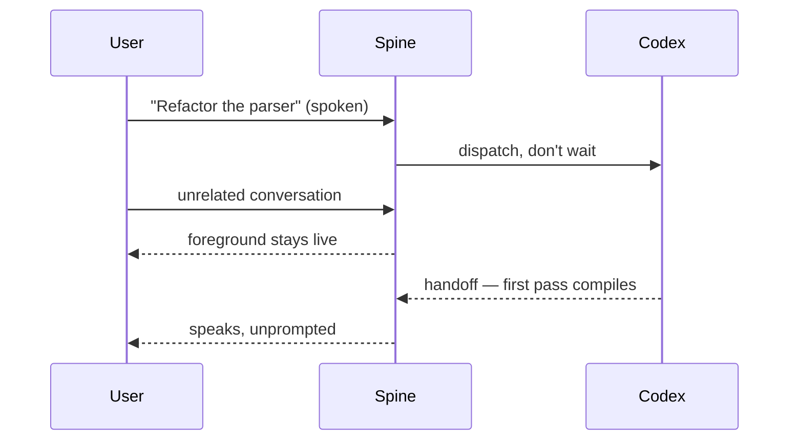
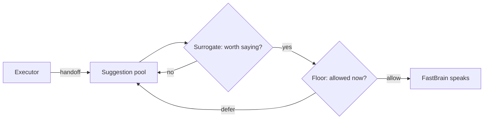
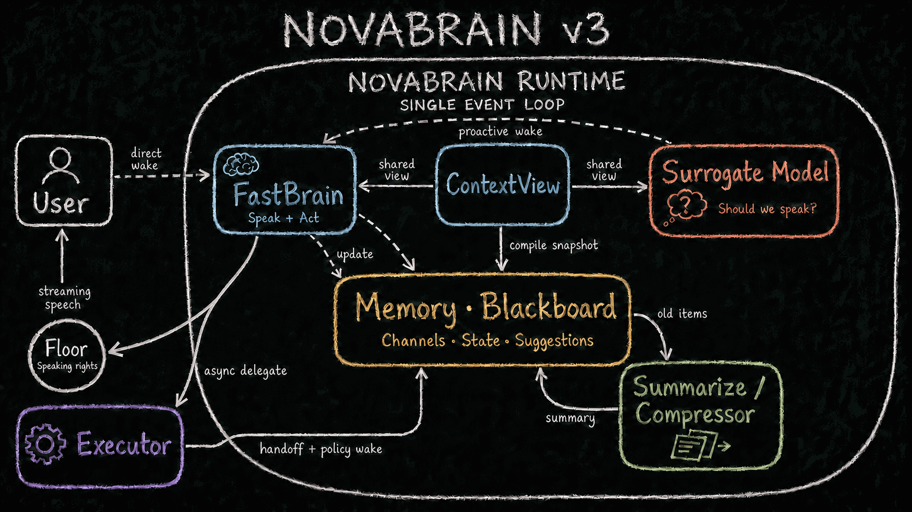
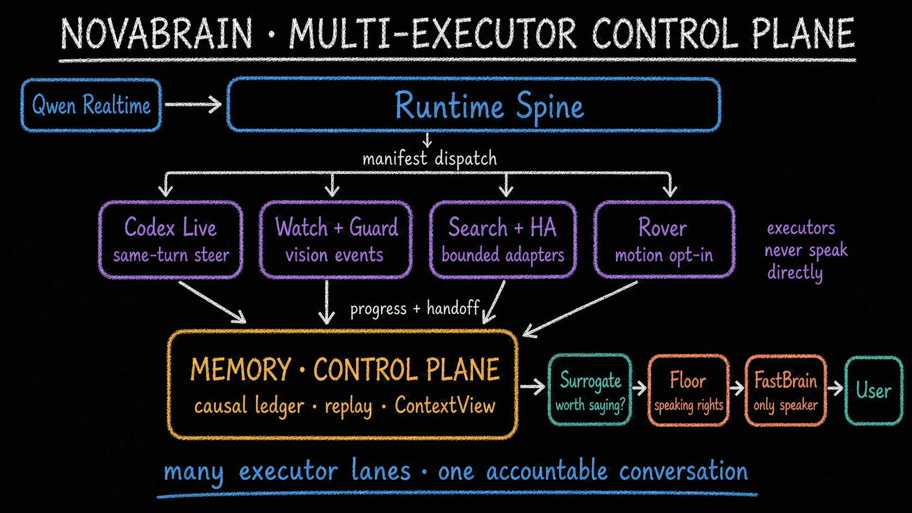

# Building the House the Tenant Will Move Into: A Tradeoff Ruler for Proactive Voice Agents

**What survives when the model finally owns the speak decision itself — and what you should never have built.**

> Distilled from a design session on 2026-08-07. Everything marked *shipped* is shipped and tested;
> everything else is a bet, and the text says which is which.
> Revised 2026-08-12 against the [DuplexLM survey](https://arxiv.org/abs/2606.19453),
> Full-Duplex-Bench v3, and qwen-audio-agent v1.8.2.

## Contents

1. [The tenant](#1-the-tenant) — the end state model we can't train, and the one ruler we measure every component against.
2. [What the tenant will do](#2-what-the-tenant-will-do) — "proactive" is two behaviors an order of magnitude apart; conflating them yields either a pager or a mute.
3. [Where the speak decision lives](#3-where-the-speak-decision-lives) — in the weights, beside them, at the model's interface, or in the harness. The choice is the architecture.
4. [The ruler, applied](#4-the-ruler-applied) — why the harness tier shrinks under a stronger model instead of getting rewritten.
5. [Related work](#5-related-work) — every layer of this has a precedent, and since June a map; the gap survives its nearest neighbor.
6. [What gets furnished first](#6-what-gets-furnished-first) — executor choice is demo strategy, and demo value is not engineering value.
7. [The open question](#7-the-open-question) — the merge our own deferred list is currently arguing against.

## 1. The tenant

The end state we are building toward is a full-duplex, on-device model. It takes in speech, video, and a sense of time; its output labels decide when to speak, when to stay silent, and when to dispatch work. Nobody hands you that model today. The closest published statement of the ambition is Thinking Machines Lab's [interaction models](https://thinkingmachines.ai/blog/interaction-models/) preview — 200 ms micro-turns for continuous input and output, deeper work delegated to an asynchronous background model, results interleaved back into a live conversation — and it is explicit that the behavior comes from joint training, not from orchestration. You cannot reproduce it by rearranging prompts around a model that wasn't trained for it.

We can't train that model. So the useful question is not "how do we fake it convincingly." It is: **what do we build today that still deserves to exist the day that model arrives?**

We answer it with one ruler, applied to every component:

> Once the model gets stronger, does this component shrink, or does it get rewritten? Keep what shrinks; don't build what would get rewritten.

The rest of this post is that ruler applied to a single question: proactivity — an agent that sometimes speaks without being spoken to.

## 2. What the tenant will do

"Proactive" gets used as one word for what are really two behaviors, an order of magnitude apart in granularity.

**Turn-level proactivity** is coarse and command-shaped. You delegate work by voice — "fix this bug," "watch the stove," "remind me at six" — and the agent comes back to you when there is something worth saying. The success criterion is strict and unglamorous: did the right information arrive, attributed to the right task, without being asked twice?

**Utterance-level proactivity** is fine-grained and timing-shaped: interjecting mid-conversation, cutting itself off when you start talking, re-entering at a natural seam. This is where the sense of presence lives. Its success criterion has nothing to do with information delivery — it is whether the timing feels human. "Feels human" is also no longer unfalsifiable: the DuplexLM survey (§5) decomposes it into testable cells — cooperative barge-in, backchannel during system speech, hesitation with long silence, third-party rejection — and those cells are the scorecard vocabulary we adopt for the voice milestone.

Turn-level proactivity is the whole arc of this diagram. Utterance-level proactivity is the timing of the final arrow — *when exactly* the agent is allowed to fire it.

Conflating the two produces bad systems in a predictable way. Optimize for delivery alone and you get a pager: results announced the moment they land, mid-sentence if necessary. Optimize for timing alone and you get an agent that swallows results because there was never a perfect moment. They are different problems with different failure modes, and a design has to name both before it can serve either.

There is a lifecycle decision before either one: *when does progress become something the agent
knows?* A notification-first design waits for a timer or a question, samples current executor
state, and turns that snapshot into a sentence. A memory-first design lets the executor publish
while the work happens, binds that observation to the run that produced it, and stores it before
choosing any presentation. That gives us the rule underneath the rest of this post:

> **Progress is memory before it is speech. Publish once. Decide later. Answer from the same state.**

The point is not to speak more often. It is to separate three judgments: the executor establishes
what happened by publishing to Memory; Surrogate decides whether an eligible ambient change is
worth mentioning when nobody asked; FastBrain answers a user-initiated question from a bounded
ContextView. User input bypasses Surrogate. A `speak=false` verdict is therefore not forgetting —
the observation stays in Memory — and Surrogate is an attention policy, not a recall mechanism.
A later answer and an earlier announcement are two projections of one state, not two independent
attempts to reconstruct what the executor was doing.

The shipped text FastBrain implements both consumption paths. The persistent realtime front brain
implements the Surrogate-to-speech second hop and a narrower user-question read path: injected
progress, active-work recovery, explicit status, and the bounded read-only `memory__recall` query.
Recall restores access to historical evidence without replacing Surrogate. Its mechanism has
deterministic coverage and a bounded Qwen live smoke; extended 20+ turn Orb behavior remains an
explicit acceptance item rather than a guarantee hidden inside the slogan.

## 3. Where the speak decision lives

Both behaviors reduce to one decision made over and over: *speak now, or don't.* There are four places to put that decision, and the choice is the whole architecture. The [DuplexLM survey](https://arxiv.org/abs/2606.19453) maps the same axis as an L0–L3 hierarchy of where the duplex decision is made; its layer names are borrowed below.

**In the weights.** The model owns the decision natively — Thinking Machines' interaction models, and full-duplex speech models generally. By the ruler, this isn't an approximation of the tenant; it *is* the tenant — though the survey's audit shows how thinly the tier is realized in public: several published claims at this level are apparent rather than substantive full-duplex (chunk-boundary transitions, keyword-triggered barge-in), so the tenant is rarer than the banner. And it is not rentable today at the capability level the rest of the product needs; as noted above, orchestration cannot substitute for the joint training. Betting the system on this tier means waiting.

**Beside the weights.** A sidecar module reads the LLM's hidden state and emits the speak decision — the survey's L1, and its most striking audit finding: this shape is a *structural attractor*. MinMo's Full-Duplex Predictor is the type specimen (a single-layer Transformer over the backbone's hidden state, deciding "respond now" vs "keep waiting" in real time), and teams with different goals keep converging on the same geometry — Freeze-Omni for cheap full-duplex, Qwen's Thinker–Talker and Step-Audio R1.1 without claiming full-duplex at all. We cannot build here for a mundane reason: a rented realtime API exposes no hidden state. But hold the shape in mind — it returns in §7 as a candidate landing zone for the merge.

**At the model's interface.** The model emits a per-step tag choosing among response, silence, and delegation. [JoyAI-VL-Interaction](https://github.com/jd-opensource/JoyAI-VL-Interaction) is the closest open implementation: a per-second choice, time-aligned actions, delegated work running asynchronously while the foreground loop continues. It ships, and its trajectory-synthesis recipes are worth borrowing. But the single-choice form has an expressiveness bug you hit in the first hour: *"Dim the living room light for me, and by the way, what's a good movie to watch tonight?"* needs delegation **and** a response in the same step. A single enum forces you to drop one, or to smuggle the second into the payload by convention — which is heuristics leaking back in. We hit exactly this wall, and it is why our fast port's output is [two orthogonal axes](../archs/v3/04-ports.md) — `speak × act`, all nine combinations legal — rather than one three-way tag.

**Outside the model.** Make "should I speak" an explicit, inspectable decision in the harness. This is where we build. Five parts, five one-line contracts:

- **ContextView** — the single layer either model port reads; a pure function compiling the multi-source blackboard into seven fields. Handoffs never arrive as conversation turns.
- **FastBrain** — the only port that ever speaks. Its silence means "I was called and chose not to."
- **Suggestion pool** — executor results never go straight to the mouth; they land in shared memory as candidate things-to-say.
- **Surrogate** — the independent decider for "nobody called me — is anything in the pool worth speaking?" It subscribes to memory, not to user input, and it picks entries; it never generates words.
- **Floor** — speaking-rights arbitration. Three verdicts: `allow`, `preempt`, `defer`. Floor rules before the first token streams, not after.

The verdict worth defending is `defer`. A deferred suggestion is not dropped and not blindly queued — it goes back to the pool with its claim intact, eligible for the next natural seam. Without a third verdict, proactive systems collapse into one of the two failure modes above: noisy (anything worth saying is said now) or mute (anything risky is discarded). `defer` is the third state that lets timing be a policy instead of an accident.

One boundary here is drawn on purpose, and it is easy to misread as an omission. Everything above governs the **onset** of agent speech — whether and when to start. The survey's state machine names a second family of speak decisions, and we deliberately do not put them in the harness: what to do when the user's voice lands on top of the agent's — yield to a floor-claim, keep talking through a backchannel, ignore a third-party voice. Today the rented backbone's interruption handling makes those calls, crudely; a turn-based core cannot tell an "uh-huh" from a barge-in, and the cells it fails have names on the scorecard. By the ruler this is the correct place to leave them: the survey's own audit concludes overlap competence is set by two-channel training data, not by orchestration — a harness-side overlap classifier is precisely the component that would get **rewritten**. The onset half is what today's models cannot decide over our context; the overlap half is tenant territory the backbone already sublets. Floor ruling before the first token is that scoping made explicit, not a limitation discovered later.

## 4. The ruler, applied

Why build at the harness tier when the weights tier is the admitted end state?

Measure the interface tier first. A per-step tag protocol couples the speak decision to one model's training recipe; swap the backbone and the protocol is vocabulary the new model never learned. The survey's training audit reads the same way: every token-level system re-imprints its duplex vocabulary through a multi-stage recipe — repeatable, but it is retraining, and the protocol does not survive the move. By the ruler: **rewritten.**

The hidden-state tier measures almost the same for us today: a sidecar is coupled to one backbone's internal geometry, and a rented API exposes no hidden state to couple to in the first place. It becomes measurable the day the backbone is ours — which is exactly when §7 picks it back up.

Now the harness tier. The day the tenant arrives, the speak decision moves into the model — FastBrain and Surrogate merge into a single port. That merge was [predicted in the design docs](../essence.md) before any of this shipped; the spine — event loop, pool, Floor — doesn't move.

It is worth being precise about what that merge has to overcome, because it isn't the obvious thing. Multi-source plumbing is already solved: both ports compile the *same* ContextView and differ only by prompt, so a handoff from a third executor arrives as a field in a struct, not as a new voice in a transcript. What differs is wake economics. FastBrain sits on the latency path — user speech routes straight to it, deliberately bypassing Surrogate, because otherwise every utterance would pay for a second model call. Surrogate wakes on memory instead, off the critical path and priced differently. Merging them merges two opposing budgets, not two policies. By the ruler: **shrinks** — just not all at once.

*The two wake paths the merge has to reconcile, drawn on the original v3 blackboard. `shared view` runs from ContextView into both ports — that half is already solved. `direct wake` runs from the user straight to FastBrain, deliberately skipping Surrogate. Merging the ports means merging those, not merging two policies.*

Two further properties fall out, one shipped and one a bet:

1. *Backbone independence, within the turn-based class* (shipped). Our current voice backbone is a turn-based realtime model — the duplex feel is engineered around a turn-based core — and the arbitration layer neither knows nor cares which turn-based backbone sits under it: swapping one for another touches the port implementation, not the decision layer. The claim stops at the duplex boundary, by our own reasoning: a true full-duplex backbone carries the overlap decisions inside its token stream, and absorbing one reaches the Floor contract itself — the same argument the [deferred list](../archs/v3/08-deferred.md) makes against swallowing a continuous multimodal session as a port swap. Candidates exist and newer ones keep appearing; we have not measured them yet, and crossing over is a re-decision, not a swap.
2. *The decision layer is a measurement instrument* (bet). Every `allow` / `defer` / `preempt` verdict is an explicit decision with a runtime-bound trigger and priority. But "logged and replayable" is currently weaker than it sounds, and the gap is registered where the [replay contract](../archs/v3/06-verification.md) lives: trace replay today is a syntactic round trip, and a Floor grant is reserved in place rather than reified as a trace event. Cashing the bet means promoting verdicts to first-class logged events first — you cannot audit a decision that was never reified, and that cuts against our own reservation until it is paid. Once it is, the corpus is exactly the evidence needed to test whether a model can take over the job. If the bet is right, the arbitration layer's last useful act will be grading its own replacement.

## 5. Related work

Every layer of this has a precedent — and since June, a map. What we could not find, after checking the map's nearest neighbors, is a test that runs the layers at the same time.

The map is the [DuplexLM survey](https://arxiv.org/abs/2606.19453): an L0–L3 hierarchy of where the duplex decision is made, an interaction ontology of timing × intent × response, and a five-state decision machine, audited across the published systems. Three of its findings do work for this post. The harness tier is its L0, and the survey's verdict on L0 is *contested rather than legacy* — a 2025–26 modular wave (FireRedChat, FlexDuo, SoulX-Duplug, the X-Talk position paper) argues the tier is competitive on latency, interpretability, and engineering cost, not a waiting room in front of the weights. Its 210-cell ontology contains no delegation axis at all. And proactive initiation appears in the entire framework as a single transition fired by a silence timer. The two dimensions this post is about are, on the field's own map, its thinnest regions.

The weights tier and the interface tier each have an exemplar. Thinking Machines Lab's [interaction models](https://thinkingmachines.ai/blog/interaction-models/) preview is the weights tier and the clearest published statement of the two-loop shape — a foreground loop at conversational latency, deeper work handed to a background model, results interleaved back. It is also explicitly attributed to joint training, which is why there is nothing in it for orchestration to copy, and why the harness tier has to exist at all. [JoyAI-VL-Interaction](https://github.com/jd-opensource/JoyAI-VL-Interaction) is the interface tier and the closest thing to a working reference: a per-step choice among responding, staying silent, and delegating, time-aligned to the input stream, with the foreground loop continuing while delegated work runs. Its [technical report](https://github.com/jd-opensource/JoyAI-VL-Interaction/blob/6cce28d977b4047ade3b027da7578f72580a2313/JoyAI-VL-Interaction-Reportv1.pdf) is worth reading for the trajectory-synthesis recipes. It is also worth reading carefully: none of its six evaluation categories tests delegation, so its scores are not evidence about background-agent or steering quality — the part we most wanted evidence for.

[qwen-audio-agent v1.8.2](https://github.com/QwenAudio/qwen-audio-agent/commit/4bd2114ebdba60de7a74660064b07b56ff5f71fe)
is the closest shipped product neighbor at the harness tier. It keeps the foreground voice live,
delegates through ACP, and now reports long-running progress proactively. Its design is pragmatic:
an ordinary Work gets a periodic check; the check samples the latest bounded activity, or asks a
delegated session for `session_status`; Qwen Realtime then turns that status into one natural
sentence. That pull-to-narrate path is simple, backend-agnostic, and productized across multiple
ACP agents. It also sharpens the boundary here. The status event is non-persistent and exists to
drive that narration; activity remains bounded Work state rather than a canonical progress memory
with per-item causality and independent readers. So “they cannot report progress” is obsolete.
The durable comparison is notification-first status sampling versus progress published first into
a shared control-plane memory.

The two granularities above each have a benchmark family — and one near-miss that has to be named. [Full-Duplex-Bench](https://arxiv.org/abs/2503.04721) (Lin et al.; distinct from Peng et al.'s independently named FD-Bench — cite this space with the team attached) covers the utterance level and is now a versioned series. v1 isolates pause handling, backchanneling, turn-taking, and interruption with automatic metrics — nothing is executing while those conversations run. [v2](https://arxiv.org/abs/2510.07838) replaces the static test set with a multi-turn automated examiner. [v3](https://arxiv.org/abs/2604.04847) is the near-miss: full-duplex voice agents making chained tool calls under real disfluent human speech. Its fine print is what keeps the gap open: the tools are "locally executed mock APIs with deterministic, zero-latency responses," so no work stays outstanding and there is nothing to stay present *through*; its self-correction scenarios test when to commit tool parameters, and a call already dispatched cannot be amended — the axis it measures is eager-versus-conservative commitment, not steering. [τ-Voice](https://arxiv.org/abs/2603.13686) covers the turn level, extending the [τ-bench](https://github.com/sierra-research/tau2-bench) family from turn-based text into full-duplex audio and scoring grounded task completion alongside interaction behavior — but its tool calls complete synchronously inside a tick, so nothing stays outstanding across turns there either. Between them these series measure timing, delivery, and now commitment under disfluency. None measures the case this post is about: the conversation staying live *while* a long task is still running.

That the gap survives its nearest neighbors is the honest version of the novelty claim, and it is narrower than "nobody has done this." Foreground presence during long-running work, same-turn steering of a running executor, and delegate/progress/handoff causality are each individually precedented; what we found no public evaluation for is scoring them jointly. That is a claim about the literature we surveyed — rechecked 2026-08-10 against FDB v3 — not a claim of invention, and it is why the verdict log above has to be built rather than borrowed.

## 6. What gets furnished first

*Many executor lanes, one accountable conversation: every lane returns progress and handoffs into memory, and none of them speaks directly. Which lanes are worth building is a separate question from whether that plumbing works.*

A proactive spine is only visible through the work it reports on, so executor choice is demo strategy. Our cut:

| Task shape | Verdict | Why |
|---|---|---|
| Long-horizon work with intermediate artifacts (a coding agent on a live turn) | in — *shipped* | intermediate handoffs are what make proactivity visible at all |
| Self-closing loop: spawn a process → watch it → report | in — *in flight* | a complete causal arc with zero staging |
| Lightweight home-automation ops | out | every smart speaker does this; no contrast |
| Simple lookups | undecided | cheap, but proves little |

Demo value is not engineering value. The home-automation executor still exists and still earns its keep in the onboarding sequence — it just cannot carry the claim that this system is different.

## 7. The open question

Not *when* the merge happens, but whether one port can hold two cost regimes at all — because our own deferred list is currently pointing the other way.

The shared ContextView that makes the two ports interchangeable is also a logged defect. Every time Surrogate judges "is anything here worth chiming in about," it reads the full view, when what it actually needs is "what changed, and how much does it matter." The registered fix is to stop sharing: [split out a `WatchView`](../archs/v3/08-deferred.md) carrying only the change set, the salience, and the pool. Its re-entry trigger is already written down — when Surrogate moves to a small on-device model, or when latency becomes a target. The survey's L1 attractor sharpens that trigger (speculation, not a plan): if the field keeps converging on hidden-state sidecars, the on-device form of Surrogate is likely an L1 module — and a change set plus salience is roughly what such a sidecar would read. The split and the merge may turn out to be the same move seen from its two ends.

So the near-term engineering pressure pushes the two ports further apart, while the ruler predicts they eventually merge. That is not necessarily a contradiction: what splits is the view, what merges is the decision. But it is an argument we owe, not a coincidence to lean on. If the split lands first and the merge never gets cheap, the honest reading is that **shrinks** was half right — the harness thins on the latency side and keeps a permanent watcher on the other.

The trigger for the merge itself is unchanged: after FastBrain's clarify-and-ask behavior passes acceptance, and after the verdict log has accumulated enough replayable cases to score a model against the explicit arbiter — let the model challenge the harness on its own record. If it wins, the decision moves into the weights and the harness shrinks around it. That is what the ruler was for all along: making sure the day the tenant arrives is a move-in, not a demolition.

## References

- Thinking Machines Lab, *Interaction Models* — <https://thinkingmachines.ai/blog/interaction-models/>
- JoyAI-VL-Interaction — <https://github.com/jd-opensource/JoyAI-VL-Interaction> ([technical report](https://github.com/jd-opensource/JoyAI-VL-Interaction/blob/6cce28d977b4047ade3b027da7578f72580a2313/JoyAI-VL-Interaction-Reportv1.pdf))
- qwen-audio-agent v1.8.2 — commit `4bd2114` — <https://github.com/QwenAudio/qwen-audio-agent/commit/4bd2114ebdba60de7a74660064b07b56ff5f71fe>
- DuplexLM survey, *A Survey of Full-Duplex Spoken Dialogue Systems* — arXiv:2606.19453 — <https://arxiv.org/abs/2606.19453>
- Full-Duplex-Bench series (Lin et al.; distinct from Peng et al.'s FD-Bench) — v1 arXiv:2503.04721 — <https://arxiv.org/abs/2503.04721>; v2 arXiv:2510.07838 — <https://arxiv.org/abs/2510.07838>; v3 arXiv:2604.04847 — <https://arxiv.org/abs/2604.04847>
- τ-Voice — arXiv:2603.13686, submitted 2026-03-14 — <https://arxiv.org/abs/2603.13686>
- τ-bench / tau2-bench — <https://github.com/sierra-research/tau2-bench>

---

*Pointers: the three-minute [design essence](../essence.md); the [model-port contracts](../archs/v3/04-ports.md) (including "why not a single three-tag enum"); [what the model actually reads](../archs/v3/03-context-view.md) (ContextView's seven fields); the [deferred list](../archs/v3/08-deferred.md) where the `WatchView` split is registered as D11; the [related-work survey](../research/gptlive-eval/03-related-work-survey.md) covering Thinking Machines Lab, JoyAI-VL-Interaction, τ-Voice, and the Full-Duplex-Bench series (its 2026-08-10 addendum pins FDB v2/v3 and the DuplexLM survey); and the [design-notes digest](../archs/proactive-arch-notes-2026-08-07.md) this post distills (Chinese).*
