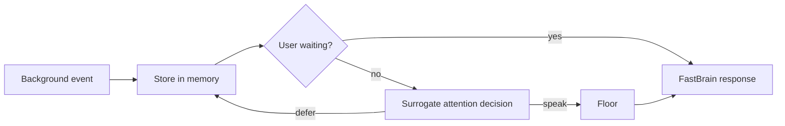

# The Design Space of Proactive Voice Agents

Turn-based assistants have a simple rule: the user speaks, the model responds, and the turn ends.
A proactive assistant has at least two independent timelines. Conversation continues in one while
searches, code tasks, or observations evolve in another. The hard problem is therefore not merely
tool execution; it is deciding when background state deserves the foreground.

Nova Audio Agent separates storage from attention. Executors publish typed observations once.
Runtime records them in canonical memory. A user question can read that state directly, while an
unsolicited update must first pass an attention policy and acquire the speaking floor.

This distinction matters because silence and forgetting are different outcomes. A progress update
can remain available for a later question without interrupting a meeting. Conversely, when the user
is explicitly waiting, delivery must not depend on a proactive-policy model.

The useful design test is a tradeoff ruler:

- Does the change create another source of truth?
- Does it add a second path to speech?
- Can it be expressed as an executor-local rule?
- Is the new abstraction justified by more than one concrete capability?

The smallest reliable proactive system is not the one with the fewest components. It is the one
where ownership is explicit: executors own domain work, Runtime owns lifecycle, Memory owns facts,
Surrogate owns ambient attention, and Floor owns the right to speak.
