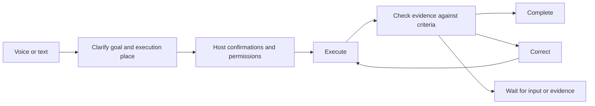

# How Nova works

Nova connects conversation, authorized context and background execution. The Workbench keeps your todos, ideas, goals and delegated tasks beside the conversation; the host tracks permissions and task state, and results return with evidence.

## Workbench and context

Todos, Ideas, Goals, Feeds, Tasks and Profile share one window with voice and text conversation. You can switch to the orb or hide the window in background mode: the desktop microphone turns off while tasks keep running.

Authorized folders, mail, calendars and Feishu provide source evidence for personal memory, Profile and suggestions. Source access and permission for the configured model to process content are separate choices. Some Todos can be captured automatically under the enabled settings; direct Feishu mentions require both consents. Recording a Todo does not authorize executing it. See [Workbench](workbench.md) and [Sources and connectors](sources-and-connectors.md).

## From a request to a result

The conversation model interprets your request. Nova manages execution-place confirmation, permissions and task state. The Task loop checks executor evidence against acceptance criteria and decides whether to complete, correct or wait; an executor finishing alone does not mean the Task is complete. You can take over to message the executor directly and return control to Nova. See [Tasks](tasks.md).

Creating or switching projects requires confirmation. Permission requests belong to a specific operation; a previous approval does not automatically authorize unrelated work. Recognition failure is not treated as approval, rejection or cancellation.

## Projects and sessions

A **project** is a working directory. A **session** is a Codex conversation within that project. Project files and session records let you resume work later.

Requests to change a running task are kept separate from new tasks. Cancelling work does not delete its project or conversation history. Disconnecting a phone does not cancel computer-side work.

## Voice and interruptions

The default **integrated** mode uses Qwen to process speech directly. **Cascaded** mode connects speech recognition, a language model and speech synthesis as separate stages.

You can interrupt spoken output. Nova tracks each response so late audio and results are not mistaken for a newer reply. Recovering speech delivery does not mean executing the task again. Progress narration reports what happened; it cannot grant permission for another action.

## Three kinds of state and memory

| Information | Purpose |
|---|---|
| Runtime blackboard | Causal conversation events and current execution state; not the personal memory database |
| Personal memory | Retain source-backed facts from conversation and authorized sources, with trace, correction, forget and purge controls; the unified local ledger is the default, mem0 an explicit alternative |
| Document knowledge | Search files you explicitly import |

These stores have separate purposes. Remembered facts and retrieved documents are information, not instructions that can override your permissions. Local storage may still use remote models for extraction and embeddings. See [personal memory](personal-memory.md).

## Progress and optional updates

Execution feedback updates runtime state. Proactive selects optional information worth sharing; Floor coordinates the speaking opportunity, and the conversation model expresses the update. These responsibilities are separate from deciding whether a Task has met its acceptance criteria. Optional morning and evening briefs are off by default.

## Vision and external tools

Conversation vision is optional and requires a supported cascaded model. It captures an image for the submitted turn. Independent monitoring observes a selected camera for the condition you requested and releases it when monitoring ends.

Camera monitoring and direct tool calls have their own lifecycles; they do not all pass through the Task loop. MCP connects configured external services. Only selected tools are exposed. Nova does not silently add services or discard tools to fit a model's limits.

## Desktop and phone

The computer runs models, memory and task execution. The iPhone client handles input, playback, messages and approval controls, connecting to the computer's service.

Settings separate **Save** from **Restart**. Service changes take effect after restarting the backend; appearance and wake settings apply after saving. See the [setup guide](getting-started.md) and [phone connection guide](iphone.md).

## Developer reference

The [architecture series](archs/00-overview.md) explains runtime state, executor interfaces, memory, speech ownership and native vision. The [client protocol](protocols/client-v1.md) defines remote messages and control receipts.
