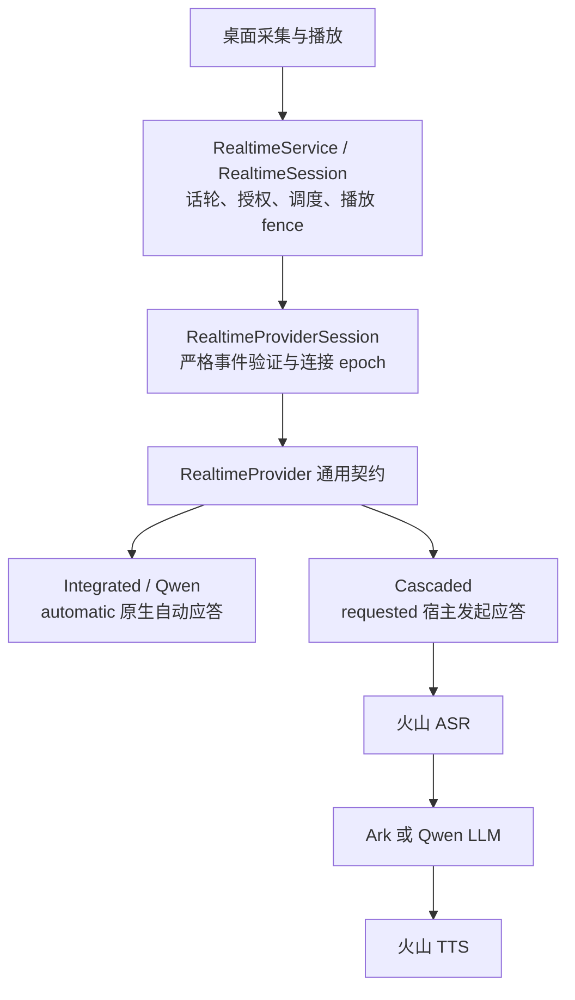

# 通用语音 Provider：实现与验收

交付 worktree：`.worktrees/voice-focus`，分支 `feature/voice-focus`，基于 v0.2.0dev 开发线的 `4b90c99`。沿用已有 RealtimeProvider / RealtimeProviderSession，不新增包装层、依赖或声纹 SDK。

## 最终架构



宿主不再依赖级联 ASR 自行取消旧回复并启动 LLM。级联 ASR 每个 item 只上报第一次 final，保存输入，等宿主调用 `ensureResponse`。宿主分别保留待发起的输入和已经发起的请求：旧 terminal 不清除新输入；重复 delivery pass 不多发；旁路回复的 terminal 不释放已请求的用户回复。`ensureResponse` 返回 false 表示忙或目标已过时，没有接受新生成。

级联在接受生成命令时建立本 epoch 内唯一回复 ID，先上报 `response_started`，再等待 LLM。宿主因此能在上游首包前取消。LLM 自己的 wire ID 只在实现内部校验。取消不配合的 LLM/TTS 在超时后产生明确 failed terminal 和 `cascaded_cancel_timeout`，旧 epoch 被撤销并有界清理，避免永久 busy 或复用失控推理；这是明确失败，需要新连接恢复。

`response_started.origin` 为严格的 user_item / host_request / unknown。级联提供确定来源；Qwen 省略来源时继续经过宿主的保守关联防御。来源只是证据，不是授权：普通工具、项目确认重试、执行器审批都核对 item/revision；明确错误来源不能进入“等下一段转录”的兜底。已修复“错误来源回复 → 真实用户转录 → confirm”的 provisional 审批旁路。

宿主回复先登记待处理记录再调用 provider，避免 response_started 早于命令返回时丢失归属；命令失败只撤销自己的记录，工具结果续接使用同一路径。

2026-09-06 修订：仅宿主事实播报提供空工具列表；用户回复与已绑定的工具结果续接保留配置工具。续接仍交叉核对原用户证据与 revision，来源本身不授予执行或确认权限。共享前台提示词、活动项目/执行器上下文渲染、宿主激活常量已移入 `frontend-instructions.ts`。Qwen 保留旧导出，宿主和级联组装直接使用共享模块。

## 验证

- 最终完整实时专项：790 通过，0 失败。覆盖 Qwen/级联、schema、session/service、审批、取消交错、epoch、生产组装及旧协议 oracle。
- `npm run check`：类型、lint、环境契约、Unicode/数值语义审计、执行器边界、capability 检查通过。新增两个数值审计项仅对应本地 response ID 的 epoch/序号，并指向可运行的取消回归。
- 桌面构建及测试：811 通过，3 项平台跳过；真实 Electron utility-process 级联启动、WebSocket 握手及正常退出通过。
- 真实 Qwen：连接、宿主消息确认、生成音频、terminal 通过，收到 3 段音频。
- 真实火山：ASR → Ark → TTS 问答、来源关联、正在生成时精确取消、重连后由真实语音触发工具及结果播报、生产宿主打断清空和下一轮恢复、连续两条宿主事实的 spoken_event_ids 归属及队列复用，全部通过。报告见 `2026-09-05-provider-contract-live-report.json`。
- 最终完整 runtime 回归：2272 项，2262 通过、5 跳过、5 失败。失败名称与此前已在基线复现的 5 项一致：package root 导出快照、生产 schema probe 两项、camera manifest 快照、Codex 普通 adapter 结果。没有新增失败，也没有宣称全库全绿。

旧 Python oracle 的调度由测试宿主显式模拟； opaque response ID 做一一重命名；新增 origin 由专门契约测试覆盖；宿主事实播报 tools=[] 先断言，再与旧 wire payload 的其余字段比较。这些是明确记录的契约迁移，并非将原始 oracle 全部原样通过。

## Live 验收发现并修复的问题

取消用例曾等待首音频超时。当时的诊断显示当时实际上是 `response_started → tool_call_ready → completed`，没有进入 TTS。收掉宿主播报的工具列表后，两次完整 live 复跑通过。此前更早一次超时没有足够事件证据，不能追溯断言为相同原因。

Sol 复核发现旧帧检查起点过晚：现已在 `onAudioClear` 同步记录帧索引，清空回调之后的所有旧 generation 帧都纳入断言。取消超时的非配合实现也有独立回归。Terra/Sol 发现的上述问题均已修复并复核。

Claude `claude-fable-5-1[1m]` 的 high 档代码审查发现未接受请求遗留 fence、异常丢失待答输入、提前消费上下文三点；前两点均有 RED/GREEN，第三点对用户及宿主两条路径都验证了 abort 后重试保留上下文。2026-09-06 修订：明确 false 仅释放本请求自己设置的 fence，命令异常仍保留取消防御；未出现 started 的终止事件通过 origin 关联请求，不可恢复 provider_error 也释放请求债务。xhigh 的大上下文审查未及时返回，未计为通过；采用实际返回的 high 档静态结论。本地测试全部由本任务实际执行，不采信外部模型关于自行运行工具或测试的文字声称。

补充真实 provider 包装与会话并发联跑后，复现并修复了宿主 pending 在开始事件之后才登记的竞态；宿主事实和工具结果续接均有真实适配器回归。Terra 对修复复核无新增问题，外部 `claude-fable-5-1[1m]` 最终静态复核也未发现具体阻塞项；真实云服务连续两条宿主事实均归属正确，终结后队列恢复空闲。

## 使用与边界

选择生产级联：`NOVA_AUDIO_AGENT_PIPELINE_MODE=cascaded`，`NOVA_AUDIO_AGENT_CASCADE_LLM_PROVIDER=ark`。凭证使用已有 `ARK_API_KEY`、`DOUBAO_BIGMODEL_API_KEY`，ASR 可另配 `DOUBAO_ASR_API_KEY`。可运行：

```sh
npm run smoke:cascaded --workspace @nova-audio-agent/runtime -- --env-file /path/to/.env --output /tmp/cascaded-live.json
```

桌面用户的持久配置没有修改；默认 integrated 及两种 pipeline 的选择机制保留。上述 live 是数字 PCM 与播放确认回调的生产链路验收，没有录制真实麦克风、没有物理扬声器回放。保留浏览器 AEC/NS/AGC，未接声纹或额外降噪 SDK；不能据此声称能识别主人，或旁人说话、真实环境噪声不再触发打断。

Qwen 的原生自动应答仍可能早于 ASR final，通用宿主需要保留这类因果与授权防御。已移走对 Qwen 实现的共享代码依赖并将 wire 处理留在下游，不声称服务商的实际事件顺序完全相同。
