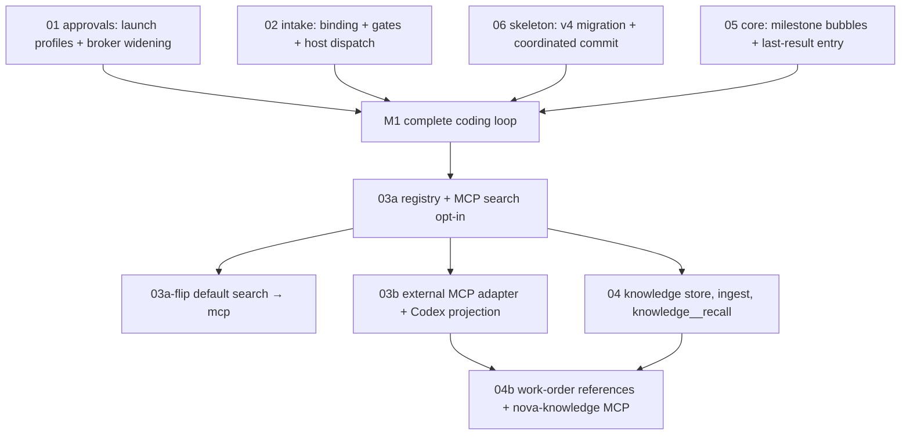

# Nova Audio Agent v0.2.0 Spec Series

> 摘要：v0.2.0 在 `v0.2.0dev` 分支上推进五组核心能力——跨平台 Codex 审批与 YOLO、多轮意图澄清与规划、能力注册表与 MCP（含 MCP 搜索）、私人知识库 / RAG、桌面进度气泡——并配套统一的设置与配置面。本系列只定边界与验收；实现按**验收里程碑**推进（先交付一条完整的「提出任务 → 必要澄清 → 工作单 → 审批 → 执行 → 可见结果」编码体验，再扩展通用 MCP 与完整 RAG），不在本阶段改产品代码。协议示例以本机 Codex 0.152.0 生成的 schema 为准。
>
> 修订（2026-09-03）：吸收一轮静态评审（7 条 P1/P2 + 4 条产品建议），处置见文末「Review log」。

This series is the product and engineering contract for the work tracked on branch
`v0.2.0dev`. Each volume owns one boundary. Implementation plans and code land
only after the corresponding volume is agreed.

| Volume | Topic |
|---|---|
| [01 Codex approvals](01-codex-approvals.md) | Cross-platform `on-request`, YOLO, broker widening |
| [02 Intake and planning](02-intake-and-planning.md) | Multi-round clarification + WorkOrder v2 planner |
| [03 Capability registry and MCP](03-capability-registry-and-mcp.md) | Enable/disable modules, MCP servers, MCP search |
| [04 Knowledge base](04-knowledge-base.md) | Private RAG (layer K), ingest, recall surfaces |
| [05 Progress bubbles](05-progress-bubbles.md) | Orb progress notifications |
| [06 Settings and config](06-settings-and-config.md) | Settings v4, env contract, panel tabs |

The public architecture volumes under [`docs/archs/`](../../archs/00-overview.md)
remain the source of invariants. Specs here propose deltas; they do not silently
rewrite those volumes.

## Goals

1. **Trustworthy Codex execution on every platform.** macOS, Windows, and Linux
   use `approvalPolicy: on-request` with the existing workspace-write permission
   profile by default. Work inside the sandbox — including ordinary commands —
   proceeds without a prompt; sandbox escapes, network access, and permission
   upgrades go through the existing confirm-forwarding path. Users can opt into
   Codex-native YOLO (`never` + `danger-full-access`) as a separately validated
   launch profile.
2. **Fewer wrong coding tasks, not more questions.** Underspecified requests
   open a host-owned intake that asks only user-owned questions (preferences
   that change implementation or acceptance), delegates repository facts to
   Codex, then compiles a structured WorkOrder bound to the request revision
   before Codex runs. Not a second conversational agent.
3. **Modular capabilities.** Built-in search, camera, Codex, and knowledge, plus
   user-configured MCP servers, sit in one registry the desktop can enable or
   disable. Search gains an MCP provider (Bailian / DashScope); the default
   flips from Tavily only after live verification.
4. **Private knowledge.** Users can ingest documents into a local SQLite store
   with hybrid retrieval. Retrieved chunks are evidence, never instructions.
5. **Glanceable progress.** Optional bubbles above the orb surface executor
   milestones so speech can stay restrained.

## Non-goals (v0.2.0)

- Shipping a package version bump or release cut from this branch until the
  features are ready; `package.json` stays at the current release version until
  an explicit release chore.
- Wrapping built-in search / camera / Codex as in-process MCP servers. Built-ins
  remain native executors; only their enablement shares the registry UI with MCP.
- A universal workflow / graph language, unrestricted long-term memory search
  auto-injected into every ContextView, or multiple speaking personas
  ([deferred](../../archs/08-deferred.md)).
- Merging project confirmation and Codex approval into one public tool (rejected
  in the 2026-09-02 Windows approvals handoff).
- Embedding-provider marketplace, cloud-hosted knowledge sync, or multi-tenant
  RAG. Knowledge is local and single-user.
- Widening the voice approval tool schema beyond a boolean decision in this
  release.

## Protocol pin

All Codex app-server shapes in this series are checked against the JSON Schema
bundle generated by `codex app-server generate-json-schema --experimental` from
Codex **0.152.0**. The first implementation PR snapshots that bundle under
`fixtures/codex/app-server-schema/0.152.0/` and adds a test that every JSON
example in `01` validates. Details in
[01 → Protocol pin](01-codex-approvals.md#protocol-pin).

## Dependency graph

## Milestones (replace the week plan)

Progress is measured by acceptance, not calendar. Each milestone is “done” when
the listed checklists are green on `v0.2.0dev`.

| Milestone | Delivers | Acceptance |
|---|---|---|
| **M1 — one complete coding experience** | User asks → only necessary user-owned questions → WorkOrder v2 → `on-request` approvals on macOS and Windows → execution → visible result (milestone bubbles + last-result entry). YOLO selectable. | 01 deterministic + live lists; 02 checklist; 05 core items (frames, stack, last-result entry, bounds reservation); 06 migration + coordinated commit |
| **M2 — capability registry** | `capabilities.json`, module toggles, MCP search provider opt-in, Tavily optional | 03a checklist; then 03a-flip after the live smoke is recorded |
| **M3 — external MCP** | FrontBrain MCP executors with compiler adaptation; Codex projection with allowlist closure | 03b checklist incl. `mcpServerStatus/list` verification |
| **M4 — knowledge** | Layer K store, ingest UI, `knowledge__recall`, then host-attached references + `nova-knowledge` | 04 checklist; release-gate decision below |

Cross-cutting settings (`06`) land with the milestone that first needs each
control.

### Release gate for 04

Open question for the product owner: does v0.2.0 ship with M4, or does the
release cut after M3 with knowledge following in v0.2.x? Arguments recorded so
the decision is explicit:

- For shipping together: the user asked for RAG in this cycle; the module gate
  (`modules.knowledge.enabled = false` by default) means M4 adds no risk to
  M1–M3 users.
- For splitting: M4 carries the only new native deps (`pdf-parse`, `mammoth`,
  embedding client), the FTS5 spike, and a data-flow disclosure that deserves
  its own review. Shipping M1–M3 earlier gets the coding loop into daily use
  sooner.

Until decided, M4 work proceeds after M3 and its docs stay marked “gate: TBD”.

## Proposed architecture deltas

These deltas are applied to [`07-decision-record.md`](../../archs/07-decision-record.md)
and [`08-deferred.md`](../../archs/08-deferred.md) only when the owning feature
merges — not as part of this documentation phase.

### Decision-record additions (proposed)

| Decision | Chosen boundary | Rejected alternative |
|---|---|---|
| Codex approval default | Cross-platform `on-request` with the named workspace-write profile (network off); YOLO is a separate launch profile (`never` + `danger-full-access`) validated end-to-end | Windows-only broker; silent auto-accept under sandbox; patching individual argv flags per mode |
| Clarification ownership | Host-owned IntakeSession + cheap assess slot; only user-owned questions are asked; repo facts become `discovery`; stop-asking and execution gates are separate | Prompt-only “ask once then dispatch”; second general conversational agent; asking for facts Codex can find |
| Work-order authorship | Host is the only dispatcher for coding tasks; deterministic WorkOrder v2 bound to `(intake_id, revision)` / `plan_revision`; admitted once through `dispatchExternal` / `dispatchConfirmedExternal` | Passing raw conversation history into Codex; FrontBrain dispatching coding tasks directly; unbound async planner results; inventing a parallel admit API |
| Capability extension | Registry filters manifests before tools reach the model; the tool allowlist is projected to Codex via `enabled_tools` and verified at runtime; built-ins stay native adapters | Capability branches inside Runtime; wrapping every built-in as MCP; server-level-only projection to Codex |
| Search transport | MCP provider available with Bailian preset; default flips from Tavily only after recorded live verification; evidence still `untrusted_external` via SearchAdapter | Hard-coded Tavily as the only transport; flipping the default before the endpoint is proven |
| Knowledge | Separate layer K (user-curated) with hybrid retrieval; evidence-only; references reach Codex only in a form it can resolve (`get_chunk` with digest pin, or in-workspace paths); no auto ContextView injection by default | Stuffing document bodies into system prompt; merging knowledge into L1 graph; emitting `knowledge://` URIs Codex cannot open |
| Progress UX | Optional orb bubbles as reminders + a persistent last-result entry; main process reserves window bounds; speech remains Floor-gated | Speaking every Codex working update; OS toasts for in-session progress; bubbles as the audit trail |

### Deferred items that stay deferred

- Unrestricted long-term memory search auto-injected into ContextView
  (`knowledge.autoRecall` defaults off).
- Automatic privilege expansion beyond the reviewed broker shapes.
- A universal workflow language for intake → plan → execute.

### Deferred items that return under a concrete use case

- Local embedding provider implementation (interface reserved in 04).
- `sqlite-vec` acceleration if chunk counts exceed brute-force comfort.
- Widening `codex__confirm_codex_approval` to session-scoped decisions by voice.

## Invariants that must not regress

From [`docs/glossary.md`](../../glossary.md):

1. The event-loop body never awaits executor completion.
2. Executors never speak to the user.
3. Accepted results reach Memory before they affect conversation.
4. Only FastBrain / FrontBrain updates structured intent, goal, authorization.
5. Models see a bounded ContextView, never unrestricted memory.
11. Only configured manifests become model-facing tools.
12. Secrets are absent from logs and configuration errors.
13. Speaking priority is bound to the triggering event.

Intake state, capability registry, and knowledge recalls must respect these. In
particular, intake must not write `intent` / `goal` by a side channel, and
knowledge chunks remain `untrusted_external` evidence.

## Verification posture

Each volume ends with a checklist. Shared rules:

- Deterministic unit and fake-transport tests land before live smokes.
- Live provider / headset runs are evidence, not substitutes.
- macOS and Windows both exercise the approval path; Linux follows the same
  policy construction even if packaging lags.
- Settings migrations are versioned (`SETTINGS_VERSION` 3 → 4) and covered by
  store tests.

## Review log

### 2026-09-03 — static review against code and Codex 0.152.0 schema

All findings were re-verified against `runtime/src` and a freshly generated
schema bundle before revising. Disposition:

| # | Finding | Verified? | Disposition |
|---|---|---|---|
| P1-1 | `01` used a `sandboxPolicy` object at thread level and `{decision}` for permissions requests | Yes — `thread/start` takes `sandbox` enum **or** `permissions` id; permissions response is `{permissions, scope}`; today’s transport sends neither field | `01` rewritten: protocol pin, per-kind decision table, `on-request` wording corrected |
| P1-2 | YOLO blocked by `validateEffectiveCodexConfig` (`network.enabled === false`, fixed profile) | Yes — `codex-app-server-schema.ts:659-678` | `01` defines two complete launch profiles; validator becomes mode-aware; table-driven test required |
| P1-3 | Intake lacked binding of async results and conflated “stop asking” with “allowed to execute” | Yes | `02` rewritten: binding + stop-asking / planning / execution gates; coding-task-only interception; `dispatchExternal` / `dispatchConfirmedExternal` |
| P1-4 | MCP allowlist not closed on the Codex side | Yes — Codex 0.152 supports `enabled_tools`/`disabled_tools` and `mcpServerStatus/list` | `03` closure rules 1–5: config projection, effective-config check, runtime tool-visibility check, approval mode, bounds asymmetry stated |
| P2-5 | MCP manifests incompatible with `compileToolSchema` (readonly rule, 64-char names, `origin_ref`) | Yes — `tool-schema.ts:140`; readonly ops are probe entries for `unknown` outcomes | `03` adapter rules: `probe_policy: 'none'` for MCP (honest consequences), deterministic aliases, reserved-param rejection, per-server failure |
| P2-6 | “Write capabilities.json then run settings transaction” can leave disk changed on `busy` / failure; search provider in three places | Yes — `settings-apply.mjs:41-80` | `06` coordinated commit (validate both → write both → saved vs applied); provider lives only in the registry with env override |
| P2-7 | `knowledge://` references may be unresolvable by Codex; `get_chunk` optional; no invalidation | Yes | `04`: host attaches only executor-resolvable references; `get_chunk` required with digest pin and `ok / stale / gone` semantics |
| Product | Clarify to reduce errors, not add rounds | — | `02` question ownership (`user` vs `repo`), inferred vs stated, planner assumptions |
| Product | Ship one complete coding loop first; milestones over weeks; verify search before flipping default | — | This file: milestones M1–M4, 03a-flip gate, 04 release-gate question |
| Product | Bubbles are reminders, not audit; native window constraints | — | `05` last-result entry, main-process bounds reservation, banner coexistence |
| Product | Make knowledge data flow explicit; unimplemented provider not selectable | — | `04` data-flow table in the panel; `local` disabled in UI |

### 2026-09-03 — second pass (confirm loop, project actions, headless, alias)

| # | Finding | Verified? | Disposition |
|---|---|---|---|
| P1 | `planReadback=confirm` circular: execution required authorization which required confirm of a plan | Yes | `02`: split planning gate vs execution gate; `intent_to_proceed` unlocks planning only; confirm binds `{proposal_id, plan_revision}`; pure confirm does not bump `revision` |
| P1 | All `codex__project` calls routed into intake would break list/switch workspace | Yes — actions in `codex-contract.ts` | `02`: interception table; only `start_session` / `resume_session` / `create_workspace`+`work_order`; preserve workspace + session + create confirmation |
| P2 | `closed(dispatched)` before admission returns; `admitDelegate` is not the public API | Yes — public API is `dispatchExternal` / `dispatchConfirmedExternal` | `02`: `committing` re-entrancy guard; `dispatched` only on `accepted=true`; else `admission_refused` + recovery |
| P2 | Headless ask contradicted the ask column (`on-request` vs `never`) | Yes | `01`: resolved profiles `ask` / `ask_headless` / `yolo`; matrix has three columns |
| P2 | Alias short form could yield wire name length 66 for a 32-char server | Yes — `5+32+2+20+1+6=66` | `03`: `budget = 64 - len(prefix)`; short form uses `budget-7`; max-length fixture required |
| Sync | README still said “MCP search default” | Yes | README.md / README.zh-CN.md / `09-roadmap.md` / `06` aligned with opt-in → flip |

Reference consulted alongside the review: the qwen-audio-agent user guide
(<https://qwenaudio.github.io/qwen-audio-agent/>). Patterns adopted:
`respond_permission`’s `once / always / reject` with no persistent backend
rule (01), `objective` as a conservative self-contained instruction with no
persona or history (02), Task record as a bounded delivery receipt and
“progress is observability, not control” (05). Deliberate differences: Nova
projects user-selected MCP servers into the Nova-owned private `CODEX_HOME`
(03), and Nova hosts a knowledge MCP for Codex (04); qwen leaves backend MCP
entirely to the backend’s own configuration.

## Document conventions

- English body (matches `docs/archs/`); a short Chinese 摘要 at the top of each
  file.
- Cite concrete current paths when describing baseline behaviour.
- Prefer “must / must not / may” over soft wishlist language for acceptance
  criteria.
- Do not claim a feature is shipped until its verification checklist is green
  on `v0.2.0dev`.
