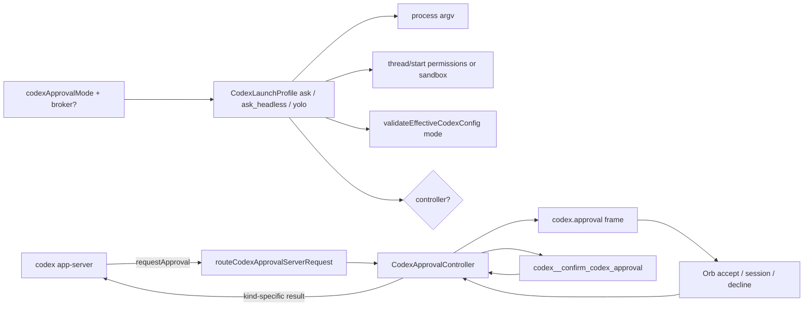

# 01. Codex Approvals and YOLO

> 摘要：默认在 macOS / Windows / Linux 全部使用 `approvalPolicy: on-request`，沙箱仍由现有的命名权限档 `nova_audio_agent`（工作区可写、网络关闭）决定。`on-request` 下沙箱内的普通读写与命令**不弹窗**；只有沙箱逃逸、网络访问、权限升级三类请求走现有 confirm 转发到前台。YOLO 是 Codex 原生 `never` + `danger-full-access`，作为一套**独立的**进程配置与有效配置校验，而不是在 ask 配置上改几个参数。协议示例以本机 Codex 0.152.0 生成的 JSON Schema 为准，并按请求类型分别定义决策映射。
>
> 修订（2026-09-03）：回应评审 P1-1（协议示例错误）、P1-2（YOLO 被有效配置预检挡住）；再修订回应 P2（headless ask 与矩阵矛盾 → 增加 `ask_headless` 解析档）。

## Protocol pin

- Supported app-server protocol: the v2 surface generated by
  `codex app-server generate-json-schema --experimental` from **Codex 0.152.0**.
  The first PR of this volume must snapshot that bundle under
  `fixtures/codex/app-server-schema/0.152.0/` and add a test that every JSON
  example in this document validates against the snapshot. Examples below were
  checked against that bundle on 2026-09-03.
- A newer Codex that changes any of the shapes referenced here is a protocol
  bump, handled by regenerating the snapshot and re-running the fixture tests —
  not by loosening validators.

Relevant facts from the pinned schema (these correct the previous draft):

| Surface | Shape |
|---|---|
| `thread/start` / `thread/resume` params | `approvalPolicy: AskForApproval`, `approvalsReviewer: 'user' \| 'auto_review'`, and **either** `sandbox: 'read-only' \| 'workspace-write' \| 'danger-full-access'` **or** `permissions: <named profile id>` (string). The two are mutually exclusive. There is no `sandboxPolicy` object at thread level. |
| `turn/start` params | May carry `sandboxPolicy`, `permissions`, `approvalPolicy`, `approvalsReviewer` overrides. Nova **must not** send any of these on `turn/start`; the thread binding is authoritative. |
| `AskForApproval` | `'untrusted' \| 'on-request' \| 'never'` or a `{granular: …}` object. Nova uses only the string forms. |
| `item/fileChange/requestApproval` response | `{decision: 'accept' \| 'acceptForSession' \| 'decline' \| 'cancel'}` |
| `item/commandExecution/requestApproval` response | `{decision: 'accept' \| 'acceptForSession' \| 'decline' \| 'cancel' \| {acceptWithExecpolicyAmendment} \| {applyNetworkPolicyAmendment}}`; params include `availableDecisions`, `networkApprovalContext`, `proposedNetworkPolicyAmendments`, `proposedExecpolicyAmendment`, `additionalPermissions`. |
| `item/permissions/requestApproval` response | `{permissions: GrantedPermissionProfile, scope?: 'turn' \| 'session', strictAutoReview?: boolean}` — **not** `{decision}`. Params carry the requested `permissions: RequestPermissionProfile`, `reason`, `cwd`, ids. |
| `config/read` effective config | Includes `approval_policy`, `sandbox_mode`, `approvals_reviewer`, `web_search`, `default_permissions`, `permissions.<id>`, `mcp_servers`, `features`, `shell_environment_policy`. |

## Baseline (today)

- `codexApprovalPolicyForTransport` in
  [`runtime/src/codex-factory.ts`](../../../runtime/src/codex-factory.ts)
  returns `on-request` only for `win32 + project + foregroundBroker`. Darwin and
  Linux always get `never` and a null `CodexApprovalController`.
- `#threadRequest` in
  [`runtime/src/codex-app-server-transport.ts`](../../../runtime/src/codex-app-server-transport.ts)
  sends only `approvalPolicy`, `cwd`, `ephemeral`, `developerInstructions`. It
  sends **neither** `sandbox` nor `permissions`; the sandbox comes entirely from
  `-c default_permissions="nova_audio_agent"` in
  [`CODEX_APP_SERVER_ARGV`](../../../runtime/src/codex-process-owner.ts).
- Process argv is fixed to `-a never`, so on Windows the thread asks for
  `on-request` while the process default says `never`.
- `validateEffectiveCodexConfig`
  ([`runtime/src/codex-app-server-schema.ts`](../../../runtime/src/codex-app-server-schema.ts))
  hard-codes one accepted shape: `default_permissions === 'nova_audio_agent'`,
  exactly one profile, `network.enabled === false`, `web_search === 'disabled'`,
  `mcp_servers` empty, all listed features off. Any other shape throws
  `config_not_isolated` and the run never starts.
- `routeCodexApprovalServerRequest`
  ([`runtime/src/realtime/codex-approval.ts`](../../../runtime/src/realtime/codex-approval.ts))
  accepts `item/fileChange/requestApproval` and
  `item/commandExecution/requestApproval` only. A command request with a non-null
  `networkApprovalContext`, `proposedNetworkPolicyAmendments`, or
  `proposedExecpolicyAmendment` returns `null` (declined). `item/permissions/*` is
  not routed.
- The controller resolves only `accept | decline`; both the renderer click and
  the voice tool share one one-shot controller with a 60 s TTL
  ([handoff 2026-09-02](../../handoffs/2026-09-02-windows-audio-codex-approvals.md)).

## Goals

1. One approval policy for project + realtime runs with a desktop broker on
   macOS, Windows, and Linux.
2. Under `ask`, work that stays inside the sandbox — reading, writing inside
   the workspace roots, and running commands that need no escalation — runs
   without a banner. Only sandbox escapes, network access, and permission
   upgrades require a user decision.
3. Users can switch to Codex-native YOLO from settings; YOLO is a complete,
   separately validated launch profile.
4. Preserve the one-shot controller, TTL, and function-authoritative voice path.

## Non-goals

- Auto-accepting escalations under the sandbox and calling that “YOLO”.
- Session-scoped decisions by voice in v0.2.0 (renderer only).
- Merging project confirmation and Codex approval into one public tool.
- Offering persistent host rules (`acceptWithExecpolicyAmendment`,
  `applyNetworkPolicyAmendment`) in v0.2.0. Same stance as qwen-audio-agent’s
  `respond_permission`: `always` is a frontend-session grant, never a persistent
  backend rule.
- Using `approvalsReviewer: 'auto_review'` (a Codex subagent deciding for the
  user). Nova pins `user`.

## Wording correction: what `on-request` means

`on-request` does **not** mean every command prompts. Codex runs commands inside
the active sandbox without asking; it raises `requestApproval` only when the
model asks to escalate (run outside the sandbox, use the network when the
profile blocks it, or widen permissions). Product copy, README, and the
settings panel must say “sandbox escapes, network, and permission upgrades need
approval”, not “commands need approval”.

## Setting

| Key | Values | Default |
|---|---|---|
| `codexApprovalMode` | `ask` \| `yolo` | `ask` |

Env: `NOVA_AUDIO_AGENT_CODEX_APPROVAL_MODE`. Desktop settings v4 stores the same
enum ([06](06-settings-and-config.md)). Changing the mode restarts the backend
through the settings transaction; a running Codex thread is not re-bound in
place.

## Launch profiles

Settings store `codexApprovalMode: ask | yolo`. The factory resolves that into
one **`CodexLaunchProfile`** value that every layer consumes. Resolution:

| Input | Resolved profile id |
|---|---|
| `yolo` (any transport) | `yolo` |
| `ask` + project mode + foreground broker | `ask` |
| `ask` + no foreground broker (headless CLI) | `ask_headless` |

No layer re-derives policy from `process.platform` or from another layer’s
output. `ask_headless` never silently becomes `yolo`.

| Layer | `ask` | `ask_headless` | `yolo` |
|---|---|---|---|
| Process argv `-a` | `on-request` | `never` | `never` |
| Process argv sandbox | `-c default_permissions="nova_audio_agent"` + existing `permissions.nova_audio_agent` (workspace roots write, `:root` read, `network.enabled=false`) | same as `ask` | `-c sandbox_mode="danger-full-access"`; **no** `default_permissions` / `permissions.*` |
| Process argv shared | `web_search="disabled"`, `shell_environment_policy` core include-only, feature disables, `--strict-config` | same | same |
| `mcp_servers` | Exactly the Nova-managed set from [03](03-capability-registry-and-mcp.md) (empty until 03b lands) | same | same |
| `thread/start` / `thread/resume` | `approvalPolicy: 'on-request'`, `approvalsReviewer: 'user'`, `permissions: 'nova_audio_agent'` | `approvalPolicy: 'never'`, `approvalsReviewer: 'user'`, `permissions: 'nova_audio_agent'` | `approvalPolicy: 'never'`, `approvalsReviewer: 'user'`, `sandbox: 'danger-full-access'` |
| `turn/start` | No policy / sandbox overrides | same | same |
| Effective-config validator | `{profile: 'ask', managedMcp}` expects ask sandbox + `approval_policy === 'on-request'` | `{profile: 'ask_headless', managedMcp}` expects ask sandbox + `approval_policy === 'never'` | `{profile: 'yolo', managedMcp}` expects `approval_policy === 'never'`, `sandbox_mode === 'danger-full-access'`, no permission profile; still requires `web_search === 'disabled'`, shell policy, feature disables, managed MCP |
| Thread binding (`bindThread`) | Echoes `on-request` + profile `nova_audio_agent` | Echoes `never` + profile `nova_audio_agent` | Echoes `never` + `danger-full-access` |
| `CodexApprovalController` | Constructed | `null`; approval tool / instructions omitted; startup logs `ask_headless_no_broker` | `null`; approval tool / instructions omitted |

`CodexLaunchProfile` therefore carries the effective `approvalPolicy`,
sandbox/permissions choice, and `controller: present | absent` so argv,
validator, thread params, and tool schema all read one object. The headless
fallback is a first-class profile, not a post-hoc override of the `ask` column.

Thread-level `permissions` is passed explicitly even though `default_permissions`
already selects it, so the thread binding is self-describing and resume of an
existing thread cannot inherit a different profile. Validation that
`permissions` and `sandbox` are never both present is a unit test, not a runtime
check.

## Mode: `ask`

### Broker request kinds

`routeCodexApprovalServerRequest` must route the following. Everything else
keeps the current fail-closed behaviour.

| Kind | App-server method | Recognised by | Shown to the user |
|---|---|---|---|
| `file_change` | `item/fileChange/requestApproval` | as today | paths / diff summary (rare under workspace-write) |
| `command` | `item/commandExecution/requestApproval` | `networkApprovalContext` null; `proposed*Amendment` may be present but are ignored | command (bounded), cwd must be the canonical workspace, reason |
| `network` | `item/commandExecution/requestApproval` | `networkApprovalContext` non-null and/or `proposedNetworkPolicyAmendments` non-null | host(s) / scope summary + command; never the raw amendment object |
| `permissions` | `item/permissions/requestApproval` | always | a redacted summary of the requested profile: filesystem entries (paths relative to workspace, or “outside workspace”) and whether network is requested |

Rules:

- `availableDecisions` (command requests) is authoritative for which buttons
  the renderer may show. If it omits `acceptForSession`, the third button is not
  rendered.
- Requests whose `cwd` is not the canonical workspace remain declined
  (existing rule). Permission requests whose filesystem entries include paths
  outside the workspace **may** be shown; the summary must say so explicitly.
- Redaction posture is unchanged: `operation_summary` is neutral,
  `local_detail` stays in the desktop process, secret-like spans are dropped.

### Decision mapping per request kind

| User action | `file_change` | `command` / `network` | `permissions` |
|---|---|---|---|
| Accept (✓) — banner or voice | `{decision:'accept'}` | `{decision:'accept'}` | `{permissions: <exactly the requested profile>, scope:'turn'}` |
| Allow for session — banner only | `{decision:'acceptForSession'}` | `{decision:'acceptForSession'}` | `{permissions: <requested>, scope:'session'}` |
| Decline (×) — banner or voice | `{decision:'decline'}` | `{decision:'decline'}` | `{permissions: {}, scope:'turn'}` (grant nothing; turn continues) |
| TTL expiry (60 s), controller already spent, or broker lost | `decline` | `decline` | `{permissions: {}, scope:'turn'}` |

- Nova never answers `cancel`; interrupting the turn is a separate user action
  (`codex__cancel`), not an approval outcome.
- Nova never returns a partial permission grant. Voice and banner both grant
  the full requested profile or nothing.
- `strictAutoReview` is never set.
- The voice tool `codex__confirm_codex_approval` keeps its
  `{approval_id, approved: boolean}` schema. `approved:true` maps to the
  “Accept” row for the kind the controller is holding; the tool never produces a
  session grant.

### Voice path (unchanged authority model)

1. Context-only host fact with opaque `approval_id`, kind, neutral summary.
2. Preemptive spoken question; at most two attempts and one host clarification.
3. `ConfirmationTurnIsolation` keeps the answer response a silent carrier.
4. ASR text is Memory / provenance only; it never spends the controller.
5. Renderer click and valid tool race the same one-shot controller.

### Expected product behaviour

- Writes inside the workspace roots and sandboxed commands (`npm test`,
  `git status`, editing files) complete with **no** approval request.
- `npm install`, `curl`, `pip install`, writes outside the workspace, and any
  request Codex marks as needing escalation produce a banner + spoken question.
- Declining leaves the Codex turn to continue or fail without any sticky grant.
- “Allow for session” lasts for the Codex thread lifetime and is cleared by
  backend restart; it is never persisted to disk.

## Mode: `yolo`

- Launch profile as in the matrix above. The child has full host filesystem and
  network access; approvals never arrive.
- Settings UI shows a persistent red warning while `yolo` is selected: sandbox
  and approvals are off; the user accepts full host risk. Not a modal; a visible
  state.
- `web_search` stays `disabled` in YOLO too. Web search is a Nova capability
  ([03](03-capability-registry-and-mcp.md)), not a Codex feature.
- Auditability comes from the existing Codex project store and Memory Board
  (started / working / terminal facts), **not** from progress bubbles
  ([05](05-progress-bubbles.md) treats bubbles as reminders).

## Desktop UX

- Confirmation pill gains a third control when `availableDecisions` allows a
  session grant (or the kind is `permissions`). Label: `本会话始终允许` /
  `Allow for session`.
- Project confirmation UI stays separate; `ConfirmationPresentationController`
  continues to show at most one banner.
- Settings → 权限: radio `ask` / `yolo` with copy that matches the wording
  correction above.

## Flow

## Implementation touchpoints

| Area | Likely files |
|---|---|
| Launch profile value | new `runtime/src/codex-launch-profile.ts` consumed by factory, process owner, transport, schema |
| Policy | `runtime/src/codex-factory.ts` |
| Argv | `runtime/src/codex-process-owner.ts` (`CODEX_APP_SERVER_ARGV` becomes a function of the profile) |
| Thread params / binding | `runtime/src/codex-app-server-transport.ts`, `codex-app-server-projection.ts` |
| Effective config | `runtime/src/codex-app-server-schema.ts` `validateEffectiveCodexConfig({mode, managedMcp})` |
| Routing / results | `runtime/src/realtime/codex-approval.ts` |
| Controller / wire | existing controller, `desktop-wire.ts`, `desktop-bridge.ts` (kind + allowed decisions on the frame) |
| Orb | `confirmation-controls.mjs`, `index.mjs`, CSS for third button |
| Settings | `settings-store.mjs` v4, settings HTML/JS, `backend.mjs` env map |
| Fixtures | `fixtures/codex/app-server-schema/0.152.0/`, fake app-server transcripts for each request kind |

## Verification checklist

Deterministic (must be green before claiming the feature):

- [ ] Schema pin: every JSON example in this file validates against the
      0.152.0 snapshot; `permissions` and `sandbox` never co-occur in emitted
      thread params.
- [ ] Policy matrix: `ask + project + broker` → profile `ask` (`on-request`)
      on `darwin`, `win32`, `linux`; `ask` without broker → profile
      `ask_headless` (`never` + ask sandbox + null controller + warning);
      `yolo` → profile `yolo` (`never` + `danger-full-access` + null
      controller). Table-driven test covers all three profiles.
- [ ] Argv, thread params, effective-config expectations, and thread binding
      all derive from one resolved `CodexLaunchProfile`; no layer patches
      another layer’s output.
- [ ] `validateEffectiveCodexConfig` accepts each profile’s shape and rejects
      the other two.
- [ ] Fake app-server fixtures: `file_change`, `command`, network-shaped
      command, `item/permissions/requestApproval` — accept, session, decline,
      TTL — each asserting the exact JSON-RPC result from the mapping table.
- [ ] `availableDecisions` without `acceptForSession` hides the third button.
- [ ] Voice boolean maps to accept / decline only; never a session grant or a
      partial permission grant.
- [ ] YOLO omits approval tool from compiled schemas and Qwen instructions.
- [ ] No Darwin native-audio file changes required for policy construction.

Live / manual:

- [ ] macOS headset: workspace write and `npm test` without banner; then a
      network escalation with banner + voice/click.
- [ ] Windows regression matrix from the 2026-09-02 handoff.
- [ ] YOLO: a run that previously requested approval completes without a
      banner; `config/read` fixture captured from the real binary matches the
      yolo validator.

## Decision-record delta (apply on merge)

Add the “Codex approval default” row from [00-overview.md](00-overview.md).
Update README roadmap and Getting Started wording per the `on-request`
correction.
