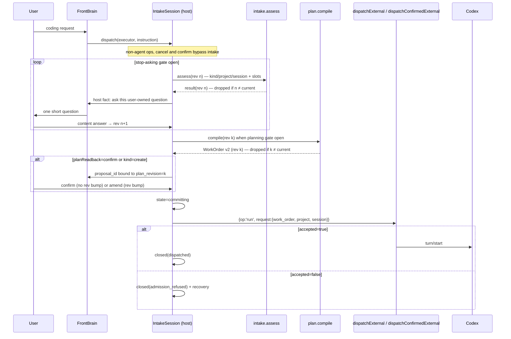

# 02. Intake and Planning

> 摘要：用宿主拥有的 IntakeSession 替代「问一轮就 dispatch」的提示词策略。目标不是多问，而是**少犯错**：只问会改变实现或验收的、属于用户的偏好；技术栈、入口、测试命令等仓库事实交给 Codex 自己探索。廉价槽 `intake.assess` 判断「还要不要问」，并在 [08](08-project-and-work.md) 后兼任 coordinator（选项目 / 选会话 / 定 kind）；「允许规划」与「允许执行」分开；`confirm` 读回绑定既有 proposal，纯确认不 bump revision。拦截的是宿主工具 `dispatch`，且只对暴露 intake 端口的 agent 执行器生效；非 agent 执行器的直接 ops 保持原路径。派单经现有 `dispatchExternal` / `dispatchConfirmedExternal`，accepted 后才标记 dispatched。
>
> 修订（2026-09-03）：回应评审 P1-3；再修订回应 P1（confirm 循环依赖、全量拦截 `codex__project`）与 P2（admission 拒绝仍标 dispatched、入口 API 名）。
>
> 修订（2026-09-03，coordinator 下沉）：拦截入口从 `codex__project` 的六个 action 换成宿主工具 `dispatch`；intake 代码搬到 `runtime/src/executors/coding/`；`assess` 输出增加 `kind` / `project` / `session`，输入增加 roster 与当前 active 项目；确认工具统一为 `confirm(id, accepted)`。边界见 [08](08-project-and-work.md)。
>
> 修订（2026-09-03，08 评审回应）：intake 归执行器所有，宿主只提供 fact / prepare / dispatch / record 回调；workspace 改为 assess 解析出项目后才绑定；`assess` 增加 `project_evidence`（选非 active 项目必须给出用户原话片段并由宿主校验）；`kind: 'create'` 不再短路，继续澄清与规划且一律确认；非 roster 名只有明确新建意图才 `create`，否则 `unclear`。

## Baseline (today)

- Clarification is **prompt policy only** inside `FRONTEND_INSTRUCTIONS`
  ([`runtime/src/realtime/qwen.ts`](../../../runtime/src/realtime/qwen.ts)):
  ask one short question, then on the next user turn merge into `work_order` and
  call `codex__project`. There is no round counter and no host readiness check.
- Dispatch payload is the model-authored `work_order` string sent as
  `turn/start` input text
  ([`runtime/src/codex-app-server-transport.ts`](../../../runtime/src/codex-app-server-transport.ts)).
- Every delegate already passes admission via `dispatchExternal` /
  `dispatchConfirmedExternal` in
  [`runtime/src/runtime.ts`](../../../runtime/src/runtime.ts): schema, known
  manifest/op, duplicate-in-flight refusal, unknown-outcome fencing, and
  `origin_ref` visibility. Intake must reuse these public entry points, not
  bypass them or invent a parallel admit API.
- Eval labels `clarify | dispatch | respond` live in
  `fixtures/realtime/qwen/v1/codex-clarification.json`.
- `update_intent` / `update_goal` exist; invariant 4: only FastBrain / FrontBrain
  may write those structures.

## Goals

1. Ask only questions whose answer changes what Codex should build or how we
   judge it done. Zero questions is the correct outcome for a well-specified
   request.
2. Host-owned bounds so “ask forever” and “dispatch too early” are both
   impossible.
3. A planning step that rewrites the clarified request into a structured
   WorkOrder before Codex runs; the planner records intent faithfully and marks
   its own guesses as assumptions.
4. Codex still receives one self-contained work order, never the conversation,
   persona, or Memory (same boundary qwen-audio-agent draws for `objective`).
5. Every asynchronous intake result is bound to the request version it was
   computed for; a stale result can never dispatch.

## Non-goals

- A second conversational agent that speaks to the user (Surrogate remains
  attention-only; FrontBrain speaks the question).
- Multi-step workflow graphs or subagent orchestration in the Gateway.
- Letting the planner mutate Memory channels, speak, or write `intent`/`goal`.
- Asking the user for repository facts Codex can discover itself.
- Replacing project confirmation; `planReadback=confirm` reuses that mechanism.

## Settings

| Key | Values | Default | Meaning |
|---|---|---|---|
| `clarificationDepth` | `minimal` \| `balanced` \| `thorough` | `balanced` | Max user-owned questions per intake: 1 / 3 / 5 |
| `planReadback` | `summary` \| `confirm` \| `silent` | `summary` | Spoken one-liner / explicit confirm / none |
| `plannerModel` | model id string | `fast_model` setting | Model for `plan.compile` |

Env mirrors: `NOVA_AUDIO_AGENT_CLARIFICATION_DEPTH`,
`NOVA_AUDIO_AGENT_PLAN_READBACK`, `NOVA_AUDIO_AGENT_PLANNER_MODEL`.

## IntakeSession

### Identity and binding

`IntakeSession` is a bounded structure owned by the **coding executor** and
living in `runtime/src/executors/coding/` ([08](08-project-and-work.md) moved
it out of `realtime/`). It is not `intent` or `goal`.

Ownership after 08: the executor owns the state machine, the gates, the slot
calls, and the revision binding. The host provides only callbacks — inject a
bounded **fact** for FrontBrain to speak, **prepare** a proposal on the
project-confirmation controller, **dispatch** through `dispatchExternal` /
`dispatchConfirmedExternal`, and **record** the outcome in Memory. The realtime
service does not read or mutate intake state; it forwards the intercepted
`dispatch` call and the callbacks' results.

| Field | Meaning |
|---|---|
| `intake_id` | Opaque id, unique per open intake |
| `revision` | Monotonic counter for the **request content** (see revision rules) |
| `plan_revision` | Revision the current compiled plan was built from; null until compiled |
| `proposal_id` | Opaque id of the pending plan-readback proposal when `planReadback=confirm`; null otherwise |
| `workspace` | Canonical workspace path of the resolved project; **null until** a current-revision `assess` result resolves `project` (08: the utterance may name another project, so binding at open time would bind the wrong one) |
| `session_id` | Realtime session that opened it |
| `session` | Coordinator's session decision, `latest` \| `new`; preserved through dispatch ([08](08-project-and-work.md)) |
| `origin_ref` | `origin_ref` of the most recent **content-changing** user utterance |
| `state` | see lifecycle |
| `slots`, `questions_asked`, `intent_to_proceed` | see below |

#### Revision rules

`revision` increments only when the user’s turn **changes the request**:

| Turn kind | Bumps `revision`? |
|---|---|
| Clarifying answer that fills / changes a slot | yes |
| Explicit amend while a plan is shown (“等等，只分析不要改”) | yes |
| Explicit cancel | closes intake; no further planning |
| Pure confirmation of a pending proposal (“确认 / 可以 / 做吧”) with no new constraints | **no** |
| Pure rejection of a pending proposal without a new ask | **no** (proposal declined; intake returns to `ready_to_plan` or closes per user wording) |

Binding rules:

- Every `intake.assess` and `plan.compile` request carries
  `{intake_id, revision}` and its result echoes them. The host **drops** any
  result whose pair is not the current one (log `intake_stale_result`); it is
  never applied to slots, never spoken, never dispatched.
- A compiled plan is valid only while `plan_revision === revision`. Any content
  bump invalidates the plan and the pending `proposal_id` (if any).
- Pure confirmation is bound to `{proposal_id, plan_revision}` via the existing
  project-confirmation controller, reached from the voice side through
  `confirm(id, accepted)`. It does **not** recompile and does **not** bump
  `revision`.
- A workspace change **after** the workspace was bound, session end, or a
  `session_id` mismatch closes the intake with `cancelled`. Before binding
  there is no workspace to invalidate.
- Concrete case: while `planning`, the user says “等等，只分析不要改”. That is
  an amend → `revision` bumps; the in-flight plan result arrives with the old
  revision and is discarded; assess + plan rerun. Saying “确认” against a
  shown proposal does **not** bump, so the plan stays valid.

### Three separate gates

| Gate | Question it answers | Inputs |
|---|---|---|
| **Stop-asking gate** | Should FrontBrain ask another question? | readiness score, `questions_asked` vs depth budget, `early_exit` |
| **Planning gate** | May the host run `plan.compile` now? | `goal` is `stated`; stop-asking closed; `intent_to_proceed`; no blocking question pending |
| **Execution gate** | May the host dispatch the compiled plan now? | Valid plan (`plan_revision === revision`); and either `planReadback` is `summary`/`silent`, or the pending `proposal_id` was accepted |

Exhausting the question budget or crossing the readiness threshold only closes
the stop-asking gate. It never opens the planning or execution gates by itself.
If the budget is spent and `goal` is still missing, FrontBrain tells the user
what is missing and the intake stays open for one more user turn (not counted
against the budget); if that turn still yields no goal, the intake closes as
`abandoned`.

`intent_to_proceed` is set when the user has asked for the work to be done: an
imperative opening request (“帮我加个…”, “fix …”) counts; an exploratory
question (“这个能不能…”) does not until the user says to proceed. `early_exit`
(“直接做 / just do it”) sets `intent_to_proceed` and closes the stop-asking
gate; it still requires `goal`. `intent_to_proceed` is **enough to plan**; it
is **not** enough to execute when `planReadback=confirm` — that still needs
proposal acceptance. Since 08, it is also a host gate before every effectful
coordinator branch (`steer`, `cancel`, `switch`, `create`, and `work`), so a
question misclassified as an action cannot reach an adapter.

### Rubric slots

Each slot is `missing | inferred | stated`. Only `stated` values become
requirements in the work order; `inferred` values render under `assumptions`.

| Slot | Owner | Ready when |
|---|---|---|
| `goal` | user | A concrete objective or failure-to-fix is stated. **Required for execution.** |
| `scope` | user | Which behaviours / areas are in or out is stated or safely inferable |
| `acceptance` | user | A user-observable success criterion exists (behaviour, not test command) |
| `constraints` | user | Hard constraints (avoid these files, keep this API, deadline) captured or explicitly none |

Readiness score ∈ [0, 1] is the fraction of slots that are `stated` or
`inferred`. Stop-asking threshold: `0.75` (`thorough`: `1.0`).

### Question ownership

`intake.assess` proposes at most one candidate question per turn, tagged:

| `owner` | Examples | Treatment |
|---|---|---|
| `user` | “只改 CLI 还是桌面也要？” “出错时静默还是提示？” “保留旧接口吗？” | May be asked, counted against the budget |
| `repo` | “项目用什么框架？” “测试命令是什么？” “入口文件在哪？” | **Never asked.** Becomes a `discovery` item in the work order for Codex to find out |

The assess prompt must include the rule verbatim: ask only when the answer
would change the implementation or the acceptance; otherwise prefer inferring
and marking the inference.

### Lifecycle

```text
idle
  → open            `dispatch` intercepted (see interception table)
  → clarifying      0..N user-owned questions (stop-asking gate open)
  → ready_to_plan   stop-asking closed AND planning gate satisfied
  → planning        plan.compile on current revision
  → readback        planReadback summary / confirm / silent
  → committing      re-entrancy guard; calling dispatchExternal /
                    dispatchConfirmedExternal
  → closed          dispatched | admission_refused | cancelled | abandoned
```

- `readback` with `confirm` holds a `proposal_id` bound to `plan_revision`.
  Accept → execution gate opens → `committing`. Amend → revision bump → back
  to `clarifying` or `ready_to_plan`. Decline without amend → stay in
  `readback` or close per wording; plan remains valid until a content bump.
- Cancellation: explicit user cancel, workspace switch, session end, or an
  unrelated topic classified by assess as `abandon` → `closed(cancelled)`,
  in-flight results dropped by binding.

### `intake.assess` slot

- Single-flight model slot alongside `fast`, `surrogate.watch`, `compress`.
- Default model: `surrogate_model` (cheap). [08](08-project-and-work.md)'s
  `resolveCancelTarget` uses the same model but is **not** this slot: it runs
  outside any intake, so it neither blocks nor is blocked by an open assess.
- Trigger: on open and after each accepted user turn while `open` /
  `clarifying` / `readback`.
- Input: bounded view of the opening request, prior intake Q&A, slot state,
  and depth budget — not unrestricted Memory. Since
  [08](08-project-and-work.md) the input also carries the **roster** (≤10
  entries: project name, latest session title, running work titles, ordered by
  `last_used_at`) and the **current active project**, so one call decides both
  "ask again?" and "which project / session". The roster never reaches the
  voice model.
- Output (schema-validated, fail-closed). `kind` / `project` /
  `project_evidence` / `session` are the coordinator fields added by 08;
  `project` must be a roster name **verbatim** or `null`. There is no
  `work_id` field: a cancel target is resolved by 08's separate
  `resolveCancelTarget` call, because a cancel carries no objective and never
  opens an intake:

```json
{
  "intake_id": "intake-…",
  "revision": 3,
  "kind": "work",
  "project": "blog",
  "project_evidence": "博客",
  "session": "latest",
  "slots": {
    "goal": { "state": "stated", "note": "…" },
    "scope": { "state": "inferred", "note": "CLI only; desktop untouched" },
    "acceptance": { "state": "missing", "note": "" },
    "constraints": { "state": "stated", "note": "none" }
  },
  "readiness": 0.75,
  "intent_to_proceed": true,
  "candidate_question": {
    "owner": "user",
    "text": "成功的标准是什么？比如运行后应该看到什么。"
  },
  "discovery": ["test command", "existing CLI entry point"],
  "early_exit": false,
  "abandon": false
}
```

- `kind` is one of `work | steer | cancel | switch | create | unclear`. `work`
  and `create` continue into the clarify → plan → dispatch flow described
  below; `steer` / `cancel` / `switch` are resolved by the executor's adapter
  and close the intake (routing table in [08](08-project-and-work.md)). There
  is no `status` kind.
- `create` does **not** short-circuit intake. It sets the intake target to
  `{action: 'create', workspace_display_name: <name from the utterance>}` and
  intake continues: an utterance that also carries a coding goal runs the
  normal clarify → plan cycle and produces the proposal
  `{action: 'create', work_order}`; a create-only utterance produces
  `{action: 'create', work_order: null}` immediately with no `plan.compile`
  call. Creating a workspace is irreversible, so `create` **always** confirms,
  regardless of `planReadback`. Both proposals are today's
  `ConfirmedProjectOperation` shapes, so the rule that only a plan bound to the
  current revision may start coding is unchanged: the `work_order` in the
  proposal is a compiled WorkOrder v2 with `plan_revision === revision`, and a
  create-only confirmation starts no coding at all.
- A `project` name that is not in the roster is only `create` when the user
  expressed **explicit create intent** ("新建一个 …", "开个新项目叫 …");
  otherwise the result is `unclear` and one question is asked. A mismatch is
  never upgraded into a workspace creation.
- `project_evidence` is required whenever `project` is not the currently active
  project: it must be the span of the user's utterance that names it. The host
  verifies the span occurs in the raw utterance after `stripLikePython`-style
  whitespace / case normalisation; absent, empty, or not found → the result is
  treated as `unclear` and FrontBrain asks "是在 X 里做吗？". Selecting the
  active project needs no evidence. Rationale and readback rules in
  [08](08-project-and-work.md).
- Intake applies the stop-asking gate: if open and `candidate_question.owner
  === 'user'`, it asks the host's fact callback to inject a bounded host fact so
  FrontBrain asks **exactly** that question. If closed, FrontBrain is told not
  to ask.
- Malformed output: the turn is treated as “no new information”; after two
  consecutive malformed results the intake closes `abandoned` with a spoken
  apology. Malformed assess never plans or dispatches.

### What enters intake

Since [08](08-project-and-work.md) the intercepted call is the host tool
`dispatch(executor, instruction)`. The host resolves `executor` against the
registered **agent executors** (manifest carries `agent: {summary}`, see
[07](07-executor-boundary.md)); if that executor exposes an intake port
(`AgentExecutor.openDispatch`) the call opens or amends an intake, otherwise it
goes straight to the executor's `run` op (the path a future non-intake agent
takes).

| Call | Intake? | Notes |
|---|---|---|
| `dispatch` to an agent executor with `openDispatch` | **yes** | Open / amend intake; coordinator decides `kind` / `project` / `session` in the same `assess` call |
| `dispatch` to an agent executor without an intake port | no | Direct `{op:'run'}` dispatch |
| `cancel` | no | Resolved in the executor ([08](08-project-and-work.md)); async, and with more than one running work it may make one tiny `resolveCancelTarget` call — never `intake.assess`, never an intake |
| `confirm` | no | The `id` selects which FSM handles the call (approval or project confirmation); that FSM's own isolation still gates the decision |
| Non-agent `${name}__${op}` ops (`search__query`, `cam__capture`, …) | no | Unchanged |

The management actions that used to bypass intake (`list_workspaces`,
`list_sessions`, `select_workspace`, `create_workspace` without a work order)
no longer exist on the voice surface: listing is gone, switching and creating
are coordinator decisions (`switch` / `create`), and every decision that changes
the active project — `switch`, `create`, or `work` on a non-active project — is
confirmed by the user through the project-confirmation FSM before any side
effect (decision 2026-09-04). Workspace maintenance is a desktop surface.

While an intake is open for the same realtime session:

- A second `dispatch` with a new instruction amends the open intake (content
  bump) unless the user clearly started an unrelated task, in which case assess
  may `abandon` the old one.
- A coordinator `switch` to a different project closes the open intake as
  `cancelled`.

### FrontBrain policy changes

Replace the “one question then never ask again” block with:

1. Coding work uses `dispatch(executor, instruction)` with the user's request in
   natural language — no project name, no session, no work-order draft. When
   intake intercepts, the tool result is `intake_opened` or
   `intake_in_progress` — not “dispatched”.
2. If the host fact carries a question, ask it and nothing else; do not call
   `dispatch` again.
3. If the host fact says ready / planning / readback / committing, do not
   invent questions. For `planReadback=confirm`, answer with
   `confirm(id, accepted)` against the given id.
4. One action per turn remains in force.

## Planning: `plan.compile`

### Slot

- Single-flight slot `plan.compile`, model `plannerModel`.
- Runs when the **planning** gate is satisfied; input is the slot notes,
  discovery list, and the opening + follow-up user utterances for this intake
  (bounded), tagged with `{intake_id, revision}`. On success the host sets
  `plan_revision = revision`.
- Output is canonical JSON (WorkOrder v2), rendered by a deterministic template.
- Planner rules embedded in its prompt: record what the user said; do not add
  requirements the user did not state; anything guessed goes under
  `assumptions`; repository facts go under `discovery` as things for Codex to
  verify, never asserted as fact.
- Knowledge references ([04](04-knowledge-base.md)) are attached by the
  **host**, not the planner, and only when resolvable by the executor.

### WorkOrder v2 schema

| Field | Required | Source | Notes |
|---|---|---|---|
| `objective` | yes | `goal` (stated) | One concrete goal |
| `scope_in` | yes | `scope` | Bullet list; may be a single inferred item |
| `scope_out` | no | `scope` / constraints | Explicit non-goals |
| `acceptance` | yes | `acceptance` or “user did not specify; propose and report” | User-observable outcome |
| `constraints` | no | `constraints` | Paths to avoid, APIs to keep |
| `discovery` | no | assess `discovery` | Facts Codex must find (stack, entry, test command) |
| `assumptions` | no | inferred slots | Clearly labelled guesses |
| `references` | no | host | Executor-resolvable locators only (see 04) |
| `evidence_excerpts` | no | host | ≤2 quotes ≤300 chars each, labelled as user-provided material |

Rendered to one UTF-8 string ≤ 4000 characters (existing `work_order` limit);
if the render exceeds the limit, `assumptions`, then `evidence_excerpts`, then
`discovery` are truncated in that order and the truncation is noted. That
string is the only text passed to `turn/start`.

### Plan readback

| Mode | Behaviour |
|---|---|
| `summary` | One spoken sentence; execution gate opens immediately after a valid plan |
| `confirm` | Host opens a proposal via the existing project-confirmation controller, bound to `{proposal_id, plan_revision, intake_id}`. Accept (voice tool `confirm(id, accepted)`) opens the execution gate without bumping `revision` or recompiling. Amend bumps `revision` and returns to clarifying / ready_to_plan. Decline without amend leaves the plan valid but does not dispatch |
| `silent` | No spoken readback; execution gate opens after a valid plan; status label / bubbles may still update |

The plan-readback proposal stays in the project-confirmation FSM; it must not
merge with the Codex permission-approval FSM. Only the voice-facing tool is
shared (`confirm(id, accepted)`, routed by id ownership — see
[08](08-project-and-work.md)).

## Dispatch boundary — one route for coding tasks



Rules:

- `cancel`, `confirm`, and non-agent executor ops never enter this diagram.
  `switch` / `steer` / `cancel` leave it after `assess` and are resolved by the
  executor's adapter. `create` stays in the diagram: it runs the same loop and
  ends in a `{action:'create', …}` proposal, always through
  `dispatchConfirmedExternal`.
- For coding tasks the host is the only dispatcher of the compiled work order.
  FrontBrain’s intercepted `dispatch` opens or amends intake; the instruction
  text never reaches Codex as a work order.
- Dispatch uses the existing public APIs on
  [`CausalRuntime`](../../../runtime/src/causal-runtime.ts) /
  [`Runtime`](../../../runtime/src/runtime.ts):
  - `dispatchConfirmedExternal` when a project confirmation capability is
    required (create-with-work-order, and any path that already goes through
    the confirmation controller — including `planReadback=confirm`);
  - `dispatchExternal` otherwise.
  A create-only confirmation (`work_order: null`) admits no delegate at all:
  `commitConfirmed` creates the workspace and claims immediately, and the
  intake closes `dispatched` with no `delegate_id`.
  Do **not** invent a parallel `admitDelegate` path. Those methods already
  perform schema, duplicate, fence, and `origin_ref` checks.
- Before the call the intake enters `committing` (re-entrancy guard: a second
  dispatch attempt for the same `intake_id` is refused). Transition:
  - `accepted === true` → `closed(dispatched)`; bind the returned
    `delegate_id`.
  - `accepted === false` → `closed(admission_refused)`; surface
    `problem` to FrontBrain as a host fact; recovery is either a fresh
    coding-task action (new intake) or, if the refusal was
    `unknown`-fence related, a verify-then-retry after the user confirms.
  Never mark `dispatched` before the admission result is known.
- The dispatched request preserves the coordinator's resolved `project`,
  `session` (`latest` \| `new`), and the compiled work order. `origin_ref` is
  the content-changing utterance of `plan_revision`.
- Exactly one successful dispatch per `intake_id`.

## Eval and metrics

- Extend `codex-clarification.json` with multi-turn dialogues labelled per turn
  `ask(user-owned) | infer | ready | abandon`, including cases where the
  correct answer is **zero** questions and cases where a repo-owned question
  must be converted to `discovery`.
- Binding fixtures: stale assess / plan results with old `revision` must be
  ignored (deterministic, fake clock).
- Evidence fixtures: an assess result naming a non-active project with a
  `project_evidence` span absent from the utterance must degrade to `unclear`,
  not dispatch (deterministic; no model call).
- Planner goldens: fixed slot notes → stable canonical JSON → stable template.
- Track question count per dispatched intake and token delta into Codex
  (internal metrics).

## Implementation touchpoints

| Area | Likely files |
|---|---|
| Slots | causal runtime slot table |
| Intake state + gates | `runtime/src/executors/coding/intake.ts` (moved from `realtime/` by [08](08-project-and-work.md)), with `intake-model.ts` and `work-order.ts` alongside |
| Prompts | `runtime/src/realtime/qwen.ts` FRONTEND_INSTRUCTIONS; assess / planner prompts |
| WorkOrder | new schema + template module; `codex-app-server-transport.ts` consumes the rendered string unchanged |
| Tool semantics | Intercept `dispatch` for agent executors with an intake port; result codes `intake_opened`, `intake_in_progress`; non-agent ops unchanged |
| Dispatch | `dispatchExternal` / `dispatchConfirmedExternal`; `committing` → `dispatched` \| `admission_refused` |
| Settings | see [06](06-settings-and-config.md) |
| Fixtures | `fixtures/realtime/qwen/v1/`, planner and binding fixtures |

## Verification checklist

- [ ] Depth limits enforced (1 / 3 / 5) for user-owned questions only;
      repo-owned candidates are never spoken and appear in `discovery`.
- [ ] Budget exhaustion with `goal` missing does **not** plan or dispatch.
- [ ] `early_exit` without `goal` does not plan; with `goal` reaches planning
      without further questions.
- [ ] Planning gate and execution gate are independent: `confirm` can plan
      before proposal accept; proposal accept does not recompile.
- [ ] Pure “确认” against a pending `proposal_id` does not bump `revision`;
      amend does; stale `(intake_id, revision)` results are dropped.
- [ ] `cancel` / `confirm` / non-agent `${name}__${op}` ops never open intake;
      `dispatch` to an agent executor without an intake port goes straight to
      `{op:'run'}`.
- [ ] `dispatch` to an agent executor with an intake port opens intake and
      preserves the coordinator's `project` + `session` through dispatch;
      `create` confirmation still required.
- [ ] `workspace` is null until a current-revision `assess` resolves `project`;
      a stale assess result never binds it; intake state is owned by
      `executors/coding/` and the service only invokes the fact / prepare /
      dispatch / record callbacks.
- [ ] Coordinator `switch` / session end closes intake; nothing dispatches after.
- [ ] Second `dispatch` while intake open returns `intake_in_progress`
      (amend) rather than a parallel Codex run.
- [ ] `kind ∈ {steer, cancel, switch}` closes intake without compiling a plan;
      `kind: 'create'` with a coding goal still compiles a plan and proposes
      `{action:'create', work_order}`, create-only proposes
      `{action:'create', work_order: null}` with no `plan.compile` call, and
      both confirm under every `planReadback` value.
- [ ] `project` not matching a roster name verbatim is `create` only on
      explicit create intent and `unclear` otherwise, never guessed; a
      non-active `project` whose `project_evidence` is missing or absent from
      the raw utterance is treated as `unclear` and asks "是在 X 里做吗？".
- [ ] State enters `committing` before `dispatchExternal` /
      `dispatchConfirmedExternal`; `dispatched` only when `accepted=true`;
      `admission_refused` keeps a recovery path; no parallel admit API.
- [ ] WorkOrder ≤ 4000 chars with deterministic truncation order; goldens
      stable; inferred slots render only under `assumptions`.
- [ ] Intake does not write `intent`/`goal` (invariant 4).
- [ ] Well-specified single request → zero questions → plan → dispatch
      (regression for today’s fast path).

## Decision-record delta (apply on merge)

Add “Clarification ownership” and “Work-order authorship” rows from
[00-overview.md](00-overview.md); the latter now states “host is the only
dispatcher; planner output is bound to request revision”.
