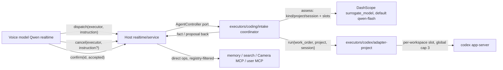

# 08. Project, Session and Work

> 摘要：语音模型不再操作 workspace/session 状态机，也不再看见项目清单。当前薄前端使用三个通用宿主工具：`dispatch(executor, instruction)`、`cancel(executor, instruction?)`、`confirm(id, accepted)`；非 agent 执行器保持直接工具：`memory__recall`、`search__search`、外部用户 allowlist 的 MCP 工具，以及内置 Camera MCP 的 `mcp__nova_camera__snapshot`。项目/会话编排下沉到 **coding 执行器侧**的 intake coordinator：`assess` 一步兼任 kind / project / session 决策（`latest | new` 仅二选一）；roster 只作为 coordinator 输入，不进 ContextView。**任何改变当前项目的决定都要用户确认**（明说切换、派到非当前项目的隐含切换、新建；产品决定 2026-09-04），只有当前项目内派单、steer、cancel 不确认。适配器锁从全局单飞改为**每项目一把**（`Map<workspace_id, RunSlot>`，跨项目全局 cap 3）；取消的是正在跑的 **work**，session 与历史保留。多个 work 并发时审批按 `{work_id, approval_id}` FIFO 排队，一次只对语音暴露一条。session 标题由宿主从 work order 生成，经 `RunInput.threadName` 由 transport 写回 Codex。里程碑 **M1.5b**，依赖 07。
>
> 修订（2026-09-03）：吸收对本卷改版稿的独立评审 12 条——审批 FIFO 队列、`cancel` 目标解析定型、`create` 仍走规划、跨项目选择必须给 `project_evidence`、并发改为每项目一槽、`dispatch` / `cancel` 为全局宿主工具绑定、`cancelDelegate` 论证更正。

## Historical baseline (superseded)

The following section preserves the pre-M1.5b review evidence only; the target
contract and current routing are defined by the controller registry and tools
below.

- Voice never calls `codex__run`. Coding work enters through
  `codex__project` with `work_order` (`codex-contract.ts:128–138`):
  `create_workspace | start_session | resume_session` → `#interceptIntake`
  (`service.ts` ~3823) → WorkOrder v2 → either silent
  `dispatchExternal({executor:'codex', op:'project'})` (`start_session`,
  `realtime-assembly.ts:826`) or propose-and-confirm via
  `codex__confirm_project_action`. Management actions
  (`list_workspaces | select_workspace | list_sessions`) bypass intake.
- A typical "改博客" needs `list_workspaces` → `select_workspace` (+confirm)
  → `start_session`: **≥3 tool round-trips** on a realtime model, each an
  audible pause.
- `session` and `workspace` are both model-visible concepts; users never say
  "线程三".
- Store (`project-store.ts`): `WorkspaceRecord{display_name,
  canonical_path, active_session_id, last_used_at}`,
  `ProjectSessionRecord{display_title, codex_thread_id, state, last_used_at}`.
  No summary/preview. Default title `任务 N`
  (`DEFAULT_SESSION_TITLE`). Title otherwise comes from the model's
  `session` string.
- Codex 0.152.0 `Thread` has `name` ("Optional user-facing thread title"),
  `preview` (first user message), `recencyAt`; methods `thread/name/set`,
  notification `thread/name/updated`. **No** auto-naming in app-server; Nova
  handles neither method on app-server-sourced threads.
- Concurrency: Runtime admits any number of delegates (`runtime.ts:1565`
  refuses only identical requests); adapters serialize with `#runActive`
  (`codex-common.ts:190`, `adapter-project.ts:280`) → second run = `busy`.
- Cancel: `ExecutorDispatchContext.signal` reaches adapters
  (`adapter-project.ts:283`); transport sends `turn/interrupt`
  (`app-server-transport.ts:1176`); `causal-runtime.ts:447` aborts on
  shutdown/deadline. **No model-facing cancel tool**, no per-delegate abort API.
- `workspace_context` item: produced by
  `RealtimeAssembly.#injectCurrentProjectContext` (`realtime-assembly.ts`
  ~608–678), content `<active_project_context>` + optional
  `<workspace_graph_context>`; revision bumps on content change; Qwen adapter
  delivers via `replace_provider_item` (`qwen.ts:393`); item cannot create a
  response (`protocol.ts:206`). Graph header is low-authority
  (`qwen.ts:253–260`).
- Frontend instructions naming `codex__project` etc.: `qwen.ts:134–250`;
  intake fact text `codex__confirm_project_action`: `intake.ts:293`.

## Goals

1. **One round-trip for the common case.** "改博客的暗色模式" with `blog`
   existing and active = one `dispatch(executor:'codex', instruction:…)`
   call; coordinator picks the project without exposing a roster. A
   non-active project still requires the project-confirmation FSM before any
   activation or dispatch side effect.
2. **Minimal model tool surface.** The host exposes only `dispatch` / `cancel`
   for agent work plus the unified `confirm` tool for host confirmations.
   Direct tools are limited by the
   FrontBrain budget in [03](03-capability-registry-and-mcp.md): the stable
   Nova surface includes `memory__recall`, `search__search`, and built-in
   `mcp__nova_camera__snapshot`; user-selected external MCP tools consume
   explicit additional budget. The voice model sees agent names **only** as
   the `dispatch.executor` enum from the controller registry (see 07).
3. **Session invisible by default.** Coordinator chooses `latest` or `new`;
   users never say "线程三"; no `<session_id>` in the model tool table.
4. **Concurrent projects.** Work in A keeps running while B is dispatched;
   desktop roster shows both; Floor semantics untouched.
5. **Confirmed cancellation of work, not sessions.**
6. **Titles humans can say.** Host-generated from the work order, written to
   Codex, mirrored back; `preview` as fallback; `任务 N` removed.
7. **Coordinator in the executor, not the voice model.** Project selection,
   session resolution, and cancel target resolution happen in
   `executors/coding/intake` via a cheap assess slot; the voice model sends
   natural language only.

## Non-goals

- Roster in ContextView for the voice model. The roster is coordinator input
  and desktop UI state only; `#renderActiveProjectContext` keeps
  workspace/session lines, not project lists.
- Voice archive / delete of sessions or workspaces — remains the desktop
  maintenance surface (`managed-workspace-maintenance.ts`).
- Multiple live Orbs; cross-project session merge; changing `plan_readback`
  semantics or the intake question policy from [02](02-intake-and-planning.md).
  `create` confirming under every `plan_readback` value is not an exception to
  this: that confirmation is the project-confirmation FSM (as today), not plan
  readback.
- Widening approval decisions (still boolean + scope per [01](01-codex-approvals.md)).
- Historical resume by `<session_id>` on the voice surface — desktop remains
  the maintenance/resume surface for named threads.
- Two sessions of the **same** project running at once. The run slot is
  per workspace because each workspace has one `CODEX_HOME` and therefore one
  app-server child; a second live session in the same project would need a
  second child under the same home, which is out of scope here. Concurrency is
  across projects only.

## Architecture



- **Agent controllers** publish `AgentDescriptor{name, summary, ownedChannels}`
  through the registry in [07](07-executor-boundary.md). The current coding
  controller owns the hidden `codex` channel. The M1.5c Vision controller owns
  the hidden `watch` and `guard` channels; its only voice entry points are
  `dispatch(executor: 'vision', ...)` and `cancel(executor: 'vision', ...)`.
  The voice model never names `watch` or `guard`; the host routes through the
  controller port to `executors/coding/intake` or the controller's equivalent.
- **Direct tools** are non-agent operations compiled from `model_visibility:
  'direct'` manifests: stable `memory__recall` and `search__search`, the
  built-in Camera MCP `mcp__nova_camera__snapshot` while the camera module is
  enabled, and explicitly
  user-selected external MCP tools. They have no coordinator and never enter
  coding intake. Hidden `watch` / `guard` remain runtime channels owned by the
  Vision controller, not direct model tools. Disabling the camera module removes
  the Camera MCP and the Vision controller/hidden channels as one assembly
  gate.

### Controller registry contract

The host constructs one closed `AgentControllerRegistry` before compiling the
voice surface. Each `AgentDescriptor` has a public `name`, bounded `summary`,
and exact `ownedChannels`; each `AgentController` implements `dispatch` and
`cancel`. Names and owned channels are unique, every owned channel names a
registered manifest, and every `model_visibility: 'hidden'` manifest has one
controller owner. The registry exposes descriptors for tool projection and
maps a runtime channel back to its controller, while `delegate.executor`
retains the exact channel identity. This is an M1.5c requirement, not a claim
that every controller or Vision path is already shipped.

## Model-facing tools (host-owned)

All host bindings are compiled by `tool-schema.ts` alongside direct tools. An
agent controller descriptor from [07](07-executor-boundary.md) is an **agent
surface**: its owned hidden executor ops (`run / steer / status / cancel`; project
bookkeeping is applied by the coordinator through adapter methods, not through
a model-facing op) are **not** compiled as `${name}__${op}`. The controller
name appears only as a value of the `dispatch.executor` / `cancel.executor`
enum, with summary lines in the tool descriptions. Direct manifests retain
their `${name}__${op}` tools.

`dispatch` and `cancel` are **one global binding each**, not one binding per
agent controller. `tool-schema.ts` uses the binding kinds
`host | delegate | query` (there is no `update` kind); host bindings have
`executor` / `op` set to null; the service
router reads the call's `executor` argument and resolves the controller by name
at call time. The enum values are collected from the controller registry; the
summaries go into the **tool description** as one line per controller
(`<name>: <summary>`), because a realtime function schema cannot be assumed to
support `oneOf` / `const` branches with a per-enum-value description. Zero
controllers registered → neither tool is compiled.

| Tool | Kind | Params | Notes |
|---|---|---|---|
| `dispatch` | write (`host` binding) | `executor` (enum of agent-controller names from registry), `instruction` (1–4000) | Description lists `<name>: <summary>` per controller; host resolves the controller, then opens the coding intake or its direct dispatch contract |
| `cancel` | write (`host` binding) | `executor` (enum), `instruction?` (1–4000) | Same description convention; target resolution in the controller (below); `async` |
| `confirm` | write | `id`, `accepted` (bool) | Unified yes/no for project proposals and executor approvals (below) |

Direct tools: `${name}__${op}` operations selected by registry and allowlist
(including `search__search` and `mcp__nova_camera__snapshot`). External MCP
tools are user-selected and consume the FrontBrain budget; they never appear
in the agent enum or enter intake.

**Removed:** `codex__project` (all six actions), `codex__confirm_project_action`,
`codex__confirm_codex_approval` / `host__confirm_approval`,
`codex__steer`, `codex__status`, and the interim `work__*` / `project__*`
host tools. Frontend instructions in `qwen.ts` and intake fact text are
rewritten for the new names.

**No status tool.** There is no voice-facing status tool and no `status`
coordinator kind. "跑到哪了" is answered from the existing
`active_executor_context` block in ContextView (`qwen.ts:85–93`), which already
carries the latest in-flight delegate's channel, state, elapsed seconds and
internal activity, with `memory__recall` as the fallback for older progress —
both unchanged from today. `steer` exists only as a coordinator kind reached
through `dispatch` (see Coordinator); it is not a tool the model can name.

### `dispatch`

1. Host resolves `executor` against registered controller descriptors; unknown
   → structured tool error.
2. Host calls `AgentController.dispatch({instruction, originalUserText,
   origin_ref, sessionEpoch, acceptedUserInputRevision, stillWanted})`; the
   controller owns the intake/coordinator decision and may dispatch only on its
   exact owned runtime channels.
3. Intake coordinator runs `assess` (see Coordinator) → branches on `kind`.
4. For `kind: 'work'` on the **active** project, existing intake flow: clarify
   → plan → dispatch through `dispatchExternal`; `plan_readback` gate
   unchanged from [02](02-intake-and-planning.md).
5. **Every decision whose target project differs from the active one is
   confirmed by the user through the project-confirmation FSM before any side
   effect** (product decision 2026-09-04): `work` on a non-active project
   (the implied switch) clarifies and plans like `work`, then proposes
   `{action: 'reuse' | 'resume', work_order}`; `create` proposes
   `{action: 'create', work_order | null}` — see Create below; `switch`
   proposes `{action: 'select', work_order: null}` with no plan cycle. The
   activation (and the dispatch, when there is a work order) happens inside
   `commitConfirmed` while the intake is `committing`, so a user turn during
   the commit is ignored rather than re-assessed. Only `work` on the active
   project, `steer` and `cancel` stay unconfirmed.
6. For `steer | cancel`, coordinator resolves the target work and routes
   directly to the adapter only when `intent_to_proceed` is true; intake closes
   without a plan cycle. A status question misclassified as either kind is
   stopped by that host gate before any effect. `kind: 'cancel'` is deliberately
   redundant with the explicit `cancel` tool: a voice model that routes "取消"
   through `dispatch` still lands on the same resolver instead of starting new
   work.

### `cancel`

Cancel is an explicit tool (safety action, not classified from speech). Target
resolution lives in the coding controller and is **asynchronous**:
`AgentController.cancel(AgentCancelRequest): Promise<AgentActionResult>`.
It is async because the >1 case may need one model call; the 0 and 1 cases
resolve without any model.

| Running works | Behaviour |
|---|---|
| 0 | `not_running` |
| 1 | Cancel that work immediately — no model call, `instruction` ignored |
| >1, no `instruction` | `ambiguous_work` listing `{work_id, project, title}` |
| >1, with `instruction` | One `resolveCancelTarget` call (below); `null` → `ambiguous_work` with the same list |

```ts
// Dedicated tiny call on the same `surrogate_model` as `intake.assess`.
// The cancel target is NOT a field on the assess schema: assess answers
// "should I ask again / which project" for an incoming objective, and a cancel
// carries no objective, so folding a `work_id` into it would widen the intake
// schema for a call that never opens an intake.
resolveCancelTarget(
  instruction: string,
  running: readonly {work_id: string; project: string; title: string}[],
): Promise<{target_work_id: string | null}>
```

The result is validated against the list the host passed in: `target_work_id`
must be one of the `running` ids, otherwise it is treated as `null`. A `null`
(or malformed / failed call) yields `ambiguous_work` with
`[{work_id, project, title}]` so the voice model can ask which one — the host
never guesses a target.

While that model call is pending, a new desktop `local_speech_onset` invalidates
the request independently of the serial provider event loop. The adapter
re-checks the captured onset and provider-input revisions before aborting any
run, so a spoken correction cannot stop the previously resolved target.

On a resolved target the adapter aborts the slot, sends `turn/interrupt`, and
returns handoff `{outcome: 'cancelled', …}`. Session and history survive.

### `confirm`

One tool for all yes/no questions the host surfaces. The `id` selects **which
FSM handles the call**, nothing more:

| `id` matches | Route |
|---|---|
| `approvalController.view.pending_approval_id` | Existing approval FSM |
| `projectConfirmation.view.pending_confirmation_id` | Existing project-confirmation FSM |
| neither | `unknown_confirmation` |

Routing is not a decision. Once an FSM has the call it still applies its own
carrier / origin / epoch / revision isolation exactly as today
(`ConfirmationTurnIsolation`, the two separate instances in `service.ts`)
before the decision is accepted; a call that fails isolation is refused by that
FSM, not re-routed to the other one.

`ApprovalController` and `ProjectConfirmationController` stay separate FSMs —
merging them is still rejected ([07](07-executor-boundary.md) Non-goals); only
the tool is unified. Ids come from host `idFactory` and do not collide. Prompt rules follow today's approval bar: call only when the user
clearly accepts or declines this turn; call once; same response — no speech
and no other tools; when ambiguous, wait for host clarification.

### Approval queue (concurrent works)

Concurrency makes approvals collide: two running works can each hit an
`on-request` permission at the same time, and the voice surface can only hold
one yes/no question. `ApprovalController` / `ApprovalBroker`
([07](07-executor-boundary.md) approval port) therefore gain a **FIFO queue
keyed by `{work_id, approval_id}`**:

- Exactly one approval is voice-visible at a time. It is the head of the queue,
  and it is the only one whose `approval_id` appears in
  `approvalController.view.pending_approval_id`.
- Later approvals from other running works are **queued, not refused**. This
  replaces today's `offer()` early return: `approval.ts:152` answers `null`
  when `#current !== null`, and the adapter turns that into a decline. Queued
  entries keep their Codex server request open — Codex is already blocked
  waiting for a permission response — so a queued approval loses nothing but
  its turn.
- The TTL (`CODEX_APPROVAL_TTL_SECONDS`) starts when the entry becomes **head**,
  not when it is enqueued, and the expiry timer is armed at the same moment.
  Otherwise a queued approval would burn its TTL unheard and expire into a
  `decline` (`#invalidateCurrent` resolves `decline`) — the exact failure the
  queue exists to prevent. Queue position has no deadline of its own.
- The head is replaced when it is decided (accept / decline) or invalidated
  (expiry, session epoch change, carrier loss). The next entry becomes visible
  in arrival order; making it visible re-runs the normal prompt path, so the
  user hears the queued question as its own approval turn.
- Because two works can be asking, the approval host fact and banner copy name
  the **project and session title** of the asking work
  (`"blog / 暗色模式：要改 3 个文件吗？"`), taken from the run slot, not from
  the executor's `operation_summary`. Without that the user cannot tell which
  work is asking.
- Queue depth is bounded by `MAX_CONCURRENT_WORK` × the per-work in-flight
  approval limit of 1 (Codex asks one permission per turn), so no extra bound
  is needed.
- Decisions never cross works: `acceptDecision` matches both `work_id` and
  `approval_id`, so a stale `confirm` for a finished work is `unknown`, exactly
  as today's single-slot behaviour.

## Coordinator (`executors/coding/intake`)

Intake moves from `realtime/` to `executors/coding/` (role-level shared, not
codex-exclusive). The cheap `assess` slot gains coordinator fields:

```ts
kind: 'work' | 'steer' | 'cancel' | 'switch' | 'create' | 'unclear'
project: string | null           // must be exact roster display_name, or null
project_evidence: string | null  // required when project ≠ active project
session: 'latest' | 'new'
```

There is **no `work_id` field**: the cancel target is resolved by the separate
`resolveCancelTarget` call above, not by assess.

**Assess inputs** (not visible to the voice model):

- Roster: ≤10 items `{name, last_session_title?, running: [{work_id, title}]}`,
  ordered by `last_used_at`.
- Active project name.
- User text / instruction.

**Assess rules:**

- Pick `project` only from roster verbatim names.
- Name not in the roster: **explicit create intent** ("新建一个 …", "开个新项目
  叫 …") → `create`; anything else → `unclear`. A name that merely does not
  match is never turned into a create proposal.
- Same running session, user adds requirements → `steer`, not new work.
- `unclear` → existing `candidate_question` mechanism (question budget from
  [02](02-intake-and-planning.md)).

**Wrong-project protection.** Selecting a project other than the active one is
the expensive mistake: work lands in the wrong repository and the user may not
notice until Codex reports. So a non-active selection must be *quoted*, not
inferred:

- Whenever `project` is not the active project, assess must also return
  `project_evidence`: the span of the user's utterance that names it
  ("改**博客**的暗色模式" → `博客`).
- The host verifies that span occurs in the raw utterance **and** overlaps
  (one contains the other) exactly one roster name, which must be the selected
  project, comparing after `stripLikePython`-style whitespace and case
  normalisation (`python-text.ts`). Missing, empty, not found, or a shared
  prefix (`pricing` with both `pricing-page` and `pricing-svc` in the roster)
  → the result is treated as `unclear` and FrontBrain asks the one-line
  question "是在 X 里做吗？" naming the selected project. A hallucinated
  project name therefore costs one question, never a dispatch. The one
  host-authored exception: when the latest turn's question is exactly that
  "是在 X 里做吗？" and the user affirmed it, X is accepted without the span
  check (an alias such as 博客→blog, or `blog` beside `blog-v2`, would
  otherwise loop).
- Selecting the **active** project needs no evidence: `project_evidence` may be
  null and is not checked.
- The readback line always names the project — the `summary` sentence under
  `plan_readback: 'summary'`, the proposal text under `'confirm'` — so even a
  verified selection is audible before Codex starts. `plan_readback: 'silent'`
  has no line by definition; a user who turned readback off accepts that a
  cross-project dispatch is only visible on the desktop, and the evidence check
  above is then the only guard.

**Kind routing after assess:**

| `kind` | Path |
|---|---|
| `work` (active project) | Clarify → plan → dispatch (today's intake) |
| `work` (other project) | Clarify → plan → proposal `reuse` / `resume`; confirmed commit activates and dispatches |
| `create` | Intake continues (below); always confirms |
| `switch` | Proposal `select` with `work_order: null`, no plan cycle; confirmed commit activates |
| `steer` / `cancel` | Adapter resolver, intake closes |
| `unclear` | Ask one clarifying question |

For `steer` / `cancel`, routing preserves the opening request and subsequent
question/answer turns in chronological order; an affirmation never replaces
the original instruction. The hidden project `steer` op and its underlying live
adapter accept up to 24,000 code points to cover the bounded intake (4,000
opening, up to eight 2,000-code-point answers and 300-code-point questions, plus
labels). The JSON-RPC request limit is 160 KiB to accommodate JSON escaping and
UTF-8 encoding plus the request envelope. Public `dispatch` still limits each
instruction to 4,000 code points.

### Create

`create` sets the intake target to
`{action: 'create', workspace_display_name: <name from the utterance>}` and
intake **continues**; it is not a short-circuit. Creating a workspace is
irreversible, so `create` **always** confirms, regardless of `plan_readback`:

| Utterance | Path | Proposal |
|---|---|---|
| Carries a coding goal ("新建一个 foo，把 README 翻译成英文") | clarify → plan, as `work` | `{action: 'create', work_order}` |
| Create-only ("新建一个项目叫 foo") | no plan cycle | `{action: 'create', work_order: null}` immediately |

Both are today's `ConfirmedProjectOperation` shapes, so no new commit path is
needed: `commitConfirmed` with `work_order === null` creates an empty
workspace and claims immediately (`adapter-project.ts` workspace-only branch),
and with a work order it creates the workspace and then runs the order
(`#runConfirmed` create branch). `plan_readback === 'confirm'` still gates plan
readback for `work`; action kinds no longer trigger separate confirm tools —
all confirmation goes through `confirm(id, accepted)`.

## ContextView (no roster)

`#injectCurrentProjectContext` keeps `<active_project_context>` (active
workspace path, active session title) and optional low-authority
`<workspace_graph_context>`. **No `<projects>` block.** The voice model does
not see project names in context; it sends natural language and the
coordinator picks from roster input.

Revision bumps when: store `active_binding_revision` changes, active session
changes, or a work starts/ends. The item still cannot create a response
(`protocol.ts:206`).

**Concurrent works need identity in the status block.** With one work running,
"跑到哪了" is unambiguous; with three, `active_executor_context` records
(`session-state.ts` `ActiveExecutorContextRecord`, up to 3 plus
`omitted_count`) carry only `delegate_id`, `channel`, `state`, `elapsed_s`,
`internal_activity` and the executor's `progress_summary` — nothing a person
can name. Each record's **`host_state` gains host-authored `project` and
`title`**, read from the run slot that owns the work (never from the
executor's progress text, which stays non-authoritative data). "博客那个在跑
测试，pricing 那个刚开始" then comes out of the existing block. This does not
reintroduce a status tool: it is the same item, one revision, two more
host-owned fields.

## Session semantics

Only `latest | new`; no `<session_id>` parameter and no `project__sessions`
tool.

- `latest`: resume `active_session_id` of the resolved project (or start the
  first session if none).
- `new`: start a fresh thread and make it active. Allowed **only when that
  project has no running work** — the run slot is per workspace (see
  Concurrency), so `new` cannot be used to run a second session of the same
  project in parallel.
- A new objective for a project whose work is running → `busy_project`
  (whichever `session` was chosen), and the voice model offers the two real
  options: `steer` the running work, or `cancel` it and start over. The
  coordinator may reach `steer` on the follow-up turn.
- Removed: `session_mismatch`, `busy_session` (renamed `busy_project`),
  `project__sessions`, voice-side historical resume by id.

## Resolution errors

Structured, never guessed. Returned to the voice model as tool errors with
stable codes:

| Code | When |
|---|---|
| `unknown_project` | Roster name not found; includes up to 3 `suggestions` (normalized match) and `hint: 'create'` |
| `ambiguous_project` | Two roster names match after normalization |
| `busy_project` | New objective for a project that already has a running work; carries `{work_id, title}` and `options: ['steer','cancel']` |
| `capacity` | `MAX_CONCURRENT_WORK` (3) exceeded; lists running `{work_id, project, title}` |
| `not_running` | Cancel with zero running works |
| `ambiguous_work` | Cancel with multiple running works and `resolveCancelTarget` could not pick one; lists `{work_id, project, title}` |
| `unknown_confirmation` | `confirm` id matches neither approval nor project confirmation |

## Concurrency

- Adapter lock becomes **per workspace** (`Map<workspace_id, RunSlot>`),
  replacing `#runActive`. One running work per project; different projects run
  in parallel. Within a project, one Codex thread admits one turn at a time
  (Codex constraint; same-turn additions go through `steer`), and a second
  session of the same project is not started while the first runs (see
  Non-goals) — hence the slot key is the workspace, not the session.
- Global cap: `MAX_CONCURRENT_WORK = 3` across projects, as a constant with a
  `ponytail:` comment (ceiling: one app-server child per `CODEX_HOME`, i.e. per
  workspace; upgrade path is a settings key once real usage shows the need).
  Exceeding it → `capacity` error naming running works so the model can offer
  to cancel one.
- Each workspace already has its own `CODEX_HOME`; the transport factory must
  allow one live app-server child per workspace concurrently, and must not
  admit a second child for a workspace that already has one.
- Floor is unaffected: each running work is an active-executor channel entry
  at priority 50; two concurrent works do not raise priority.
- Approval state, including the concurrent-work FIFO and its `hold` / `release`
  transitions, must live in one dedicated host module alongside the existing
  project-confirmation host module. This is an architectural requirement for
  one ownership point and race-free TTL/epoch handling, not a claim that the
  current implementation has already been refactored that way.
- Codex stdio MCP multiplies child processes: the v0.2 caps permit up to
  `3 projects × 8 external servers = 24` stdio MCP children. The settings UI
  should warn about this multiplier and recommend `streamable-http` for
  servers that can support it; the Codex projection remains outside the
  Qwen realtime tool budget.

## Cancellation

Cancellation is deliberately **adapter-level**, not runtime-level:

- `cancel(executor, instruction?)` → host → `AgentController.cancel` → adapter
  finds the slot → aborts the **run slot's own `AbortController`**, the one the
  adapter created for that work. The delegate's task controller inside
  `CausalRuntime` is not touched.
- `#runBound` (`adapter-project.ts:714`) observes its own AbortError while
  `slot.cancelling` is set, sends `turn/interrupt` once (`active.close()`
  already does this), and *returns* handoff `{outcome: 'cancelled', trust:
  'trusted_system', content: {reason: 'user_cancelled', work_id}}`. Being a
  normal return, it travels the normal completion path —
  `CausalRuntime.#ownTask` → `CoreRuntime.postExecutorResult` — so memory,
  speech, and bubbles need no special case. `ExecutorHandoff.outcome` includes
  `'cancelled'` (`events.ts`, `ports.ts`). Rejected alternative: overloading
  `refused` — cancelled work would look like a policy refusal in memory and
  speech.
- **`CausalRuntime` is not changed**, and there is no
  `CoreRuntime.cancelDelegate`. `#ownTask` (`causal-runtime.ts:399`) still
  posts a **normally resolved** handoff after its controller is aborted — only
  the rejection branch is suppressed (`!controller.signal.aborted`,
  `causal-runtime.ts:414`). So a runtime-level abort would produce a terminal
  fact only if the adapter converted the abort into a resolved `cancelled`
  handoff anyway; the adapter-level abort achieves exactly that without adding
  a runtime API. A new `cancelDelegate` would buy nothing and would put a
  cancel concept into a layer that has none.
- Public state: `running → cancelling → cancelled | failed`. The `cancel` call
  resolves as soon as the target is resolved and its slot aborted (at most one
  `resolveCancelTarget` round-trip in between); the terminal handoff arrives a
  moment later through the normal path ("博客那个已经停了").
- Session and history survive; desktop roster shows the session with
  `running: []`.

## Titles

- On `beginSessionForRun(workspaceId, title: string)` the host derives
  `display_title` from the work order: first sentence, stripped, ≤ 20 code
  points, `uniqueSessionTitle` disambiguation. `DEFAULT_SESSION_TITLE`
  (`任务 N`) and `nextDefaultSessionTitle` are deleted.
- New session: `RunInput.threadName = deriveSessionTitle(workOrder)`. That is
  the adapter's **only** job in naming.
- The **transport** owns the call: when `RunInput.threadName` is set it sends
  `thread/name/set {threadId, name}` right after firing `onThreadReady`
  (`app-server-transport.ts:413–418`, schema `app-server-schema.ts:77`).
  Failure is logged, not fatal; the adapter never sends the method itself.
- The transport also subscribes to `thread/name/updated {threadId, threadName}`
  and surfaces it as `onThreadNamed(threadId, name | null)`
  (`app-server-transport.ts:122–124, 867–872`); the adapter mirrors a non-null
  name into store `display_title` (truncate 120) — Codex is source of truth
  once a name exists.
- Desktop roster and session lists show `display_title`; legacy threads without
  names keep the store title.

## Desktop

- `project.state` adds `roster: [{name, last_used_at, running: [{work_id,
  title}]}]` for UI only (Orb sidebar, bubbles). Voice model does not read
  this wire.
- `pending_action` is `create_workspace | reuse_workspace | select_workspace |
  resume_session`: every change of the active project surfaces a confirmation
  pill whose text names the action (decision 2026-09-04).
- Progress bubbles and last-result key on `work_id` (`delegate_id`) so two
  concurrent works do not overwrite each other's bubble/last-result.
- Confirmation pill appears for every project proposal and executor approvals
  (both routed through `confirm` on the voice side). The approval pill shows
  the asking work's project and session title, and only ever shows the queue
  head — queued approvals from other works are not rendered until their turn.

## AgentController port (`agent-controller.ts`)

```ts
interface AgentController {
  readonly descriptor: AgentDescriptor
  dispatch(request: AgentDispatchRequest): Promise<AgentActionResult>
  cancel(request: AgentCancelRequest): Promise<AgentActionResult>
}
```

Host `service.ts` routes the single `dispatch` / `cancel` host bindings by the
call's controller name; it finds the registered `AgentController`. The coding
controller owns the intake coordinator and its roster/resolution seam, then
dispatches through the exact `{channel, op, request, origin_ref, stillWanted}`
runtime port. Assembly wires the coding controller's run callback as
`{op:'run', request:{work_order, project, session}}`.

## Implementation touchpoints

| Area | Files |
|---|---|
| Tools | `tool-schema.ts` (`host` binding kind, `dispatch.executor` enum + per-executor description lines), `work-tools.ts` (`dispatch`/`cancel`/`confirm` constants + `deriveSessionTitle`), `realtime/bridge.ts` routing |
| Intake move | `realtime/intake.ts` → `executors/coding/intake.ts`, `intake-model.ts`, `work-order.ts`; tests follow |
| Coordinator | `executors/coding/intake-model.ts` assess schema (+ `project_evidence`) + roster input, `resolveCancelTarget`; `intake.ts` kind routing and evidence verification; `executors/codex/adapter-project.ts` `resolveIntakeTarget` |
| Port | `agent-controller.ts` `AgentController`; `realtime/service.ts` `dispatch`/`cancel` routing by controller name, unified `confirm` routing |
| Store | `project-store.ts` (title derivation, per-workspace running state, roster query) |
| Context | `realtime-assembly.ts` `#injectCurrentProjectContext` (no roster), `realtime/session-state.ts` `host_state.project` / `.title`, `realtime/qwen.ts` render + policy text |
| Approvals | `approval-port.ts` + `executors/codex/approval.ts` FIFO queue keyed `{work_id, approval_id}`; `realtime/service.ts` approval fact naming project + title |
| Concurrency | `executors/codex/adapter-project.ts` per-workspace lock, transport factory, `MAX_CONCURRENT_WORK` |
| Cancel | adapter abort → `turn/interrupt`, `events.ts`/`ports.ts` `cancelled` outcome |
| Titles | `executors/codex/transport/app-server-schema.ts`, `-transport.ts`, adapter mirror |
| Prompt | `realtime/qwen.ts` FRONTEND_INSTRUCTIONS, `intake.ts` fact text |
| Desktop | `desktop-wire.ts`, `desktop-bridge.ts`, renderer `index.mjs` / `confirmation-controls.mjs` / `bubbles.mjs` |
| Tests | `tool-schema`, `realtime-intake`, coordinator eval, `adapter-project`, `realtime-service`, `project-store`, `realtime-qwen`, assembly, desktop wire; the 07 fixture executor gains a registered `AgentDescriptor` and ops `run / steer / status / cancel` so `executor-boundary-fixture.test.ts` drives the `dispatch` path |

## Verification checklist

Deterministic:

- [ ] Compiled realtime tool table: registered agent controllers expose
      `dispatch` / `cancel`, with one shared `confirm` (no `codex__*`, no
      `work__*` / `project__*`); registry-filtered direct operations retained;
      exactly one `dispatch` and one `cancel`
      binding of kind `host` with null `executor`/`op` for two registered agent
      controllers; `dispatch.executor` enum generated from the controller
      registry with one `<name>: <summary>` line per controller in the tool description and
      no per-enum-value schema branch; no status tool anywhere in the table
      (`tool-schema.test.ts`, `qwen-realtime-assembly.test.ts`).
- [ ] Coordinator assess: six kinds route correctly; roster verbatim enforced;
      not-in-roster with explicit create intent → `create`, otherwise
      `unclear`; `new` refused when that project has a running work.
- [ ] `project_evidence`: non-active selection without a verifiable span (absent,
      empty, or not present in the raw utterance after normalisation) →
      `unclear` + the "是在 X 里做吗？" question, never a dispatch; active-project
      selection dispatches with no evidence; readback names the project.
- [ ] Resolution errors: `unknown_project` + suggestions; `ambiguous_project`;
      `busy_project` with `steer` / `cancel` options; `capacity` at cap 3;
      `not_running`; `ambiguous_work`; `unknown_confirmation`.
- [ ] `create` keeps planning: with a coding goal → clarify/plan → proposal
      carrying a `work_order`; create-only → proposal with `work_order: null`
      and no `plan.compile` call; both confirm under every `plan_readback`
      value; confirm/decline/expiry through unified `confirm` unchanged from
      today's FSM tests.
- [ ] ContextView: no roster block; active project/session lines only; each
      `active_executor_context` record carries host-authored `project` and
      `title`; item cannot create a response.
- [ ] Per-workspace lock: two dispatches to two projects run concurrently under
      a fake transport; a second objective for a project with a running work →
      `busy_project`; cap 3 → `capacity`.
- [ ] Approval queue: two concurrent works each raise an approval; only the
      first is voice-visible and the second's Codex request stays open; the
      queued one becomes visible after the first is decided and after the first
      is invalidated; the fact/banner names project + title; a `confirm` for
      the queued id while it is not the head is not accepted; under a fake
      clock, holding the head past the TTL expires only the head and the
      queued entry still gets a full TTL once it becomes head.
- [ ] Cancel typing: 0 running → `not_running` with no model call; 1 running →
      cancelled with no model call even when an instruction is given; >1 with
      an instruction → one `resolveCancelTarget` call, an id outside the
      running set is rejected as `null` → `ambiguous_work` listing
      `{work_id, project, title}`; the assess schema has no `work_id` field.
- [ ] Cancel: adapter sends `turn/interrupt` once; handoff `cancelled` arrives
      through `postExecutorResult` with no `CausalRuntime` change; second
      cancel → `not_running`; session record survives.
- [ ] Titles: derived title ≤20 code points and unique; transport sends
      `thread/name/set` after `onThreadReady` only when `threadName` is set and
      the adapter sends the method nowhere; `thread/name/updated` mirrors via
      `onThreadNamed`; `任务 N` code deleted.
- [ ] Prompt goldens updated; intake fact text has no `codex__`.
- [ ] Desktop: `project.state` schema with roster (UI only); pill on every
      project proposal + approval; bubbles/last-result keyed by `work_id` under two concurrent
      works.
- [ ] Full `npm test` green; `check:executor-boundary` still zero violations.

Live (DashScope FastBrain / Qwen realtime, real Codex 0.152.0, macOS headset
first, Windows second). Each row records transcript, tool calls, and Codex
`thread/list` output as evidence in IMPLEMENTATION.md:

- [ ] **Cross-project dispatch.** With `blog` existing and not active, say
      "改博客的暗色模式". Expect exactly one `dispatch(executor:'codex', …)`,
      one confirmation prompt naming `blog` (pill `reuse_workspace` /
      `resume_session`), no activation before `confirm(id, true)`, then active
      project switched and bubble within 3 s.
      *2026-09-04: not run — needs a live voice session; only the coordinator
      half (non-active pick with verbatim evidence) is covered by the eval.*
- [x] **New session + title.** Say "在博客里重新开一个，把 README 翻译成英文".
      Expect coordinator chooses `session:'new'`, a new thread, and `thread/list`
      showing a name derived from the objective.
      *2026-09-04: `session:'new'` from `qwen-flash` on this utterance (eval);
      new thread + `thread/name/set` ok + `thread/list` name `新建 hello.txt`
      from the adapter smoke on real Codex 0.152.0 — not via voice.*
- [ ] **Concurrency.** Start a long task in A, then dispatch B. Expect both
      progressing, desktop roster showing two `running`, `active_executor_context`
      naming both projects, and a Guard alert still preempting speech
      mid-progress. Then dispatch a third objective into A → `busy_project`
      and a spoken `steer` / `cancel` offer.
      *2026-09-04: not run — single workspace, no parallel real children.*
- [ ] **Approval collision.** With two long tasks running under `ask`, drive
      both into a `file_change` approval. Expect one prompt at a time, naming
      its project; after answering it, the second prompt arrives on its own and
      its Codex request completes normally (no timeout, no lost approval).
      *2026-09-04: not run — smoke ran `ask_headless` (no approvals).*
- [ ] **Cancel.** Say "取消博客那个" with two works running. Expect one
      `resolveCancelTarget` call, `turn/interrupt` on the blog work only,
      terminal "已停" within the op deadline, the other work still progressing,
      and the session still listed.
      *2026-09-04: partial — `resolveCancelTarget` live with two works → `w-blog`
      (eval); one `turn/interrupt` + `cancelled` handoff + session still in
      `thread/list` with one running work (smoke). Two-works-live half not run.*
- [ ] **Unknown / ambiguous.** Say "改一下 pricing 那个" with both
      `pricing-svc` and `pricing-web` present → coordinator asks which; say
      "改 foo" with no `foo` → one clarifying question, **no** create proposal;
      say "新建一个项目叫 foo，把 README 翻译成英文" → create proposal carrying
      the work order → confirm → workspace created and the order runs.
      *2026-09-04: coordinator halves pass in the eval (`unclear` ×2, `create`);
      confirm → workspace creation → run not exercised live.*
- [ ] **Regression.** One `file_change` approval accepted by voice under
      `ask`; one declined via banner; YOLO profile runs a command without a
      prompt; both via `confirm(id, accepted)`.
      *2026-09-04: not run — no voice; `yolo` live is blocked by the
      `permissions: null` validator gap noted in IMPLEMENTATION.md.*
- [ ] **Latency.** Log tool round-trips per dispatch over 10 utterances;
      median must be 1 (today ≥3).
      *2026-09-04: not run — needs a live voice session.*

- [x] Coordinator eval (DashScope `surrogate_model`, default `qwen-flash` — the
  same model 02 pins for `intake.assess`; fixed roster, ~10 Chinese utterances
  covering switch / create / steer / cancel / ambiguity) with threshold in test;
  evidence in IMPLEMENTATION.md.
  *2026-09-04: `runtime/test/coding-coordinator-eval.test.ts`, 10/10 ×3 runs,
  safety 10/10, `resolveCancelTarget` 1/1.*

## Decision-record delta (apply on merge)

| Decision | Chosen boundary | Rejected alternative |
|---|---|---|
| Project selection | Executor-side coordinator (`assess` + roster input); voice sends natural language via `dispatch`; every change of the active project confirms (switch, cross-project work, create — decision 2026-09-04), create still plans; a non-active project must be quoted in `project_evidence` and verified against the raw utterance | Voice model picks roster from ContextView; six `work__`/`project__` tools; model-driven list/select/start state machine; trusting an unquoted project name; `create` short-circuiting intake |
| Voice tool surface | Three host tools (`dispatch`, `cancel`, `confirm`) plus registry-filtered direct tools; `dispatch` / `cancel` are one `host` binding each, routed by controller name; names only in the `*.executor` enum, summaries as description lines | Per-executor prefixed tools; one binding per controller; per-enum-value schema descriptions (`oneOf` / `const`); separate confirm tools per FSM |
| Session surface | `latest` / `new` only; coordinator decides; titles derived by host, sent by the transport via `thread/name/set`, owned by Codex afterwards | `<session_id>` parameter; `project__sessions`; model-authored session titles; adapter-sent naming calls; `任务 N` |
| Roster visibility | Coordinator input + desktop UI; not in ContextView; running works identified in `active_executor_context` by host-authored project + title | Roster in versioned `workspace_context` for the voice model; a status tool |
| Cancellation | Explicit async `cancel` tool; 0/1 running resolved without a model; >1 with an instruction resolved by a validated `resolveCancelTarget` call, else `ambiguous_work`; abort the adapter's own run-slot controller so the `cancelled` handoff returns through `postExecutorResult`; session survives | Speech-inferred cancel; optimistic cancel; a `work_id` field on the assess schema; overloading `refused`; a `CoreRuntime.cancelDelegate` API (buys nothing: `#ownTask` already posts a resolved handoff after abort) |
| Concurrency | Per-workspace adapter lock (one running work per project), global cap 3, Floor unchanged; approvals FIFO-queued by `{work_id, approval_id}` with one voice-visible at a time | Global single-flight; per-session locks with two live sessions per `CODEX_HOME`; unbounded parallel app-server children; refusing or auto-declining an approval that collides with another work's |
