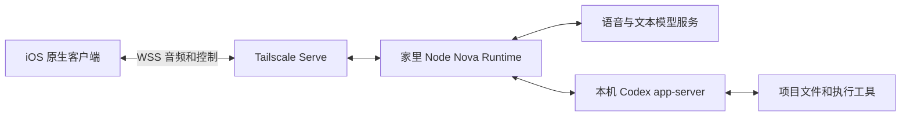

# iOS 远程语音客户端：设计提案

日期：2026-09-05。代码基线：`v0.2.0dev` / `9763e5045a4f15f6c37ba7e177c133a5438d58d9`。
状态：规划，尚未实现、未真机验证；是基于 v0.2.0dev 的并行开发方向，不自动加入 v0.2.0 发布门槛。
实施顺序见 [实施计划](IOS-IMPLEMENTATION.md)。

## 1. 目标与首版范围

用户在自己的 iPhone 上与 Nova 双向语音聊天，通过 Tailscale 连接家里的机器；Nova 在该机器上调用 Codex，手机显示字幕、项目、任务进度、结果与审批。

- 同一 repo，增加 `ios/Nova/` 原生 SwiftUI 客户端；Node + TypeScript 继续作为权威 Runtime。
- 第一部署目标为现有 macOS 开发机；常驻服务不引入 Electron 依赖。Linux 部署作为后续独立验收项。
- 建议 iOS 17+ 作为初始工程基线；这是产品选择，不代表相关 API 的最低要求。实际设备与 Xcode SDK 兼容性在创建工程前检查。
- 一个用户、一个服务实例、一个活跃语音客户端。第二连接返回 busy，不自动抢占。
- 首版覆盖前台聊天、打断、Codex 审批与任务结果，以及进程存活期间的断线恢复。
- 锁屏持续通话在单独真机门槛通过后开放；不承诺 App 被系统结束后自动开麦。
- 暂不做 APNs、手机相机、屏幕共享、后台唤醒词、手机直连模型、多端同时通话、服务重启后自动继续未完成命令。

## 2. 部署与职责



| iOS | 家里 Runtime |
|---|---|
| 录音、重采样、Voice Processing、耳机路由 | 模型连接、对话逻辑、工具路由 |
| 播放、即时停播、实际播放回执 | 播放代次、取消语义、上下文一致性 |
| 连接、Keychain 凭据、状态展示 | 身份校验、项目/任务状态、授权校验 |
| 审批按钮提交具体 proposal/approval ID | 检查 ID、时效、会话与授权绑定，消费一次 |
| 临时 UI 状态 | Codex 登录凭据、模型密钥、文件、MCP |

手机不直接访问 Codex app-server，也不把识别到的“同意”直接变成命令执行。保留现有 host-owned approval 与项目确认边界。

服务监听 localhost 固定端口，经 Tailscale Serve 提供 tailnet 内 HTTPS/WSS；不使用 Funnel。手机安装官方 Tailscale App，不在 Nova 中实现 VPN。tailnet 访问控制限制到用户设备，同时保留应用层凭据。

首版设备接入采用服务端本地命令生成高熵连接凭据，用户手动录入手机并存入 Keychain；服务端可轮换并立即断开旧凭据连接。凭据不进入 URL、日志或 Git。无需先建用户账户系统或一次性配对 HTTP 服务；二维码交换留给体验迭代。

## 3. 已存在的边界与需要补的部分

| 当前代码 | 观察 | 实施方向 |
|---|---|---|
| `runtime/src/desktop-entry.ts` | 组装 capabilities、MCP、Codex、telemetry、camera；依赖桌面 readiness 与父进程停止源 | 提取确实被两个入口使用的 production composition；增加独立服务入口 |
| `runtime/src/desktop-service.ts` | 统一生命周期 owner 与 readiness 回报 | 复用清理次序；桌面回报和服务 ready 日志分别注入，不伪造 Electron 父进程 |
| `runtime/src/desktop.ts` | localhost 随机端口、首帧认证、单客户端 | 旧入口保持默认；远程服务使用显式固定端口、独立远程握手路径 |
| `runtime/src/desktop-wire.ts` | PCM16、NOVA 二进制头、播放身份 | 提取文档与跨语言向量，直接复用媒体格式 |
| `runtime/src/desktop-bridge.ts` | disconnect fence、状态/结果重投、部分错误 abort | 明确连接级错误只关闭当前连接；保留真正的服务致命错误 |
| `runtime/src/desktop-realtime.ts` | 连接 generation 与发送泵 | 防止旧连接异步回调影响新连接 |
| `runtime/src/realtime/service.ts`、`realtime-assembly.ts` | 对话与执行资源生命周期 | 核对断网、provider 故障、显式结束会话分别如何影响任务 |

不批量重命名所有 `desktop-*` 文件，不复制一套 mobile Runtime，不把 Codex 专属逻辑移入通用客户端协议。现有状态文档是历史验收记录，能力装配以这次代码基线为准。

## 4. 协议边界

共享文件放 `fixtures/client-protocol/v1/`，协议说明放 `docs/protocols/client-v1.md`。所有新增协议名在契约工作包落地时冻结；本节是拟定的远程 v1 设计，不是现有接口说明。

- 远程入口使用 `/client/v1`；现有桌面入口及认证行为不变。
- 首帧认证通过后发送 `client.ready`，携带 `protocol_version: 1`、进程随机 `server_instance_id`、连接随机 `connection_id`、实际输入/输出音频格式、支持能力。认证前不发送状态或接受音频。
- v1 仅支持 mono PCM16 little-endian。采样率由已配置 provider 的实际适配链路得出并在 ready 中声明；不能从设备默认采样率推断，也不能只根据 PCM16 校验器推断。
- 下行媒体继续使用现有 NOVA 帧头及 `utterance_id / generation_epoch / sequence`；上行继续使用经过长度校验的 PCM16。
- 字幕、project state、executor state/progress/result、playback clear/terminal 和两类审批复用现有 payload。
- 需要回执的远程控制使用 `{type: "client.command", request_id, connection_id, payload}`，payload 只允许选定的现有控制 schema；服务端回复 `{type: "client.command_result", request_id, status}`。status 限于 `applied / rejected / stale`。
- `applied` 表示宿主接受该控制，不代表 Codex 任务完成。审批和任务结果仍由宿主状态事件证明。
- 同一连接最多保留 256 个请求结果；同 ID 同 payload 返回原结果，同 ID 不同 payload 拒绝；额度满后拒绝新控制并要求重连，不静默驱逐尚可重试的副作用请求。新连接 ID 下旧命令判 stale，手机不跨连接自动重发审批。
- 不重试媒体和播放回执；新连接清空本地播放队列并先恢复快照。首版不建立无限事件日志。
- 不支持的版本、非法长度、未知可执行控制明确拒绝；未知非执行展示事件可忽略并记录诊断。
- Camera/调试板默认不从远程路径暴露；远程会话装配时关闭相机能力，避免向用户声称可以看到手机。

## 5. 生命周期和授权

| 事件 | 期望行为 |
|---|---|
| 网络断开或发送积压 | 清理该连接媒体，已授权任务继续；监听服务保持可连接 |
| 用户打断播报 | iOS 立即清空本地声音，上报已有 speech/playback 控制；不等同于取消工作 |
| 用户结束通话 | 关闭音频设备和连接，任务继续；长时无连接的模型会话释放策略另行验证 |
| 新连接 | 同步项目、执行状态、待审批和有界结果，旧音频不恢复 |
| 审批期间断线 | 沿用宿主有效期与队列策略，不自动同意；重连只显示仍有效的审批 |
| 服务重启 | instance ID 改变，手机作新会话；旧审批失效，未完成任务不自动重新提交 |
| 第二设备连接 | busy；用户先断开原客户端再连接新客户端 |
| 服务显式停止 | 有界关闭资源，不能宣称正在运行的 Codex 无损存活 |

第一版可靠性承诺是“同一服务进程存活时，手机网络波动不取消已授权工作”。provider session 与 task owner 能否完全分离要由故障测试证明；未验证前不承诺模型连接故障也能保全任务。退出模型连接的优化不能先于这项所有权验证。

仅凭旧的内存结果缓存不能宣称服务重启后的恢复。首版 UI 必须区分 disconnected、busy、unauthorized、server restarted 与任务执行失败。

## 6. iOS 实现边界

建议目录：

```text
ios/Nova/
  Nova.xcodeproj/             # 提交 shared scheme；不提交个人签名和用户状态
  Nova/
    NovaApp.swift
    Connection/              # URLSessionWebSocketTask、Keychain、状态恢复
    Audio/                   # AVAudioEngine、重采样、播放进度与打断
    Protocol/                # Codable 与有界二进制解析
    Views/                   # 连接、通话、任务结果、审批
  NovaTests/                 # 协议向量与播放代次检查
  README.md
```

这些是计划路径，本次不创建空工程。Swift 工程不加入 npm workspaces；不引入 JS bridge 或新跨平台框架。

先做连接页和一张通话页；通话页包含字幕、静音、结束、项目/任务、待审批卡片。审批卡片显示项目、任务、具体请求与当前有效性，按钮只在收到宿主状态后更新成功。

使用 `AVAudioSession` 的 playAndRecord/voiceChat 和 AVAudioEngine Voice Processing；真机处理权限拒绝、系统中断、扬声器/耳机切换与重采样。实际播放进度来自音频渲染状态，不把接收/排队当成用户已听见。瞬时 speech onset 停播后仍走原有因果语义，不自行提交任务。

WSS 先沿用现有媒体链路。测量上传/播放积压并设有界队列；如果蜂窝丢包导致不可接受的 p95 延迟，再评估现有依赖中的 RTC 能力和 iOS 对接，避免提前添加第二套媒体栈。

## 7. 并行开发与发布

先落一个共享协议提交，再从同一基线开两个实现分支：

- `feature/nova-remote-service`：Runtime 与部署。
- `feature/nova-ios-client`：Swift 客户端，先连基于协议向量的模拟服务。

两条线使用不同 worktree；“同 repo”不等于两个开发者同时写一个 checkout。协议与 fixtures 由同一责任人修改，变更双方同步。服务端使用测试客户端验证，iOS 使用模拟服务验证，之后合流联调。

桌面连接常驻服务是后续第三个工作包，初版桌面仍按原模式启动自己的 Runtime。两实例不要同时占用相同可写项目/宿主状态目录；首版部署说明要求停掉同宿主桌面实例，桌面共享服务实现后再解除该限制。

服务运行分支不自动加入现有发布打包。iOS simulator CI 单独 job/workflow，签名和 TestFlight 分发单独配置；不修改现有 npm 安装 CLI 的桌面含义。

## 8. 验收与证据

- 跨语言：TS 和 Swift 对同一组帧、非法长度、Unicode、旧代次得出相同结果。
- 真实业务：语音请求 → 项目确认 → Codex → 权限审批 → 结果 → 语音回报。
- 故障：执行中断网、审批中断网、重连、重复请求、凭据轮换、第二客户端、服务重启。
- 真机：扬声器/AirPods、前台/锁屏、Wi-Fi/蜂窝切换、来电中断；模拟器不能替代 AEC 与后台验收。
- 记录首音延迟、局部停播延迟、上/下行积压、恢复时间，并记录 Tailscale direct/relay。建议初始目标：本地停播 p95 ≤150 ms，网络恢复可达后状态恢复 p95 ≤5 s；这是验收目标，非当前结果。
- 全部自动化检查通过只证明确定性行为；真机/家庭网络验收单独记录。

## 9. 官方参考

- [Tailscale Serve](https://tailscale.com/docs/features/tailscale-serve)
- [Tailscale iOS VPN On Demand](https://tailscale.com/docs/features/client/ios-vpn-on-demand)
- [Tailscale connection types](https://tailscale.com/docs/reference/connection-types)
- [Apple Voice Processing](https://developer.apple.com/documentation/avfaudio/avaudioionode/setvoiceprocessingenabled(_:))
- [Apple background recording](https://developer.apple.com/documentation/avfaudio/avaudiosession/category-swift.struct/record)
- [Apple background notifications](https://developer.apple.com/documentation/usernotifications/pushing-background-updates-to-your-app)
