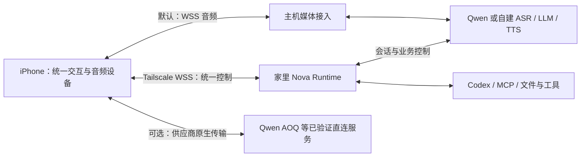

# iOS 多供应商语音接入：通用中转与可选直连评估 Spec

日期：2026-09-05。
状态：**Draft / 待决策，仅记录候选方案，不授权实施，不加入 v0.2.0 发布门槛。**

关联：[iOS 远程客户端设计](09-ios-remote-client.md)。本文是其多供应商语音接入候选扩展：通用中转为基础，Qwen AOQ 等直连为可选优化。保留原文件名以保持链接稳定。采用前须重新核对实际开发分支、SDK 和服务端接口。

## 1. 要解决的问题

当前方案通过 `iPhone ⇄ Tailscale ⇄ 家里 Mac ⇄ 语音服务` 持续传输音频。目标是在同一套 Nova 会话、UI、授权和任务体系中，同时兼容端到端实时模型和 ASR → LLM → TTS 级联管线，并允许具备条件的供应商通过手机直连减少音频绕路。Mac 继续运行权威 Agent Runtime、Codex 和工具。

基础路径保留主机中转，可接入现有 Qwen 与火山级联适配。Qwen AOQ 是第一个候选直连实现，不作为通用协议，也不要求其他供应商支持 AOQ。

这不是把 Qwen 模型部署到手机，也不是把整个 Node/TypeScript Runtime 移植到 iOS。

预期收益是降低接话和打断延迟、改善弱网播放稳定性。收益尚未测量；不能由“少一次中转”直接推导必然更快。Qwen 轮次检测、模型首音时间、设备音频缓冲仍然存在。

## 2. 已知事实与待验证假设

### 已核对的依据

- 2026-09-05 对 iOS 开发 worktree 的只读检查：`runtime/src/realtime/qwen.ts` 使用 WebSocket，音频通过 `input_audio_buffer.append` 发送，并配置 `turn_detection: {type: 'smart_turn'}`。这不是对所有 checkout 或运行中实例配置的保证。
- 客户端约定上行 16kHz、下行 24kHz、单声道 PCM16。双向持续传输合计约 80KB/s，不含 Base64、JSON、TLS 和网络开销；不能把该计算当作实际流量测量。
- Qwen 官方 AOQ 接入文档明确覆盖 `qwen-audio-3.0-realtime-plus`，列出 iOS SDK，并将 Audio 轨与 Data 轨分开。
- 官方描述 AOQ 为基于 QUIC 定制的实时传输方案；它属于模型接入层，不承担 Nova 的工具执行、授权或记忆。
- AOQ 使用服务端代理鉴权：长期 API Key 留在 AppServer，客户端使用本次连接的临时 Token。每次新连接须重新申请，不缓存复用 Token。
- Tailscale 直连与中继的性能不同；Connected 不等于 direct。当前手机网络是否直连需要现场测量。
- Qwen 的 `silence_duration_ms` 仅在 `server_vad` 生效，不能通过给 `smart_turn` 添加此参数来缩短判停。
- 当前主 checkout 的 `runtime/src/realtime/protocol.ts` 已定义 `RealtimeProvider`，覆盖会话连接、音频输入、上下文注入、响应创建/取消和事件流。`runtime/src/realtime/cascaded/provider.ts` 已实现此接口，内部组合 endpointing、ASR、LLM、TTS；级联配置支持火山 ASR/TTS 与 Qwen 或 Ark LLM。这是代码能力观察，不等于 iOS 全路径已验收。
- 火山官方提供整合 ASR/LLM/TTS、支持 iOS 的 RTC 实时 AI 方案；该托管方案不等于本项目的自建级联，也不证明现有语音 API 可直接复用其客户端鉴权。

### 采用前必须验证

- 当前账号、地域、模型版本是否实际开放 AOQ；SDK 能否在本机 Xcode 和目标 iPhone 上构建、签名和运行。
- AOQ Data 轨是否完整覆盖现有工具调用、结果注入、取消、响应身份、上下文更新及历史恢复需求，不能仅凭“Realtime 协议”宣称等价。
- Runtime 在不拥有模型音频 socket 的情况下，能否继续执行现有 Guard、确认、项目选择、取消及工具调度语义。
- SDK 的音频设备管理、Voice Processing、扬声器和耳机切换，是否能满足现有采集、AEC 和实际播放回执要求。
- 手机直连在 Wi-Fi、蜂窝网络以及网络切换时的收益、耗电和重连表现。
- Qwen 直连与现有火山级联能否复用同一套 UI、审批、工具及任务协议，而不把供应商字段泄漏到通用业务层。
- 不同实现对取消、播放位置、上下文注入的能力差异能否显式表达；不能把未支持的能力静默模拟成成功。

## 3. 候选架构与职责

### 3.1 分开处理管线与音频路径

| 维度 | 选项 | 约束 |
|---|---|---|
| 语音处理管线 | 端到端实时模型；ASR → LLM → TTS 级联 | 决定判停、识别、生成和合成的实现 |
| 音频接入路径 | 主机中转；客户端直连；后续独立媒体网关 | 决定媒体传输位置，不改变主机授权所有权 |

两者独立建模，但不是所有组合都可用。某供应商支持端到端模型，不代表它支持安全的客户端直连；音频双向传输也不代表各模型具备相同的插话理解能力。

图中媒体路径为候选分支；单次会话只选择一条。直连的业务控制初期通过手机转发，不暗示 Runtime 可以独立附着到同一个供应商会话。

| 接入方式 | 手机 | 主机 | 首轮定位 |
|---|---|---|---|
| 通用 WSS 中转 | 现有采集、播放和 UI | 现有 Qwen 或火山自建级联 | 默认、回退、兼容性基线 |
| Qwen AOQ | 专用 SDK 音频和事件适配 | 凭证申请、业务控制、授权和工具 | 可选 PoC |
| 火山原生 RTC 等 | 对应供应商适配 | 经验证的业务控制与鉴权 | 后续候选，不承诺现有自建级联可直接切换 |
| 独立媒体网关 | 连接网关 | 语音管线可部署于云端；家里执行工具 | 仅在多个供应商都需要避开家庭音频链路时评估 |

独立媒体网关增加部署、费用和状态同步成本，本轮不建设。首轮也不拆成手机分别直连 ASR 和 TTS、主机运行 LLM 的多连接管线；这需要额外协调判停、流式文本、播放和取消，须有独立收益证据。

### 3.2 统一业务语义，保留供应商差异

- 沿用 `RealtimeProvider` 的上下文、响应、工具和取消边界，以及既有客户端任务/审批协议，不另建一套 Agent Runtime。
- 现有 `sendAudio()` 假定音频进入主机，不能声称增加一个 AOQ provider 即可完成接入。候选改动是在建立会话时显式选择媒体路径，供应商适配负责连接与事件映射；直连时主机不调用虚假的空 `sendAudio()`。
- 通用层统一会话代次、response/tool-call 身份、字幕、工具请求与结果、审批、播放进度和取消状态。供应商原始事件须经过校验与映射，不能原样成为通用业务契约。
- AOQ Token、轨道、SDK 对象、火山鉴权字段和编解码配置留在各自适配层。长期密钥继续留在主机；不能把 AOQ 的临时凭证规则套到其他供应商。
- 不通过不断增加 `if qwen` / `if volcengine` 分支污染 UI、审批或 Codex 调度。初期只为已验证的两种实现建立最小接入边界，不提前构建插件市场或任意管线编排框架。

会话建立前，客户端报告可用接入实现，主机结合供应商能力和业务要求选择实际路径，并返回明确的选择结果。下表是需要协商的语义，不是已冻结的 wire 字段：

| 能力 | 决策用途 |
|---|---|
| 可用媒体路径、音频格式、设备 owner | 决定是否能建立连接；避免两套引擎同时采集 |
| 客户端连接凭证及撤销方式 | 无安全可用鉴权时禁止该直连模式 |
| 工具调用、结果与上下文注入 | 不满足现有业务契约时禁止启用工具模式 |
| 响应取消、实际播放回执、历史截断 | 区分本地停播和完整打断；缺失能力须明确处理 |
| 主机主动触发响应、播放前门控 | 判断 Guard 和任务播报是否可保持原语义 |

能力声明必须由适配验收支撑，不能只信客户端自报。必需能力缺失时，应在建连前说明原因并选择已验证的中转路径，或明确拒绝该模式；中转也不保证补齐模型自身缺失的能力。

### 3.3 直连模式的职责分配

以下以 Qwen AOQ 为例；中转模式继续沿用原有音频路径。

| 职责 | iPhone | 家里 Mac |
|---|---|---|
| 音频 | 采集、AEC、路由、播放、AOQ 连接 | 不持续转发原始音频 |
| 交互 | 字幕、星云动画、连接状态、审批 UI | 权威任务状态和审批判定 |
| 会话 | 传输状态、模型事件转发、执行已批准的会话控制 | 指令、工具清单、上下文策略、业务会话身份 |
| 工具 | 请求转发、结果送回对应模型会话 | 校验、授权、幂等、Codex/MCP 执行 |
| 凭据 | Nova 连接密钥存 Keychain；AOQ 临时凭证仅供本次连接 | DashScope API Key、Codex 凭据、临时凭证申请 |
| 恢复 | 重新建连、拒绝旧代次事件 | 任务持久化、状态恢复、决定结果能否注入新语音会话 |

普通聊天的音频直接往返 Qwen；家里仍参与会话控制、上下文策略和工具处理，控制事件可能持续往返。工具请求和结果仍有手机到家的网络延迟。

不假设家里可以独立附着到手机已建立的同一个 Qwen 会话。初始候选通过手机转发控制事件；若官方提供可用的服务端控制连接，另行验证后再选择。

## 4. Qwen AOQ 鉴权与连接流程

本节仅约束 Qwen AOQ 适配；其他供应商必须单独核验安全鉴权，不能要求用户把长期供应商密钥填入手机以绕过能力缺失。

1. 手机通过既有 Tailscale 私网入口连接 Nova，完成应用层凭据验证。加入 tailnet 本身不替代应用鉴权。
2. Runtime 校验单活跃客户端约束，为本次语音连接分配新的会话代次。
3. Runtime 使用本机 DashScope API Key 向官方鉴权接口申请连接凭证；模型和地域由服务端配置，客户端不能指定任意目标 URL。
4. Runtime 经已认证连接返回官方要求的 Token、会话 ID、端点和证书指纹等连接字段，并绑定本次 Nova 会话代次。
5. 手机使用凭证建立 AOQ 连接，按 Runtime 提供的指令、工具清单和模式配置模型。收到 `session.updated` 后才开启音频上行。
6. 手机将模型事件映射到当前业务会话；Runtime 校验工具请求并执行，手机将结果送回对应模型会话。
7. 断开后废弃该次连接凭证；下一次 connect 重新申请，不能自动重发上一会话的副作用请求。

用户不需要在手机填写 Qwen API Key。手机现有 Nova 连接密钥与 AOQ Token 是两种不同凭据。

凭证不得进入日志、字幕、URL 查询参数、分析事件或 Git。Token 申请应限流，并绑定已认证客户端与活跃连接；返回后不能假设 Nova 密钥轮换会自动撤销已经建立的 Qwen 连接，撤销语义须验证并明确实现。

官方允许提交可选 `clientIp` 辅助选择接入点；不能用 Tailscale 私网 IP 冒充客户端公网 IP，无法可靠获得时省略。

## 5. 会话与授权边界

本方案最大的成本是拆分模型连接与业务控制的所有权，而不是替换一条 URL。

- Runtime 继续拥有工具授权、项目选择、审批消费和执行状态。客户端转发的工具调用一律作为待校验请求，不能当作授权证据。
- 现有 proposal / approval、origin、response 等绑定不得退化为仅判断转录里是否有“同意”。
- 在既有协议上增加必要字段前，先确定会话代次、provider session、response、tool call、request ID 的映射；旧连接回调不得写入新会话。
- 工具调用需校验工具白名单、参数、当前项目、会话归属和幂等键。重复转发不能导致重复执行。
- Runtime 发送的指令、工具结果和取消控制，应由客户端确认应用结果；收到消息不等于模型已接受。
- 原始模型音频直达手机后，家里无法事后阻止已经播放的内容。须审计哪些 Guard 依赖先检查再播放：需要这种顺序的路径必须保留播放门控或中转，无法保持原有保证时不能启用 AOQ 工具模式。
- 客户端掌握临时模型连接凭证并不赋予主机执行权限；主机不能信任客户端自报的模型事件来源。

协议消息名、SDK 包装方式和具体模块拆分在 PoC 后冻结，不在本草案中创建第二套通用媒体框架。

## 6. 打断、音频设备与失败处理

### 打断

手机检测到插话后应及时停止或衰减本地播放，并同步模型取消与实际播放位置。停止扬声器、取消模型生成、取消主机工具是三个独立动作，不能互相替代。

本地检测可能误触发，恢复策略须验证。不能以“手机立即静音”宣称云端响应和上下文已同步取消。若 SDK 无法获得可靠播放位置，需明确替代方案及对历史截断准确性的影响。

### 音频设备

PoC 选择单一采集/播放 owner：复用原生音频层或使用 AOQ SDK 的设备管理，不能让两套音频引擎同时占用麦克风并处理回声消除。必须验证扬声器下边听边说，以及耳机、系统中断后的恢复。

### 断线与回退

| 场景 | 候选行为 |
|---|---|
| Qwen 断线、家里仍在线 | 保留主机任务状态；重新申请 Token，新建语音代次；不重放旧工具调用 |
| 家里断线、Qwen 仍在线 | 首个 PoC 暂停语音会话并提示重连；不假装仍可执行工具，不引入离线聊天模式 |
| 工具执行中手机断线 | 沿用现有主机任务生命周期；断线不自动取消已经授权的工具 |
| 工具完成时模型会话已失效 | Runtime 保存结果；由恢复策略决定是否送入新会话，不盲目注入旧 response |
| AOQ 不可用或收益不足 | 用户结束本次会话后切回现有 WSS 中转；不在活跃轮次里无缝双发 |

PoC 保留现有中转入口作为对照和回退，默认不改变已有部署。只允许一个音频发送路径和一个活跃模型语音会话，防止重复回答或重复计费。

## 7. 评估方案与决策门槛

### 对照设计

- A：现有手机 → Tailscale → Mac → Qwen 的 WSS 链路。
- B：手机 → Qwen 的 AOQ 链路，家里只处理控制和工具。
- 固定同一手机、模型、地域、音色、指令、轮次模式、音频路由与测试语句，交替运行 A/B。
- C：现有火山 ASR → Qwen/Ark LLM → 火山 TTS 经主机中转，用于验证共享契约与回归。C 的模型和管线不同，不能用 A/B/C 总延迟直接归因 AOQ 优劣。
- 第一轮保持 `smart_turn` 不变，避免把轮次模式变化误算成协议收益。之后单独比较 `server_vad + 500ms`，记录抢话和错误判停率。
- 覆盖 Wi-Fi 与蜂窝；记录当次 Tailscale direct / relay。网络切换、家里连接故障单独统计，不混入正常网络样本。
- 每个主要场景至少 30 次有效轮次作为初筛，记录样本量、p50/p95 和失败率；小样本 p95 仅供方向判断，通过后再做持续真机验证。

### 测量指标

| 指标 | 定义与证据 |
|---|---|
| 接话延迟 | 手机侧用户语音结束到第一段实际可听输出；不能只测收到音频包 |
| 本地打断延迟 | 插话开始到扬声器停止旧回答；日志配合录音或回环测量 |
| 云端打断同步 | 取消事件、旧 response 停止、上下文实际播放位置是否一致 |
| 播放稳定性 | underrun、断续次数、最大待播时长、积压增长 |
| 工具延迟与正确性 | 请求到主机、审批、执行、结果注入分段计时；重复执行次数 |
| 恢复 | 网络重新可达到会话可用时间；是否有旧代次音频或结果泄漏 |
| 设备成本 | 固定时长前台通话的耗电、温度、崩溃与设备路由异常 |

使用手机单调时钟测端到端体验；跨设备时间戳不能未经校准直接相减。网络 RTT、各端局部耗时和相关 ID 用于辅助归因。日志默认只保留元数据；测试录音另行明确留存范围。

### 建议的采用条件（待用户决策，非现状承诺）

- Qwen 直连与火山自建级联均通过共享会话、UI、审批和任务契约验收；不要求火山支持 AOQ，也不要求它在首轮实现直连。
- 在目标日常网络中，接话 p95 同时改善至少 20% 和 200ms，或者在真实弱网下获得足以改变体验的稳定性收益；需保留 A/B 原始证据。
- 本地打断 p95 目标 ≤150ms，且云端取消、上下文和工具状态一致。
- 授权、重复事件、旧代次、断网恢复、扬声器 AEC 均通过；不能用平均延迟改善抵消正确性退化。
- 无明显耗电或维护负担倒退。若中转本来只占少量延迟，优先保留现有架构。

## 8. 最小验证顺序与成本判断

1. **接口核验**：取得实际 iOS SDK，确认鉴权、构建及必需事件支持；以 Qwen AOQ 和现有火山级联填写能力矩阵，先识别业务契约差异，不先改 Runtime。
2. **纯聊天 PoC**：用临时凭证完成真机双向语音、打断和 A/B 测量，不启用主机工具。
3. **控制边界 PoC**：接一个只读主机工具，验证事件映射、结果注入、重复调用和断线。
4. **跨实现与故障验收**：Qwen 直连、Qwen 中转、火山自建级联运行相同的审批、重复工具请求、取消、旧代次、断网和结果恢复场景。验证仅在会话边界切换实现、任务状态仍由同一 Runtime 拥有；业务代码不依赖 AOQ 字段。
5. **采用决定**：证据通过后才制定正式实施计划；否则保留中转，不继续扩展。

纯聊天 PoC 范围较小；生产接入成本主要在会话所有权拆分、Guard 等价性、音频设备集成和真机故障验证。SDK 尚未实测，不给出确定工期。

完整 Runtime 移植不属于此方案。只有产品明确要求“家里离线时手机仍能独立编排并完成大量任务”，才另行评估；移植编排逻辑也不会让手机获得 Mac 的文件、终端和 Codex 环境。

## 9. 参考资料

以下官方资料于 2026-09-05 查阅；实施前复核。官方能力说明不等于本项目已验证结果。

- [Qwen Audio AOQ 接入、iOS SDK 与临时凭证](https://help.aliyun.com/zh/model-studio/real-time-voice-conversation-using-aoq-access-qwen-audio-3-0-realtime-plus)
- [Realtime 模型接入方式与 AOQ 定义](https://platform.qianwenai.com/docs/api-reference/realtime-api/connect-model)
- [Realtime Token 鉴权](https://www.alibabacloud.com/help/zh/model-studio/realtime-token-authentication)
- [Qwen Audio 客户端事件与轮次参数](https://help.aliyun.com/zh/model-studio/fun-audiochat-client-events)
- [Tailscale 性能建议](https://tailscale.com/docs/reference/best-practices/performance)
- [火山对话式 AI 实时交互方案](https://www.volcengine.com/docs/82379/1393085?lang=zh)

## 10. iOS 开发分支首轮落实（2026-09-05）

用户本轮已授权按本文完善接入；上文 Draft 的“不授权实施”是原评估状态，不构成本轮额外审批要求。此 checkpoint 落实通用中转能力协商与 SDK 接口核验；不代表 AOQ 生产接入或采用门槛通过。

- 已实施：`hello.media.transports` → 主机根据实际生产配置选择 → `client.ready.media`。管线 integrated/cascaded 与 relay 路径分开表达，客户端持有唯一音频设备 owner。协商失败先拒绝、后续不调用 Runtime admission。没有新增 Agent Runtime 或供应商控制框架。
- 兼容：旧 v1 客户端/服务端仍走原中转；明确声明但不支持的路径不得静默接受。AOQ-only 拒绝；同时提供 relay 时明确选择 relay。不支持会话中切换或双发。
- 官方 AOQ iOS SDK v1.2.0 已下载并核验 arm64 iOS Swift 导入及公开方法 typecheck。下载来源为参考资料 SDK 下载页，归档 SHA-256：`ea01f00ab3c78e061d082faa5e30f9906b9156f9f6cfd2630509b54cd19e24b4`。二进制仅放临时目录，没有作为 App 依赖或提交。
- 实际公开接口有 `pauseAudioPlayer`、`interruptAudioPlayer`、`onPlaybackAudioFrame`、音量回调和 Data 轨。PCM 帧包含时间戳与 pushSequence，但没有显式 response/item ID；不能据此宣称逐响应实际扬声器播放回执已满足。对采样时间戳、音频归属、缓冲播放门控与取消同步仍需真机 PoC。
- 尚未实施/验收：Token broker、AOQ 真机纯聊天与 A/B、provider-control 映射和工具模式。先完成文档第 8 节的 SDK/纯聊天验证，再按证据引入实际需要的控制契约；不预先宣称直连更快。

回归入口：`runtime/test/client-server.test.ts` 的能力协商和拒绝前 admission 检查、`server-entry.test.ts` 的两类管线配置、`ios/Nova/NovaTests/ProtocolTests.swift` 的未知媒体 fail-closed；保留断线、旧代次和播放账本回归。UI 同步移除空对话占位卡、重复状态和装饰性标签，只在有字幕时呈现对话。

## 11. AOQ 纯聊天实现（2026-09-06，实测待完成）

- 后端 `NOVA_AUDIO_AGENT_SERVER_MEDIA_MODE=relay|aoq_chat` 启动时切换，默认 relay。AOQ 独立凭证代理不加载 Runtime/provider/Codex/MCP；避免默认管线与 SDK 同时建立模型连接。模式切换需要结束通话并重启服务；执行任务中的 relay 不应切换。
- iOS 设置可选择跟随主机/主机中转/AOQ 实验聊天，显式选择不兼容时拒绝，不偷偷回退。AOQ 不展示审批或任务能力，只有聊天；现有 relay 授权与任务通道保留。
- `aoq.connect` 绑定 connection_id/request_id，每连接一次领取，跨连接每分钟 6 次预算。长期 API Key 只在服务器；官方端点固定、禁止重定向、请求超时和响应上限、输出仅白名单。端点 route_index 映射成 SDK routeIndex。
- iOS 独立 AOQAudio adapter 是该通话唯一音频 owner；session.updated 后启用采集/上行。控制连接失效、后台和结束通话销毁 SDK；generation/live 隔离旧回调。启动过程中禁用静音/扬声器，避免未生效的假静音。主机 WSS ping 3 秒后发送、5 秒截止，超时终止 SDK；不宣称瞬时发现断网。
- SDK v1.2.0 通过 `ios/Nova/scripts/fetch-aoq.sh` 校验固定 SHA-256 下载；不将供应商二进制纳入 Git。设备构建嵌入签名，模拟器不声明 AOQ 能力。
- 本地停播调用 SDK interruptAudioPlayer；未宣称逐 response 实际播放位置与云端历史截断等价。此限制是只启用纯聊天、不接工具模式的验收边界之一。
- 星云保持同一套星点分布与连续相位，最大局部半径扰动 3.5%、星点尺寸 12%、亮度增量 0.10；不再整团收缩。后台不累计相位，Reduce Motion 保持静态。

已验证：49 个后端回归、11 个 Swift 协议/播放检查、设备签名构建。尚未验证：本次真实凭证申请、SDK 真机建连、双向语音/打断/AEC、弱网和 A/B 收益。不能将可编译/模拟协议通过写成真实 AOQ 体验已通过。

### 2026-09-06 真实鉴权与部署补充

用户明确授权所提供的北京业务空间 API Host。现场验证发现旧 DashScope HTTP 地址返回空 404，官方地域说明也仅列其 HTTP/SSE/WebSocket 支持；已改为后端必须配置、严格校验的业务空间专属域名。服务端函数不接受任意 URL、端口、路径或查询参数，重定向仍禁止。

通过 Nova 原有 safeStorage 读取保存的 DashScope Key（仅内存），真实凭证申请通过：2 个接入点、7200 秒有效期。没有输出/保存临时凭证。AOQ broker 已在既有 Tailscale WSS 入口启动，握手返回 `qwen_aoq_chat_v1` / `chat_only` / `audio,captions`；iPhone App 已打开并连接调试控制台。此结果仍不代表真实双向音频或 A/B 门槛通过，需要用户说话后的验收。

### AOQ 真机启动路由修复（2026-09-06）

- 用户遇到“音频设备已切换，请重新连接”：AOQAudio 将 SDK 路由通知当作致命错误；采集启动产生的异步通知可能在 `configured = true` 后处理，直接销毁刚启动的会话。
- 删除 `expectedRoute` 和路由通知中的断开逻辑，由唯一音频 owner AOQ SDK 管理路由；采集/播放失败和系统中断仍结束会话。不使用启动宽限计时器。日志仅记录路由数值、configured 状态和采集就绪，不记录凭证或对话。
- 设备 SDK Swift typecheck、签名构建、系统信任环境下 codesign 校验通过；Terra 复核无 blocker。真机语音收发仍待用户验收，不能据此宣称 AOQ 延迟或耳机切换已通过。

## 12. AOQ 接入持久 Runtime（2026-09-06）

已验证原 AOQ 聊天真机可听到回复，用户反馈流畅；后续新增独立 `aoq_runtime` 服务模式和 `qwen_aoq_runtime_v1` 协议，不给旧 chat-only 客户端静默增加工具权限。

- 音频：iPhone AOQ SDK 独占麦克风、AEC 和播放，Audio 轨直连模型，主机不接收或发送 PCM。
- 控制：SDK Data 事件通过现有私网 WSS 的 `aoq.event` 送到主机；主机复用 Qwen 事件归一化、RealtimeService、Runtime 与 Codex。`aoq.command` 将唯一一份 host-owned `session.update`、工具结果、取消及续答发回同一个 SDK 会话。Runtime 模式手机不再自行配置 session。
- 权限：主机编译 tools/instructions；调用保留原 provider item/response、user origin 和 Runtime 准入规则。项目与执行审批复用现有 `project.state` / `executor.approval` 卡片及 `client.command`。客户端不指定模型 endpoint 或执行器配置。
- 生命周期：服务先打开监听再等待手机接入；等待手机不消耗 SDK 握手时限。断开先隔离旧 epoch，再释放 SDK Data socket；现有 provider replacement barrier 等待下一次手机接入，Runtime/Codex 继续存在。握手失败记录无敏感内容的诊断，并释放本次连接。Runtime 内部需要重连时也会结束手机当前通话，需要重新连接并点开始语音，不宣称无缝恢复。
- 边界：每条事件至多 64 KiB，封装至多 128 KiB；方向白名单、connection_id、连续 sequence 校验，256 KiB 队列预算；普通命令仍使用原去重协议，控制命令与 provider 事件分开处理，避免等待工具结果时堵住结果事件。纯聊天仍禁止 Runtime 控制。
- 播放：不生成假的 audio delta / played_ms / heard 回执。SDK 的真实逐 response 播放关联与完整截断语义仍未验证；必须保留这一限制，不能据此认定语音确认等价于桌面所有场景。

验证：50 项生命周期回归、扩展 110 项 broker/授权/项目确认/旧 origin 回归通过；14 项 Swift 检查及真机签名构建通过。Terra 架构复核通过。端到端 AOQ 工具链与实际真机创建项目验收单独记录，不以这些测试替代。

### 首轮 Runtime 真机联调修复

- 真机已完成 SDK `session.created` / host `session.update` / SDK `session.updated`，主机记录 `aoq_provider_connected`，手机记录 capture ready。随后出现的 4003 提示不能归因于密钥。
- broker 漏掉官方 `conversation.item.input_audio_transcription.delta` 和 `conversation.item.ambient_audio_transcription.delta/completed`；补齐后依然只由最终正式转写建立来源，不把 partial/ambient 当执行授权。认证后协议拒绝改为 1002，并记录安全的事件类型/原因码。
- 实际主机存有 11 个项目；store 最多返回 20 个、UI wire 最多接受 10 个。修复 `publicProjectView` 使用既有 `MAX_ROSTER` 投影，保留完整存储。12 项目回归与原并发项目测试 8/8 通过；私网实测 `project.state` 返回 10 项且无待确认项。
- 仅认证但未创建 SDK 的连接关闭时，不再排入额外 provider replacement；每条连接传递 `hadProviderAttachment`，UI 始终释放，native PCM 的默认替换行为不变。
- 回环工具链测试覆盖 SDK Data→broker→Qwen adapter→RealtimeService→CausalRuntime→模拟执行器，以及正式来源、伪造来源拒绝、重复调用只执行一次、function_call_output/response.create。该测试不等于实际 Codex 写入俄罗斯方块项目成功。
- 外部 Claude 指定模型 review 尝试 180 秒无输出后超时，未取得 review 结果。

### Runtime 修复后检查

- 完整 `npm run check` 通过，包括 TypeScript、ESLint、环境契约、Node parity、执行器边界和能力契约；新增 parity 条目逐项关联现有行为测试，保留既有审计结论。
- 修复后 AOQ broker/adapter/工具链、DesktopRealtime、项目并发和 server entry 定向回归 51/51 通过。
- 恢复中断后退出的本机服务，使用现有密钥经 Tailscale 入口实测握手返回 `qwen_aoq_runtime_v1` / `runtime`，并成功收到 `project.state`。未轮换密钥。
- 当前 Apple 真机调试列出 iPhone unavailable；仍待手机通过 Tailscale 重新开始语音，验证实际项目确认与 Codex 执行。此项未完成，不能用模拟执行器测试替代。
