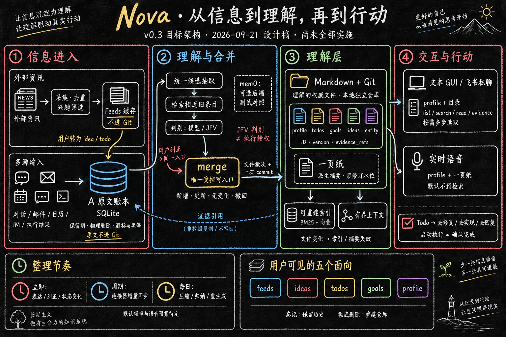

# 07 Memory、信息渠道与交互设计

> 状态：设计稿。2026-09-21 脑暴收敛；待评审后进入实施计划。
> 本卷只记录设计与代码核查结果；未修改产品代码、迁移数据或执行新的产品 live 验收。

## 1. 目标与已确认方向

Nova 的核心是交互：通过文本和语音理解用户、持续维护上下文，并帮助用户推进事情。记忆服务于交互，同时允许用户检查依据、纠正和撤销。

| 已确认方向 | 含义 |
|---|---|
| 五象限 | 面向用户呈现 feeds / ideas / todos / goals / profile；不要求底层分成五套存储。 |
| 文件为真，只覆盖理解层 | profile、五象限对象、entity、一页纸以 Markdown 为权威并纳入 Git；原文账本（06 卷 A 阶段）留在 SQLite，不进 Git。索引与缓存可删除、可重建。 |
| 尽量自动整理 | 模型抽取和判别后自动维护信息，减少逐项确认；保留推断标识、依据、纠正与撤销。 |
| 整理节奏混合 | 明确表达、纠正和 todo 状态变化入库时立即合并；压短、归纳、带日期更正、profile 派生段与一页纸重生成每日批量执行。 |
| mem0 不进写路径 | 现有 merge 是唯一写入口；mem0 保留为可选后端与抽取质量的测试对照，不做 Markdown 管理层。 |
| feeds 以外部资讯为主 | 类似个性化 RSS；不把后台抽取候选或记忆变更日志直接当成资讯流。 |
| 个人信息主要进入 todo | 邮件、日历、IM 用于发现和更新与用户有关的行动事项；普通通知不必生成待办。 |
| 更新频率可配置 | 用户可以配置自动更新频率，例如每天。默认值和配置粒度待讨论。 |
| todo 提供行动入口 | 主操作可为"去修复／去实现／去回复"，另有直接标记完成的勾选入口。 |
| 区分文本与语音 | 文本支持按需深入检索；语音优先使用简短 profile 与记忆一页纸，控制实时交互延迟。 |
| IM 三角色都纳入 | 飞书既是信息来源、提醒投递渠道，也是与 Nova 私聊的文本入口；后者走与桌面 GUI 相同的读取策略。 |
| 忘记与彻底删除分开 | 忘记保留历史；彻底删除丢弃历史重建仓库。Git 的具体实现暂不展开。 |

以下章节给出设计建议。未定项集中在第 8 节，不将建议写成已实现或已批准的契约。

## 2. 五象限与信息来源

| 视角 | 用户看到什么 | 与其他信息的关系 |
|---|---|---|
| feeds | 外部资讯及其摘要、来源、时间 | 按兴趣和目标筛选；用户可围绕资讯讨论，形成 idea 或 todo。 |
| ideas | 想法、灵感、尚未承诺执行的方向 | 可以发展为 goal 或 todo，不自动等同于行动承诺。 |
| todos | 需要推进的具体事项、状态、截止时间及行动入口 | 来自用户表达或个人信息渠道，可关联 goal、idea 和原始依据。 |
| goals | 持续目标及达成条件 | 关联多个 todo；任务数量或全部勾选不必然等于目标达成。 |
| profile | 稳定偏好、相关背景和沟通习惯 | 为筛选和对话提供上下文，区分明确表达与推断。 |

**建议：** 五象限共享实体、证据和修订；feeds 是信息呈现，todo 等是可维护对象，profile 是有依据的长期理解。邮件或 IM 中的稳定偏好仍可支持 profile，但不把私人信息混入外部资讯流。

IM 的三个角色分别配置范围与权限：读取选定会话作为信息源、投递提醒、让用户与 Nova 私聊。前两项已有部分实现；第三项是文本模式的一个入口，绑定同一主机会话，身份映射与投递范围在 04 卷补充。

## 3. 建议架构



*目标架构示意，尚未全部实施。黑板报对应本卷主流程；事实与派生摘要、来源生命周期、访问范围和写入恢复的补充评审意见见 §9，图不替代文字契约。*

用户提出的链路"存储结构 → 杂乱信息 → 结构化抽取 + 整理 + 判别 → 整合 → 证据 → 对话"映射为：

```text
外部资讯 → 采集、去重与个性化筛选 → feeds（缓存，不进 Git）→ 用户转为 idea／todo ─┐
                                                                             │
对话／邮件／日历／IM／可核验执行结果 → A 原文账本（SQLite，保留期与物理删除）←─┘
                                          ↓
                   结构化抽取 → 检索相近条目 → 判别（配置模型或 JEV）
                                          ↓
                                  merge：唯一受控写入口
                                          ↓
                       B／C 理解层（Markdown 权威，Git 版本审计）
                    profile ／ goals ／ ideas ／ todos ／ entity ／ 一页纸
                                ↓                   ↓
                     可重建检索索引（BM25＋向量）   有界上下文投影
                                ↓                   ↓
                     文本 GUI／飞书私聊按需读取     语音 profile＋一页纸
```

证据不是最后补上的独立层：理解层每个文件的 `evidence_refs` 指向 A 中的原文记录，来源、候选、修订、摘要和对话引用保持可追溯。用户纠正回到同一个受控写入口，再传播到索引和所有投影。

### 3.1 存储与写入边界

**为什么 A 留 SQLite，B／C 上 Markdown。** 边界不是"文件还是数据库"，而是"证据还是理解"：

1. 06 卷已定 IM 与邮件原文 30 天保留期、断开来源物理删行。原文进 Git 后到期清正文等于改写历史。理解层文件体积小、变化慢，值得保留历史；原文流水相反。
2. 文本模式要向 agent 暴露 grep／搜索。理解层目录便于限制检索范围，但二手产物不天然脱敏，集中画像仍可能敏感；仍须按用户身份、来源授权和渠道范围限制读取。原文若在同一目录树里，一条 grep 就可能翻出全部邮件正文。
3. 游标、hash 去重、幂等重放需要索引结构，在文件系统上重造一套没有收益。

**文件布局（建议，字段名待实施规格定）：**

| 对象 | 落点 | 进 Git |
|---|---|---|
| profile | 一个文件，分明确表达段（仅经 merge 写入，保留稳定 ID 与证据 ID）和派生段（每日整理重生成，仍经 merge 发布）；内容覆盖生活背景、自主性校准和沟通风格，推断单独标记 | 是 |
| goals／ideas／todos | 每条一个文件；状态、截止、关联 id 在头部 | 是 |
| entity（人、项目、工作区） | 每个一个文件，别名列表是检索命中面 | 是 |
| 一页纸 | 派生文件，带生成时间与所依据的修订水位；只是缓存 | 是 |
| feeds | 外部资讯缓存；用户转为 idea／todo 时才生成理解层文件 | 否 |

头部字段：稳定 `id`、`kind`、`aliases`、`version`、`origin`（stated／inferred）、`evidence_refs`、`valid_until`，以及 kind 专属状态字段。正文是带日期的事实列表；更正以带日期的条目替换原句，旧句可在正文或 Git 历史中查到。文件之间用 `[[id]]` 互链。

**写入规则：**

- **唯一写入口不变。** 06 卷 `merge` 的签名、NOOP／add／update／tombstone 语义、纠正优先、乐观并发全部保留；改变的只是输出，从 SQLite 行变成"写一批文件 + 一次 commit"。模型不得绕过 merge 直接改文件；用户在编辑器里手改文件视为一条 `written_by = user_correction` 的修订，由主机在下次读取时识别并入账。
- **原子性。** 一次 merge 涉及的多个文件先写临时目录再发布，随后 commit。恢复时仅清理可确认属于本次 merge 的临时文件；未提交的用户手改保留并作为 user_correction 入账，不允许整仓回滚到上一次 commit。已发布但未完成的批次须按操作记录与版本检查恢复，遇到用户并发修改保留冲突，不能盲目覆盖。Git commit 本身不是事务，游标、原文与修订仍需一致恢复；具体协议在实施计划中定义。
- **派生数据。** SQLite 中的修订表与向量表退为可重建索引，不能保存文件中不存在的唯一事实。
- **用户数据目录独立于产品源码仓库，默认不推送远端。**

迁移建议：先统一写入契约，再迁 LifeService JSON 与现有修订表；保留原数据直至条数、ID、引用、版本、纠正和遗忘行为校验通过。不得形成长期双写。

### 3.2 抽取、判别与 mem0

**统一两套抽取器。** 现有 `understanding/` 产 todo／idea／goal 候选写 LifeService，`memory-substrate` 自抽 fact／commitment 写修订表，来源、候选、修订契约各一套。建议收敛为一个候选契约：抽取器输出带原文引用与 kind 的类型化候选；判别器检查归属、语气、证据支持和保留价值；merge 按 kind 应用专属规则。LifeService 的状态机、idea 转 todo／goal、幂等回执作为 kind 专属规则进入 merge，不再是独立存储。

**补上"检索相近条目"这一段。** 现有 merge 的 NOOP 判据是归一化后内容等价，属于字符串级去重；条目身份靠模型复现同一个 key。判别前应先用理解层索引检出相近旧条目（同实体、同主题、别名命中），把"旧条目 + 新候选"一起交给判别器，输出新增／更新／无变化。这是"不吃辣"与"不喜欢辣的东西"能合并、"喜欢日料"能被"吃腻了"带日期替换的机制。

**mem0 的结论。** 用户提出借 mem0 避免手写整理循环。核查 `mem0ai` 3.2.0 OSS 后：其 `add()` 的抽取 prompt 明确只做 ADD；先向量检索 10 条旧记忆，但只用于去重和 `linked_memory_ids` 关联，不产生 UPDATE／DELETE；衰减仅云端可用，OSS 直接报错；默认也从 assistant 消息抽取。它同样缺"检索相近条目后判合并"这一段，且不带证据引用并集、stated 优先、版本校验。因此 mem0 不进写路径、不做管理层；现有 `runtime/src/mem0/` 保留为显式选择的可选后端。另一个零成本用法：同一份 fixture 分别跑 Nova pipeline 与 mem0，事件不一致处即待审 case。

**JEV。** 可替换判别器，适合批量判归属、语气、承诺强度这类选择题；不是写入者，不授予执行权限。当前基准 fixture 的 64 题中 32 题为助手标注参考，没有人工 gold；先做人工标注对比再决定默认权重。"同事想学日语"不能成为用户目标，"有空再看看"不能自动变成明确承诺，这类样本应进入标注集。

### 3.3 整理节奏与更新频率

三档调度，各自职责清楚：

| 档 | 触发 | 做什么 |
|---|---|---|
| 立即 | 用户明确表达、纠正、勾选完成、取消 | 入库、检索相近条目、判别、merge 写文件；使旧索引与一页纸对应段落失效 |
| 连接器同步 | 每 k 小时，用户可配 | 邮件／日历／IM／目录增量入 A；抽取候选走"立即"档 |
| 每日整理 | 每天一次，时间可配 | 压短与归纳派生内容，重生成 profile 派生段与一页纸；涉及明确事实的更正另经 merge 校验，不以摘要覆盖明确表达段 |

**建议：** 提供"每天／每几小时／手动"和"立即更新"；外部资讯、个人信息同步、每日整理可以分别设置。默认周期、每日执行时间、时区待讨论。

每类更新显示上次成功时间、覆盖范围、当前状态和失败原因。重复同步应幂等；应用休眠或离线后合并补跑。桌面退出后不承诺继续同步。明确纠正、取消和完成事项立即写入并使旧索引和旧摘要失效；后台摘要尚未生成时使用修正后的有界上下文，不能等到下一个周期才停止使用旧事实。模型不可用时保留已入账来源并允许重试。

### 3.4 检索

- **关键词：** 在理解层文件之上建 BM25（SQLite FTS5 trigram，中文不依赖分词器），可整库重建；现有词法路径是子串计数，不是 BM25。
- **向量：** 沿用现有 embedding 与融合排名，仍受 06 卷外发同意约束；embedding 不可用时保留关键词检索。
- **别名：** 写进头部后，grep、BM25、模型自己翻目录三条路都能命中，成本最低。
- 删除内容不再被搜索或下钻；索引在文件更新后重建对应条目。

### 3.5 文本与语音读取

| 交互 | 注入上下文 | 深入读取与降级 |
|---|---|---|
| 文本 GUI、飞书私聊 | 简短 profile、当前对话、记忆目录（每文件一行 id／标题／别名） | 四个只读工具 `list`／`search`／`read`／`evidence`；允许多步查找，返回来源与版本。 |
| 实时语音 | 预生成的简短 profile＋记忆一页纸 | 默认不预检索、不每轮长检索；是否允许一次工具往返及超时行为待实测延迟后定。 |

目录优先于硬塞 top-k：先给模型索引，让它决定翻哪里。一页纸包含当前关注事项、近期重要变化、未完成承诺，带生成时间、覆盖范围和修订水位；它是派生摘要，不能反过来成为事实来源。文本工具限定在理解层目录内，不暴露原文账本目录或 Git 历史。

### 3.6 todo 行动入口

| 示例 | 主操作 | 独立状态操作 |
|---|---|---|
| 修复登录错误 | 去修复 | 勾选已完成 |
| 实现导出功能 | 去实现 | 勾选已完成 |
| 回复项目邮件 | 去回复 | 勾选已完成 |
| 审阅方案 | 去审阅 | 勾选已完成 |

**建议行为：** 主操作启动关联执行或打开带上下文的对话；缺少必要信息时在该对话中补齐，不重复创建任务。todo 关联行动类型、执行上下文和完成依据；文案由行动含义决定，不凭标题关键词猜执行权限。profile 的"自主性校准"段是行动入口提示"直接做还是先问"的依据来源，但只是有依据的推断，不是授权。

自动整理、启动执行、确认完成是三种不同动作。模型从邮件抽出 todo 不代表允许发送邮件；点击行动入口也不立即标记完成。执行中展示进度，失败或等待用户时保持可继续状态。用户勾选可直接表达完成；自动完成需要可核验结果。

### 3.7 Git、忘记与彻底删除

忘记：当前文件删去条目并写一条带日期的修订，历史保留，可回滚。彻底删除：保留当前树，丢弃全部历史重建仓库，一次性完成。带日期的文内更正保住语义审计，不依赖 Git 历史。用户已确认不在本卷展开 Git 实现细节。

## 4. 实现现状与差距

以下为 2026-09-21 的代码阅读结果，不代表本轮重新运行验证。

| 部分 | 当前实现 | 与目标的差距／代码入口 |
|---|---|---|
| 唯一写入口 | `merge` 已有 NOOP／add／update／tombstone、纠正优先、乐观并发、纠正后抑制旧证据 hash；`write` 事务写修订表并清向量缓存 | 输出仍是 SQLite 行；[store](../../../runtime/src/memory-substrate/store.ts)。 |
| 检索相近条目 | 条目身份是 `kind:key` 的 hash，展示给模型的 existing 列表只含同一证据派生的行 | 缺对全量理解层的相近检索；[resource](../../../runtime/src/memory-substrate/resource.ts)。 |
| 两套抽取器 | `understanding/` 产 todo／idea／goal 候选写 LifeService JSON；`memory-substrate` 自抽 fact／commitment | 契约未统一；[pipeline](../../../runtime/src/understanding/pipeline.ts)、[life](../../../runtime/src/personal-agent/life.ts)。 |
| JEV | 已是候选判别默认，返回归属、语气、支持、重要性判断及概率 | 基准无人工 gold；[jev](../../../runtime/src/understanding/jev.ts)。 |
| 摘要刷新 | 两段式摘要，校验 entry_id@version，条目变化后失效 | 尚无每日整理与一页纸；[memory-overview](../../../runtime/src/personal-agent/memory-overview.ts)、[host](../../../runtime/src/personal-agent/host.ts)。 |
| mem0 | 显式选择的可选后端；`disableHistory: true`，事后删除 assistant 归属条目 | 不承担合并判定；[worker](../../../runtime/src/mem0/store-worker.ts)。 |
| 记忆检索 | 词法与向量融合；词法为分词后子串计数 | 不是 BM25；[retrieval](../../../runtime/src/memory-substrate/retrieval.ts)。 |
| 文本／语音 | 已有回忆、证据工具及有界预检索 | 无目录注入与双模式策略；[prerecall](../../../runtime/src/memory/prerecall.ts)。 |
| feeds | 固定 RSS，运行时每 15 分钟轮询 | 频率未接用户配置；见 [five-tab 记录](../../design-notes/2026-09-20-five-tab-personal-space.md)。 |
| 连接器 | 周期同步、增量来源、权限生命周期 | 需统一用户频率配置；[Composio](../../../runtime/src/connectors/composio/index.ts)、[macOS](../../../runtime/src/connectors/macos/reader.ts)。 |
| 飞书 IM | 选定聊天采集、机器人提醒卡片及反馈 | 私聊入口未实现；[Feishu](../../../runtime/src/connectors/feishu/index.ts)。 |

换存储时需要保留现有版本冲突检查、异步权限重验、遗忘抑制、来源删除失效及重启恢复能力，不能只替换 factory 或文件格式。

## 5. 实现与验收记录

| 时间／证据级别 | 已记录内容 | 边界 |
|---|---|---|
| 2026-09-12 历史实现记录 | 记忆底座、统一回忆、飞书连接引导及自动化／界面检查 | 失败、跳过和未验收项保留在本地记录中。 |
| 2026-09-20 历史 live 报告 | 合成事实和真实模型／embedding 验证抽取、召回、证据 ID、重启及删除失效；桌面跨会话回忆 | 详见本地 memory live acceptance 记录。未证明真实私人连接器处理或麦克风回忆。 |
| 2026-09-21 代码核查 | 对照现有规格检查底座、Life、抽取、JEV、mem0、检索和连接器边界 | 只读核查，未重新运行产品验收。 |
| 2026-09-21 架构评议 | 本地 Claude CLI 提出写入口收敛、历史删除、摘要新鲜度等风险 | 第二意见，不是能力验证。 |
| 2026-09-21 脑暴收敛 | 定下存储边界、整理节奏、mem0 结论、IM 私聊入口、忘记与彻底删除；核实 mem0ai 3.2.0 add 只有 ADD | 仅文档变更，不代表已实施 Markdown 迁移、BM25、每日整理或双模式读取。 |

## 6. 建议验收清单（均待本方案实施后执行）

每项同时保留可重放用例与最小 live 结果；记录输入、实际输出、证据 ID、版本、耗时及失败。

| 层次 | 最小验收场景 | 通过依据 |
|---|---|---|
| 文件与恢复 | merge 写文件中途中断并重启；重复入账；用户手改文件；用户与模型并发修改 | 无半截写入残留，手改成为 user_correction 修订，冲突可见；旧数据迁移可校验和回退。 |
| 检索 | 删除 SQLite 索引后从 Markdown 重建；中文关键词、别名、精确 ID、语义改写；embedding 断开 | 权威文件不变，预定相关结果可找回；降级可见；删除内容不再被搜索或下钻。 |
| 抽取与判别 | 真实模型处理否定、转述、模糊愿望、明确承诺、后续取消；相近旧条目 | 区分归属与确定性；相近条目被识别为更新而非新增；不把他人事项或模型建议当作用户承诺。 |
| 来源与调度 | 授权测试账户产生一条邮件／日历／IM 变更，设定频率并同步；每日整理跑一次；暂停、撤权和重连 | 更新与范围一致、重复运行幂等；整理只出新修订；撤权后旧任务不能回写。 |
| 五象限 | 真实资讯进入 feeds；个人行动进入 todo；idea 转行动；纠正 profile | 来源可打开、对象关联正确；自动更新可撤销，不覆盖用户已纠正内容。 |
| 行动入口 | 点击"去修复／去回复"、重复点击、执行失败、用户勾选完成 | 上下文正确传递、不重复执行；启动不冒充完成。 |
| 文本与语音 | GUI 与飞书私聊检索并下钻；真实麦克风跨会话回忆；纠正后立即再次询问 | 两种文本入口使用相同目录与工具；语音回答使用有效一页纸；测量首个响应与完整回复延迟。 |

端到端至少验证以下三条链路：

1. 外部资讯更新 → feeds 可见 → 用户讨论 → 形成 idea／todo → 点击行动入口 → 查看执行结果。
2. 授权个人来源变化 → 自动整理 todo → GUI 或飞书私聊查依据 → 语音询问 → 用户纠正／取消 → 所有入口不再使用旧状态；忘记后历史可查，彻底删除后仓库重建。

3. 贯穿迁移与整理的用例：“我不吃辣” → 换种说法不重复 → “最近可以吃一点”更新当前认识并保留时间范围 → 新会话使用新状态 → 用户纠正立即生效 → 重启不退回旧状态。保留实际输入输出、对象 ID、版本及证据，并检查多次每日整理后明确表达不漂移。

先用合成内容和隔离数据目录跑通合同，再以授权真实账户和原生客户端验收。

## 7. 与已有规格及参考材料的关系

- [06 记忆底座](06-memory-substrate.md) 的证据、受控修订、只读投影继续作为基础；本卷把 B／C 的权威表示改为 Markdown + Git，06 卷已追加对应调整段。
- [03 用户视角记忆](03-user-memory-view.md) 的依据、纠正、遗忘继续保留；profile 文件是分段的带日期事实列表，不是 D3 拒绝的叙事画像。
- [02 需求发现与动态页](02-need-discovery-and-feed.md) 的历史 `feed_item` 是主动建议事项，不与本卷外部资讯 feeds 等同；命名和迁移待后续统一。
- [04 来源与 connector](04-sources-and-connectors.md) 的授权、暂停、断开和删除边界继续保留；本卷补充可配置更新频率与飞书私聊入口。
- [five-tab 个人空间记录](../../design-notes/2026-09-20-five-tab-personal-space.md) 记录了 LifeService、NewsService 与 JEV 默认判别的现状。
- Instinct 分析原文与讨论截图（仅本地保存） 提供读写分离、目录优先、profile 三段和一页纸思路。它是外部行为逆向推测；每日周期、冲突处理不能当作已验证事实。
- [OpenClaw 官方说明](https://docs.openclaw.ai/concepts/memory) 与 [检索说明](https://docs.openclaw.ai/concepts/memory-search) 是 Markdown 与混合检索并存的参考。
- mem0ai 3.2.0 结论来自本地 `node_modules/mem0ai/dist/oss` 源码核查，不来自其文档宣称。

## 8. 待讨论事项

| 事项 | 需要定下的边界 |
|---|---|
| 更新频率默认值 | 连接器同步周期、每日整理时间、时区及离线补跑规则。 |
| 文本／语音读取预算 | 文本目录上限与渐进读取；profile／一页纸大小、刷新时机、语音深入查询及超时策略；以真实延迟和准确性测量定值，边界与验收见 §9.1。 |
| 自动整理与完成判据 | 低置信度与矛盾信息如何呈现；每类行动怎样验证完成，哪些结果仍需用户验收。 |
| JEV 人工标注 | 标注集规模与来源；与配置模型对比的通过线。 |
| 抽取器统一的迁移顺序 | 先统一契约再迁 LifeService 与修订表，或先迁 LifeService；影响双写窗口长短。 |
| 飞书私聊身份与范围 | 飞书用户与本地用户的映射、允许的会话与证据读取范围、私聊是否可触发执行；边界与验收见 §9.1。 |

讨论收敛后再更新对应卷的正式契约与实施计划。本卷不新增已发布 API，也不修改现有模型、客户端或存储接口。


## 9. 补充架构评审（2026-09-21，待讨论）

**评审判断：认同总体方向，以下建议尚未成为已批准的实施契约。** Markdown + Git 的价值是让用户可查看、编辑和追踪理解；记忆质量仍取决于候选抽取、相近检索、合并和读取，不能由存储介质保证。优先统一候选契约与受控 merge，保留原文和理解的边界，采用即时状态更新加每日整理。

### 9.1 五个边界的评审依据与验收

访问范围和读取预算统一在 §8 跟踪；下表补充理由与验收，不另设一组待定事项。

| 议题 | 当前设计的歧义或风险 | 建议与最小验收 |
|---|---|---|
| profile 事实与摘要 | 原表述混用权威事实和每日摘要；§3.1 已明确分区，仍需验证整理不会改变明确表达 | 明确表达保留稳定 ID、证据和 stated 标识；推断单独标记；注入对话的简短 profile 为派生投影。同文件分区即可，不必增加存储系统。一页纸即使进 Git 也不成为事实来源。连续整理后明确偏好不漂移，摘要不能作为新事实的证据。 |
| 原文到期与派生理解 | 原文删除后，长期理解可能仍有价值，但 evidence_refs 已不能保证下钻原文 | 沿用 [06 卷](06-memory-substrate.md) §4 来源撤回级联墓碑及 §5“证据已删除”的悬空显示，不重复立项。仅需明确正常到期、用户要求忘记是否采用与断开来源相同的派生处理；已定删除契约继续有效，差异待评审。 |
| 理解层访问范围 | 二手产物可能集中暴露个人情况，Markdown 不能自动提供脱敏与授权 | list/search/read/evidence 均由主机校验身份、来源权限及渠道范围；evidence 受控下钻，不开放原文目录。飞书私聊与本地主体绑定后仍须校验读取范围；跨身份及未授权来源查询不可泄漏目录、摘要或正文。 |
| 文件批次与恢复 | §3.1 已去掉整仓回滚并要求保留用户手改；多文件批次的可见性与恢复协议仍待实施规格细化 | 定义操作 ID、所属文件变更、读者可见时点，以及 SQLite 入账状态与 Git 批次的恢复关系；保留并接纳用户手改，不能一律当半截写入丢弃。覆盖中断重启、重复处理和用户并发修改。这里补一致性要求，不展开 Git 删除实现。 |
| 读取预算与兜底 | 全文件目录随数据量增长；语音一页纸无法覆盖所有细节 | 文本目录设大小上限并通过 list/search 渐进展开。语音维持默认不预检索；遇到一页纸未覆盖的明确回忆请求，允许受预算控制的深入查询或明确说明未覆盖，策略待测。测试大目录、摘要失效和具体历史追问的准确性与延迟。 |

### 9.2 判别器与实施顺序

- mem0 不进入主写路径的架构理由，是 Nova 需要统一的证据、版本和纠正规则；不依赖某个 mem0 版本能力不足才能成立。本次补充评审未重新核验 mem0 源码，§3.2 为此前版本核查记录。
- JEV 保持可替换。人工标注、误记／漏记和更新判定质量先于默认权重；助手标注的参考答案不等同于人工 gold。
- 建议顺序：统一候选与 merge 契约 → 补相近条目检索及更新语义 → 迁移 LifeService JSON／修订表到文件 → 每日整理与文本／语音读取。每步独立验证，不将全部改动攒成一次迁移；正式顺序仍列为 §8 待讨论项。

贯穿各步的最小用例：“我不吃辣” → 换种说法不重复 → “最近可以吃一点”更新当前认识并保留时间范围 → 新会话使用新状态 → 用户纠正立即生效 → 重启不退回旧状态。验收应保存实际输入输出、对象 ID、版本和证据，不以成功写文件或测试数量代替体验结果。
