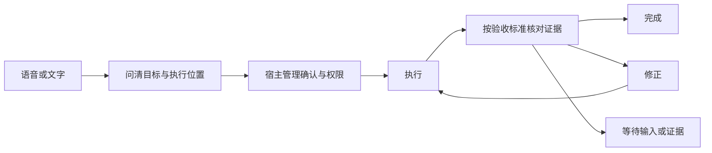

# 工作原理

小诺把对话、授权上下文和后台执行连接起来。Workbench 让待办、想法、目标和交出去的任务与对话并排；宿主管理权限和任务状态，执行结果带着证据返回。

## Workbench 与上下文

待办、想法、目标、资讯、任务和「关于我」与语音、文字对话共享一个窗口。你可以切成悬浮球，或进入隐藏窗口的后台模式：桌面麦克风关闭，任务继续运行。

授权的文件夹、邮件、日历和飞书为个人记忆、Profile 和建议提供来源证据。读取来源与允许配置的模型处理内容，是两项独立授权。部分待办可以按已启用的设置自动记录；飞书直接 @ 提及需要两项同意。记录待办不代表授权执行。详见 [Workbench](workbench.md) 和[资料来源与连接器](sources-and-connectors.md)。

## 从需求到结果

对话模型理解需求，Nova 管理执行位置确认、权限和任务状态；任务循环对照验收标准核对执行器证据，再决定完成、修正或等待，执行器结束本身不等于任务完成。你可以接管，直接与执行器交流，再交还给小诺。详见[任务](tasks.md)。

创建或切换项目需要确认。权限请求只针对具体操作，不会因之前批准过其他事情就自动放行。识别失败不会被当作同意、拒绝或取消。

## 项目与会话

项目是工作目录，会话是该项目下的一段 Codex 交流。项目文件和会话记录支持之后继续工作。

补充正在执行的任务与新建任务分别处理。取消任务不会删除项目和会话记录，断开手机连接也不会取消电脑上的任务。

## 语音与打断

默认集成模式使用 Qwen 直接处理语音。级联模式把语音识别、语言模型和语音合成分开配置。

你可以打断播报。Nova 跟踪每次回复，避免把迟到的音频或结果混入新回复。恢复播报不会重新执行任务，进度播报也不能授权新的操作。

## 三类状态与记忆

| 信息 | 用途 |
|---|---|
| 运行时黑板 | 当前对话事件与执行状态，按因果顺序更新；不是个人记忆数据库 |
| 个人记忆 | 保留对话和授权资料中的长期信息，带出处，可纠正、忘记或彻底删除；默认使用本地统一账本，也可显式选择 mem0 |
| 文档知识库 | 检索你主动导入的文件 |

记忆和检索结果不具有授权效力。本地保存的数据仍可能发送给模型服务进行整理和向量化。详见[个人记忆](personal-memory.md)。

## 进展与主动提醒

执行反馈更新运行时状态，Proactive 选择值得主动告知的信息，Floor 协调发言时机，对话模型负责表达。这与判断任务是否满足验收标准是不同职责。可选的早间和晚间简报默认关闭。

## 视觉与外部工具

对话视觉按需开启，需要支持图片的级联模型。独立监控按照你指定的条件观察选定摄像头，结束时释放设备。

视觉监控与直接工具调用各自管理生命周期，不会全部经过任务循环。MCP 连接已配置的外部服务，只开放选中的工具。Nova 不会为了迁就模型的数量上限而擅自添加服务或丢弃工具。

## 桌面与手机

电脑负责模型、记忆和任务执行；手机负责输入、播放、消息和审批操作。

设置中的保存与重启分开：服务配置重启后台后生效，外观和唤醒设置保存后生效。详见[上手指南](getting-started.md)和[手机连接](iphone.md)。

开发细节见[架构参考](archs/00-overview.md)与[客户端协议](protocols/client-v1.md)。
