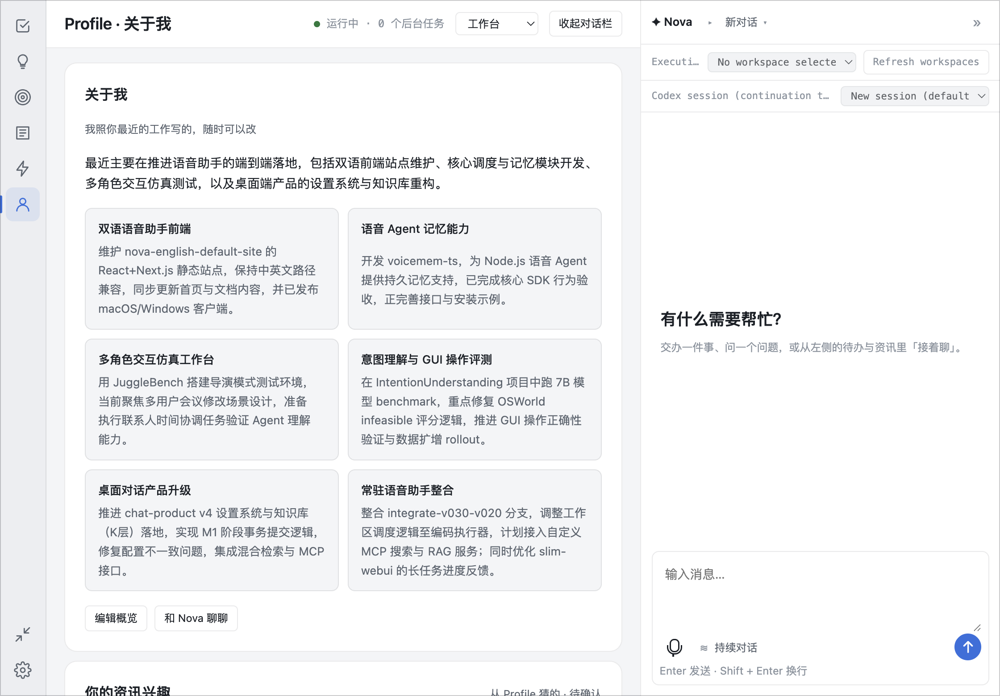

# 个人记忆

Nova 会从对话中整理信息，方便你在之后的会话中继续提问。个人记忆默认开启，使用本地统一账本保存，支持对话回忆、来源依据、纠正与忘记。也可显式选择 mem0。

## 怎么使用

直接告诉 Nova 一条信息，例如：“我的示例项目叫青杉，编号是 C-731。”稍后在新的会话中问：“青杉项目的编号是多少？”

整理记忆需要时间，刚说过的信息不一定立即出现在记忆中。你可以在桌面查看学习状态。

## 查看记忆

默认账本可在主窗口的记忆视图中查看、纠正和忘记条目。以下面板说明适用于显式选择 mem0 的配置；mem0 不启用依赖账本的来源连接器。

右键点击悬浮球，打开「记忆面板」，选择个人记忆。这里可以：

- 搜索你说过的原话。
- 查看已整理的信息，以及对应原话。
- 翻页浏览记录，区分「已学习」和「尚未形成记忆」。

搜索按原话匹配；内容较长时会显示节选。目前条目查看支持本地 mem0，面板暂不提供编辑和删除按钮。

## 数据存在哪里

统一账本默认保存在 `~/.nova-audio-agent/workspace-graph.sqlite`，可用 `MEMORY_LEDGER_PATH` 指定其他位置。选择 mem0 时使用 `~/.nova-audio-agent/memory.sqlite.mem0/`，不同用户的数据分别存放。

**本地保存不等于离线处理。** 整理信息和生成检索向量会调用你配置的模型服务，并向该服务发送相关文本。

个人记忆与文档知识库分开：前者来自对话，后者来自你导入的文件。记住一条信息不会授予 Nova 执行任务的权限。

## 更改或关闭记忆

源码运行时，在 `.env` 中配置后重启 Nova。默认配置无需填写。

| 选择 | 配置 |
|---|---|
| 本地统一账本（默认） | `MEMORY_CONNECTION=local`，不填写 provider 或选择 `voicemem` |
| 本地 mem0 | `MEMORY_CONNECTION=local` 和 `MEMORY_PROVIDER=mem0` |
| 关闭个人记忆 | `MEMORY_CONNECTION=disabled`，移除 provider 配置 |
| 连接远程记忆服务 | `MEMORY_CONNECTION=remote`，配置下述地址和令牌，移除 provider 配置 |

远程服务需要 `MEMORY_URL` 和 `MEMORY_TOKEN`。服务须兼容 Nova 的记忆接口；不能直接填写任意 mem0 服务地址。远程连接失败时会显示不可用，不会自动改存本地。

统一账本可只读迁入旧 VoiceMem 记录，并保留原数据库。选择 mem0 不会迁移账本数据；关闭记忆不会删除已保存的数据。更多配置见[上手指南](configuration.md)。
