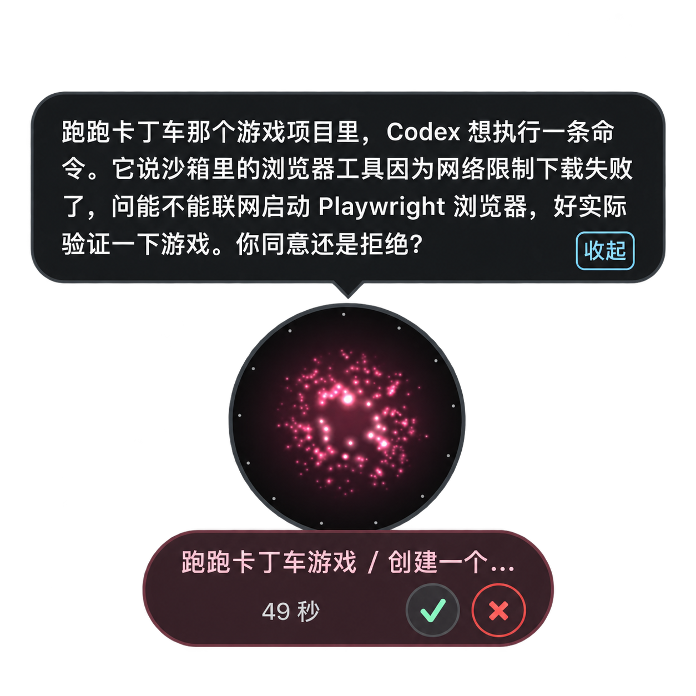

# 任务

任务是交出去的活落地的地方：每个任务都带着目标和验收条件，小诺核对证据后才会说完成——而不是看到某一步跑过就算数。

## 生命周期

一个任务会经历排队中、执行中、核验中、等待中，最终完成，或者在任意阶段被取消。只要小诺掌控着这个任务，它就会自己驱动这个循环：派发工作、拿证据对照验收条件、然后决定调整目标、修正指令、继续等待，或者带着证据把任务标记完成。任务处于「等待中」，往往是因为小诺还确认不了上一步到底发生了什么，而不是单纯没有动静。

一个任务里可以有不止一轮执行，分别显示为「第 1 次执行」「第 2 次执行」等等。没有挂在任何任务下的 executor 工作会单独列出来。

任务页面上的每一项还带着一句简短的下一步提示：需要你处理、由你掌控、没有待办，或者小诺正在处理。

## 接手与交还

| 操作 | 效果 |
|---|---|
| 接管任务 | 你直接给 executor 发消息，小诺暂停自动纠正 |
| 接管并回复 | 同上，并立刻发出这条消息 |
| 交还 Nova | 把控制权还给小诺，让它继续判断和纠正 |
| 停止任务 | 取消这个任务。取消是终态，之后不能再继续；要重做需要新建任务 |
| 继续任务 | 让一个处于等待中的任务重新交给小诺推进，并重置自动修正次数；对已完成或已取消的任务无效 |
| 已核对：已执行 / 已核对：未执行 | 只在小诺无法确认上一步是否真的执行时出现，需要你来确认 |
| 标记 Todo 完成 | 只在任务已完成、但关联的 Todo 在别处发生了变化时出现，用来手动解决冲突 |

任务详情会显示当前由谁掌控——你、小诺，还是另一个已连接的客户端——同时列出验收条件、待处理的审批（「任务审批」，可以「允许一次」或「拒绝」），以及一份记录了在 Workbench 之外发生的相关动态的「公开活动」。

## Nova 建议的执行位置

开始新工作前，小诺可能会先提出一个执行位置：新建一个 Workspace，或者在已有的 Workspace 里开一个新的或继续用原来的 Session（Workspace 和 Session 具体是什么，见[术语表](glossary.md)）。可以直接「按此执行」确认，也可以「改为此位置执行」换一个地方。

## 交办与跟进

在 Todo 上点「发送给执行器」，就会把它转成一个任务。「查看任务与结果」会打开这个任务的详情；点击询问进展，会往对话草稿里放一条按任务名提到它的话，直接发送即可。

## 限制

Workbench 里大约保留最近 200 个已完成的任务，更早的会在新任务完成时自动清理。清理只影响 Workbench 里的记录，不会动 executor 已经在你的 Workspace 里产出的内容。

[Workbench](workbench.md) · [资料来源与连接器](sources-and-connectors.md) · [术语表](glossary.md) · [Executors](executors/overview.md)
