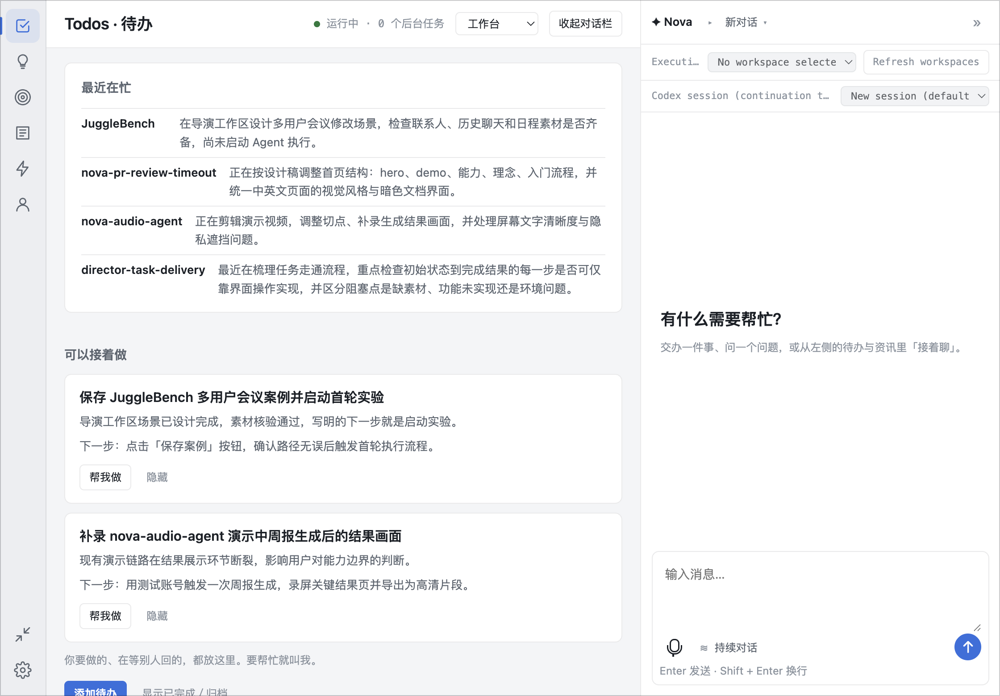

# Workbench

Workbench 是小诺的主窗口：左边是待办（Todo）、想法、目标、资讯、任务和「关于我」，右边是和小诺的对话。

## 布局

| 侧栏项 | 内容 |
|---|---|
| 待办 | 要做的事，状态分待办中、进行中、等待中、已完成、已取消 |
| 想法 | 还没定下来的念头，之后可以转成 Todo 或目标 |
| 目标 | 你在追踪的结果，带成功标准，进度来自关联的 Todo |
| 资讯 | 按兴趣排序的阅读列表 |
| 任务 | 交给 executor 执行的工作，详见[任务](tasks.md) |
| 关于我 | 小诺了解你的一小段自我介绍 |

对话栏停靠在右侧，可以收起而不用离开当前页面。状态栏会显示小诺是否已连接、有多少后台任务在跑；断线期间正在写的内容不会丢，等重新连上还在。

## 切换小诺的呈现方式

小诺有三种呈现方式：Workbench（这个主窗口）、悬浮球（一个小的浮动对话入口），或者隐藏。可以在托盘菜单里切换（对应「工作台」「悬浮球」「隐藏」），也可以在 Workbench 任意页面顶部的模式选择器里切换。另有一项独立的设置决定启动时默认打开哪一种——悬浮球、Workbench，还是沿用上次的选择——只在下次启动时生效；从源码运行时执行 `npm run start:workbench` 会为这一次启动强制打开 Workbench，不理会已保存的偏好。

## 待办、想法与目标

这些内容你可以直接编辑，小诺也会主动提建议。当你说的话像一条待办、想法、目标或「关于我」的补充时，小诺会把它作为候选展示出来，并附上依据的原话；确认前可以先改好措辞，也可以直接略过。有些 Todo 会被自动记下，只要之后没有被改动过，仍然可以撤销。「关于我」的建议是追加到已有内容后面，不会替换掉原有的介绍。

来自你已连接资料的建议卡片，会提示把某件事设为目标、交给 executor 去做、接着聊，或者直接隐藏。待办的建议上方有时还会出现一张回顾卡片，总结你最近在本地项目里忙的事。

目标的进度只统计关联的 Todo，且不计入已取消的部分；目标是否真正达成，永远由你确认，不会被自动判定完成。

在你给出两项飞书同意之后，所选飞书会话里直接 @ 你的消息可以被记为待办；详见[信息来源与连接器](sources-and-connectors.md#飞书)。

## 每日简报

可选的早间和晚间简报，会把你的待办、日历事件和飞书中直接 @ 你的消息整理成主动提醒。两者默认都关闭。在「设置 → 连接与权限 → 每日简报」中开启，也可以在这里设置时间（默认 08:30 和 18:30）、重复日期（默认工作日）、时区和免打扰时段（默认 22:00 至 08:00）；免打扰期间不发送提醒。

## 资讯

按你的兴趣排序的文章，分「为你推荐」和「收藏」两个标签。小诺还没摸清你的口味之前，会先按时间顺序展示，并在准备切到兴趣排序前先跟你确认一下。每篇文章都会说明推荐的理由。你可以打开原文、收藏，或者把它转成一条 Todo、想法或目标——这些动作都只是记录下来，不会让小诺去执行任何操作。也可以告诉小诺哪类兴趣想多看、哪类想少看。

## 关于我

一段关于你的简短自我介绍，可以自己编辑，也可以让小诺在对话中逐步补充。

[任务](tasks.md) · [资料来源与连接器](sources-and-connectors.md) · [个人记忆](personal-memory.md) · [功能概览](features.md)
